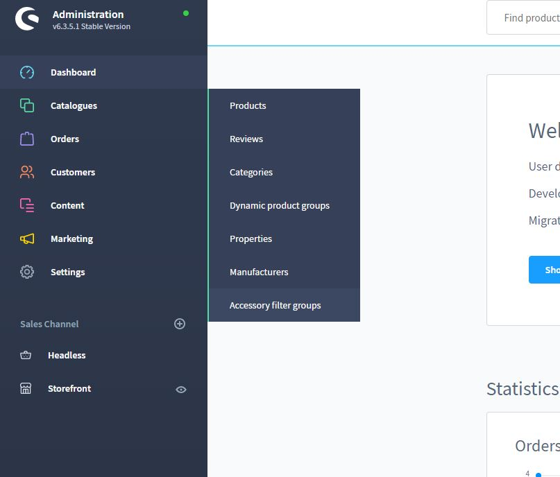
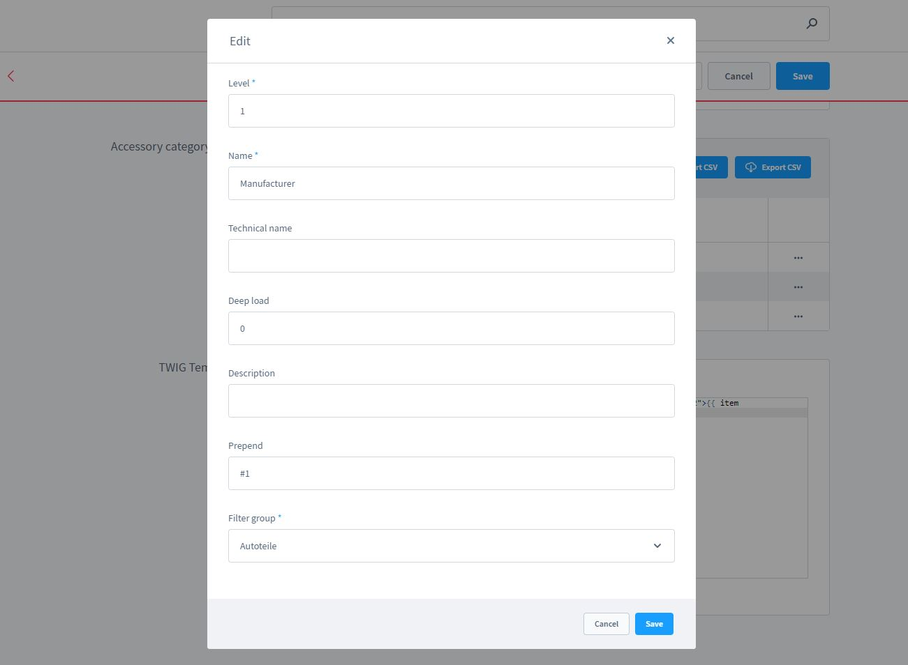
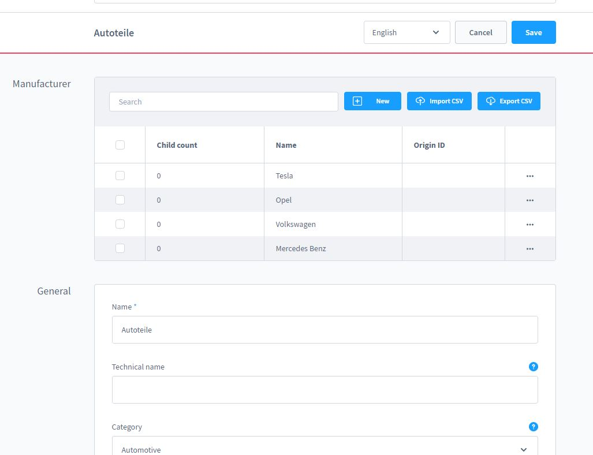
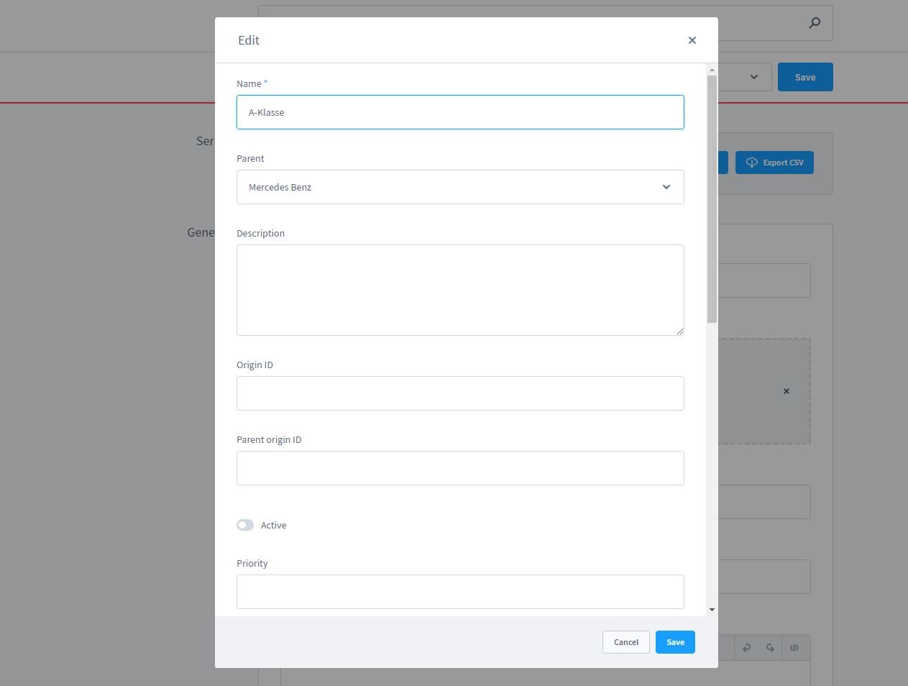
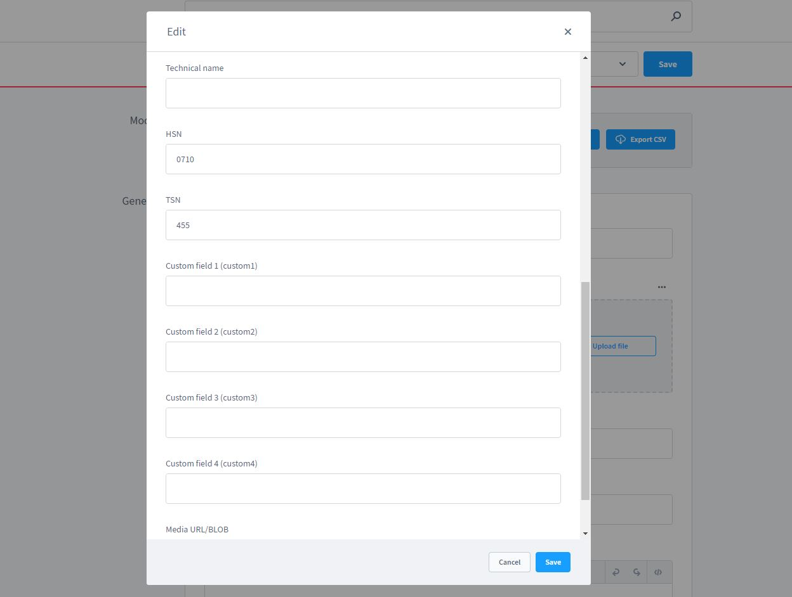
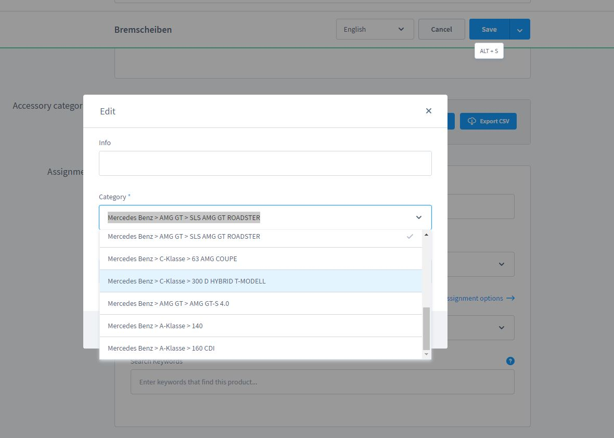
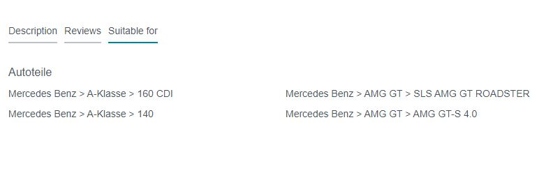
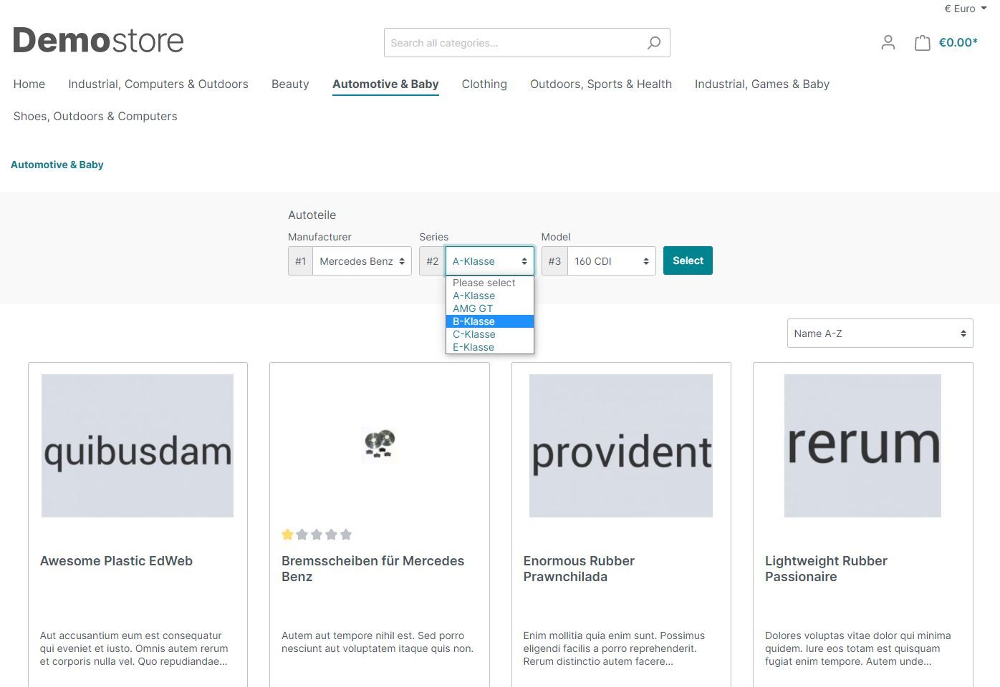

# Zubehör Finder - Autoteile, Druckerzubehör und mehr

_Hinweis: Dieses Plugin benötigt die aktuelle Version des [Foundation / Basis Plugin](../MoorlFoundation/index.md)._

---

Mit diesem Plugin erstellen Sie sich für Ihren Shop eine umfassende Filtermöglichkeit für Zubehör jeder Art.
Ihre Kunden finden wichtiges Zubehör schneller als mit der normalen Shopsuche.

**Mögliche Einsatzgebiete:**

1. Druckerzubehör
2. Fahrzeugzubehör
3. Ersatzteile
4. Verbrauchsgegenstände

## Highlights
- Zusätzliche Suchvorschläge
- Frei erstellbare Ebenen-Navigation
- Passend für Tab in der Produktbeschreibung des Zubehör-Produktes
- CMS Filter Element für Kategorie-Listen
- Simpel und individuell anpassbar

## Features
- Mehrfache Filtergruppen, auch für die selbe Kategorie geeignet
- Filtereinstellung des Kunden wird für die Sitzung gespeichert und kann zurückgesetzt werden
- Filter als Sidebar-Element oder volle Breite
- TSN/HSN Schlüsselnummer-Suche möglich
- Import/Export der Daten via CSV für schnelle Datenübernahme
- Eigenes Twig Template für Anpassungen im Produkt-Detail Tab
- Unbegrenzte Ebenen für den Filter
- Unterkategorien behalten die Filter-Einstellungen

## Installation und Bedienung

Installieren Sie zu erst das Foundation Basis Plugin über den Plugin-Manager von Shopware 6.
Anschließend können Sie den Zubehör Finder installieren.

Sie finden die Filtergruppen hier:

Dort legen Sie eine neue Filtergruppe an:

Ist die Filtergruppe angelegt werden automatisch drei Ebenen erstellt, 
diese können Sie einfach nach Ihren Bedürfnissen anpassen. Bitte achten Sie darauf, 
dass es die Ebene ab 1 beginnt und keine Lücken hat.

Nun können Sie auch direkt mit der Pflege der Hersteller beginnen. Bei größeren Datenmengen 
sollte der Import jedoch durch einen professionellen Entwickler umgesetzt werden.

Klicken Sie nach dem Erstellen eines Herstellers auf die drei Punkte (...) und auf Bearbeiten
um in die nächste Ebene zu gelangen. Dort können Sie beliebig weiter Ebenen Pflegen.

In der letzten Ebene angekommen? Nun können Sie die Zubehör-Produkte zuweisen!

Alternativ können Sie auch in das Produkt gehen und dort in der Sektion "Zubehör Kategorien"
Ihre kompatiblen Geräte/Fahrzeuge zuweisen.

Ein Blick in das Frontend verrät, ob die Zuweisungen gelungen sind.

Um den Filter anwenden zu können, brauchen Sie nun eine Anpassung im Kategorie-Listing.
Gehen die auf die Blöcke "Sidebar" und ziehen Sie das Element "Zubehör Filter" in das Template.

Nachdem Sie die CMS Seite gespeichert haben, stellen Sie sicher, ob diese Seite auch der
Kategorie zugewiesen wurde, in der sich die Zubehör-Produkte befinden.

So sollte es nun im Frontend aussehen:

Filter nicht gesetzt:

Filter gesetzt:

Geben Sie ihrer Filtergruppe den technischen Namen "car_parts" um die Schlüsselsuche zu aktivieren.

Die Pluginkonfiguration kann optional angepasst werden, falls gewisse Funktionen nicht benötigt werden
oder es Schwierigkeiten mit der Performance gibt.

# Accessory Finder - Car Parts, Printer Supplies and More

_Note: This plugin requires the current version of [Foundation / Basis Plugin](../MoorlFoundation/index.md)._

---

With this plugin you create for your store a comprehensive filter option for accessories of any kind.
Your customers will find important accessories faster than with the normal store search.

**Possible areas of use:**

1. printer accessories
2. vehicle accessories
3. spare parts
4. consumables

## Highlights
- Additional search suggestions
- Freely configurable level navigation
- Matching tab in the product description of the accessory product
- CMS filter element for category lists
- Simple and customizable

## Features
- Multiple filter groups, also suitable for the same category
- Customer's filter setting is saved for the session and can be reset
- Filter as sidebar element or full width
- TSN/HSN key number search possible
- Import/export of data via CSV for fast data transfer
- Custom Twig template for adjustments in the product detail tab
- Unlimited levels for filter
- Subcategories keep the filter settings

## Installation and operation

First install the Foundation Basis plugin via the Shopware 6 plugin manager.
Then you can install the Accessories Finder.

You can find the filter groups here:

There you create a new Filtergroup:

Once the filter group is created, three layers will be created automatically,
you can easily adjust them according to your needs. Please make sure
that the level starts from 1 and has no gaps.

Now you can start directly with the maintenance of the manufacturers. With larger amounts of data
the import should be done by a professional developer.

After creating a manufacturer, click on the three dots (..) and on Edit
to get to the next level. There you can maintain as many layers as you like.

Arrived at the last level? Now you can assign the accessory products!

Alternatively you can go to the product and there in the section "Accessories Categories" you can assign
assign your compatible devices/vehicles.

A look into the frontend reveals if the assignments were successful.

To apply the filter, you now need an adjustment in the category listing.
Go to the "Sidebar" blocks and drag the "Accessory Filter" element into the template.

After you have saved the CMS page, make sure that this page has also been assigned to the
category where the accessories products are located.

This is how it should now look in the frontend:

Filter not set:

Filter set:

Give your filter group the technical name "car_parts" to activate the key search.

The plugin configuration can optionally be changed, if certain functions are not needed or there are
or there are problems with the performance.

