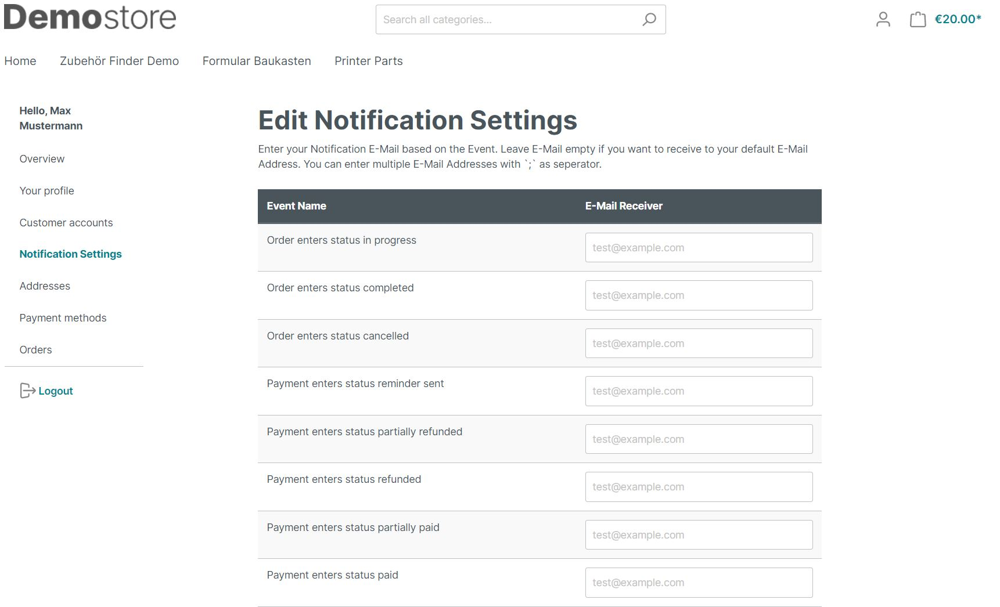

# Customer access management

Let your customers create accesses for several people themselves.
This way, each person with an individual access can place orders on behalf of the customer.

## Plugin settings

1. activate sub-accounts for these customer groups.
2. rules for the customer numbers of the sub-accounts:
      * Automatic allocation - A customer number is generated.
      * Manual: The customer number starts with the customer number of the main account.
      * Manual and unique: Same as manual, but checks if the customer number already exists.
3. activate notification settings - The main customer can set e-mail recipients for the order process.

## Frontend

If a customer is authorised to create sub-accounts, a further menu item appears in the customer area.
appears in the customer area. The sub-accounts are listed there, including status and last login.

Here you can create further accounts by clicking on the button.

If the customer forgets his password, a new one can be created quickly.

If the notification settings have been activated, the customer can also enter his e-mail recipients here.

