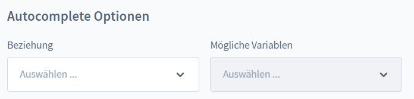
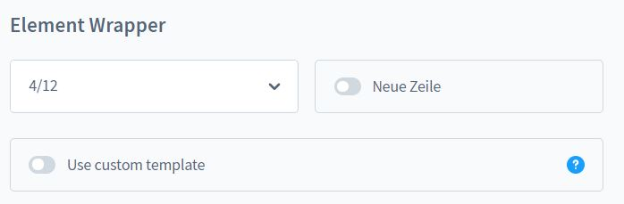
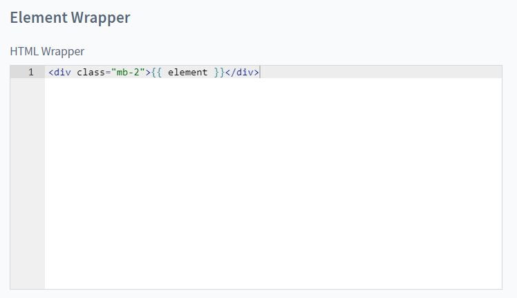
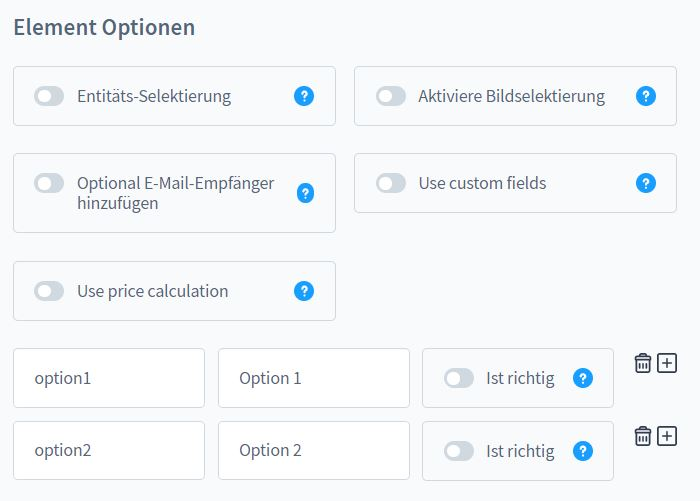
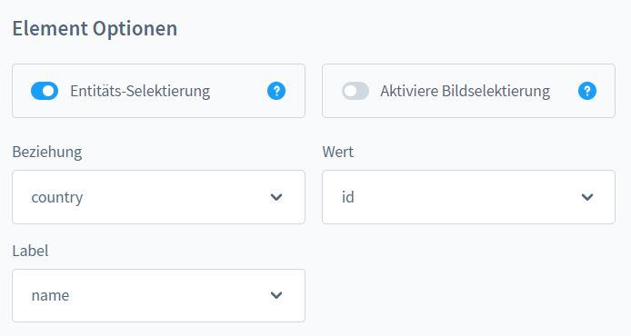
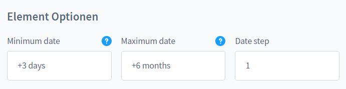

# Formular Baukasten Professional - Elemente

## Eingabefelder - Typen

|Typ|Zweck|Besonderheit|
|:---|:---|:---|
|Text|Text Eingabe||
|E-Mail|E-Mail Eingabe|Der Shop Betreiber kann durch sein E-Mail Programm an diese E-Mail antworten. Der Kunde kann sich eine Kopie an diese E-Mail Adresse senden lassen.|
|Textfeld|Text Eingabe|Für längere Texte mit Zeilenumbrüchen.|
|Auswahl|Einfach-Auswahl|Man kann je nach Auswahl eine individuelle Empfänger E-Mail Adresse bestimmen. Die Auswahloptionen können direkt aus eine Datenbank-Tabelle bezogen werden.|
|Mehrfachauswahl|Mehrfach-Auswahl Eingabe|Siehe Typ: __Auswahl__|
|An/Aus|Switch Regler||
|Checkbox|Einfache Checkbox|Siehe Typ: __Auswahl__|
|Checkbox Gruppe|Mehrere Checkboxen|Siehe Typ: __Auswahl__ + Bildselektierung möglich.|
|Radio Gruppe|Einfach-Auswahl|Siehe Typ: __Auswahl__ + Bildselektierung möglich.|
|Einzel-Upload|Datei Upload|Es können verschiedene Dateitypen bestimmt werden - z.B. Dokumente oder Bilder. Ein Upload wird im Medien Manager gespeichert und kann als Datei-Anhang per E-Mail verschickt werden.|
|Datum|Datum Eingabe|Man kann ein Zeitfenster für ein Datum hinterlegen - z.B. Wenn ein Wunschlieferatum min. 3 Tage in der Zukunft sein soll.|
|Uhrzeit|Uhrzeit Eingabe||
|Passwort|Passwort Eingabe||
|Zahl|Zahl Eingabe|Man kann den Mindest- und den Maximalwert bestimmen.|
|Zahl Schieberegler|Zahl Eingabe|Siehe Typ: __Zahl__|
|Rating|Zahl Eingabe|Siehe Typ: __Zahl__ + Das Icon kann ein FontAwesome-Symbol, ein Zeichen oder ein Emoji sein. Siehe Textbaustein `moorl-form-builder.general.star`.|
|Versteckt|Intern|Beliebig einsetzbar.|
|HTML|Intern|Kann für Textinhalte innerhalb des Formulares oder für Anpassungen am Formular-Layout genutzt werden. Dieses Feld ist __nicht übersetzbar__. Für Mehrsprachige Texte kannst du jedoch Textbausteine nutzen `{{ "meinText"|trans }}`.|
|Repeater Open/Close|Intern|Mit dem Repeater kannst du Eingaben gruppieren und wiederholen. Nähere Infos dazu folgen.|

## Grundlegende Eigenschaften

Jedes Eingabefeld hat spezifische Eigenschaften, diese werden hier im Detail
erläutert!


- Typ: Typ des Elementes
- Label: Übersetzbar - Die Bezeichnung des Feldes


### Wichtigste Merkmale

- __Technischer Name:__ Pflichtfeld für alle Eingabe-Elemente, muss eindeutig sein, darf keine Umlaute oder Leerzeichen beinhalten
- Platzhalter: Übersetzbar - Steht im Feld, wenn leer
- Element vorausfüllen: Hier kann ein fester Wert oder eine TWIG-Variable stehen - z.B. `{{context.customer.email}}` - Ohne Leerzeichen!
- Prepend: Übersetzbar - z.B. Ein Symbol, ein Emoji - steht vor dem Eingabe-Element
- Append: Übersetzbar - z.B. Ein Symbol, ein Emoji - steht nach dem Eingabe-Element
- Validation: Client-Basierte Validation - z.B. `[A-Za-z]{3}`
- Tooltip: Übersetzbar - Hilfstext zu dem Eingabe Element
- Erforderlich: Pflichtfeld - Clientseitige + Einfache Serverseitige Validierung
- Deaktiviert: Das Feld wird deaktiviert und wird auch nicht abgesendet

### Autocomplete für Text-Elemente



Die Autocomplete-Funktion zieht sich Informationen aus eine Datenbank-Tabelle und schlägt diese
dem Kunden als mögliche Eingabe vor.

- Beziehung: Tabelle
- Mögliche Variablen: Tabellenspalte

### Element-Wrapper

Wenn Bootstrap 12-Spalten Grid aktiv:

- Bestimme die Breite des Elementes
- Neue Zeile: Nach dem Element muss ein Zeilenumbruch sein



Wenn Bootstrap 12-Spalten Grid inaktiv:

- Das Element kann hier optional gewrappt werden



### Custom Template

Manchmal reichen die gegebenen Elemente für eine optisch passende Darstellung
nicht aus. Hier hast du die Möglichkeit selbst eine Template-Datei einzubinden oder ein Template zu schreiben.

So sieht z.B. Das Template für ein einfaches Textfeld aus.

```TWIG
<div class="form-group form-{{ formElement.type }}-{{ formElement.name }}">
    

    
        <input
            type="text"
            name="{{ formElementName }}"
            id="{{ formElementId }}"
            value="{{ formElementValue }}"
            placeholder="{{ formElementPlaceholder }}"
            pattern="{{ formElement.pattern }}"
            data-autocomplete="{{ seoUrl('moorl-form-builder.autocomplete', {
                formId: form.id,
                formElementId: formElement.id
            }) }}"
            required
            disabled
            class="form-control">
    
    
</div>
```


### Interaktionen mit anderen Eingabe-Elementen

Du kannst abhängig von einer Eingabe Elemente oder ganze Bereiche ein- und ausblenden.
So kannst du dein Formular für relevante Eingaben optimieren. Fange am besten hier klein an
bevor du komplexe Formulare mit dieser Funktion baust.

- Technischer name: Gebe hier den technischen Namen des Schlüssel-Elementes ein
- Operator: Wähle einen Operator
- Wert: Wenn dieser Wert im Schlüssel-Element steht, dann wird dieses Element angezeigt

__Bei diesen Elementen gibt es keine Serverseitige Validierung, da diese optional sind!__

Wenn du ganze Bereiche ein- und ausblenden möchtest, dann nutze ein Element vom Typ: HTML.
Dort öffnest du ein DIV-Tag und gibst das Attribut `data-form-conditions='{{ formConditions }}'` bei.
Aktiviere die Option: "Keine Eltern HTML Tags / Kein Wrap".

Ein Beispiel findest du in dem Demo-Formular `Example: Multipurpose Form`.


### Optionen

Bei Elementen vom Typ: Auswahl, Checkbox-Gruppe und Radio-Gruppe kannst du Optionen festlegen.
Außerdem hast du auch noch weitere Möglichkeiten diese Optionen zu nutzen.

- Entitäts-Selektierung: Ermöglicht die Ausgabe der Optionen aus einer beliebigen Datenbank-Tabelle
- Aktiviere Bildselektierung: Optische Aufbesserung duch Bilder
- E-Mail Empfänger: Abhängig von der Auswahl kannst du E-Mail Empfänger für das Formular bestimmen, trenne mehrere Empfänger durch ein Semikolon `;`
- Preisberechnung: Ist nur für das Add-On "Custom Products" relevant.



Beispiel für eine Entitäts-Selektierung:



Beispiel für E-Mail Empfänger:


### Zeitfenster für Datum Eingabe

Bei Elementen vom Typ: Datum kannst du hier bestimmten in welchem Zeitfenster das Datum sein darf.
Dazu nutzt du einfach die Date Modify Begriffe aus PHP.



### Min- und Maxwert für Zahlen und Ratings

Wenn du eine Rating Eingabe anlegst, solltest du Min auf 1 und Max auf 5 stellen.


### HTML Eingabe

Die HTML Eingabe ist für Textpassagen oder Layout Anpassungen im Formular geeignet.
Dieses Feld ist __nicht übersetzbar__. Für Mehrsprachige Texte kannst du jedoch Textbausteine nutzen `{{ "meinText"|trans }}`.


Noch Fragen? Bitte stelle deine Frage im Kommentarbereich!

