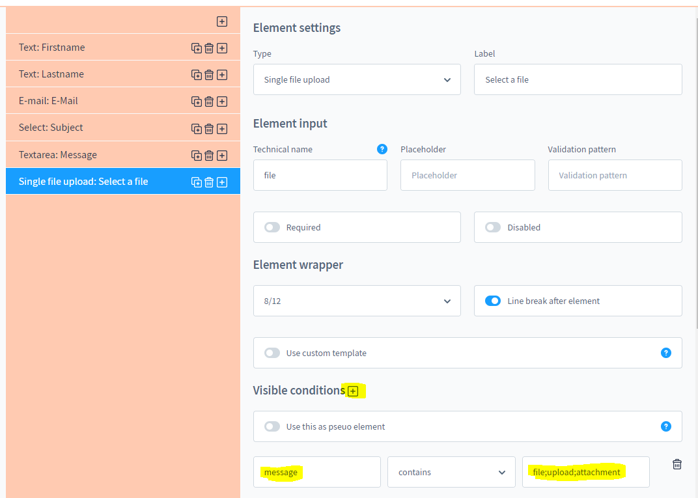
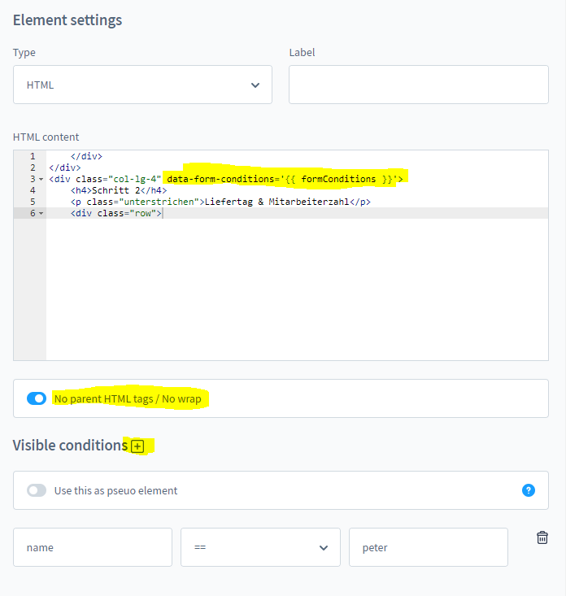
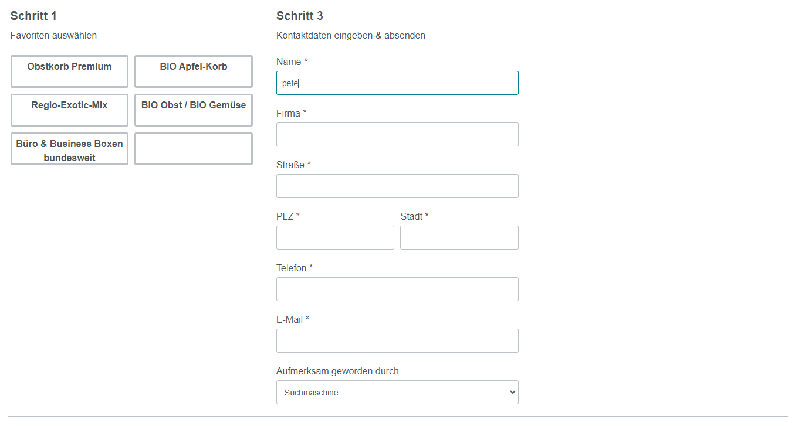

# Formular Baukasten Professional - Individuelle und frei gestaltbare Formulare

## Interaktive Formulare

### Vorwort

Je nach Anforderung können einige Formulare schon etwas größer ausfallen.
Soetwas kann für Verwirrung sorgen und ggf. vergeht dem Kunden auch die Motivation
ein Formular bis zum Ende hin auszufüllen.

Ein interaktives Formular kann viel kleiner ausfallen, weil hier je nach Anforderung
Eingabefelder ein- oder ausgeblendet werden.

Dieses Plugin unterstützt solche Interaktive Formulare in den Grundlegenden Funktionen.
Dazu werden nachfoldend Beispiele aufegührt, wie man ein solches Formular im Admin Bereich
konfiguriert.

### Beispiel 1 - Eingabefelder

Hier zeige ich Ihnen anhand einer Konfiguration, wie man ein Upload Feld ein- oder
ausblendet anhand eines Keywords.

#### Konfiguration

#### Ergebnis

Ohne Keyword:

Mit Keyword:

### Beispiel 2 - Ganze Bereiche

Es ist auch möglich ganze Bereiche per HTML zu wrappen, dazu kann man eigenes HTML
verwenden um einen Bereich zu öffnen und zu schließen.

Dazu sind folgende Regeln zu beachten:
1. Checkbox (Keine Eltern Elemente) muss angeklickt sein
2. im HTML muss das Attribut ``data-form-conditions='{{ formConditions }}'`` eingefügt werden

#### Konfiguration

#### Ergebnis

Ohne Keyword:

Mit Keyword:

