# Formular Baukasten Professional - Individuelle und frei gestaltbare Formulare

Dieser User Guide beinhaltet zum Teil Erklärungen und Begriffe zu den Add-Ons.

## Übersicht

Die Detailübersicht besteht aus:

1. Sprachwahl
2. Formular Einstellungen
3. Liste der Eingabe-Elemente
4. Element Einstellungen

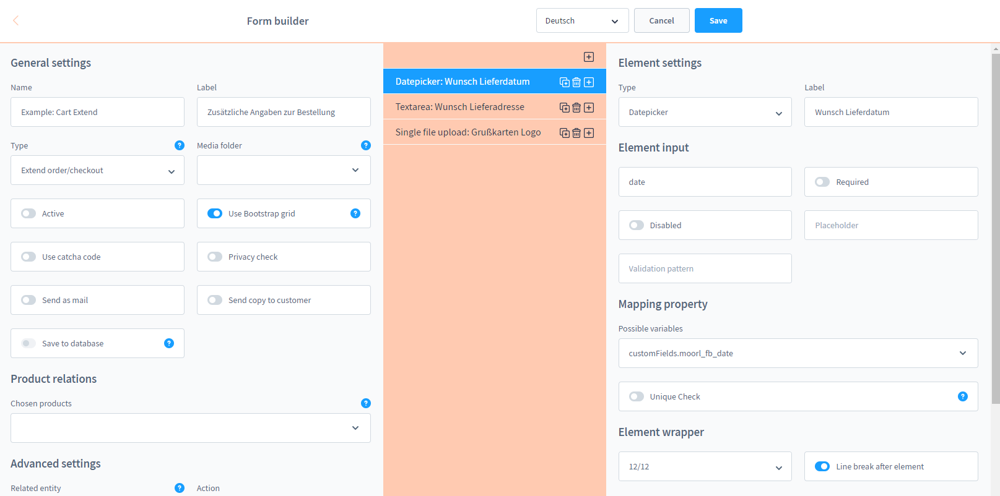

## Formular Einstellungen

### Formular Typ

Es gibt Formulartypen für unterschiedliche Zwecke, diese Formulartypen werden durch die Add-Ons erweitert.
Im Standard gibt es ausschließlich Formulartyp 'CMS Element' für einfache Kontaktformulare. 

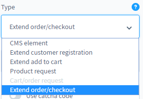

**Die weiteren Typen kurz erklärt:**

- Erweiterte Kundenanmeldung: Der Shopkunde kann zustätzliche Angaben zu seinem Kundenaccount machen 
und auch Uploads für den Shopbetreiber bereit stellen
- Erweiterte Warenkorb Position: Zu jedem Produkt oder zugewiesenen Produkt kann man weitere Benutzereingaben
zur Verfügung stellen. Die können zum Beispiel Wunschlieferdatum oder Wunschzustelladresse zu einem Produkt beinhalten,
aber auch Texte z.B. für personifizierte Produkte
- Erweiterter Warenkorb: Kunden können pro Bestellung zusätzliche Angaben machen, dieses Add-On ähnelt der erweiterten
Warenkorb Position - ist jedoch nur einmalig pro Bestellung pflegbar
- Produktanfrage: Ein Kontaktformular, welches Produktinformationen beinhaltet

### Generelle Einstellungen

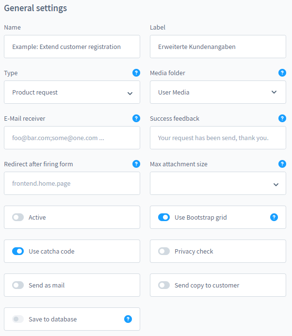

- Name: Der Name für das Formular im Backend
- Titel: Ein Übersetzbarer Titel für die Ausgabe im Frontend
- Medien Ordner: Zielordner für Datei-Uploads
- E-Mail Empfänger: Durch Semikolon getrennte Liste an Empfängern
- Status Nachricht: Wenn das Formular abgesendet wurde, erhält der Kunde eine Bestätigungsnachricht
- Weiterleitung: Dieses Feld hat noch keine Funktion
- Max. Anhanggröße: Maximal mögliche Größe für E-Mail Anhänge, bitte informieren Sie sich bei Ihrem
E-Mail Anbieter, welche Größe möglich ist
- Aktiv: Formular an/aus schalten
- Bootstrap Grid nutzen: Das Formular ist für das Bootstrap Grid optimiert, so kann man pro 
Zeile maximal 12 Eingabefelder anlegen
- Captcha: Spamschutz durch Captcha aktiv/inaktiv
- Privacy Check: Der Kunde muss die Datenschutzerklärung akzeptieren um das Formular zu senden
- Als E-Mail senden: Der Inhalt des Formulares wird als E-mail gesendet
- Kopie an den Absender: Der Kunde kann optional eine Kopie seiner Anfrage erhalten.
- In Datenbank speichern: Der Inhalt des Formulares wird in einer Datenbank gespeichert, diese
Funktion ist noch in der Konzeptphase

### Erweiterte Einstellungen

#### Produkt Beziehung


Die Produktbeziehungen sind für viele Add-Ons relevant.

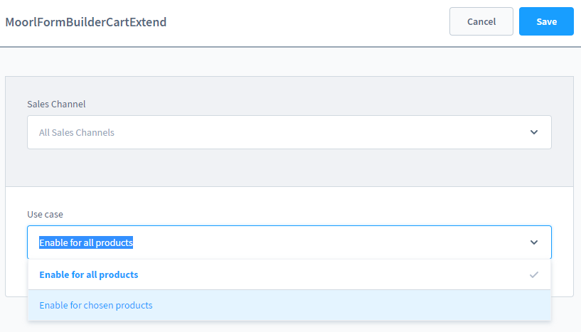

So lassen sich zum Beispiel in der Config des Add-Ons 'Erweiterter Warenkorb' regeln, 
wann dieses Formular in Frontend angezeigt werden soll.

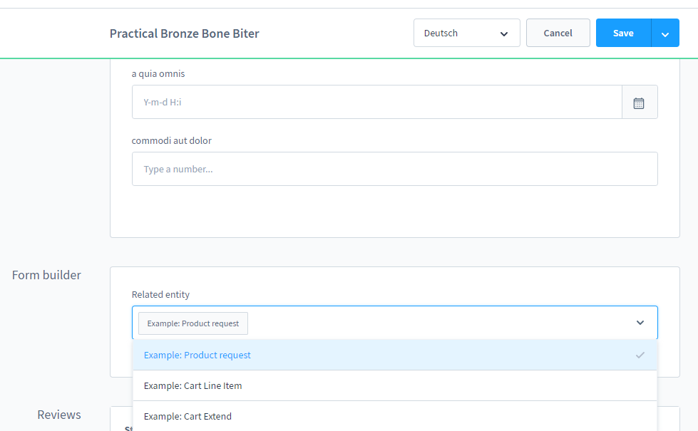

Die Verknüpfung 'Produkt' und 'Formular' sind bidirektional - es können für ein Produkt Formulare 
mit unterschiedlichen Verwendungszwecken zugewiesen werden.

#### Zuweisung der Entität

Diese Zuweisung spielt eine große Rolle und ist für Datenbankeinträge sowie Formular Add-Ons
mit Datenspeicherung relevant.


So nutzt zum Beispiel die erweiterte Kundenregistrierung die 'customer' Eintität um Benutzereingaben
wie zum Beispiel die Kundennummer in der Datenbank zu speichern.

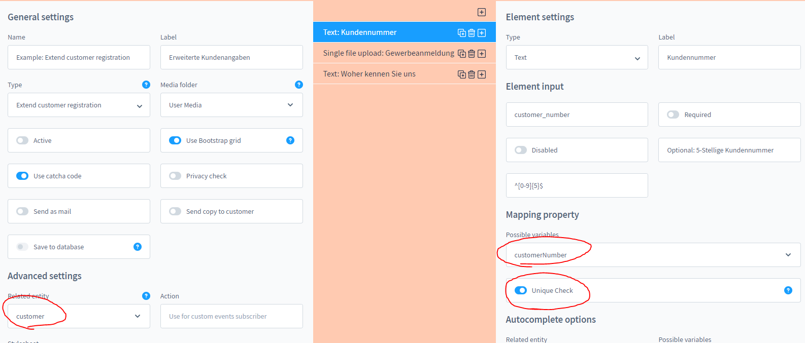

So kann man wie in diesem Beispiel die Kundennummer Matchen/Mappen. 
In besonderen Fällen dürfen Einträge nur einmalig sein, dafür ist der
'Unique Check' zuständig!

#### Aktion

Die Aktion sorgt für eine technische Trennung von ähnlichen Formularen, diese Trennung kann zum Beispiel
in den E-Mail Vorlagen genutzt werden:

````twig

    {# use form.action to differentiate between seperate request types #}

    {# use form.action to differentiate between seperate request types #}

    {# if form.action is not set or no match then do this #}
    <table>
        
            
                <tr>
                    <td>{{ formElement.label|join(', ') }}:</td>
                    <td>
                        
                            
                                
                                    {{ option.label|join(', ') }}<br>
                                
                            
                        
                            {{ formElement.value|nl2br }}
                        
                    </td>
                </tr>
            
        
    </table>

````

#### Stylesheet

Mit Hilfe des Stylesheets lassen sich Formulare optisch per CSS anpassen, die Formular ID für den CSS Selektor
entnehmen Sie auf der Addresszeile Ihres Browsers:

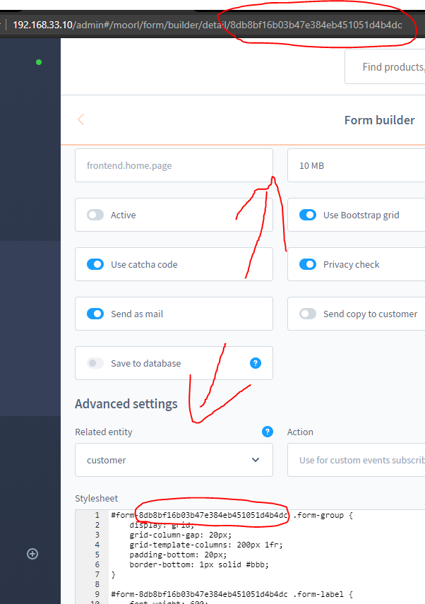

## Liste der Eingabe-Elemente

Die Formular Elemente sind zusammen gefasst in einer Liste abgebildet. Es können mit dem Plus-Symbol
neue Elemente hinzugefügt werden.

Auch können Elemente verschoben, dupliziert und gelöscht werden. Die Änderungen sind erst damm aktiv, 
sobald das Formular gespeichert wurde.

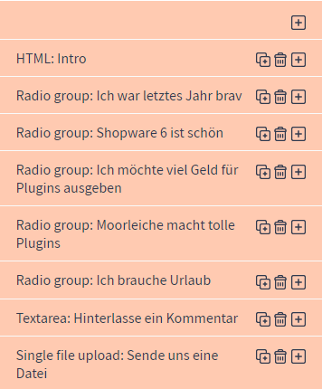

## Element Einstellungen

Dieses Plugin bietet eine Vielzahl an Element Einstellungen an. So lassen sich je nach Typ
Verschiedene Funktionen mit diesem Element umsetzen. Man kann auch einfach nur ein HTML Element
nutzen um im Formular kleine Textpassagen einzubauen.

Generell sind alle im Fronted sichtbaren Bennenungen der Elemente an alle Systemsprachen übersetzbar.
Im Standart werden Beispiele in Deutsch und ich Englisch geliefert.

### Element Typ

Die hier sichtbaren Element Typen sind Bestandteil des Plugins, die ausgegrauten Typen sind für kommende
Updates geplant.

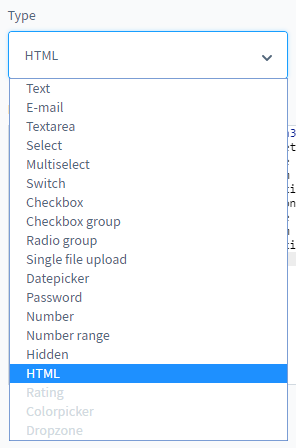

Es gibt für jeden Typen individuelle Einstellmöglichkeiten, welche nun erklärt werden.

### Generelle Einstellungen

Fast jedes Element nutzt diese Einstellmöglichkeiten.

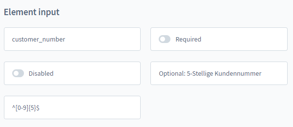

- Bezeichnung / Label: Steht für eine Kurze Beschriftung des Eingabe Elementes
- Name: Der Technische Name des Eingabe Elementes, dieses Feld wird nicht übersetzt
- Pflichtfeld: Hier muss durch den Benutzer eine Eingabe erfolgen
- Inaktiv: Das Eingabefeld ist ausgegraut
- Platzhalter: Sofern das Element nicht ausgefüllt ist, erscheint dieser Platzhalte
- Validation Pattern: Ein Feld, welche für die Formatierung der Eingabe steht. So können
zum Beispiel Kundennnummern die fünfstellig sind und nur Ziffern behinhalten geprüft werden

### Optionen

Für Optionen, Mehrfachauswähl und Checkbox-Gruppen können die Optionen ebenfalls gepflegt werden.
Mindestens eine Option ist Pflicht. Das Kontrollfeld 'richtig' sind zum Beispiel für Multiple Choice
Aufgaben geeignet. Die Bezeichnungen sind übersetzbar - die technischen Werte nicht.


Für Numerische Eingabe Elemente lassen sich hier die Min- und Maxwerte sowie die Schritte definieren.


### Element Wrapper

Das Eingabe Element lässt sich durch den sogenannten 'Wrapper' nochmal beliebig anpassen.


Sofern Sie Bootstrap Grid verwenden, kann hier die Breite des Elements bestimmt werden. Außerdem
kann unabhängig der Breite ein Zeilenumbruch erzwungen werden.

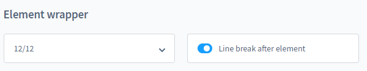

### Auto Vervollständigung

Mit Hilfe der Auto Vervollständigung können bereits vorhandene Werte einer beliebigen Entität aus
dem System genutzt werden. So lassen sich beispielsweise bekannte Produkt Titel oder Artikelnummern
aus dem System hervorragend für eine Erleichterte Eingabe durch den Benutzer verwenden.


### Mapping/Matching Zuweisungsfeld

Dieses Feld ist für den technischen Nutzen vorherbestimmt. Hier lässt sich bestimmern, in welches
Datenbank-Feld eine Bentzer-Eingabe abgelegt wird.

Das Kontrollfeld 'Unique Check' dient zur Validierung von Duplikat-Einträgen. So wird sicher gestellt
dass nur eine Kundennummer oder nur eine E-Mail Adresse im System hinterlegt werden kann.

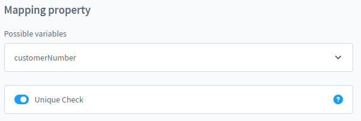


