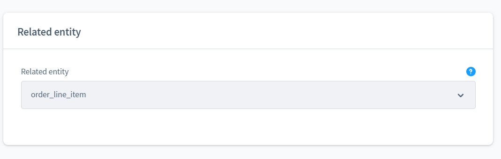
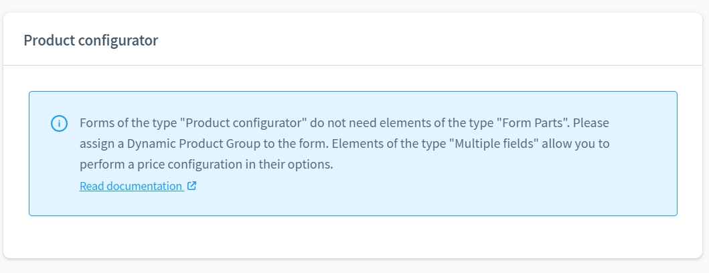
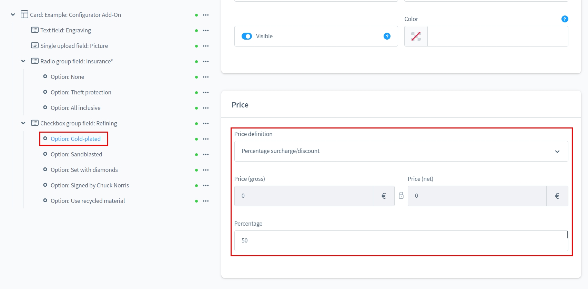
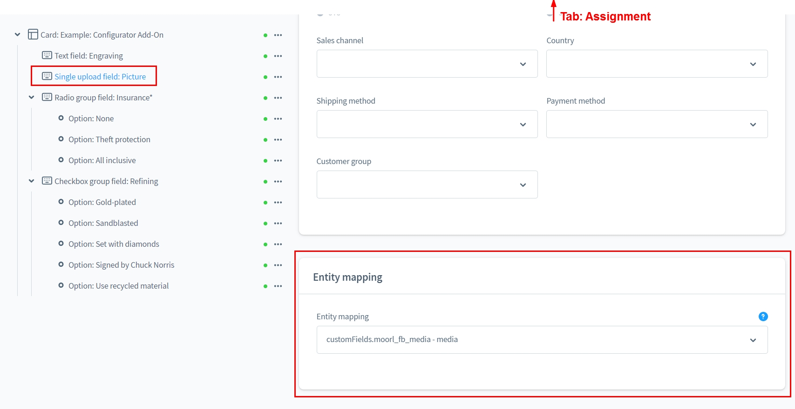
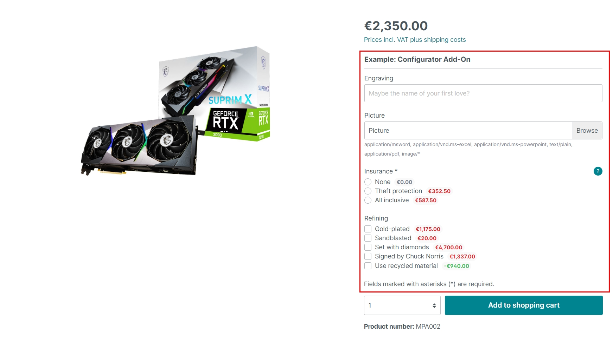
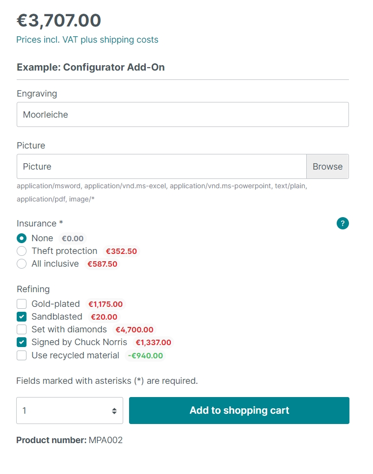
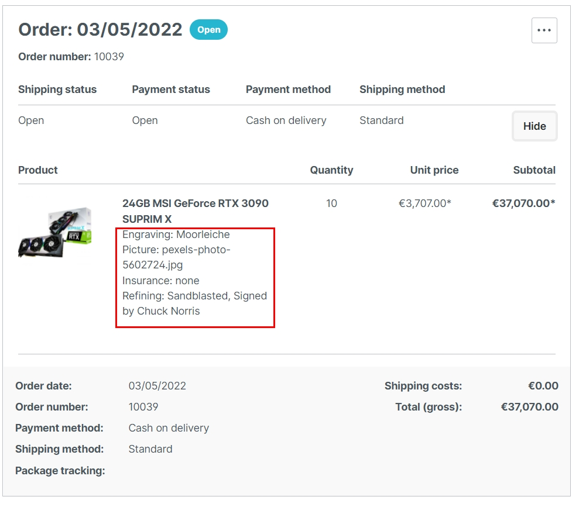
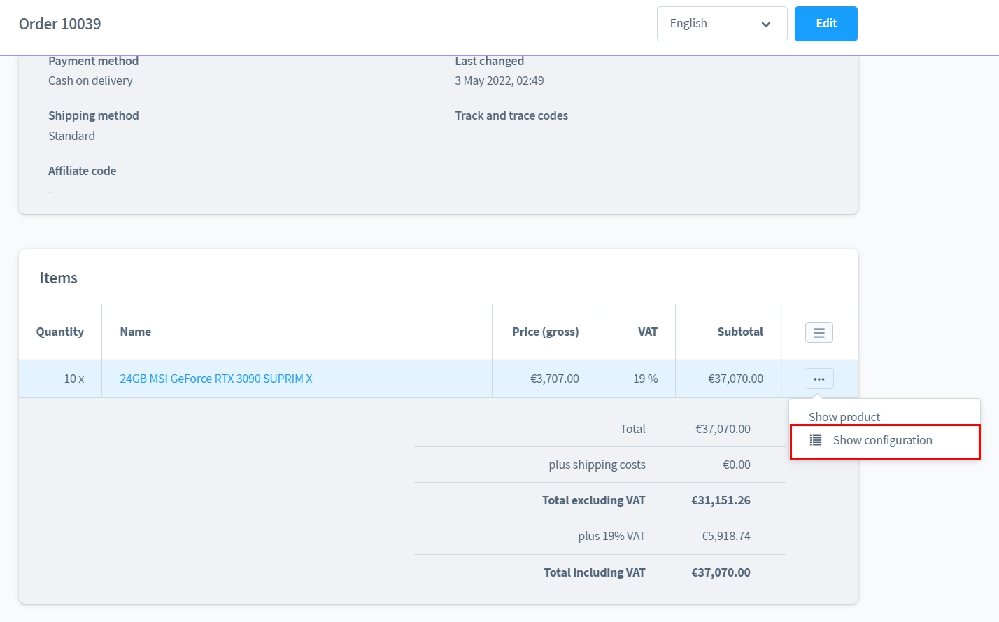
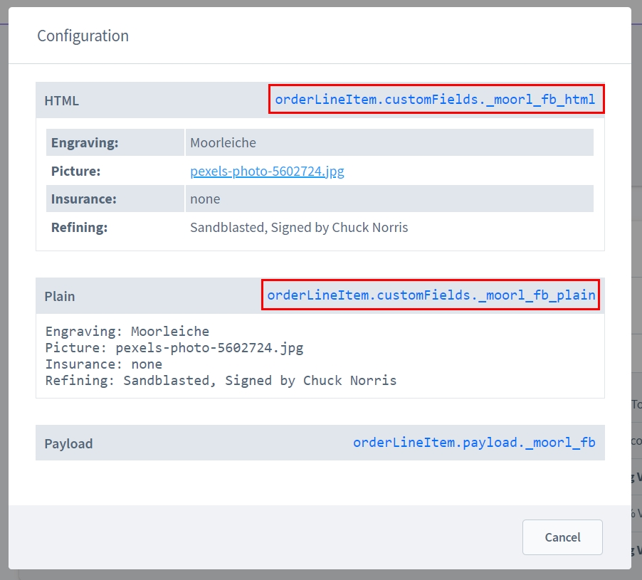

# Produkt-Konfigurator Add-On | Formular Baukasten 2

Mit diesem Add-On für [Formular Baukasten 2](../MoorlForms/index.md) kannst du Produkte 
individuell konfigurierbar machen und den Preis beeinflussen! Eingabefelder lassen sich
Datenbankfeldern zuweisen!

## Hinweis für alle Kunden, die den Formular Baukasten bereits besitzen

Dieses Plugin ist grundlegend anders aufgebaut und bietet keine Möglichkeit, die bisherigen
Formulare zu migrieren.

Leider ist es nach Absprache mit Shopware auch nicht möglich die Subscriptions zu duplizieren/übertragen.

Da ich meinen bisherigen Kunden keinen Nachteil schaffen möchte, wird der Formular Baukasten
weiterhin mit Updates versorgt. Aber es werden keine neuen Funktionen mehr entwickelt.

Für alle Interessenten mit aktiven Subscriptions biete ich einen 50% Rabatt für Basis und Add-Ons. 
Die Migration der Formulare wird auf Wunsch ebenfalls übernommen.
Es kann jedoch zu Abweichungen im Aussehen kommen, diese werde ich nicht abgleichen.

## Beispiel Formulare zum Download

- [Produkt-Konfigurator Add-On](examples/custom-products-add-on.json)

## Neues Formular vom Typ "Produkt-Konfigurator"

Mit diesem Formular kannst du einerseits die Produktpreise über die Optionen beeinflussen und
andererseits kannst du das Mapping nutzen, um die Konfiguration in Custom-Feldern zu speichern
z.B. für weitere technische Verarbeitung der Daten.

Beispiel Formular.

Die zugeordnete Entität ist vom Typ "order_line_item", diese gleicht dem Namen der Datenbank-Tabelle.
Dort wird der Payload und die Custom-Felder deiner Produkt-Konfiguration gespeichert!

Bevor du mit der Preiskonfiguration startest, musst das Formular...

1. einer dynamischen Produktgruppe zuweisen.
2. eine Steuerrate zuweisen.

Die dynamische Produktgruppe sagt aus, für welche Produkte das Formular aktiviert wird.

Es ist auch möglich mehrere Formulare für die Produkte zu kombinieren! Achte jedoch darauf,
dass du immer individuelle technische Namen für deine Eingabefelder nutzt!

## Preisdefinitionen

Du kannst für die Optionen Preisdefinitionen festlegen.

Absolute Preise können zum Produktpreis aufgeschlagen werden.

Leider ist es nicht möglich negative Preise einzugeben, ich arbeite jedoch schon an einer Lösung dieses Problems.

Prozentuale Preise sind relativ zum Preis des Produktes. Du kannst auch negative prozentuale Preise definieren.

## Mapping

Sofern die Daten aus der Entität "order_line_item" für eine weitere technische Verarbeitung relevant sind 
kannst du die Eingabefelder zu Datenbankfeldern zuweisen!

## Storefront

In diesem Beispiel siehst du den Produkt-Konfigurator in Aktion!

Hier gibt es die Möglichkeit einen Text, ein Upload und verschiedene Optionen auszuwählen.

Der Preis aktualisiert sich anhand der Auswahl, die der Kunde trifft.

Die Anzahl der Produkte wird ebenfalls beachtet.

Die Konfiguration ist abgeschlossen, ab in den Warenkorb!

Kleine Nachbesserungen können vor Bestellabschluss jederzeit durchgeführt werden!

In der Bestellübersicht wird die Konfiguration in Textform angezeigt.

## Admin

Solltest du das Mapping nicht nutzen, hast du trotzdem jederzeit Zugriff auf die Konfiguration.

Gehe dazu in die Bestellübersicht und wähle im Kontextmenü "Zeige Konfiguration".

Die rot markierten Platzhalter überträgst du in all deine E-Mail und Dokumenten Templates, damit die 
Konfiguration auch für den Kunden weiterhin ersichtlich sind.

Da die Custom-Felder für Bestellpositionen nicht im Admin ersichtlich sind, ist hier ein Screenshot aus
der Datenbank zur Veranschaulichung, dass das Feld richtig gespeichert wurde.

