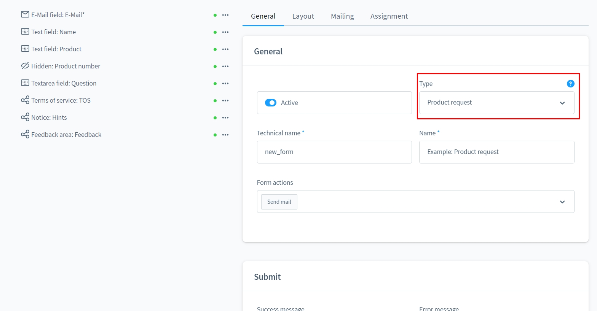
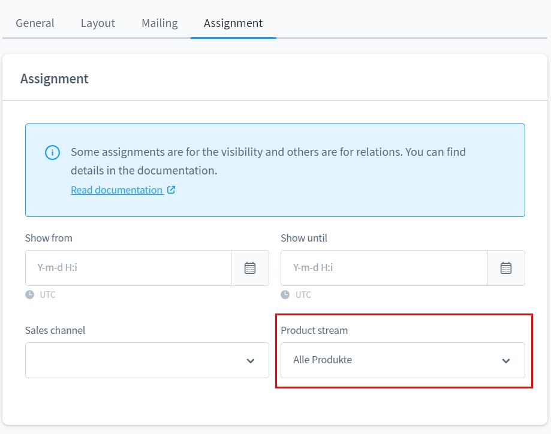
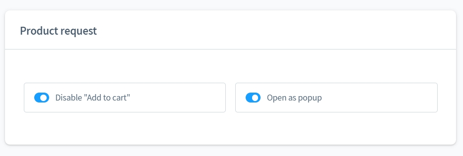
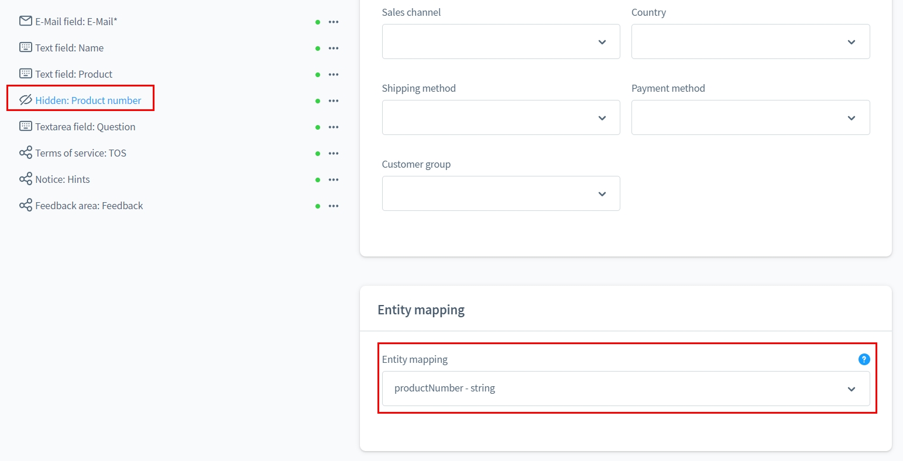

# Formular Baukasten 2 | Produkt-Anfrage Add-On

Mit diesem Add-On für [Formular Baukasten 2](../MoorlForms/index.md) kannst du
zusätzliche Formulare für deine Produkte bereitstellen. Produkte mit Formularen
können optional vom Kauf ausgeschlossen werden.

## Hinweis für alle Kunden, die den Formular Baukasten bereits besitzen

Dieses Plugin ist grundlegend anders aufgebaut und bietet keine Möglichkeit, die bisherigen
Formulare zu migrieren.

Leider ist es nach Absprache mit Shopware auch nicht möglich die Subscriptions zu duplizieren/übertragen.

Da ich meinen bisherigen Kunden keinen Nachteil schaffen möchte, wird der Formular Baukasten
weiterhin mit Updates versorgt. Aber es werden keine neuen Funktionen mehr entwickelt.

Für alle Interessenten mit aktiven Subscriptions biete ich einen 50% Rabatt für Basis und Add-Ons. 
Die Migration der Formulare wird auf Wunsch ebenfalls übernommen.
Es kann jedoch zu Abweichungen im Aussehen kommen, diese werde ich nicht abgleichen.

## Beispiel Formulare zum Download

- [Produkt-Anfrage Add-On](examples/product-request-add-on.json)

## Neue Formular von Typ "Produkt-Anfrage"

Mit diesem Formular kannst du auf der Produkt-Detail Seite die Möglichkeit
bieten, Anfragen zum Produkt zu stellen.

Das Formular wir einer dynamischen Produktgruppe zugewiesen.

Das Formular kann optional als Popup geöffnet werden. In diesem Falle ist
ein Element vom Typ "Absenden" nicht notwendig.

Du kannst versteckte Felder anlegen und dort relevante Informationen zum
Produkt ergänzen.

## Ausgabe im Storefront

