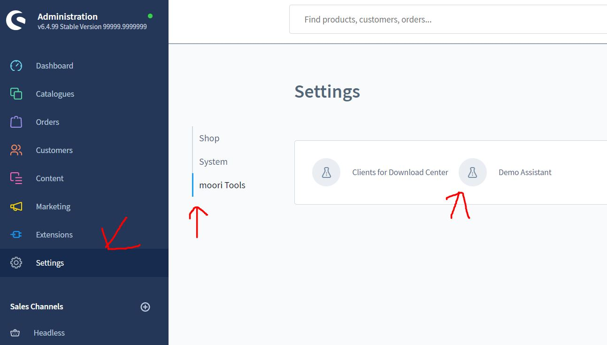
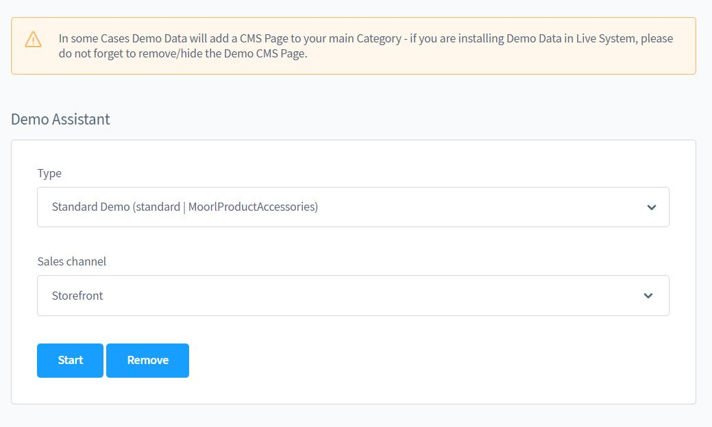

# Foundation | Demo Assistant

available from Shopware 6.4

### Simply install demo data

Many plugins have ready-made demo packages and thus make it easier for you to fill content.

### How does it work?

After you have installed Foundation, go to the "Settings" on the "Extensions" tab and then click on the "Demo Assistant".

Then simply select the desired plug-in and the correct sales channel.

Please note that the images are protected by copyright. The contents of the demo packages may not be freely accessible.
