# Foundation Premium Features

Die Premium Features können mit dem Foundation Unlocker aktiviert werden.

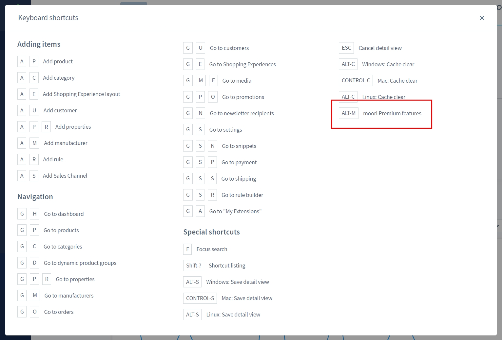

## Shortcut

Die Features werden mit `ALT+M` (Linux/Windows) oder `CONTROL+M` (Mac) aktiviert/deaktiviert.

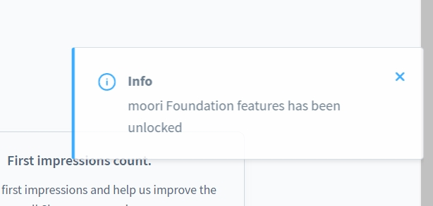

Durch eine Meldung wird bekannt gegeben, dass die Features freigeschaltet wurden.

## CMS Features

Das Plugin bietet eine Reihe an nützlichen CMS Features, hier werden diese im Detail erklärt.

### Responsive CMS Block Darstellung

Hier lassen sich die CMS Blöcke je nach Endgerät/Bildbreite anzeigen oder ausblenden.

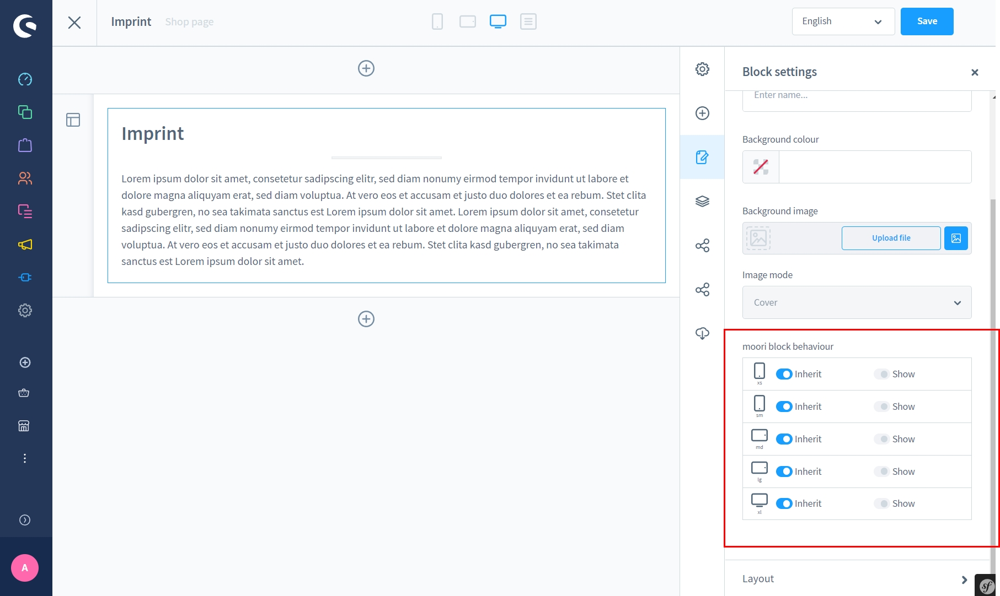

### Zusätzliche Element Optionen

Es erscheinen zwei neue Optionen für das CMS Element

- Element speichern
- Animationen

Elementkonfigurationen können gespeichert werden. So erspart man sich eine immer
wiederkehrende Konfiguration für dasselbe Element.

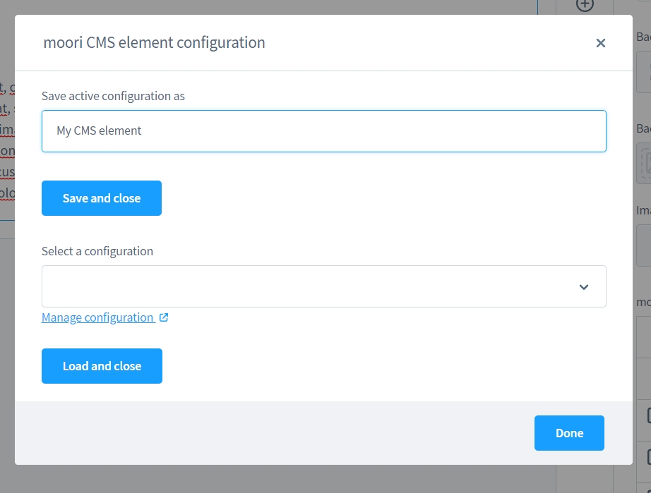

Die gespeicherte Konfiguration kann man über das Auswahlfeld bestimmen und anschließend
in das gewünschte Element übertragen.

Jedes Element, welches sich in einem moori Spalten/Grid Block befindet kann mit
vielseitigen Animationen ausgestattet werden. Es gibt drei Typen für Animationen:

1. Einblendanimationen (Animate in)
2. Ausblendanimationen (Animate out)
3. Effekte

Diese können mit ebenfalls drei verschiedenen Auslösern gestartet werden:

1. Element ist teilweise sichtbar
1. Element ist ganz sichtbar
1. Maus befindet sich über dem Element

### Zusätzliche Layouts/Blöcke

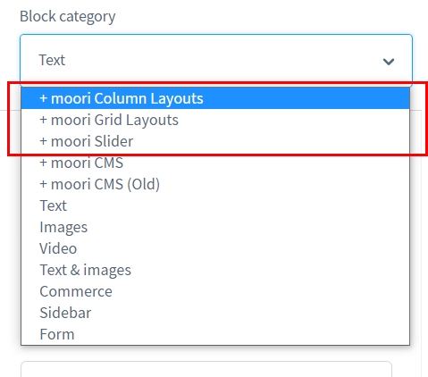

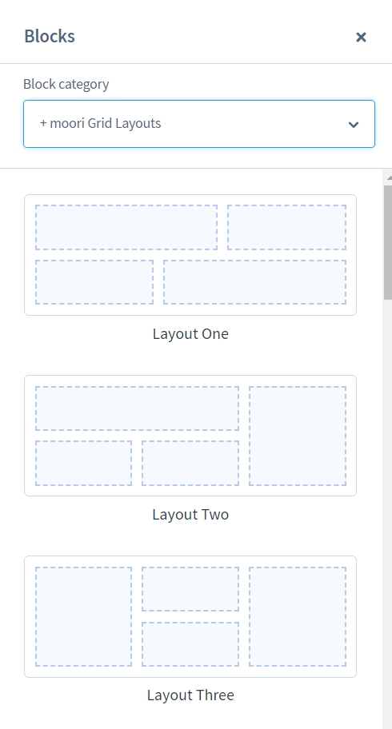

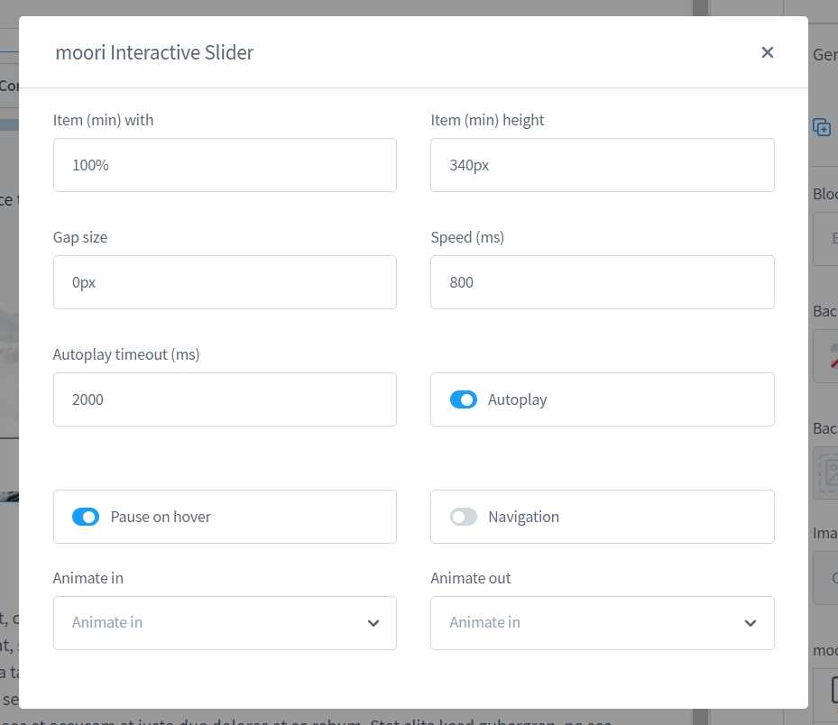

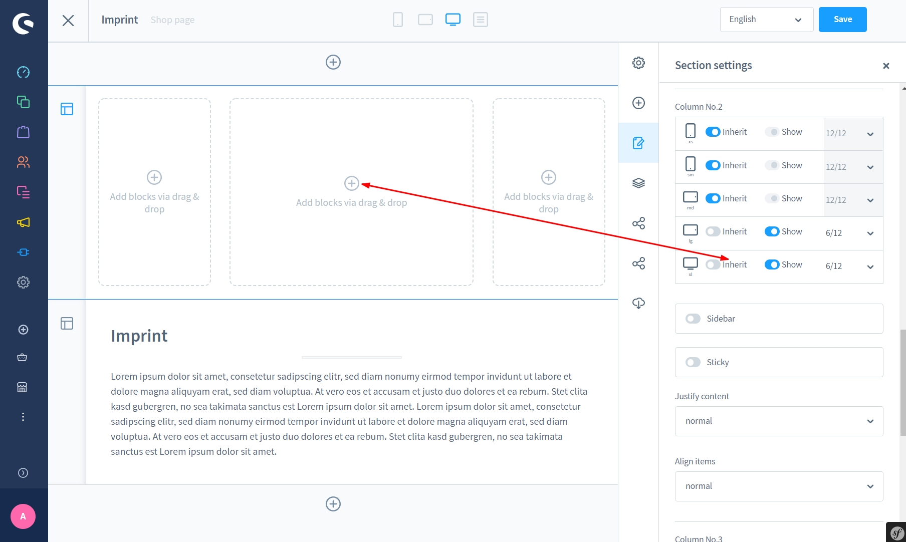

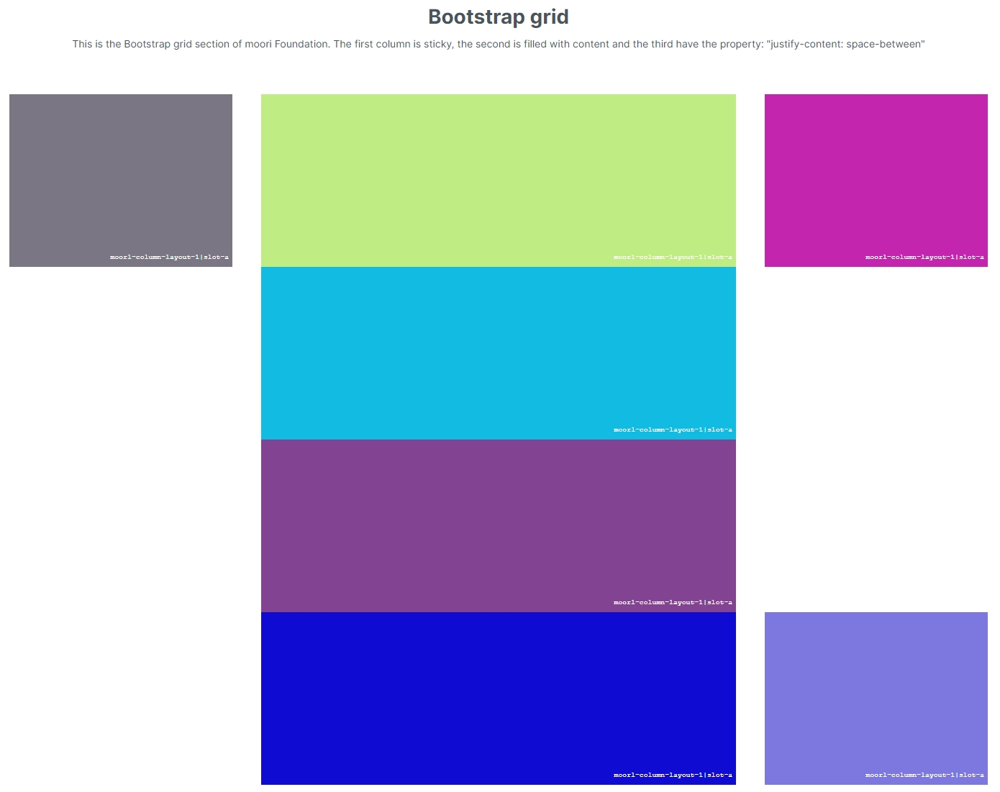
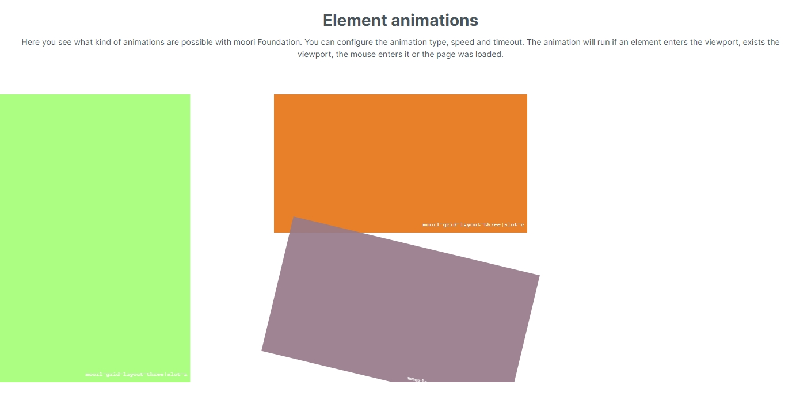
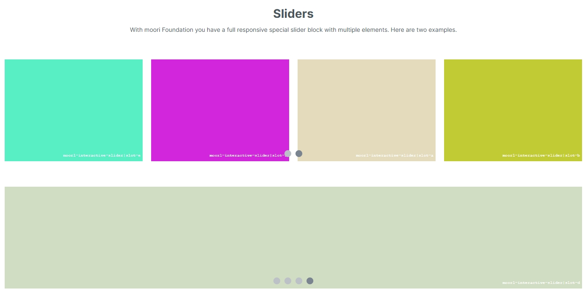
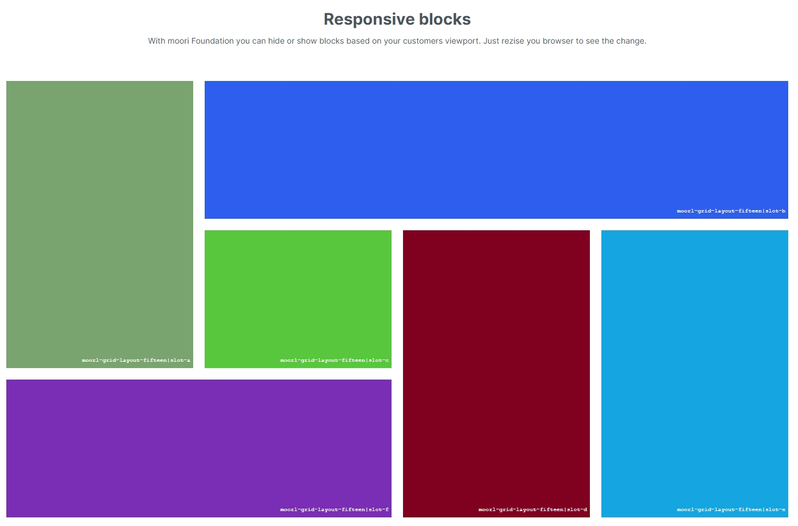
