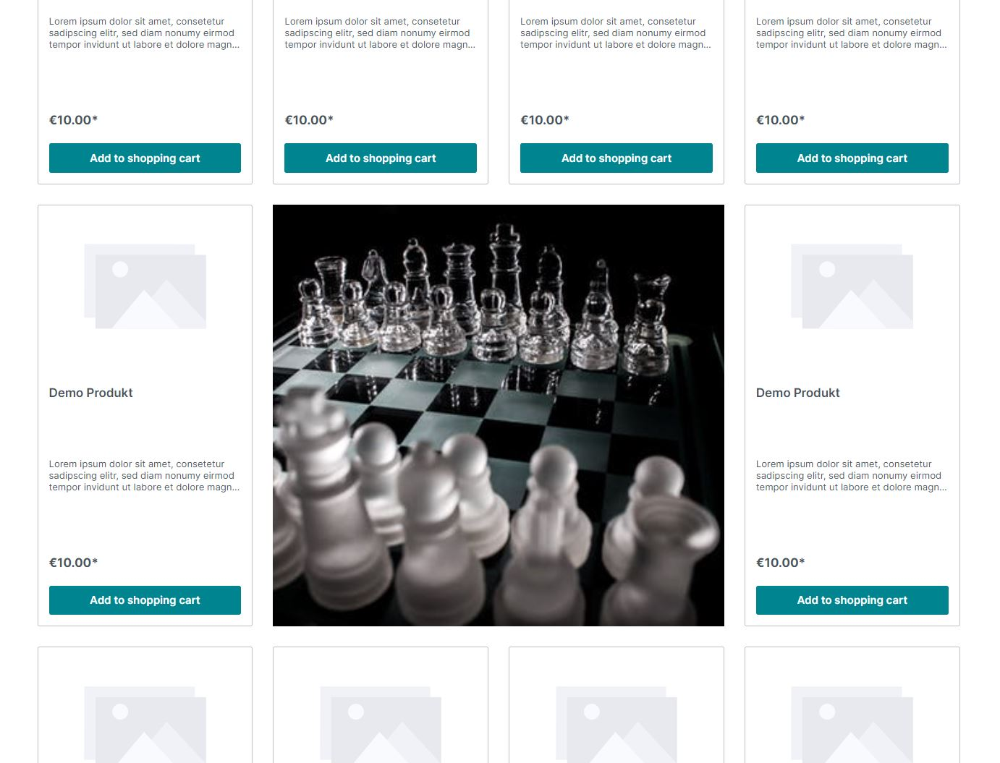
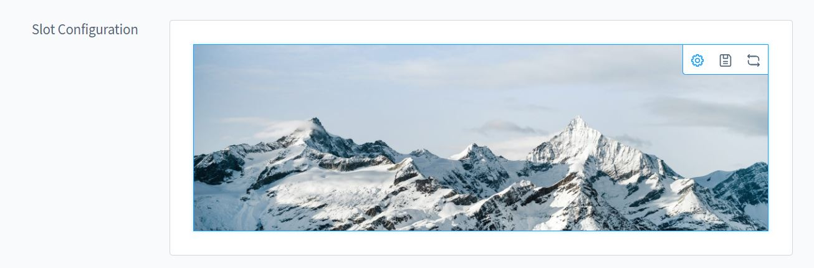

# Listing Störer für Shopware 6

[Hier geht's zur Demo](https://demo.moori.net/Stoerer-im-Listing-Demo/)

Mit dieser App kannst Du Dein Produkt Listing mithilfe von CMS Elementen jeglicher Art
aufpeppen. So werden Deine Kunden auf Interessante Aktionen und Hinweise aufmerksam 
gemacht.

Gestalte deine Produkt Listings um und untermale somit dein Produktangebot mit 
exklusiven Inhalten. Die Handhabung ist sehr einfach, Du bestimmst auf welcher 
Kategorie Seite und auf welcher Listing Seite dein Störer erscheinen Soll. 
Erstelle deinen Störer aus der CMS Element Bibliothek von Shopware oder aus CMS 
Elementen, die Du durch andere Plugin Hersteller bezogen hast. Stelle ein an 
welcher Stelle im Listing, welche Breite und für welche Viewports dein Störer 
erscheinen soll.

Mit dieses Plugin erhältst Du auch wieder ein fertiges Demopaket. 
Du kannst dieses Demo Paket über "Einstellungen | Plugins | Demo Assistent" finden 
und Installieren. 

