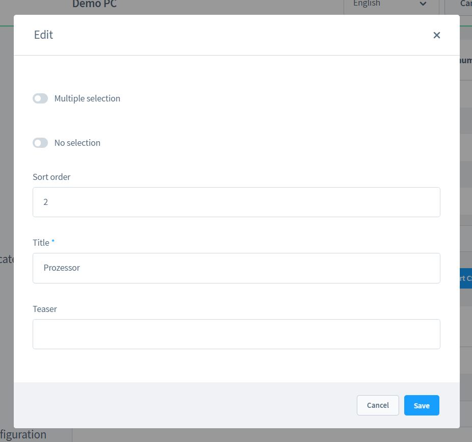
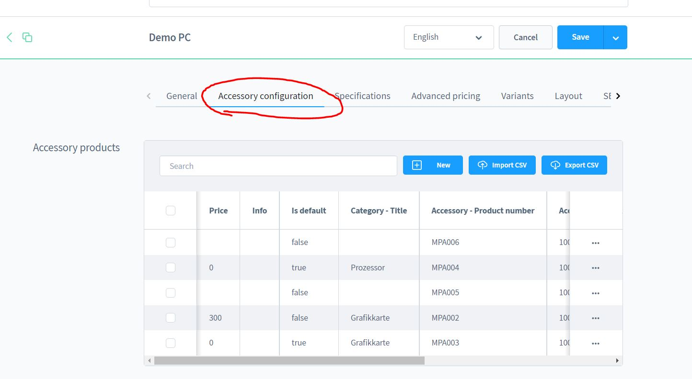
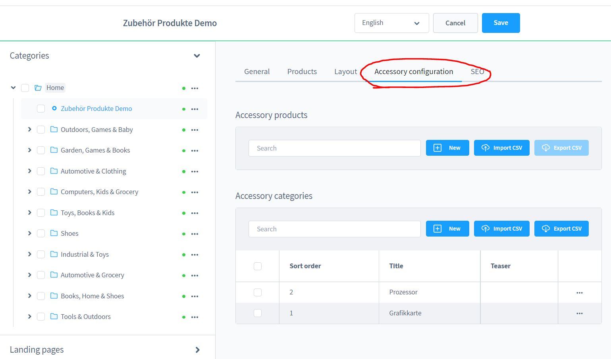
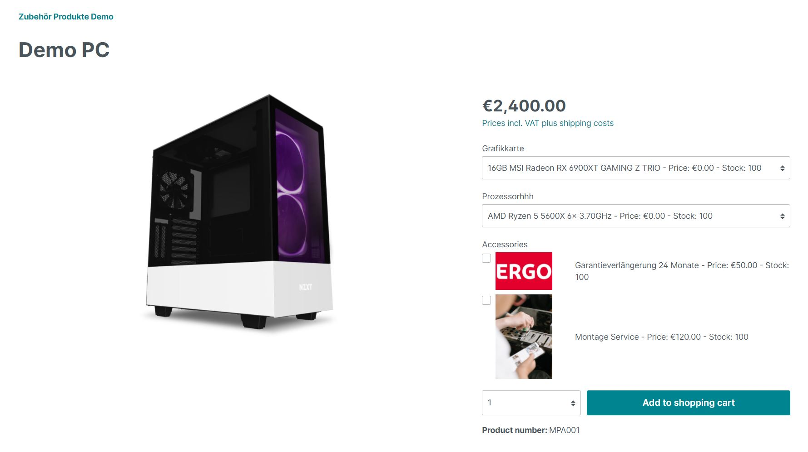

# Shopware 6的产品插件和附件

[点击这里查看演示](https://demo.moori.net/Demo-PC/MPA001)

有了这个插件，你还可以得到一个现成的演示包。
你可以通过 "设置|插件|演示助手 "找到这个演示包。
并安装它。

## 安装

1.安装
[基金会](./MoorlFoundation/index.md)

2. 可选：在这个应用程序中，有一个
   [演示包](./MoorlFoundation/demo-assistant.md)
   包括。

## 配置

你一般可以在产品或类别的细节下找到配置。

如果你想对你的产品附加组件进行分组，你应该首先创建类别。

输入一个名称和一个排序，其他字段目前不相关。

从技术角度来看，附加组件不是伪产品，而是__真正__的产品。
购买时，库存水平会被更新。

在这里，你可以配置附加组件/配件产品。你有以下选择，关于
的定价。

- 调整后的价格：是=价格可以自己定义，否=产品的标准价格。
- 是标准的：这个选项是预选的
- 附加产品：可以选择作为附加产品的产品
- 类别（可选）：在这个类别中，选择被归类为

###产品级别

在这里，你可以访问产品层面的配置。

以下选项可以在产品层面进行配置。

- 隐藏列表中的添加到购物车按钮。防止产品在没有配置的情况下被单独添加到购物车中。
- 显示徽章。在列表中显示一个徽章
- 将配置排除在类别级别之外。忽略所选类别级别的配置。

例子。

### 类别

如果配置重复多次，值得在类别层面上创建配置。
类别级别。所有与该类别相关的产品都被考虑在内。
顾及到了。

## 插件配置

- 创建捆绑产品：是=包括附加组件的产品将被添加到购物车中，否=所有产品将被单独添加到购物车中
- 显示股票。是=将被显示，否=将不被显示。

∮∮店面

这就是配置器在产品详情页上的样子。

而像这样在购物车里。

