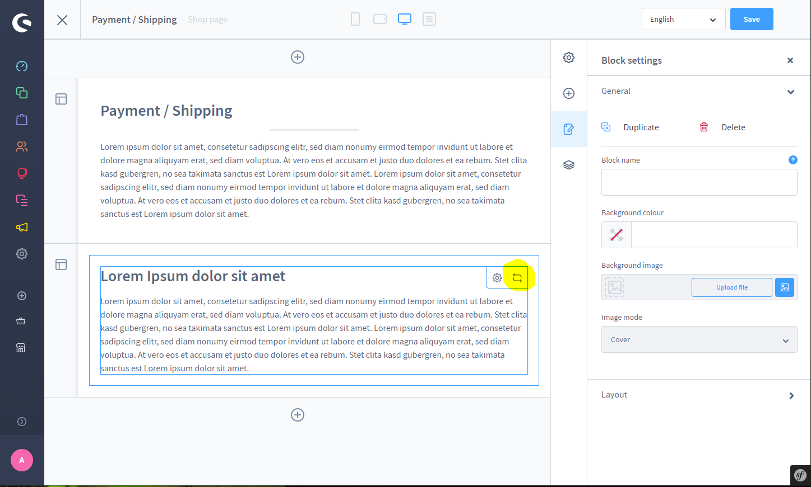
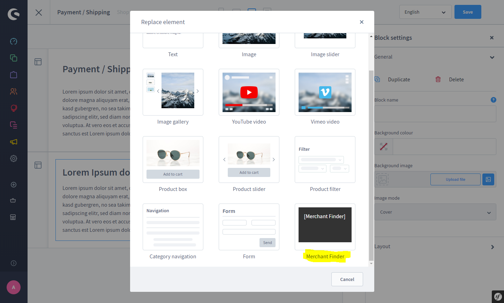

# Häufig gestellte Fragen

- [Ich finde das Block Element zum Plugin nicht](#ich-finde-das-block-element-zum-plugin-nicht)
- [Das Plugin läuft nicht](#das-plugin-luft-nicht)
- [Mir fehlt eine wichtige Funktion](#mir-fehlt-eine-wichtige-funktion)

## Ich finde das Block Element zum Plugin nicht

Viele haben Stunden lang nach dem Block Element (zum Beispiel für die Händlersuche) gesucht. Ein großer Teil meiner Plugins besitzt jedoch keinen Block, sondern nur ein Element.

Shopware unterscheidet zwischen Blöcken und Elementen. So kann beispielsweise ein Block auch aus mehreren Elementen bestehen. Generell hast du Zugriff auf meine Elemente hier:

Nun kannst du das entsprechende Element auswählen!

## Das Plugin läuft nicht

Lässt sich das Plugin aus irgendeinem Grund nicht starten, dann check zunächst ob du die aktuelle Shopware Version hast und auch ob das Plugin aktuell ist.

Sollte das der Fall sein, dann kannst du gerne sofort Kontakt zu mir aufnehmen! Meine E-Mail Adresse lautet info@moorleiche.com, ich versuche möglichst früh zu reagieren.

## Mir fehlt eine wichtige Funktion

Für Verbesserungsvorschläge bin ich immer offen, sinnvolle Erweiterungen werden in der Regel auch gerne umgesetzt. Ich habe mir vorgenommen meine Plugins mit eurer Hilfe weiter zu Entwickeln, wohin die Reise auch hin geht.