# Discounts on Product Combinations

## Installation

!!! note

      If you encounter issues with the plugin, please refer to the following [guidelines](../) in the FAQ section.

1. Install [Foundation](../MoorlFoundation/index.md)
2. Install Discounts on Product Combinations
3. Optional: A [demo package](../MoorlFoundation/demo-assistant.md) is included in this app.
4. Navigate to: Marketing | Combinations & Discounts

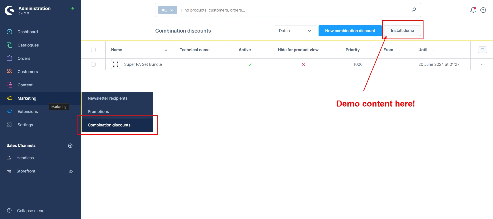

Here you can create a new entry.

## Settings

### Basic Configuration

In the basic configuration, you can make general settings.

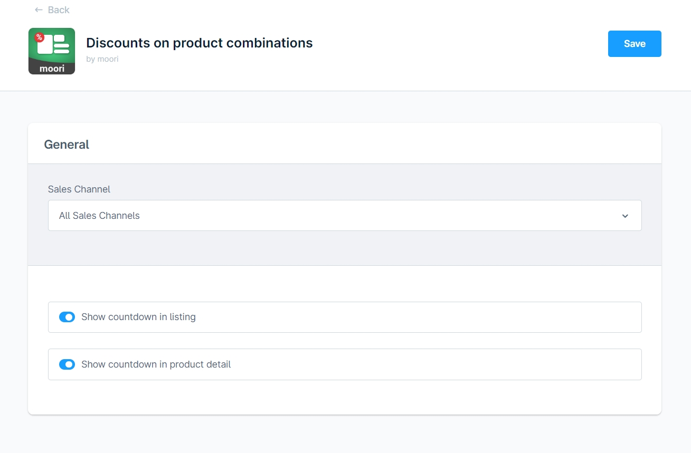

- Show countdown in listing
- Show countdown/element on the product detail page

## Create Product Combination

Click on create new combination.

### Basic Settings:

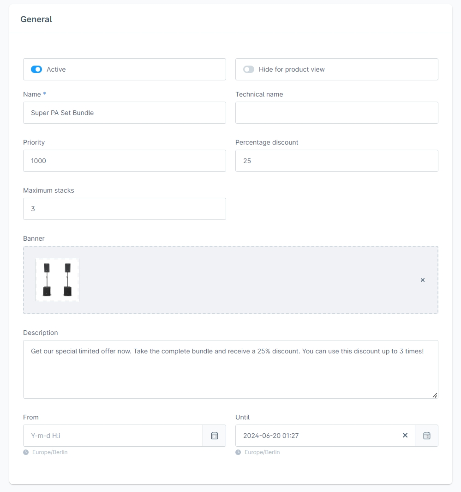

- Active: Activates the product combination.
- Hide for products: The product combination is active and can be integrated as a CMS element but will not be displayed on the product detail page or in the listing.
- Name: The public name.
- Technical Name: The internal name.
- Priority: The combination with higher priority will be calculated first in the cart. This is useful if products appear in multiple combinations.
- Percentage Discount: The discount for the listed combination of products.
- Maximum redeemable: The discount is calculated on a limited number of combinations.
- Banner: Displayed as a banner and also serves as a cover for the cart position of the discount.
- Description: An additional description.
- From and to time: The combination and discount will only be displayed during this time.

### Optional Element Settings

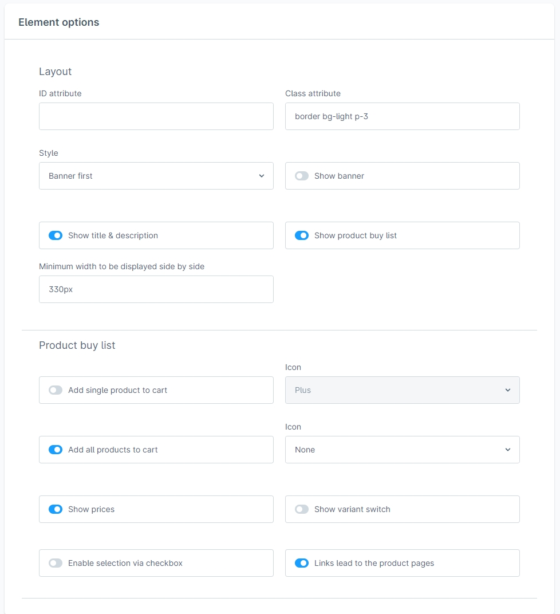

Layout

- ID Attribute: The element can be supplemented with an ID, e.g., for stylesheet adjustments.
- Class Attribute: The element can be supplemented with a CSS class, e.g., for stylesheet adjustments.
- Style: Banner or content first
- Show Banner: Enable banner in the element. Countdown and hotspots can also be displayed.
- Show Title & Description: Displays title & description.
- Show Shopping List: Displays shopping list.
- Minimum width for side-by-side display: If banner and content no longer fit side by side, they are displayed one below the other.

Shopping List

- Add individually to cart: Products can be added to the cart individually.
- Add all to cart: The entire combination can be added to the cart.
- Icon: Type of icon.
- Show prices: Displays prices.
- Enable variant switch: Enables variant switch. This option only makes sense if no discount calculation is activated, as discounts are not calculated for all variants.
- Enable selection through checkbox: Allows products in the shopping list to be selected.
- Links lead to product pages: Active - Click leads to the product detail page | Inactive - Click opens a window.

Hotspots

- Show hotspots: Hotspots are displayed on the banner. You can enter the positions in % in the product list. A preview is currently not available!
- Hotspot Animation: Select an animation for the hotspots.

Countdown

- Show countdown: Displays a countdown. Only available if the combination has an expiration date.
- Countdown type: Choose from different types.

### List of Combinations

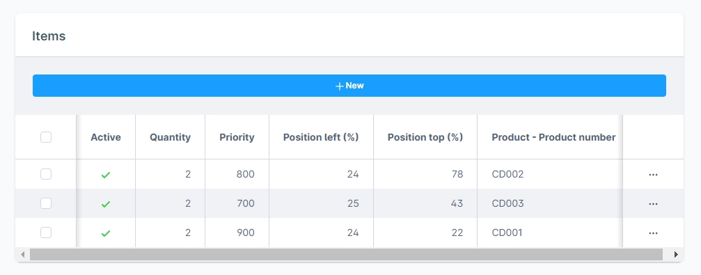

Here you can assign or remove products as positions.

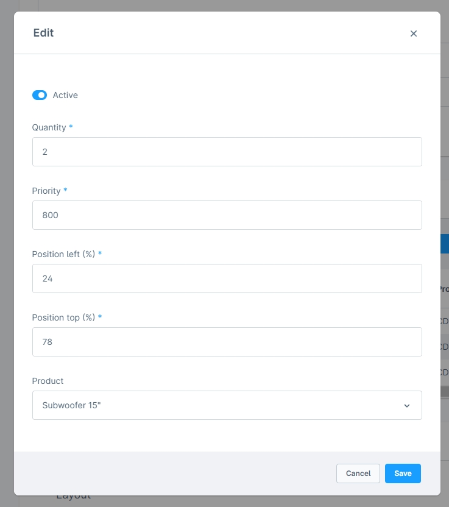

- Active: The position is active.
- Quantity: The product is added to the cart in the specified quantity.
- Priority: Defines the order in the list.
- Position left (%): The distance to the left for the hotspot on a banner.
- Position top (%): The distance to the top for the hotspot on a banner.
- Product: The product.

## Create CMS Element

Optionally, you have the option to display your combinations as a CMS element. This element also has a Shop-The-Look feature.

In this CMS element, you can override the element settings of the combination.

## View in Storefront

### Product Detail Page

The combination is displayed on your product's detail page. Here the customer has the option to add the combination to the cart. Optionally, you can globally disable the display on the product detail page in the plugin settings.

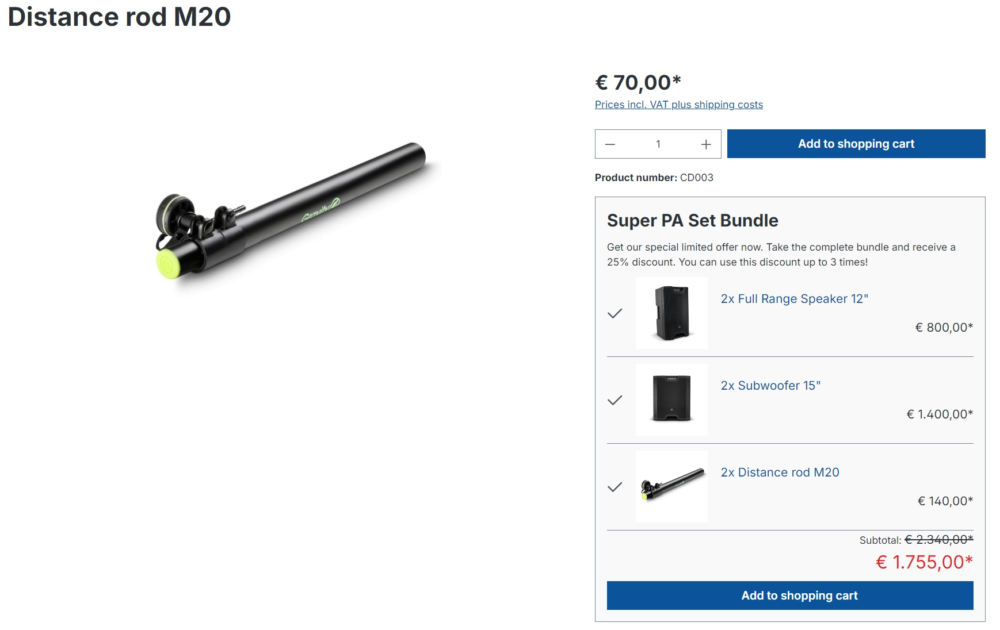

### Product Listing

If a countdown is present, it will be displayed in the list.

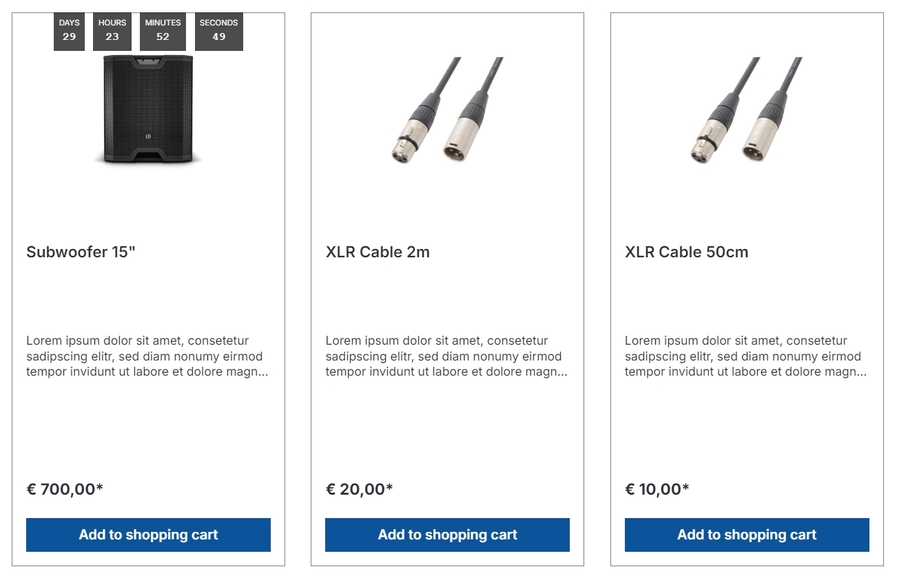

### CMS Element

All important information is contained in the CMS element. Once the combination expires, the CMS element is empty.

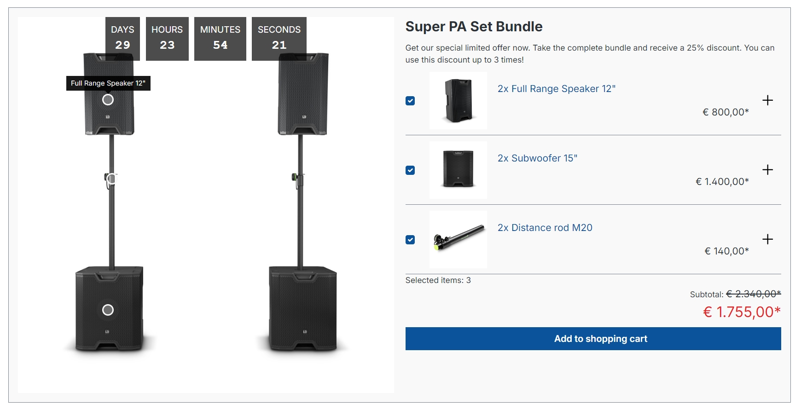

### Shopping Cart

It is determined how many times a combination fits in the cart. It also considers how many times the discount can be used. A credit is automatically created based on the combinations and the percentage discount value.

!!! note

      If a product is no longer available, it will be removed from the cart. Therefore, no credit is created!

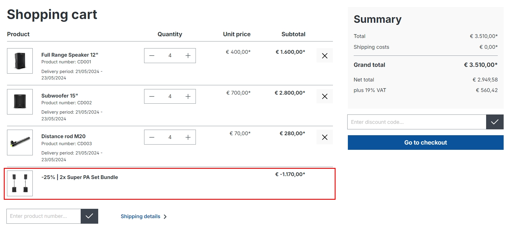

## Order Management

In order management, you can see the credit. It is of type `credit`.

!!! note

      If you edit the order, you must delete the credit so it can be recalculated. If the product combination is active, the credit will be automatically created again. If you do not want it in the order, deactivate the product combination or manually change the credit to 0!

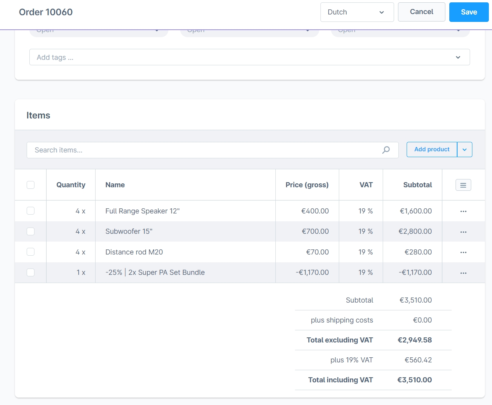
