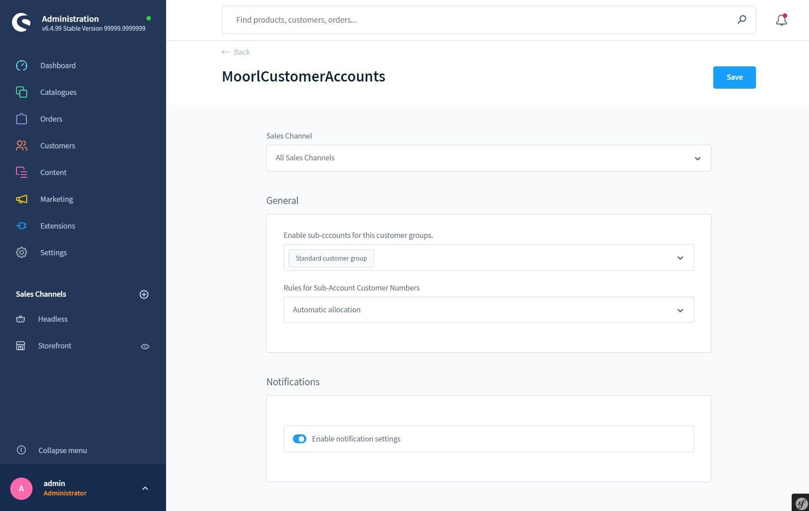
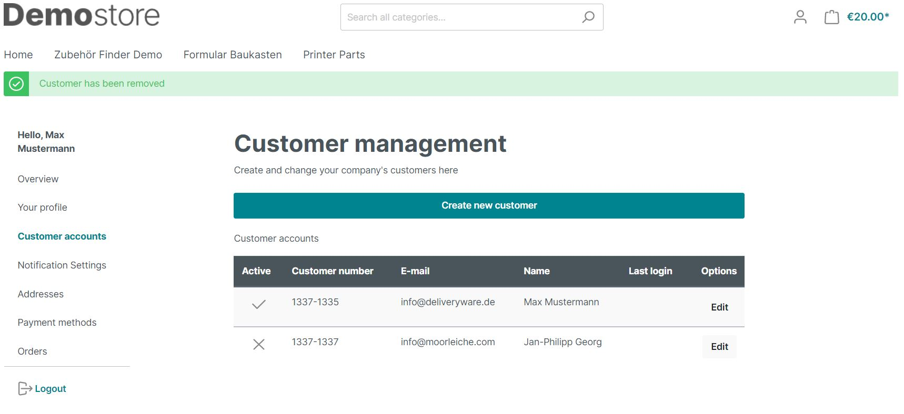
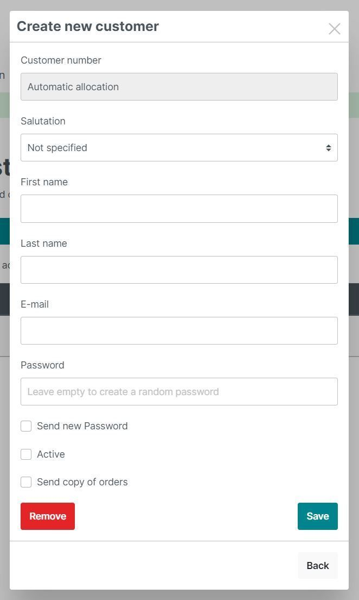
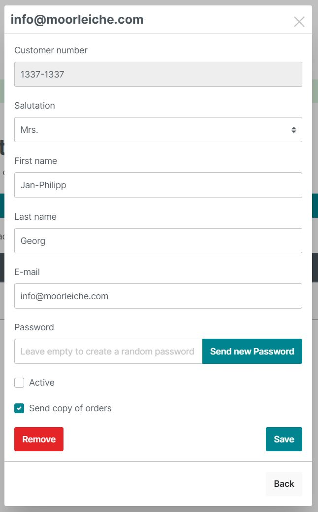
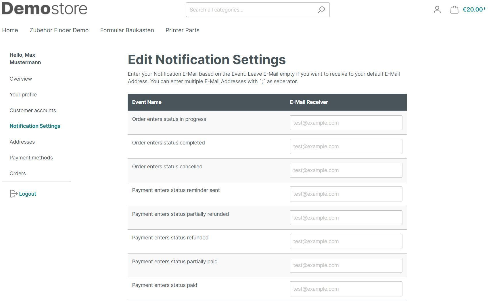

# Kunden Zugangsverwaltung

Lassen Sie Ihre Kunden selbst Zugänge für mehrere Personen anlegen. 
So kann jede Person mit einem individuellen Zugang Bestellungen im Namen des Kunden tätigen.

## Plugin Einstellungen

1. Aktiviere Unter-Accounts für diese Kundengruppen.
2. Regeln für die Kundennummern der Unter-Accounts:
    * Automatische Vergabe - Es wird eine Kundennummer generiert
    * Manuell: Die Kundennummer beginnt mit der Kundennummer des Haupt-Accounts
    * Manuell und einmalig: Wie Manuell - Es wird jedoch geprüft ob die Kundennummer bereits existiert
3. Benachrichtigungseinstellungen aktivieren - Der Hauptkunde kann für den Bestellablauf E-Mail Empfänger einstellen

## Frontend

Ist ein Kunde dazu berechtigt Unteraccounts anzulegen, so erscheint ein weiterer Menüpunkt
im Kundenbereich. Dort werden die Unteraccounts gelistet, inklusive Status und letztem Login.

Hier können nun durch klick auf den Button weitere Zugänge erstellt werden.

Sofern der Kunde sein Passwort vergisst, kann schnell ein neues erstellt werden.

Wenn die Benachrichtigungseinstellungen aktiviert wurden, kann der Kunde ebenfalls hier seine
E-Mail Empfänger eintragen.

