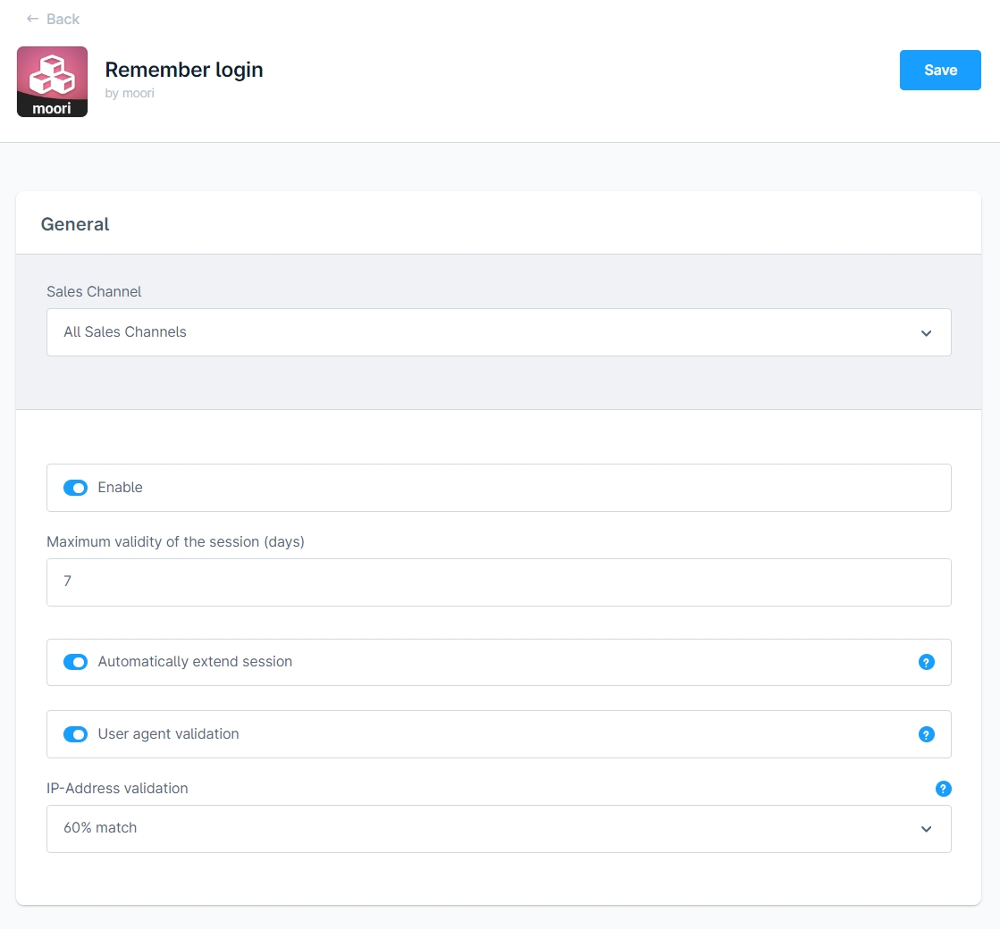
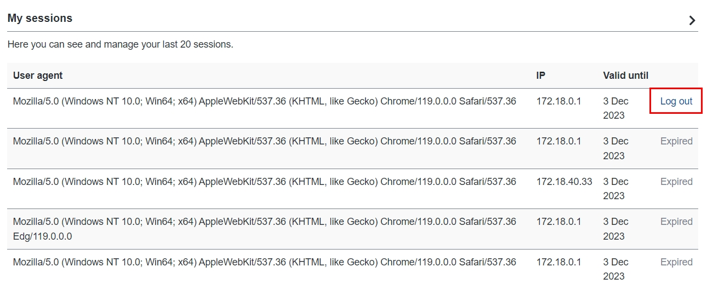
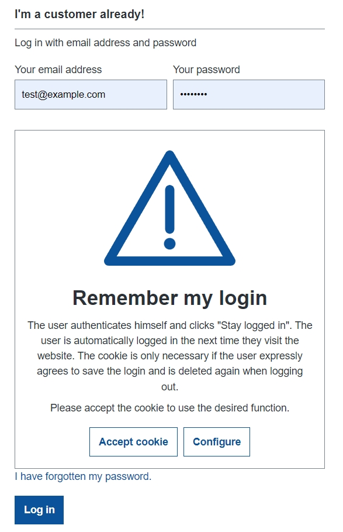

# Login merken

Bietet dem Kunden die Möglichkeit, seinen Login für eine festgelegte Dauer zu speichern. Dadurch muss der Kunde nicht immer wieder seine Zugangsdaten eingeben.

## Konfiguration

Du erreichst die Konfiguration über "Erweiterungen" -> "Meine Erweiterungen" -> "Login merken", klicke dort auf "..." -> "Konfiguration".

- Aktiv: Aktiviert die Erweiterung, wenn ausgewählt
- Maximale Gültigkeit der Sitzung: Lege fest wie viele Tage der automatische Login gültig ist
- Sitzung automatisch verlängern: Die Gültigkeit des Logins wird automatisch um x Tage verlängert
- Überprüfung des User-Agents: Überprüft die Browser-Informationen des Kunden, sofern diese abweichen ist kein automatischer Login möglich. Dies kann z.B. bei einem Update des Browsers der Fall sein
- Überprüfung der IP-Adresse: Überprüft die IP-Adresse des Kunden beim automatischen Login. Sofern die IP-Adresse von der Regel abweicht, ist kein automatischer Login möglich
- Abgelaufene oder beendete Sitzungen löschen nach...: Automatische Löschung wird als geplante Aufgabe (Scheduled Task) ausgeführt. Manuelle Löschung als CLI Befehl "moorl-customer-session:clean-up"
- Typ des Cookies: Auswahl zwischen "Optional (Komfortfunktion)" und "Essenziell (Technisch erforderlich)"

## Ansicht im Storefront

Zusätzliches Kontrollfeld im Login-Formular.

Eingeklappter Bereich in der Account-Übersicht

Ausgeklappt - hier können aktive Logins entfernt werden, das gilt auch geräteübergreifend.

Cookie box - wenn Cookie Typ auf "Optional (Komfortfunktion)" gesetzt ist und der Benutzer dem Cookie nicht zugestimmt hat.

## Hinweise zur Sicherheit

Dieses Plugin bietet einige Sicherheitsoptionen, der Kunde kann jederzeit die aktiven Sitzungen inkl. IP-Adresse einsehen und beenden. Jedoch kann man keine hundertprozentige Sicherheit garantieren, da die Browser-Cookies von kompromittierten Systemen ausgelesen und IP-Adressen durch VPN Netzwerke simuliert werden können. Bitte verwende diese Erweiterung mit Bedacht!

Quelle:

[https://www.it-daily.net/it-sicherheit/cybercrime/cookie-klau-liegt-zunehmend-im-trend](https://www.it-daily.net/it-sicherheit/cybercrime/cookie-klau-liegt-zunehmend-im-trend)
