# Download Center

Mit diesem Plugin kannst du Downloads in verschiedenen Variationen anbieten. Zum einen gibt es öffentliche Downloads frei zugänglich auf einer Produktseite oder Einkaufswelten. Zum anderen kannst du Downloads nur für bestimmte Kunden (-gruppen) freigeben. Du kannst aber auch genauso Download-Produkte oder Lizenzschlüssel verkaufen. Hier werden dir rund um das Thema Downloads viele Möglichkeiten geboten.

## Verfügbare Dateisysteme

* Lokales Dateisystem
* FTP
* SSH
* Amazon S3
* WebDAV
* Nextcloud
* Azure (wird bei Bedarf nachgeliefert)
* Google Storage (wird bei Bedarf nachgeliefert)

Der Shopware Medien-Manager wird nicht angeboten. Es ist jedoch möglich mit folgendem Plugin eine WebDAV Verbindung aufzubauen:
https://store.shopware.com/frosh11030048018f/webdav.html

## Installation

!!! note

      Falls du Probleme mit dem Plugin hast, bitte beachte folgende [Hinweise](../) im FAQ Bereich.

1. Installiere [Foundation](../MoorlFoundation/index.md)
2. Installiere dieses Plugin
3. Optional: In diesem Plugin ist ein [Demopaket](../MoorlFoundation/demo-assistant.md) enthalten.
4. Wenn du kein Demopaket installiert hast, musst du zunächst einen [Client](../MoorlFoundation/client.md) erstellen.
5. Die Verwaltung deiner Downloads findest du nun unter: Inhalte / Download Center (DLC)

## Fehlende Dienste nachladen

Einige Dienste benötigen composer Pakete, folgende Befehle kannst du im Hauptverzeichnis deines Shopware 6 Shops ausführen:

```text
composer require league/flysystem-ftp
composer require league/flysystem-webdav
```

## Übersicht

In der Übersicht findest du eine Zusammenfassung aller Downloads. In diesem Beispiel ist das Demopaket bereits installiert.

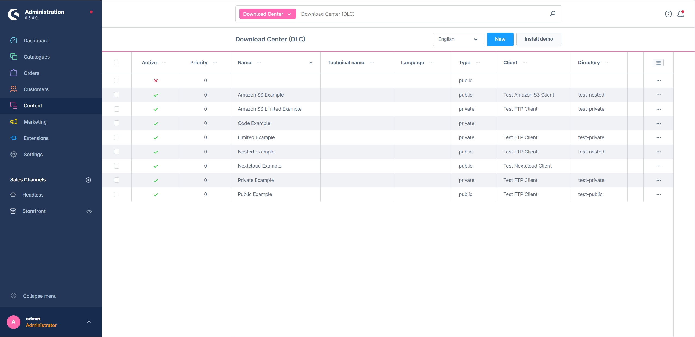

## Einstellungen

### Plugin Einstellungen

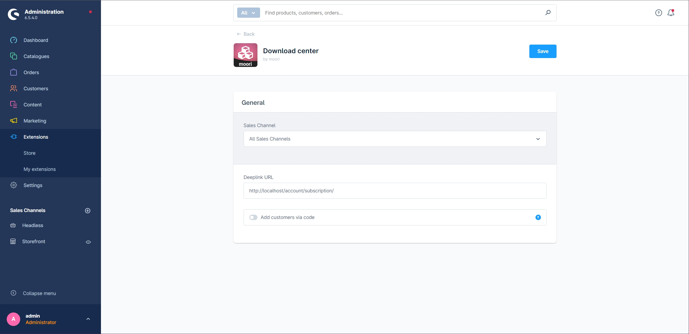

- Deeplink URL: Diese URL wird genutzt um z.B. Links für Gastbesteller zu generieren, trage hier deine aktuelle Domain ein + "/account/subscription/"
- Kunden mit Code hinzufügen: Schaltet die Funktion frei, dass Kunden im Kundenbereich ein Code zur Freischaltung von Downloads eingeben können

### Basiskonfiguration

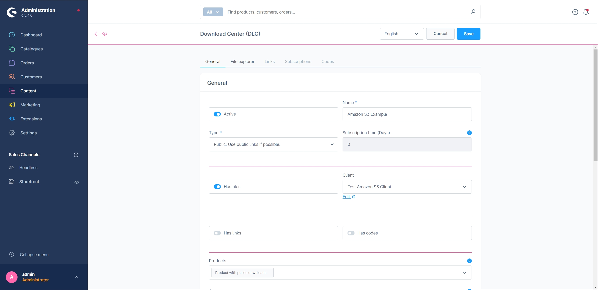

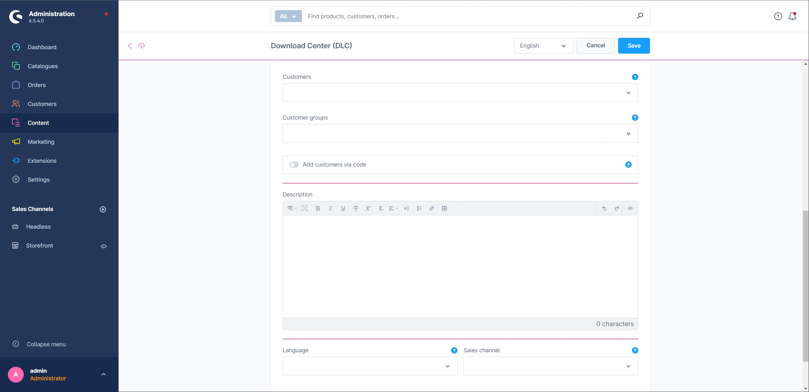

- Aktiv
- Name
- Typ (privat oder öffentlich)
- Hat Dateien (Client-Auswahl und Reiter mit dem Datei-Explorer wird aktiviert)
- Client (Wähle den Client mit einem Dateisystem)
- Hat Links (Reiter mit Links wird aktiviert)
- Hat Codes (Reiter mit Codes wird aktiviert)
- Produkte (Zuweisung zum Produkt. Privat: Download erst verfügbar nach Bestellung. Öffentlich: Downloads sind sofort verfügbar im Reiter "Downloads" auf der Produkt-Detailseite)
- Kunden (Direktzuweisung zum Kunden. Kunde kann im Kundenbereich die Downloads sehen und herunterladen)
- Kundengruppen (selbe Funktion wie bei Kunden)
- Kunden-Downloads via Code erstellen (Der Kunde kann den persönlichen Download mit einem Code freischalten. Die Codes dienen ausschließlich für den Kunden und dürfen nicht mehr als Seriennummern für ESD Produkte verwendet werden)
- Beschreibung
- Sprache (Downloads werden nur für eine bestimmte Sprache geladen)
- Verkaufskanal (Downloads werden nur für einen bestimmten Verkaufskanal geladen)

### Datei-Explorer

Wähle hier das Verzeichnis aus, welches zum Download zur Verfügung steht. Es sind alle Unterverzeichnisse für den Kunden zugänglich, so kannst du z.B. für unterschiedliche Download-Kategorien oder Sprachen eigene Verzeichnisse anlegen.

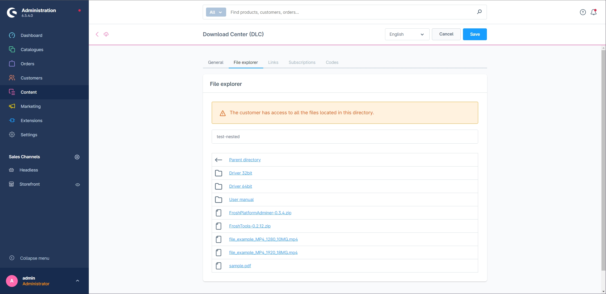

### Links

Hier kannst du externe Links eintragen. z.B. wenn du eine Seriennummer für ein Microsoft Produkt anbietest, aber selbst nicht den Download zur Verfügung stellst. Das entlastet auch deine Bandbreite.

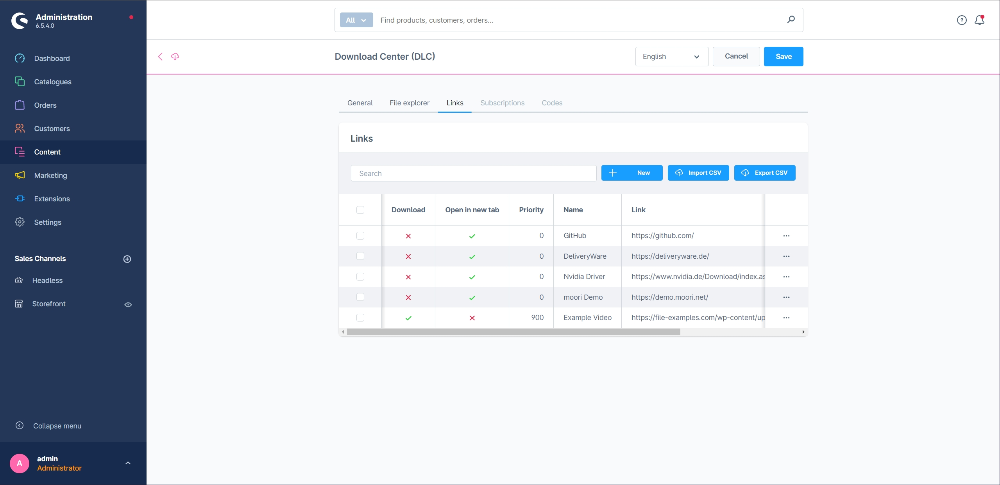

### Einkäufe

Hier findest du eine Übersicht aller Einkäufe deiner Kunden, diese kannst du bei Bedarf auch selbst erstellen oder anpassen.

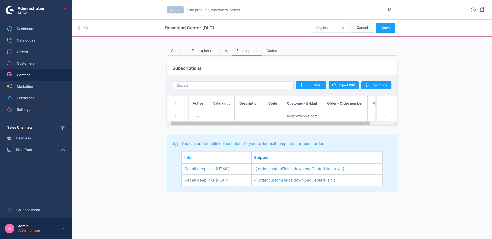

### Codes

In diesem Reiter verwaltest du z.B. die Seriennummern von deinen Softwareprodukten. Es ist auch möglich Volumenlizenzschlüssel einzufügen, damit kann ein Schlüssel mehrmals verkauft werden.

Wenn du die Codes für persönliche Kunden-Downloads nutzen möchtest, kannst zu z.B. einfach ein neues Element erstellen, der Code wird automatisch generiert.

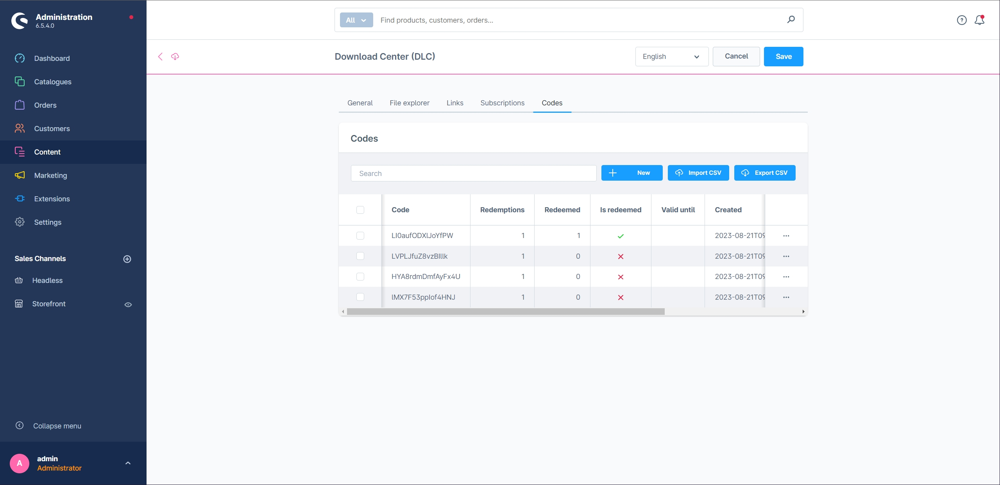

### Zusätzliche Gestaltungsmöglichkeit

Du kannst eine metadata.xml im Verzeichnis anlegen. Dort hast du drei zusätzliche Optionen:

- visibility (private): Blendet eine Datei aus (z.B. für die metadata.xml selbst)
- description: Eine zusätzliche Beschreibung für die Datei (aktuell nur einsprachig!)
- image: Eine Bild-URL oder Base64 für das Icon

Beispiel:

```xml
<files>
    <file name="_metadata.xml">
        <visibility>private</visibility>
        <description>Benutze dies um deine XML Datei zu verstecken</description>
    </file>
        <file name="FroshTools-0.2.12.zip">
        <visibility>private</visibility>
    </file>
    <file name="sample.pdf">
        <description>Irgendein PDF aus dem Internet</description>
        <image>data:image/png;base64,(...)</image>
    </file>
    <file name="FroshPlatformAdminer-0.3.4.zip">
        <description>Ein tolles Tool um Datenbanken in Shopware 6 zu verwalten</description>
        <image>https://avatars.githubusercontent.com/u/36633261?s=200&v=4</image>
    </file>
</files>
```

## Storefront

### Einkaufswelten

In diesem Beispiel sieht man ein Download Center als CMS Element.

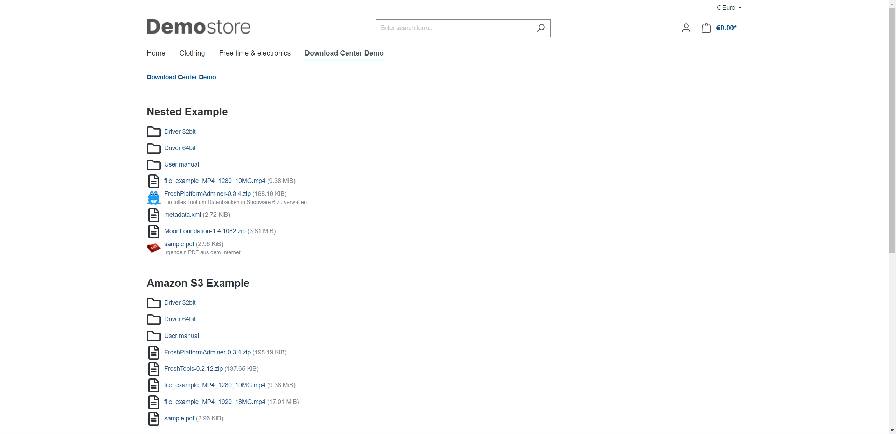

Ein Unterverzeichnis wird geöffnet.

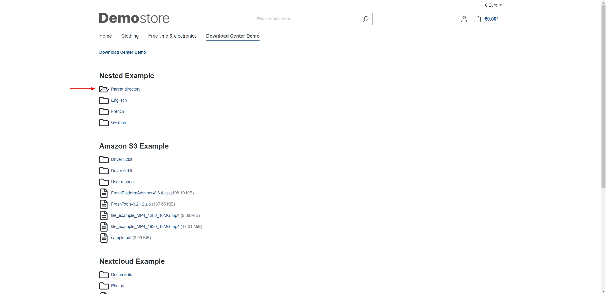

### Produkte

Ein normales ESD Produkt (Kann ein Download und/oder ein Code beinhalten)

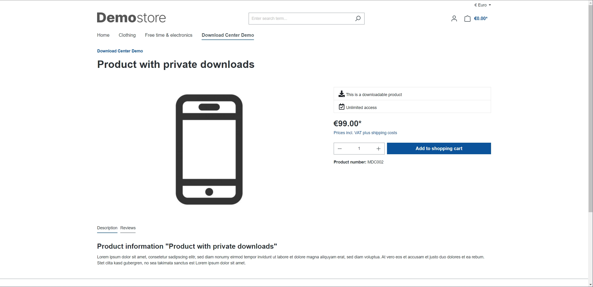

Ein Produkt mit öffentlichen Downloads, wie z.B. Bedienungsanleitungen.

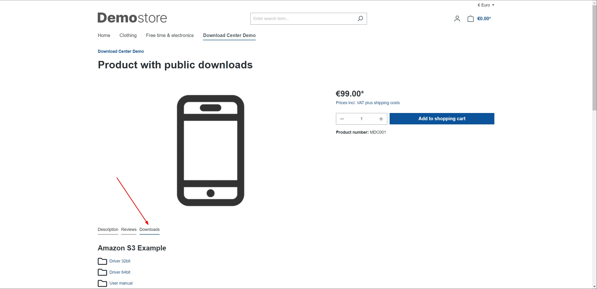

!!! note

      Du kannst auch private und öffentliche Downloads bei einem Produkt kombinieren

### Einkauf von ESD Produkten

#### Warenkorb

In diesem Beispiel kaufe ich ein gratis ESD Produkt, ein Produkt mit Codes un ein kostenpflichtiges ESD Produkt.

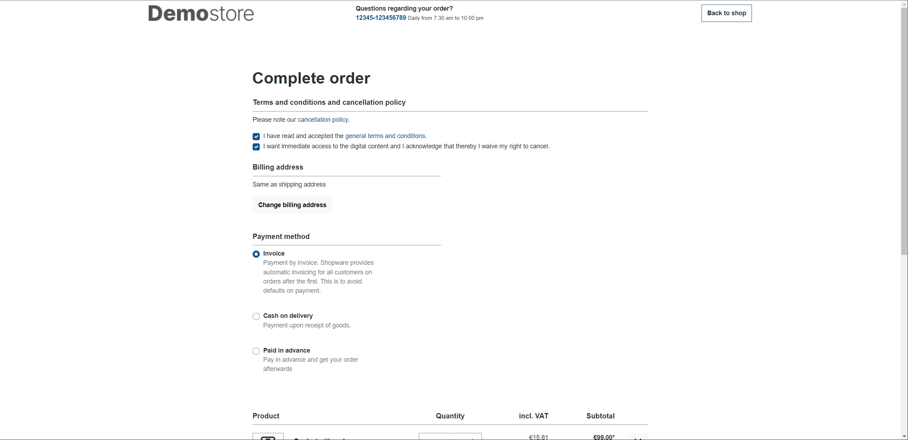

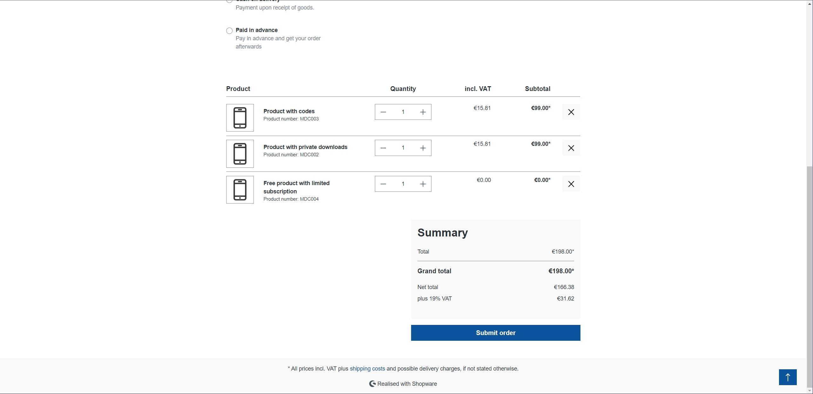

#### Meine Einkäufe

Neben der Bestellübersicht erscheint eine neue Seite im Kundenbereich mit den sogenannten Subscriptions.

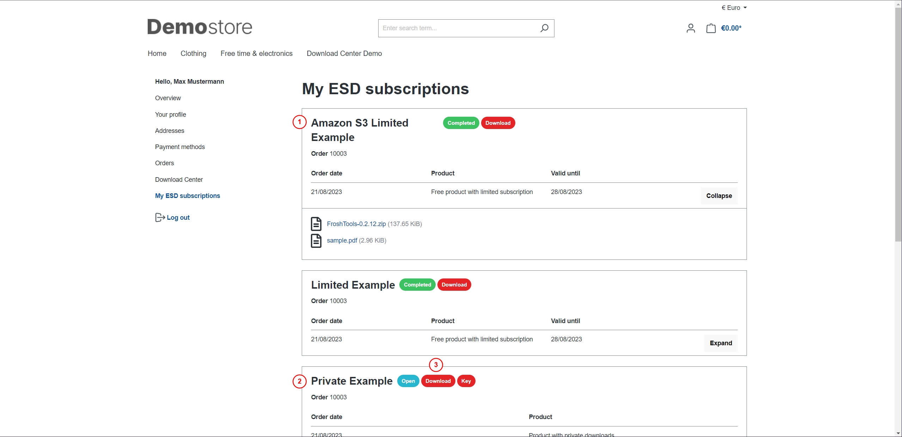

1. Das ist das gratis ESD Produkt und sofort freigeschaltet, die Freischaltung ist jedoch auf ein Datum limitiert.
2. Ein kostenpflichtiges ESD Produkt muss erst den Status "bezahlt" erreichen.
3. Informationen über Status und Inhalt der Subscription.

Jetzt setze ich im Admin den Zahlungsstatus auf "bezahlt" und prüfe erneut meine Subscriptions.

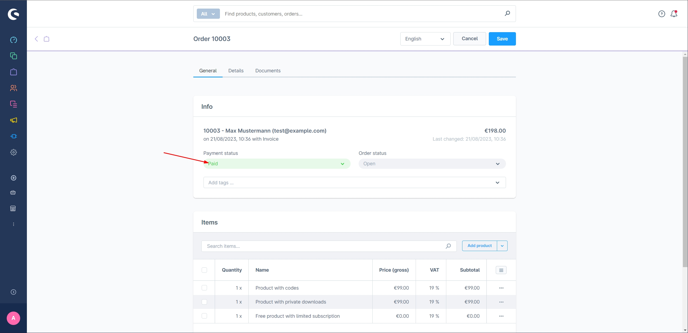

Downloads und Code stehen hier nun zur Verfügung.

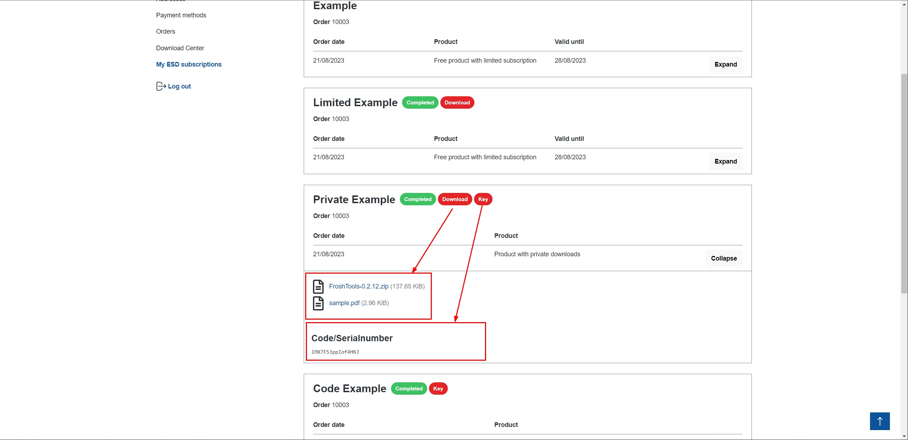

### Persönliche Downloads

Da es neben den Subscriptions auch eine Direktzuweisung über den Kunden oder die Kundengruppe gibt, hat der Kunde die Möglichkeit auf die Downloads direkt zuzugreifen.

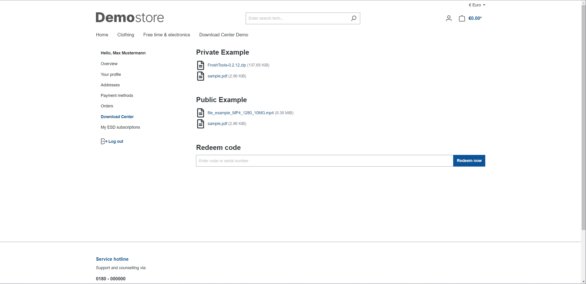

Das Eingabefeld um einen Code einzulösen wird über die Plugin einstellungen bei Bedarf ein- oder ausgeblendet.

## Sonderfall: Gastbesteller

Auch als Gastbesteller hat man die Möglichkeit ESD Produkte zu kaufen. Dafür musst du jedoch eine kleine Änderung am E-Mail Template durchführen.

Im Text Bereich diese Variable einfügen
```text
{{ order.customFields.downloadCenterPlain }}
```

Im HTML Bereich diese Variable einfügen
```html
{{ order.customFields.downloadCenterHtml|raw }}
```

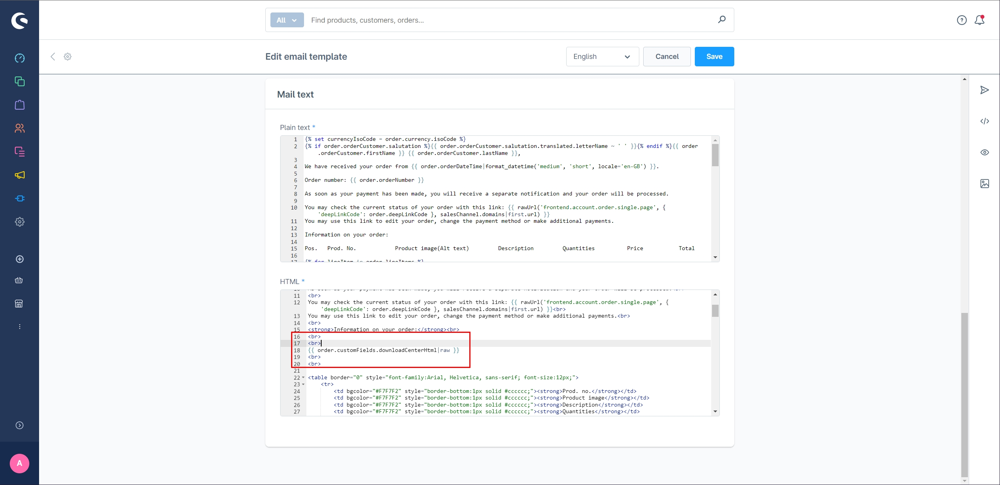

Nun sieht der Gastbesteller in der E-Mail einen direkten Link zu seinem gewünschten Download-Produkt.

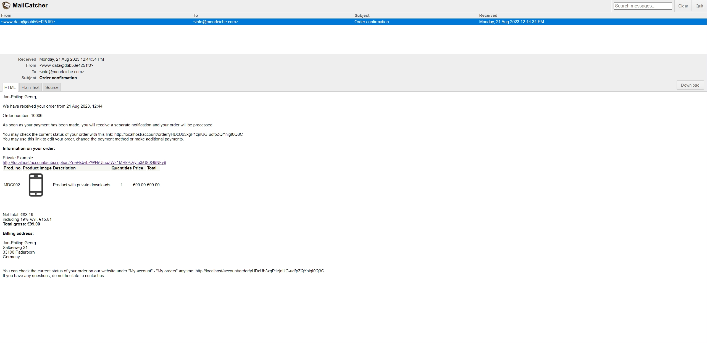

Durch diesen Link kann der Kunde nun die Seite zum Download aufrufen.

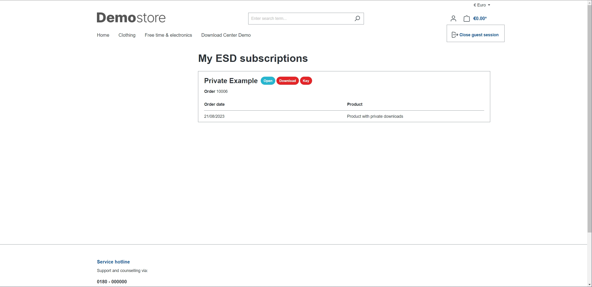
