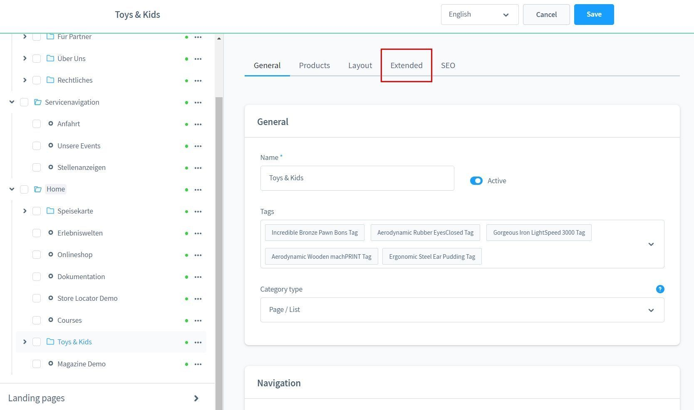
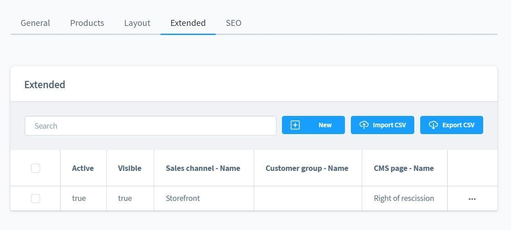
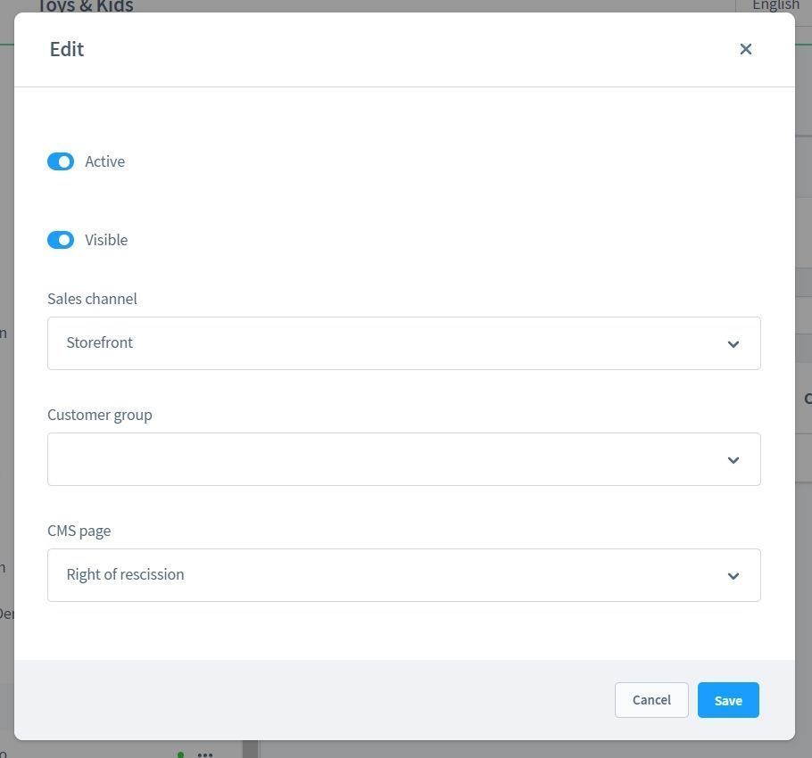

# Erweiterte Kategorien

Mit diesem Plugin für Shopware 6 kannst du die Sichtbarkeit und die CMS Seiten deiner Kategorien 
anhand des Verkaufskanals oder der Kundengruppe steuern.

## Beschreibung

Oftmals möchte man den Kategorie-Baum für mehrere Verkaufskanäle nutzen, es ist jedoch aktuell nicht möglich,
dass man abhängig des Verkaufskanals unterschiedliche CMS Seiten in der Kategorie anzeigen lassen kann.

Manchmal möchte man auch bestimmte Kategorien überhaupt nicht im aktuellen Verkaufskanal anzeigen.

Diese Anforderungen zwingen den Shop-Betreiber dazu die gesamte Kategoriestruktur zu duplizieren und anzupassen.
Dadurch entsteht einerseits ein hoher Wartungsaufwand, die Kategorien müssen redundant gepflegt werden,
die SEO Urls der Kategorien passen nicht mehr und die Performance des Shops lässt nach.

Für dieses Szenario habe ich das Plugin "Erweiterte Kategorien" entwickelt. 

Als kleine Abhilfe kann man hiermit auch eine Standard CMS Seite für alle Kategorien definieren. Das ist 
z.B. Sinnvoll, wenn man viele Kategorie-Seiten mit demselben Layout hat.

Ein weiteres kleines Extra ist, dass man Kategorie-Seiten und deren CMS Inhalte Kundengruppen-Spezifisch
steuern kann.

Hinweis: Die Kategorie-Spezifische Inhaltskonfiguration (Slot-Config) ist mit diesem Plugin aktuell nicht
möglich. Dieses Update erfordert im Einzelfall eine Beauftragung.

## Installation

_Hinweis: Falls du Probleme mit dem Plugin hast, bitte beachte
folgende  [Hinweise](../) im FAQ Bereich._

1. Installiere
   [Foundation](../MoorlFoundation/index.md)
2. Installiere "Erweiterte Kategorien" im Plugin Manager

## Konfiguration


In den Plugin-Einstellungen kann man eine Standard CMS Seite als Fallback definieren.



In den Kategorie-Einstellungen kannst du über den Tab "Erweitert" die spezifischen Einstellungen erreichen.



Hier befindet sich eine Liste mit den erweiterten Kategorie-Einstellungen.



Folgende Einstellungen sind hier möglich:

- Aktiv: Die Kategorie ist für den ausgewählten Verkaufskanal oder die Kundengruppe aktiv
- Sichtbar: Die Kategorie ist für den ausgewählten Verkaufskanal oder die Kundengruppe in der Hauptnavigation sichtbar
- Verkaufskanal: Definiert den Verkaufskanal für die erweiterte Einstellung
- Kundengruppe: Definiert die Kundengruppe für die erweiterte Einstellung
- CMS Seite: Überschreibt die CMS Seite für den ausgewählten Verkaufskanal oder die Kundengruppe

Achtung: Sobald du eine Kundengruppe oder einen Verkaufskanal definierst. Ist diese Kategorie für alle
weiteren Definitionen inaktiv. Bitte lege weitere Definitionen für die übrigen Verkaufskanäle 
oder Kundengruppen an!

## FAQ

### Wie schließt man Kategorien in der Sitemap aus?

In Shopware 6 gibt es nur eine statische Einstellung in der `shopware.yaml` um Kategorien oder Produkte aus der Sitemap zu entfernen.

Beispiel für `/src/Core/Framework/Resources/config/packages/shopware.yaml`:

```YAML
shopware:
    sitemap:
        batchsize: 100
        custom_urls:
        excluded_urls:
           - resource: category
             identifier: df1f52ccf3b3c5c6cf628c07d5a492ac
             salesChannelId: b0035a82b2ce4b015bbe421e12ce0e2b
           - resource: category
             identifier: 92a4abd3842acdf321e5d2700f8879de
             salesChannelId: b0035a82b2ce4b015bbe421e12ce0e2b
           - resource: product
             identifier: ce9aad668705fdfba00058d30e8c4af0
             salesChannelId: b0035a82b2ce4b015bbe421e12ce0e2b
```
