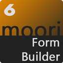

# Formular Baukasten Professional

_Hinweis: Dieses Plugin benötigt die aktuelle Version des [Foundation / Basis Plugin](../MoorlFoundation/index.md)._

[Hier geht's zur Demo](https://demo.moori.net/Formular-Baukasten/)

---

Mit diesem Plugin hast du die Möglichkeit individuelle Formulare zu erstellen. Diese Formulare unterstützen Datei Uploads als E-Mail Anhang, Captcha Spamschutz und Datenbankanbindungen.

Deine Formulare lassen sich als CMS Elemente in deine Einkaufswelten einbinden. Außerdem gibt es weitere interessante Add-Ons.

**Add-Ons:**

1. [Erweiterte Kundenregistrierung](../MoorlFormRegistration/index.md)
2. [Erweiterter Warenkorb](../MoorlFormCartExtend/index.md)
3. [Erweiterte Produkteigenschaften / Custom Products](../MoorlFormCartLineItem/index.md)
4. [Individuelle Produktanfrage](../MoorlFormProductRequest/index.md)

**Mögliche Einsatzgebiete:**

1. Kontakt Anfragen
2. Reklamationen / Widerruf
3. Umfragen / Kundenmeinungen
4. Steuerfragebögen
5. Individuelle Einträge in Datenbank, z.B. Leads - Beispiel Plugin für Händlersuche (als Händler eintragen) folgt

## Highlights
- Frei gestaltbare Formulare
- Autocomplete
- Captcha Code
- Datei Upload und E-Mail Anhänge
- Kopie senden

## Features
- Erlebniswelten Elemente
- Mehrfachauswahl mit Bildern
- Mehrfachauswahl aus beliebigen Datenbank Tabellen
- Bootstrap 4 Standard
- Eigene HTML Wrapper möglich
- Vielseitige Events für EVA Prozesse
- Direkte Datenbank Anbindungen
- Logging / Verlauf
- Newsletter Anmeldung
- Eigenes CSS
- Twig Template Snippets
- Import / Export vom Formularen
- Bedingungen zum ein- und ausblenden von Eingabefeldern

## Installation

[Hier geht es zum Setup-Guide](setup.md)

## Bedienung

[Hier geht es zum User-Guide](user.md)

## Demos und Beispiele

Hier gibt es einige Beispiele für die unterschiedlichsten Verwendungs-
fällen des Formular Baukastens.

## Changelog
| Version | Datum | Änderungen |
| ---: |:---:| ---|
| 1.0.0 | 30.04.2020 | Erste Version des Plugins veröffentlicht |