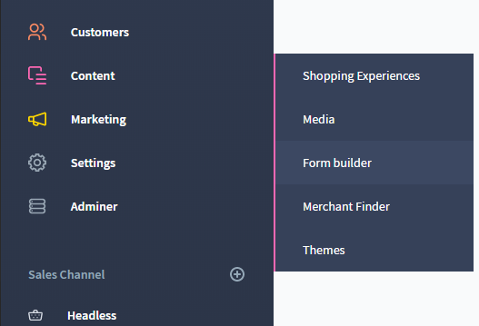
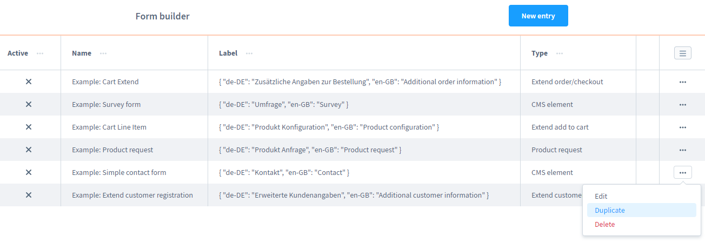
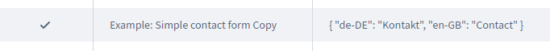
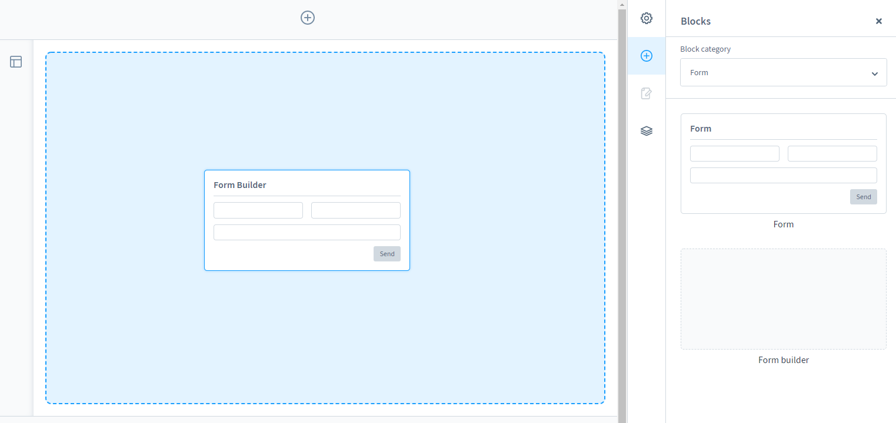
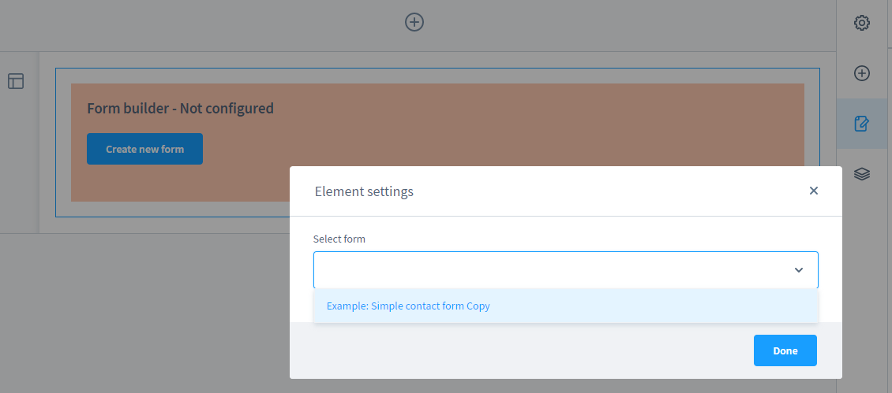
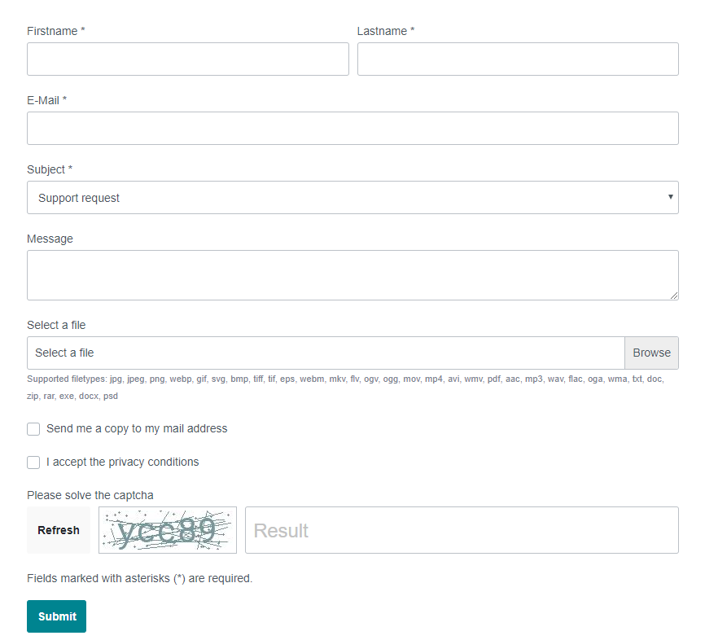

# Installation

### Vorwort

Bevor Sie mit der Installation des Formular Baukastens beginnen,
überlegen Sie sich bitte für welchen Anwendungsfall Sie vorhaben
dieses Shopware 6 Plugin zu nutzen.

Dieses Plugin kann verschiedene Anwendungsgebiete abdecken -
angefangen bei einfachen Kontaktformularen, über individuelle Produktanfragen
bis hin zu komplexen Datenbank- oder Schnittstellen-Anbindungen.

Die Konfiguration ist aufgrund der Komplexität auch nur für erfahrene Anwender geeignet,
eine Fehlkonfiguration kann sich negativ auf Ihr System auswirken.

### Vorbereitung

Bitte bereiten Sie sich auf die Installation gut vor und beachten Sie folgende Schritte:
1. Machen Sie ein Backup Ihres Systems
2. Installieren Sie aktuellste Version von 'moori Foundation', dieses Plugin beinhaltet grundlegende Funktionen
3. Installieren Sie nun den Formular Baukasten

### Erste Einstellungen

Sobald Sie das Plugin installiert und aktiviert haben, gehen Sie zu aller erst in die 
Hauptkonfiguration und setzen Sie nötigen Einstellungen: z.B. Datei-Endungen für 
Benutzer-Uploads frei geben.

Anschließend finden Sie das Plugin unter:

*Admin Menü > Inhalte > Formular Baukasten*

### Erstes Formular anlegen

Sie finden nun eine Liste mit einigen Beispielen, nicht alle Beispiele können Sie direkt 
einsetzen. Dazu fehlen Ihnen die sogenannten Add-Ons, diese die optional zusätzlich erwerben können.

Dieses Plugin ermöglicht die Grundfuktionen aller Add-Ons - Sie können auch Ihre eigenen individuellen Add-Ons 
mit diesem Plugin wunderbar umsetzen (lassen), sprechen Sie dazu mit Ihrem Dienstleister für die Shop-Umsetzung.

In der Grundversion können Sie freie Individuelle Kontaktformulare anlegen und in Ihre Einkaufswelten einfügen, 
eine detaillierte Erklärung zu den Einstellungsmöglichkeiten finden Sie im nachkommenden Sheet.

Legen Sie sich eine Kopie eines Beispiel-Kontaktformulares an. Anschließend öffnet sich eine neue Seite. Für die Ersteinrichtung
sind die Felder 'Medien Ordner' und 'Aktiv' relevant. Wählen Sie zunächst einen Order aus, auf dem Benutzer-Uploads
gespeichert werden sollen. Geben Sie optional einem E-Mail Empfänger ein, lassen Sie dieses Feld leer - geht die E-Mail 
an die Shopbetreiber Adresse, die in den Stammdaten des Shops hinterlegt sind. 

Legen Sie den Schalter 'Aktiv' um und klicken Sie anschließend auf 'Speichern'. Gehen Sie anschließend eine Seite zurück.
Nun sollte hier ein neuer Eintrag erscheinen, der aktiv genutzt werden kann.

### Formular in den Erlebniswelten einfügen

Gehen Sie nun in die Erlebniswelten, unter der Kategorie 'Formulare' befindet sich ein Formular Baukasten Block. Diesen
ziehen Sie nun einfach via Drag&Drop in den Inhalts-Bereich.

In der Konfiguration des Elementes wählen Sie nun Ihr zuvor erstelltes Formular.

Das war`s - Sie können nun das Formular im Frontend testen!

