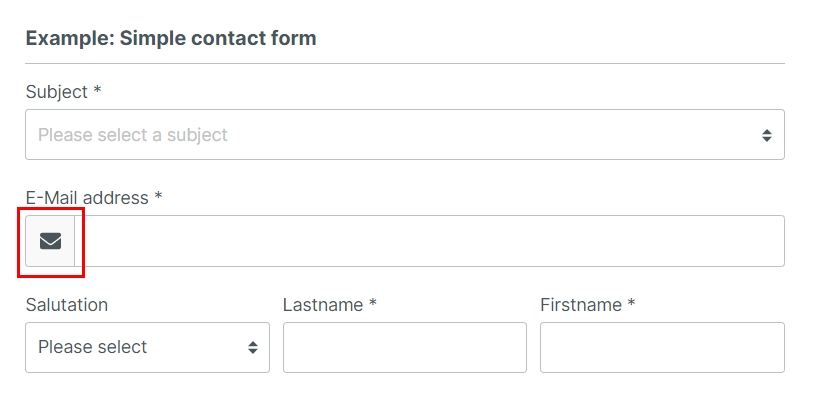
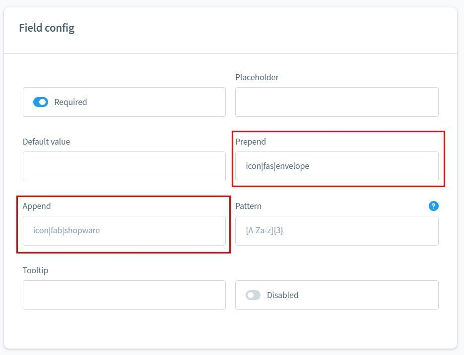
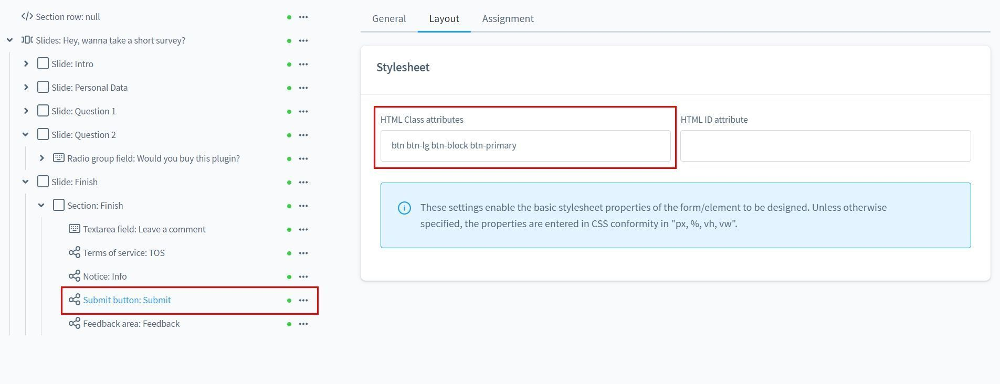
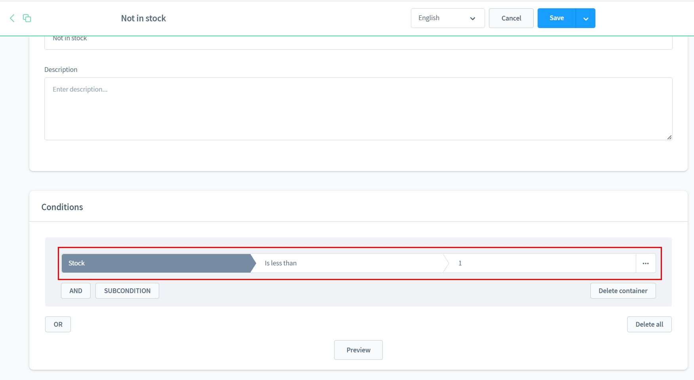
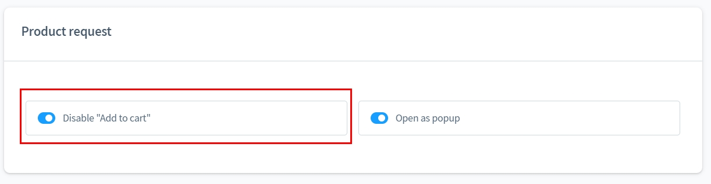
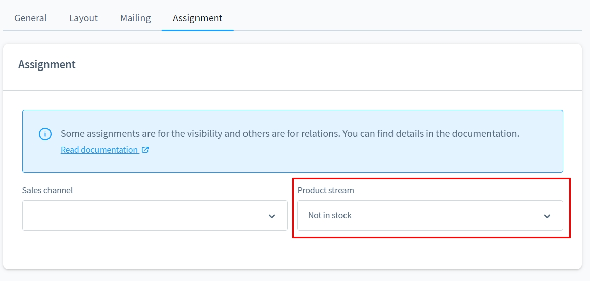
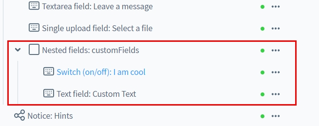
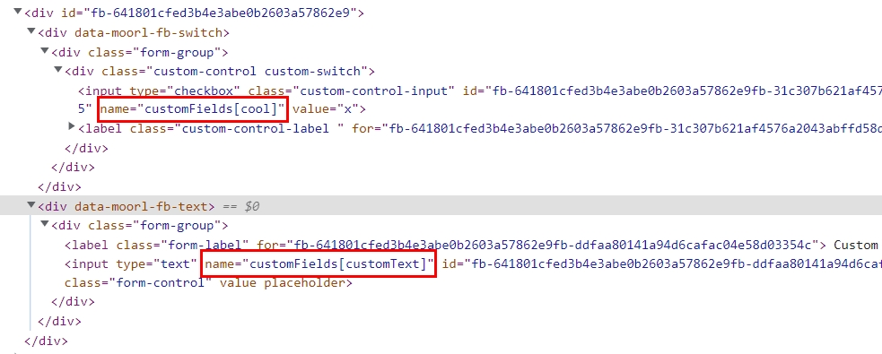
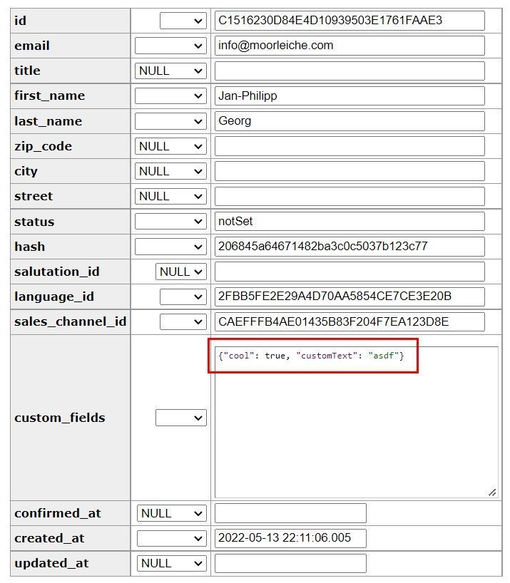

# Form Builder 2 | How-To

## Use SVG icons in input fields

**Basic version**

You can use SVG icons inside the input fields. The moori Foundation Plugin already provides suitable SVG icons from the FontAwesome 5 package.

Enter `icon|<pack>|<name>`.

- pack: Name of the icon package, e.g. far, fas, fab (FontAwesome 5) or solid, regular (Shopware)
- name: Name of the icon

To determine the appropriate name, go to the following pages:

- FontAwesome 5: [https://fontawesome.com/v5/search](https://fontawesome.com/v5/search)
- Shopware: [https://component-library.shopware.com/icons/](https://component-library.shopware.com/icons/)

## Individualise send button

**Basic version**

You can give the send button its own stylesheet classes.

To do this, go to the "Stylesheet" tab and insert the desired classes accordingly.

## Product requests only for products that are not in stock

**Product Request Add-On**

With the Product Request Add-On you can assign matching forms using the dynamic product group.

Create a new dynamic product group with the rule `stock is less than 1`.

Deactivate the "Add to cart" button, your customer can now alternatively request the product.

In the form settings you make an assignment for the dynamic product group.

## Write custom fields for newsletter subscriptions

**Classic Add-On**

With the element "Nested fields" you can use structured input fields. With this you can also write custom fields for newsletter registration, among other things.

In Shopware itself, structured input fields can also be found in the addresses for customer registration.

Use the element "Nested Fields" and use the technical name `customFields`. There you create further input elements.

In the HTML view of the form we now see how the input element is named.

If the data was entered validly, the column `custom_fields` is filled with the correct data.

!!! note

    This function only supports input of type `string` and `boolean`.