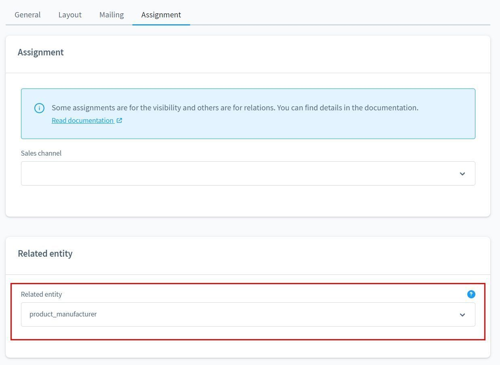
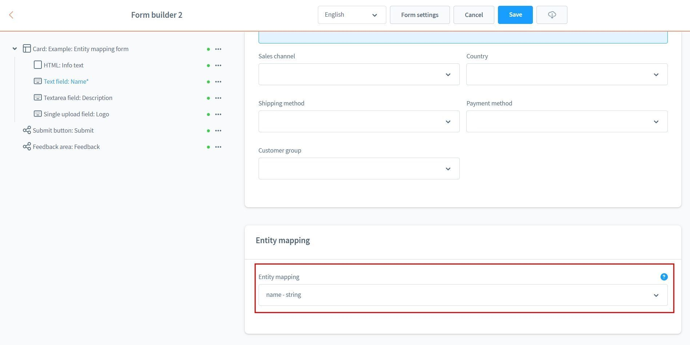

# Formular Baukasten 2 | Anleitungen

## Formular in Twig Template einbauen

**Basis Version**

Für Theme-Entwickler und Programmierer gibt es ein spezielles Twig-Snippet, um selbst erstellte Formulare direkt in ein Template einzubinden.

Nutze dazu das einfach das Snippet ````.

Du kannst den technischen Namen oder die exakte ID des Formulars als Parameter übergeben.

## In Eingabefeldern SVG Icons nutzen

**Basis Version**

Du kannst SVG Icons innerhalb der Eingabefelder nutzen. Dazu liefert das moori Foundation Plugin bereits passende SVG Icons aus dem FontAwesome 5 Paket.

Gib dazu `icon|<pack>|<name>` ein.

- pack: Name des Icon-Pakets, z.B. far, fas, fab (FontAwesome 5) oder solid, regular (Shopware)
- name: Name des Icons

Um den passenden Namen zu ermitteln, gehe dazu auf folgende Seiten:

- FontAwesome 5: [https://fontawesome.com/v5/search](https://fontawesome.com/v5/search)
- Shopware: [https://component-library.shopware.com/icons/](https://component-library.shopware.com/icons/)

## Datenbank mit Formularen befüllen

**Basis Version**

Du kannst mithilfe des Formular Baukasten 2 selbst Datenbank-Einträge in Shopware 6 schreiben.

Dazu stehen dir nützliche Features zur Verfügung. Gehe dazu in den Formular-Einstellungen in den Reiter "Zuweisung" und wähle eine Tabelle aus.

Anschließend kannst du ein Eingabefeld zu einer Tabellenspalte zuweisen.

Bitte achte darauf, dass du Pflichtfelder entsprechend kennzeichnest.

Du findest hier ein Beispiel-Formular: [Entity Mapping Formular](examples/entity-mapping-form.json)

## Absende-Button individualisieren

**Basis Version**

Du kannst dem Absende-Button eigene Stylesheet-Klassen geben.

Gehe dazu in den Reiter "Stylesheet" und füge entsprechend die gewünschten Klassen ein.

## Produkt Anfragen nur für Produkte, die nicht lagernd sind

**Produkt-Anfrage Add-On**

Mit dem Produkt-Anfrage Add-On kannst du mithilfe der dynamischen Produktgruppe passende Formulare zuweisen.

Lege eine neue dynamische Produktgruppe mit der Regel `Lagerbestand ist kleiner als 1` an.

Deaktiviere den "In den Warenkorb" Button, dein Kunde kann nun Alternativ das Produkt anfragen.

In den Formular-Einstellungen machst du eine Zuweisung für die dynamische Produktgruppe.

## Custom-Felder für Newsletter-Anmeldungen schreiben

**Classic Add-On**

Mit dem Element "Verschachtelte Felder" lassen sich strukturierte Eingabefelder nutzen. Damit kannst du unter anderem auch Custom-Felder für die Newsletter-Anmeldung schreiben.

In Shopware selbst kommen strukturierte Eingabefelder unter anderem auch in den Adressen der Kunden-Registrierung vor.

Verwende das Element "Verschachtelte Felder" und nutze den technischen Namen `customFields`. Darin erstellst du weitere Eingabe-Elemente.

In der HTML Ansicht des Formulars sehen wir nun wie das Eingabe-Element benannt ist.

Sofern die Daten valide eingegeben wurden, ist die Spalte `custom_fields` mit den richtigen Daten befüllt.

!!! note

    Diese Funktion unterstüzt ausschließlich Eingaben vom typ `string` und `boolean`.