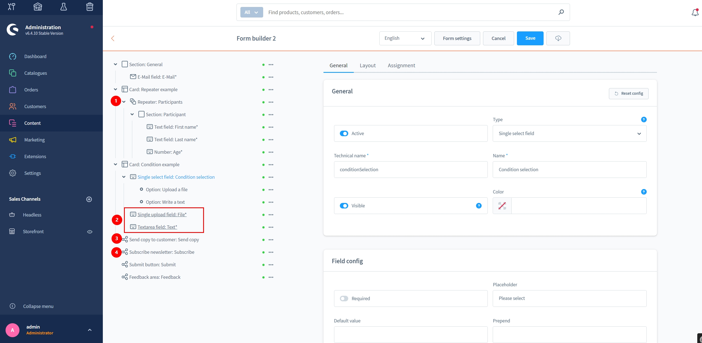
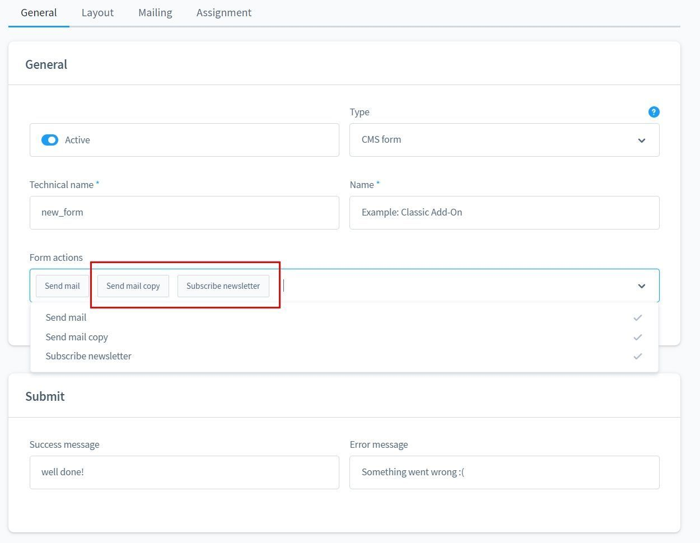
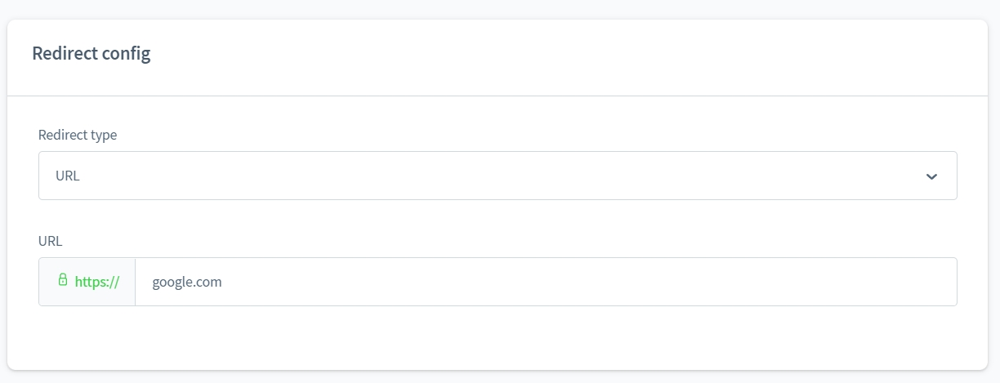
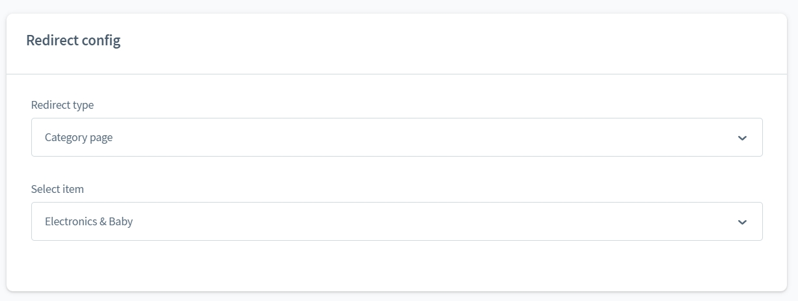
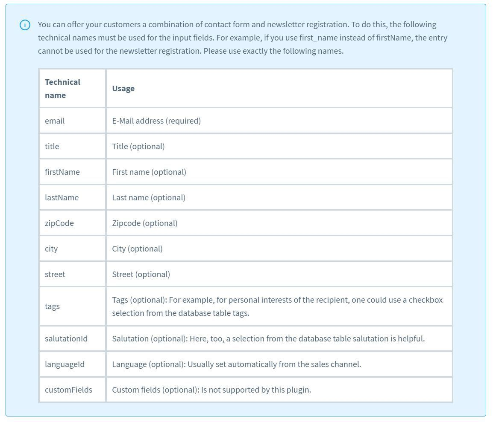
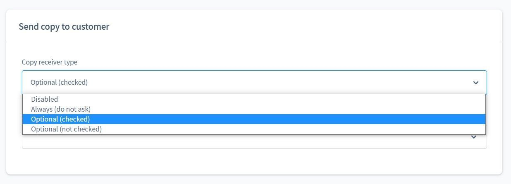
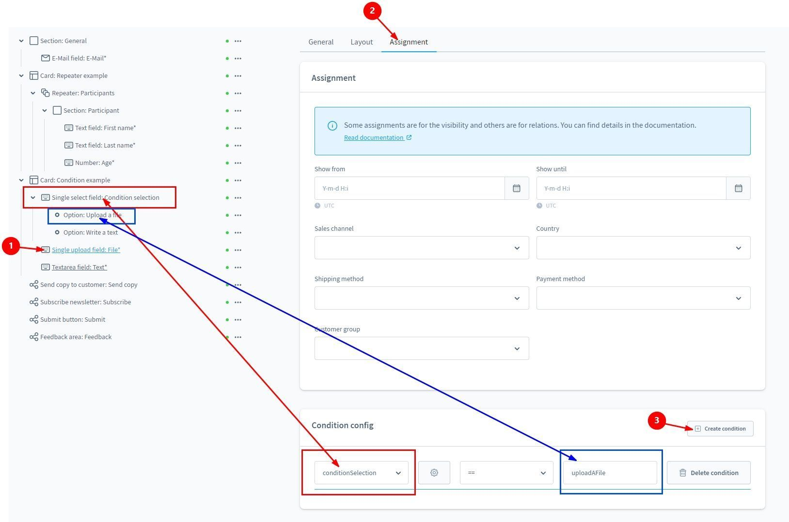
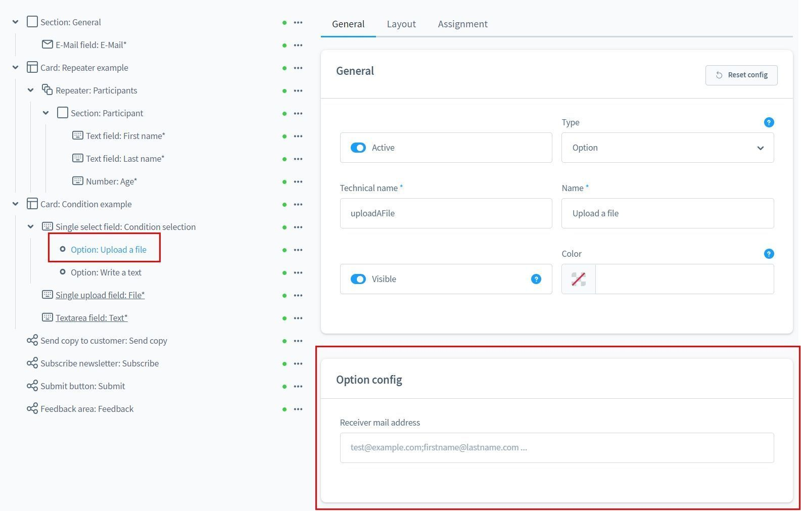
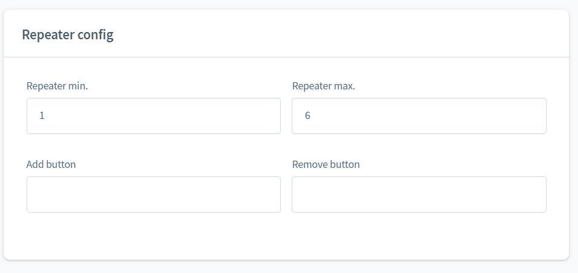
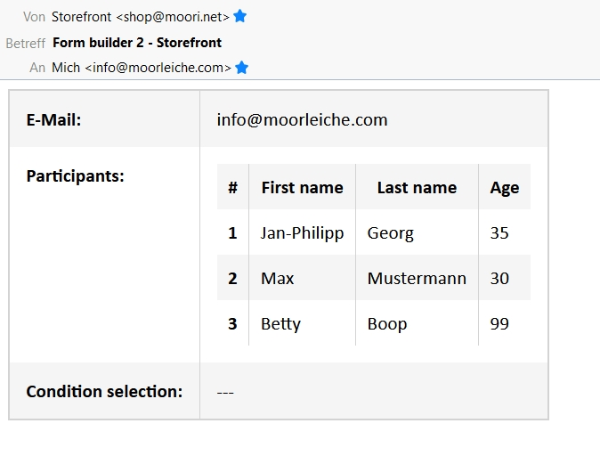

# Formular Baukasten 2 | Classic Add-On

Mit diesem Add-On für [Formular Baukasten 2](../MoorlForms/index.md) stehen dir neue Möglichkeiten zur Verfügung.

## Beispiel Formulare zum Download

- [Classic Add-On](examples/classic-add-on.json)
- [Rückgabe Formular](examples/return-form.json)

## Neue Elemente

1. Element vom Typ "Repeater"
2. Elemente die nur unter bestimmten Voraussetzungen eingeblendet werden
3. Kopie an den Kunden senden
4. Newsletter Anmeldung anbieten
5. Zwischenspeicherung von Formulardaten für bessere Benutzerfreundlichkeit

## Formular Aktionen

- Kopie an den Kunden senden
- Newsletter Anmeldung anbieten

Hinweis: Wenn die Aktionen gewählt sind, muss auch das entsprechende Element im Strukturbereich eingefügt werden!

### Weiterleitungen

Nachdem ein Formular erfolgreich abgesendet wurde, kann man den Nutzer auf eine Seite weiterleiten. Das ist z.B. sinnvoll um ein Ereignis mit dem Google Tag Manager zu erfassen.

### Newsletter Anmeldung

Hinweis zu den technischen Namen der Elemente, wenn die Newsletter-Anmeldung aktiviert ist.

### Kopie senden

"Kopie an den Kunden senden" kann in verschiedenen Variationen angeboten werden.

### Bedingungen

Aufbau von Bedingungen um ein Element ein- oder auszublenden.

### Erweiterung für Elemente vom Typ "Option"

Anhand einer ausgewählten Option kann die Empfänger E-Mail-Adresse beeinflusst werden.
So landen je nach Anfrage-Typ die Mails im richtigen Postfach!

### Konfiguration für "Repeater" Elemente

Das Repeater-Element kann eine min und eine max Eigenschaft haben. Außerdem lassen sich
die Buttons individuell beschriften.

## Beispiel der Ausgabe einer E-Mail mit einem Repeater-Element

