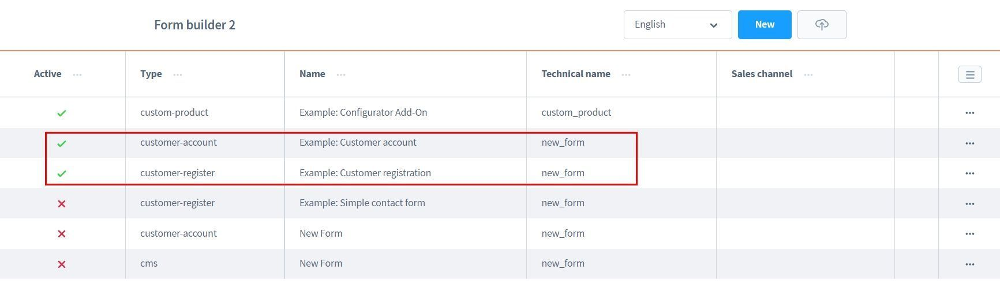
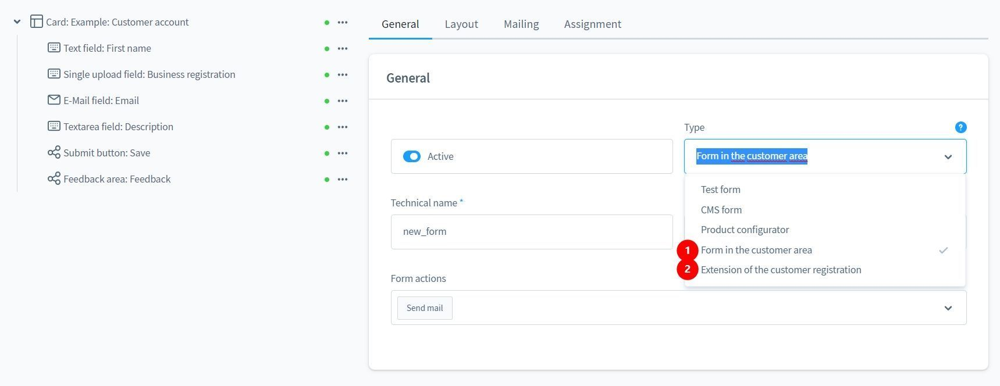
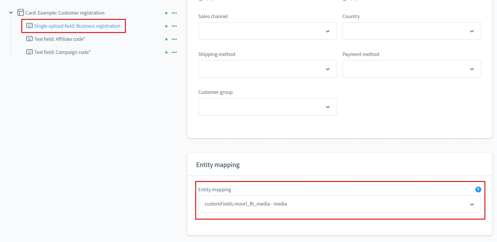
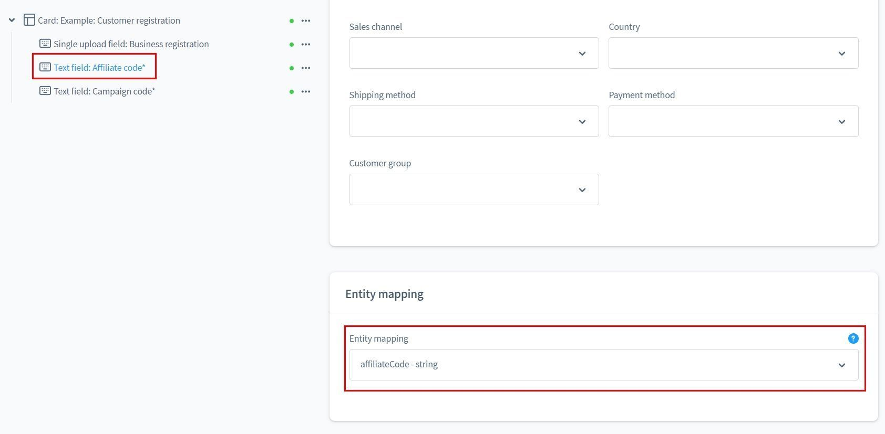
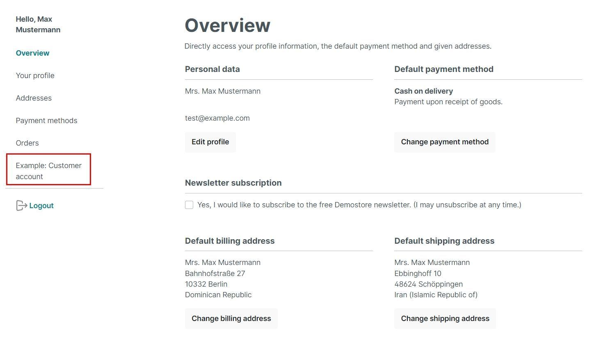
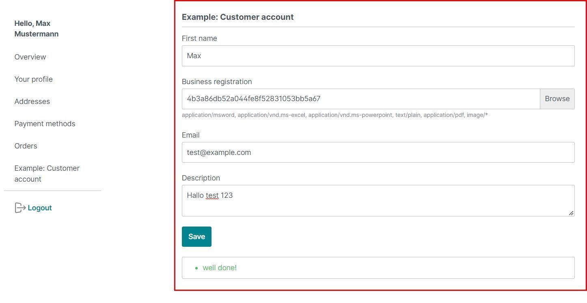
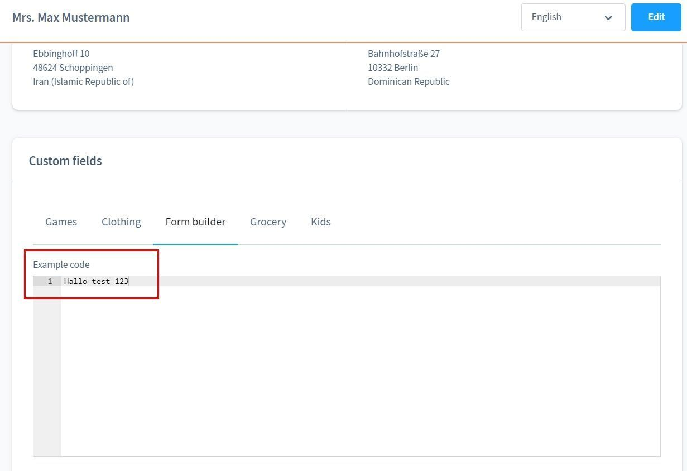
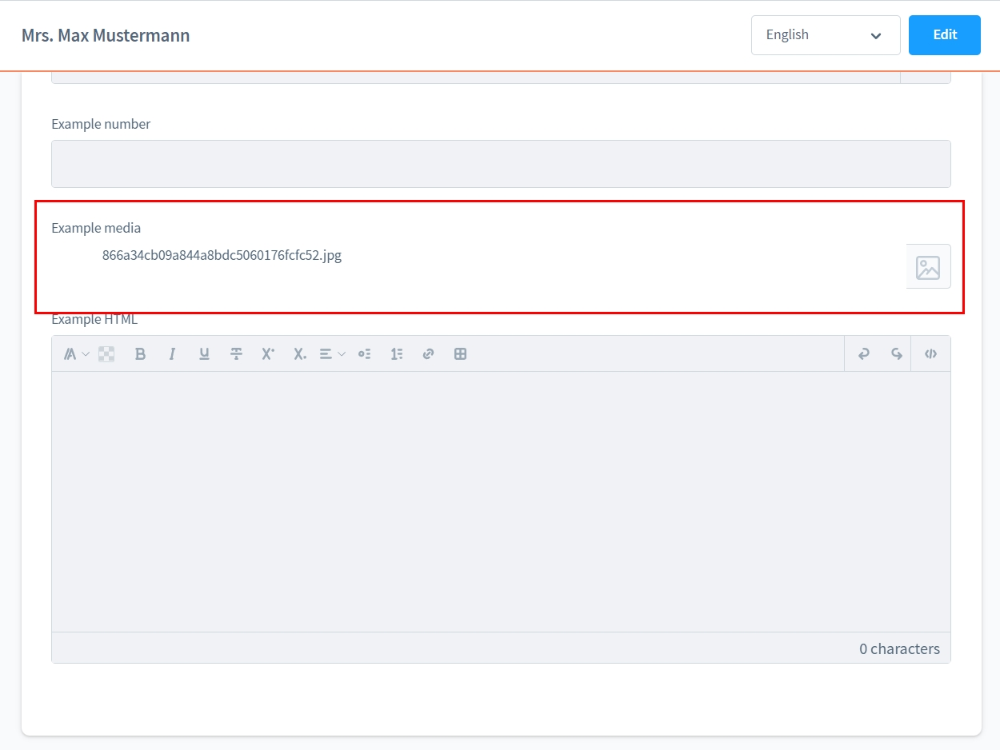
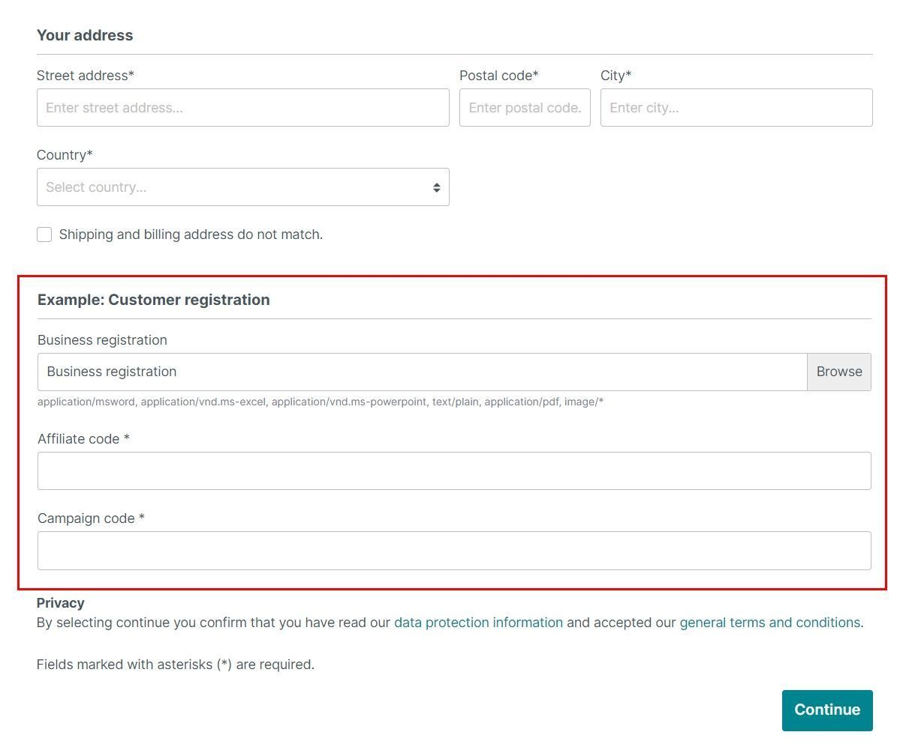

# Formular Baukasten 2 | Kunden-Formulare Add-On

Mit diesem Add-On für [Formular Baukasten 2](../MoorlForms/index.md) kannst du
Kundenspezifische Formulare für die Registrierung oder dem Account-Bereich nutzen!
Biete deinen Kunden mehr Möglichkeiten.

!!! note "Hinweis für alle Kunden, die den Formular Baukasten bereits besitzen"

    Dieses Plugin ist grundlegend anders aufgebaut und bietet keine Möglichkeit, die bisherigen Formulare zu migrieren.
          
    Leider ist es nach Absprache mit Shopware auch nicht möglich die Subscriptions zu duplizieren/übertragen.
          
    Da ich meinen bisherigen Kunden keinen Nachteil schaffen möchte, wird der Formular Baukasten weiterhin mit Updates versorgt. Aber es werden keine neuen Funktionen mehr entwickelt.
          
    Für alle Interessenten mit aktiven Subscriptions biete ich einen 50% Gutschein für Basis und Add-Ons.
    
    Der Gutschein wird individuell ausgestellt und ist nicht mit Rabattaktionen kommulierbar.

## Beispiel Formulare zum Download

- [Kunden-Account Formular Add-On](examples/customer-account-add-on.json)
- [Kunden-Registrierung Formular Add-On](examples/customer-registration-add-on.json)

## Neue Formular-Typen

- Formulare für den Account-Bereich
- Formulare für die Registrierung

## Mapping

Kundenspezifische Formulare bieten die Möglichkeit die Eingabefelder in Datenbankfelder zu schreiben.

So kann der Kunde z.B. eine Gewerbeanmeldung hochladen, die Zuweisung zu der Datei steht z.B. in einem
Custom-Feld.

### Kunden-Account

Die Formulare für den Kunden-Account werden automatisch in der Navigation eingebunden.

Das Formular übernimmt anhand der Mapping-Eigenschaften die passenden Datenbankfelder.

Auch beim Speichern werden die Daten wieder in den zugeordneten Datenbankfeldern gespeichert.

Optional kann der Shopbetreiber per E-Mail über eine Änderung informiert werden.

### Kunden-Registrierung

Das Formular für die Kundenregistrierung benötigt keine Bauteile, da es in das bestehende
Formular integriert wird.

