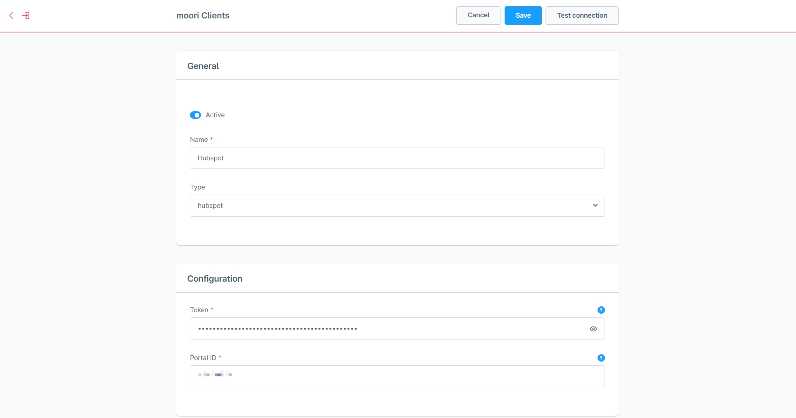
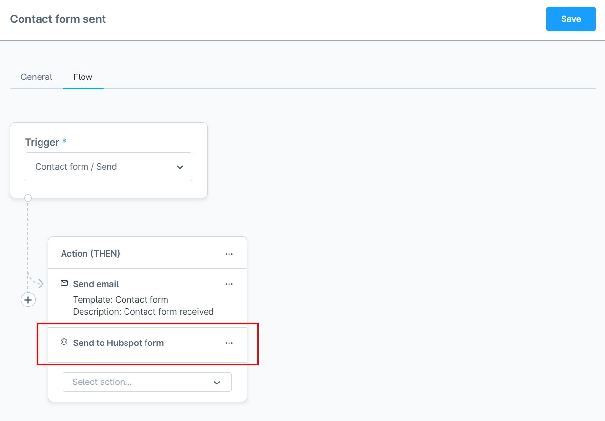
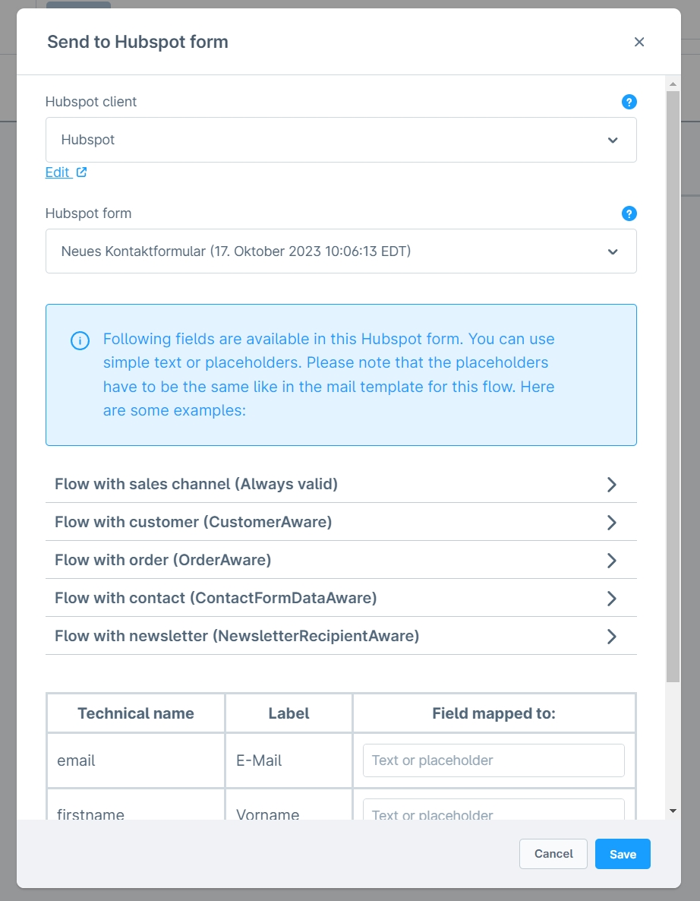
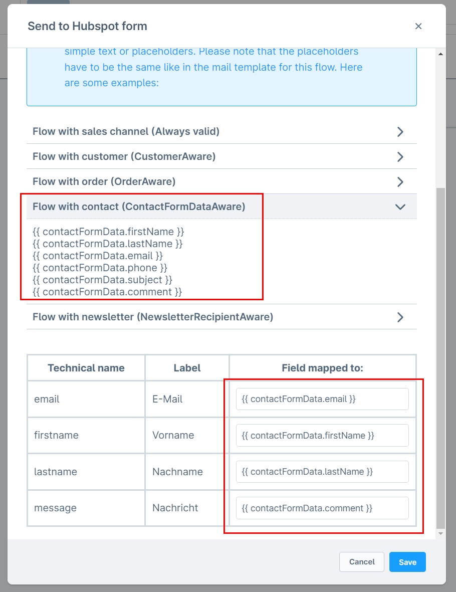
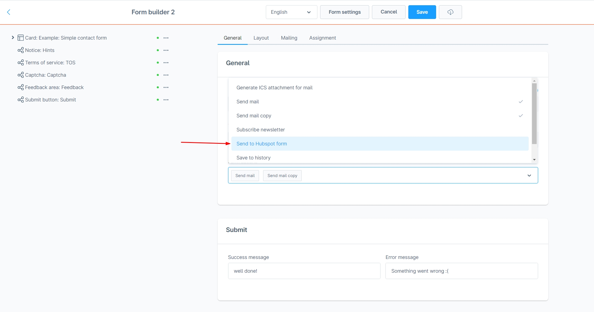
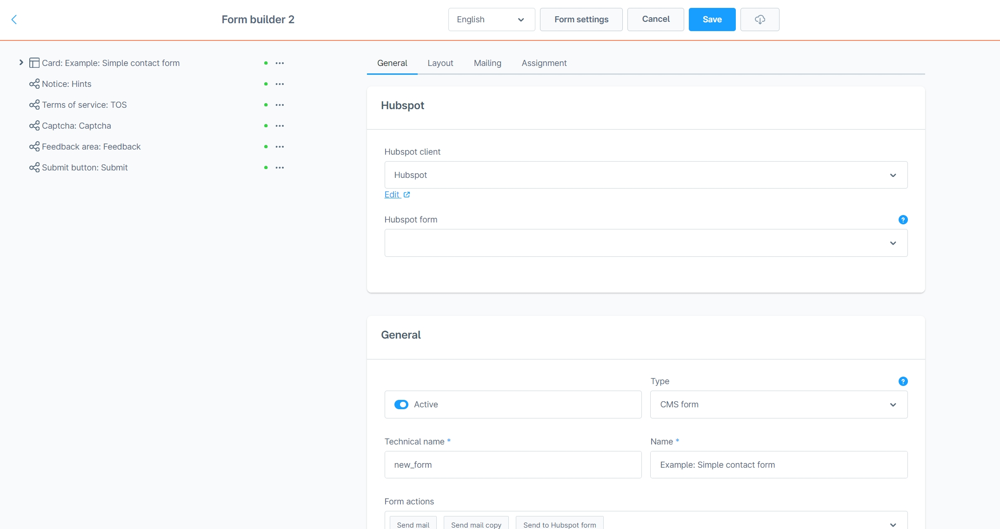
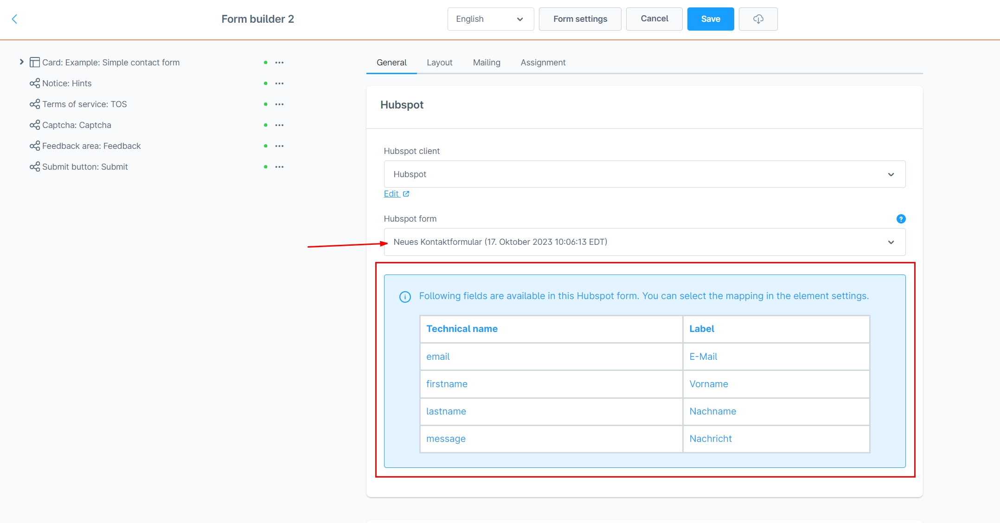
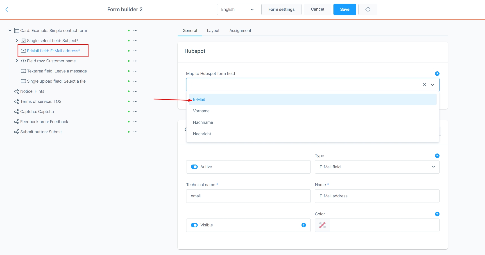
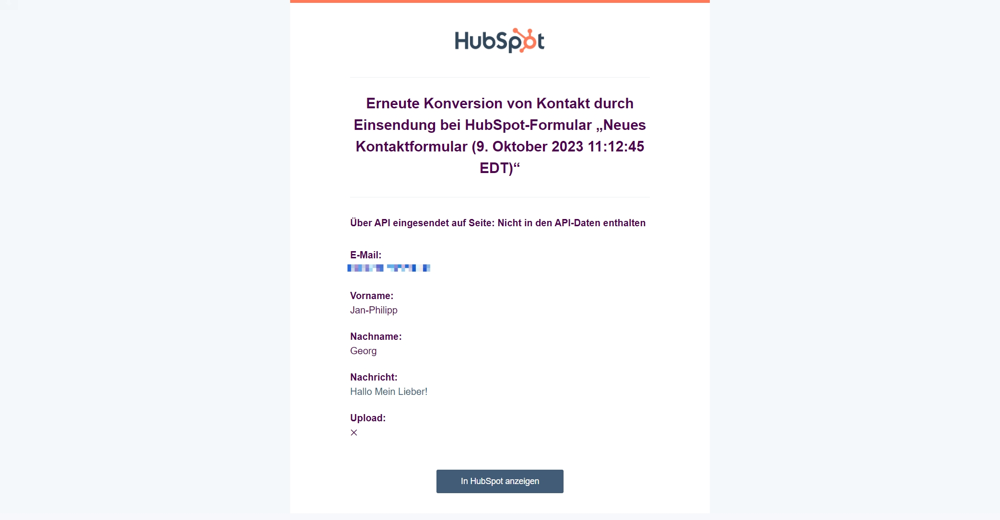

# Hubspot Forms Integration

This extension is compatible with [Form Construction Kit 2](../MoorlForms/index.md)!

## Installation

!!! note

    If you have any problems with the plugin, please note the following [notes](../) in the FAQ section.

1. install
   [Foundation](../MoorlFoundation/index.md)
2. install Hubspot Forms Integration in the Plugin Manager

## Setup

This extension is well suited for shop operators who already work with Hubspot. For example, contacts or tickets can be created automatically as soon as a contact form is submitted in the Shopware 6 shop.

### Create a Hubspot account

You can create a Hubspot account relatively easily. For example, use your Google account and choose a free plan!

### Create a private Hubspot app

- Go to "Profile & Settings".
- Create a new app in the left sidebar under "Account setup" -> "Integration" -> "Private apps".
- The app needs the following permissions: forms-uploaded-files, forms, crm.objects.contacts.write, crm.objects.contacts.read
- Copy the token and switch to the Shopware Admin.

### Create a Hubspot client in Shopware

- Navigate to "Settings" -> "Extensions" -> "moori Clients"
- Create a new client of type "hubspot
- Enter the token of your private Hubspot app
- You will find the portal ID in the account menu of Hubspot under your username.
- Test the client

### Create a form in Hubspot

- Navigate from the main menu in Hubspot to "Marketing" -> "Forms
- Create a new form of the type "Embedded", you can use the template for contact forms for testing purposes.
- Save the form without making any changes

With this form, contacts are automatically created in Hubspot as soon as it is filled in and submitted.

### Connect Hubspot form with flow builder

- Navigate to the flow builder and open e.g. "Contact form has been sent".
- Go to the "Flow" tab
- Add the action "Send to Hubspot form".
- Select your Hubspot client
- Select your form created in Hubspot
- Create the data mappings, in our example you can use the placeholders for "Flow with contact".

If the flow does not run due to incorrect placeholders, there will be no error message. Please check your settings carefully!

### Connect Hubspot form with Form Builder 2 form

- Open your form in the Shopware Admin
- In the basic settings of the form, select the option "Send to Hubspot form" under "Form actions".
- Select your Hubspot client
- Select the form you created in Hubspot
- Now an info box appears which fields are available in the Hubspot form
- Save the form
- Now go to the element settings, e.g. the email field
- Here you can assign the appropriate field from the Hubspot form.
- Assign the fields: First name, last name and message
- Save the form

## Test

After submitting the form, you should receive an email from Hubspot.

