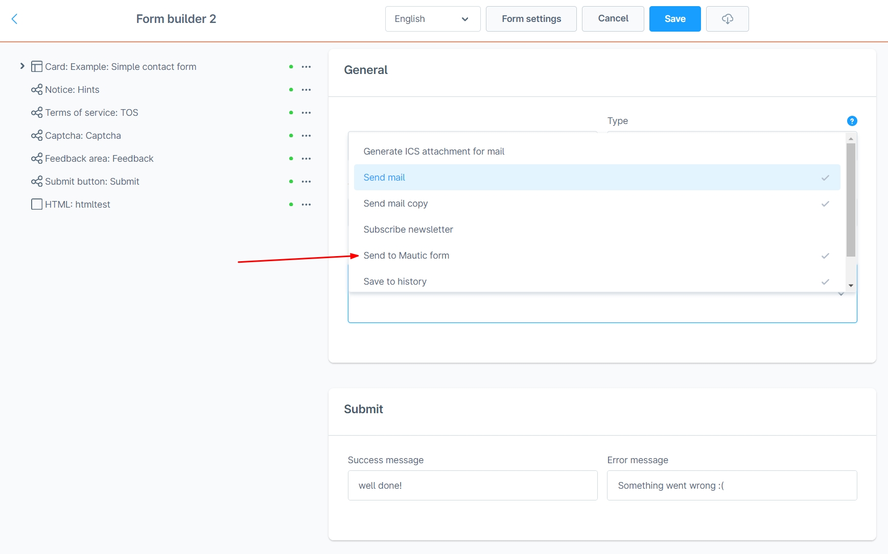
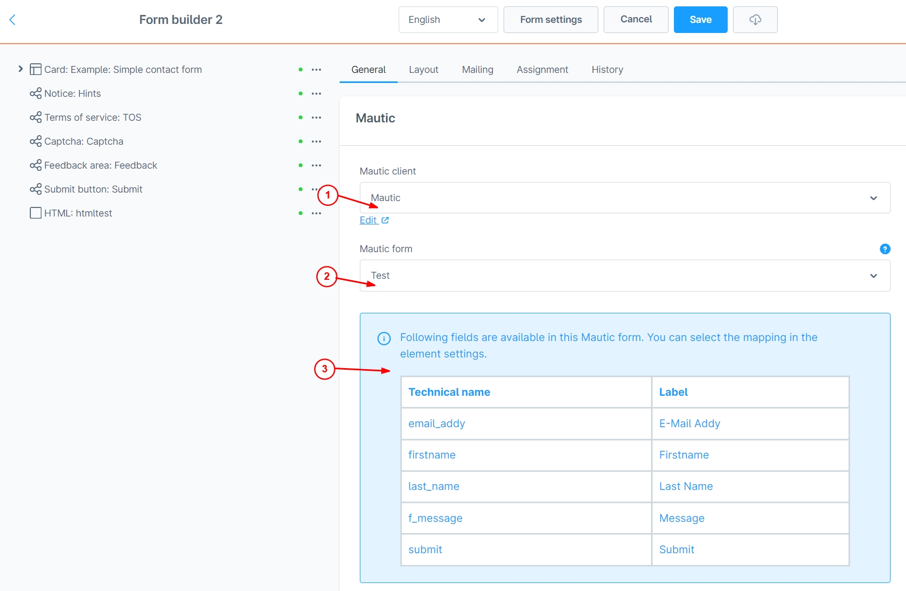
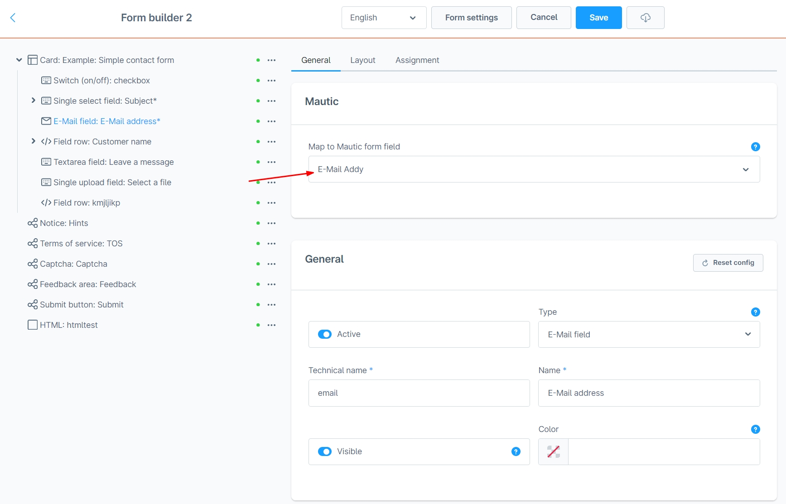
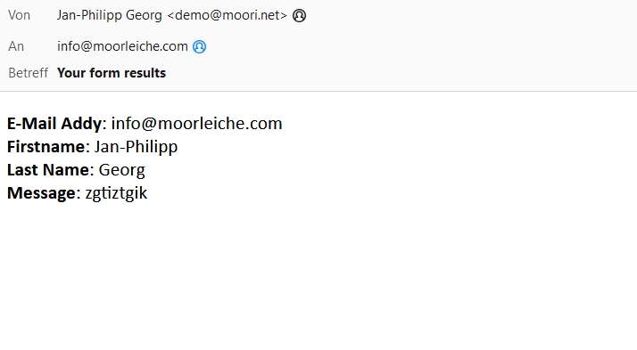

# Form Builder 2 | Mautic Add-On

With this Add-On for [Form Builder 2](../MoorlForms/index.md) you can send your form data to Mautic.

## What is Mautic?

Mautic is an open source marketing automation software. With Mautic, website visitors can be tracked and converted into identified contacts using forms.

## Setup

These instructions refer to Mautic version 4 and assume that this software has already been installed.

### Activate Mautic API

- Click on the cogwheel in the top right corner
- A navigation will open on the right side, click on "Configuration".
- Click on "API Settings" in the navigation on the left side
- Activate the API and "HTTP basic auth".

With this method you can connect to the API with your username and password. I recommend to create another admin for this case, which is only for the API.

### Create a Mautic client in Shopware

- Navigate to "Settings" -> "Extensions" -> "moori Clients".
- Create a new client of type "mautic
- Enter the URL, username and password, there must not be a "/" after the URL.
- Test the client

### Create a form in Mautic

- Navigate from the main menu in Mautic to "Components" -> "Forms".
- Create a new form of the type "Campaign Form
- Enter the basic data and create the input fields
- e.g. e-mail, first name and last name
- For the input fields you can make an assignment in the tab "Contact Field", e.g. "Email".

With this form, contacts are automatically created in Mautic as soon as it is filled in and sent.

### Connect Mautic form with form builder 2 form

- Open your form in the Shopware Admin
- In the basic settings of the form, select the option "Send to Mautic form" under "Form Actions
- Select your Mautic client
- Select the form you created in Mautic
- Now an info-box will appear which fields are available in the Mautic form.
- Save the form
- Now go to the element settings, e.g. the email field
- Here you can assign the appropriate field from the Mautic form.
- Assign your other fields
- Save the form

## Test

After you submit the form, you should receive a mail from Mautic and a new contact will be created.

