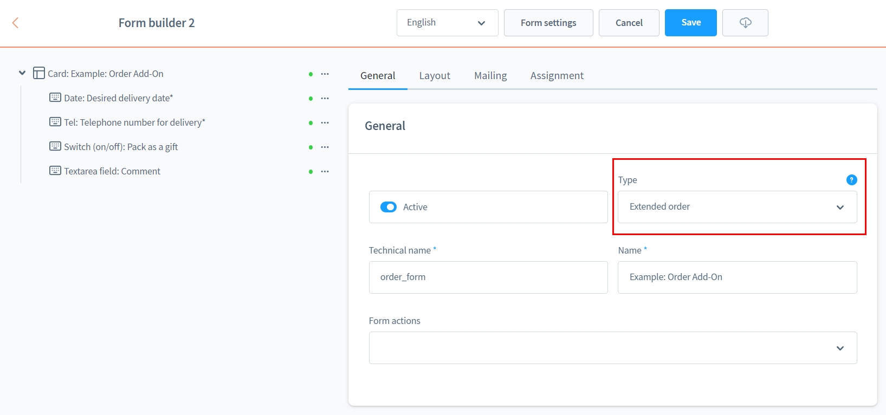
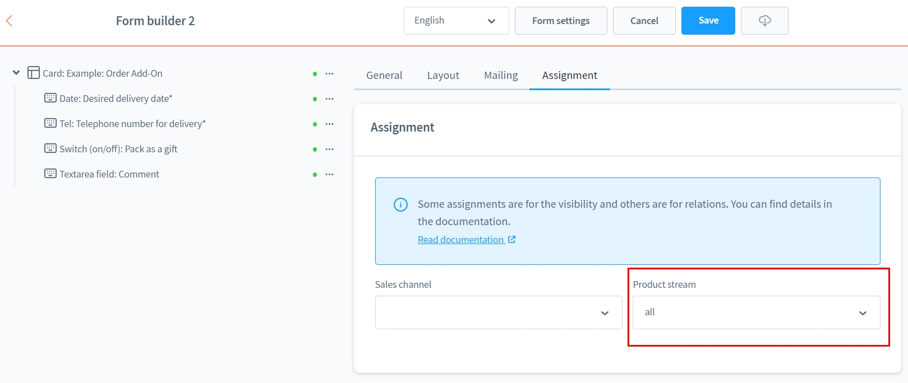
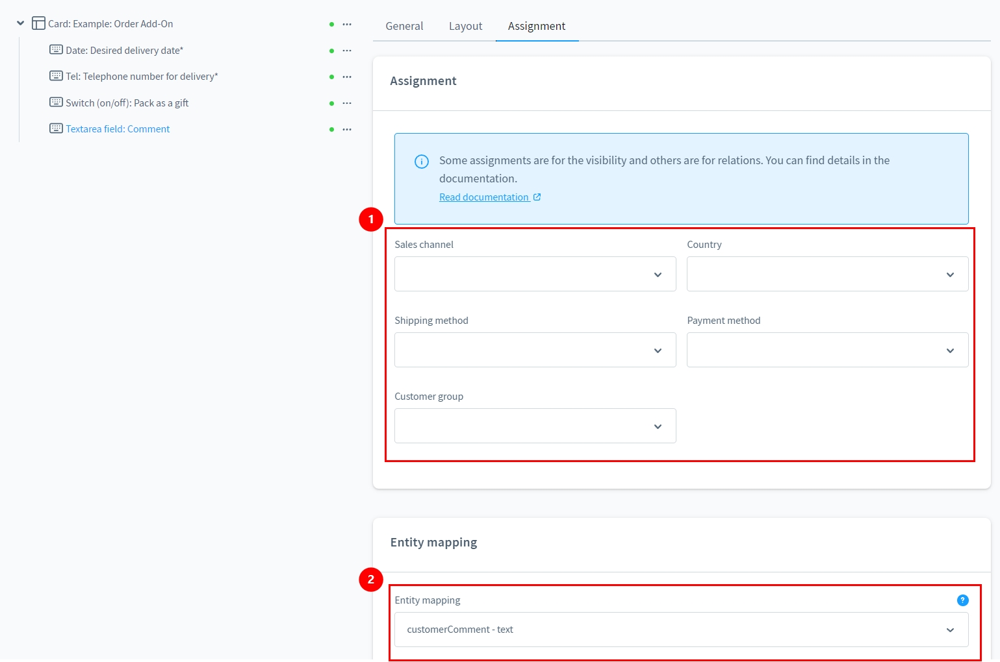
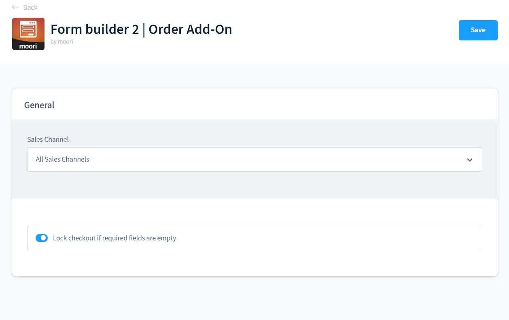
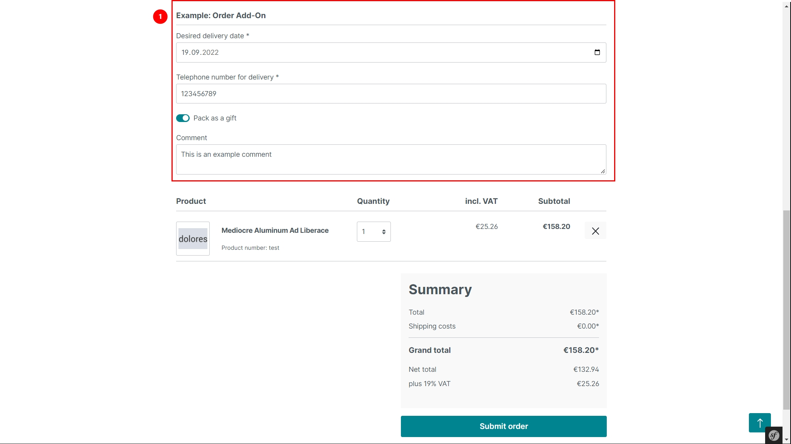
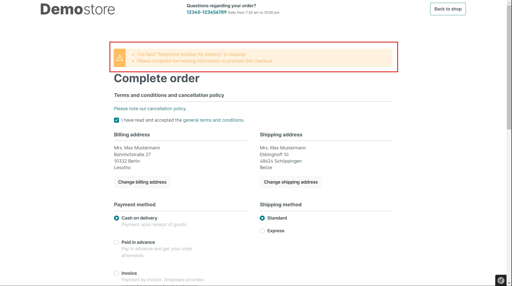
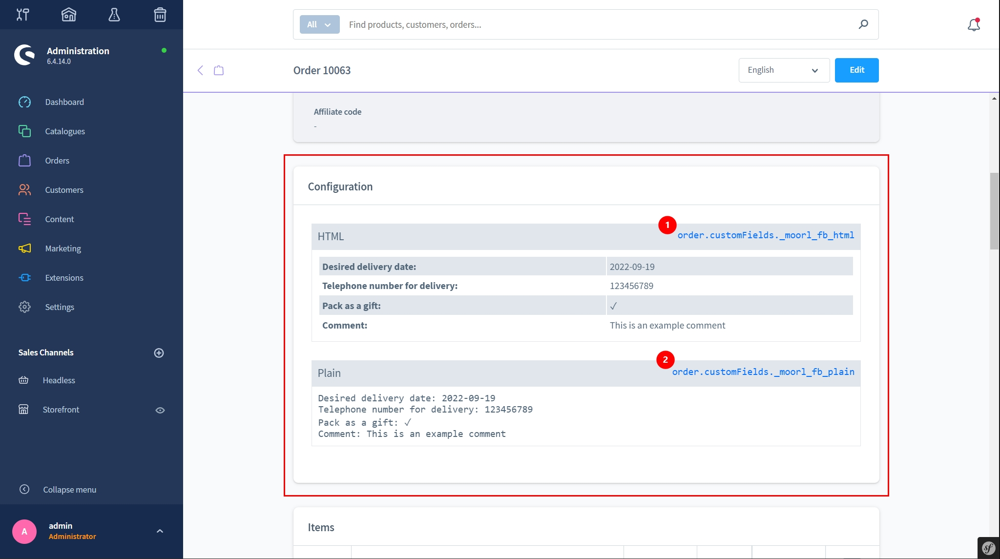

# Formular Baukasten 2 | Bestellung Add-On

Mit diesem Add-On für [Formular Baukasten 2](../MoorlForms/index.md) hast du die Möglichkeit die Bestellungen abhängig von den Produkten im Warenkorb zu erweitern.

## Beispiel Formulare zum Download

- [Bestellung Add-On](examples/order-add-on.json)

## Neues Formular von Typ "Erweiterte Bestellungen"

Mit diesem Formular bist du weit mehr für B2B oder personifizierte Kundschaft gerüstet. Du kannst im Checkout beliebige Kundendaten erfassen und weiter verarbeiten. Die Möglichkeiten wann und welche Daten erfasst werden, kannst du vollständig selbst bestimmen.

## Einstellungen

Erstelle ein neues Formular. Wähle den Typ "Erweiterte Bestellung" aus.

Anschließend ist eine Produktzuweisung notwendig. Das Formular erscheint nur dann, sofern ein zugewiesenes Produkt im Warenkorb liegt.

Die Zuweisung erfolg über eine dynamische Produktgruppe.

Nun kannst du deine Eingabefelder in das Formular einfügen. Es sind keine technischen Felder, wie z.B. ein Absende-Button notwendig.

Die Eingaben des Kunden werden automatisch gespeichert.

1. Du kannst die Eingabefelder spezifisch ein- oder ausblenden. Wenn der Kunde z.B. eine bestimmte Versandart wählt, könnte man eine Telefonnummer für den Zusteller hinterlegen.
2. Wenn du die Eingaben für eine technische Weiterverarbeitung benötigst, eignet sich die Zuweisung in vordefinierte Felder.

In den Haupteinstellungen des Plugins kannst du bestimmen, ob der Checkout gesperrt werden soll, sofern die Eingaben im Formular nicht valide sind.

## Ausgabe in der Storefront

Das Formular erscheint direkt im Checkout.

Das Formular wird automatisch nach jeder Eingabe abgesendet. Hier wird der Kunde auf fehlende Eingaben hingewiesen.

## Angaben zur Bestellung einsehen

Öffne die Bestellung einfach im Admin. Die zusätzlichen Angaben stehen direkt über den Bestellpositionen.

1. Verwende diesen Wert für dein E-Mail Template vom Typ "HTML"
2. Verwende diesen Wert für dein E-Mail Template vom Typ "Plain"
