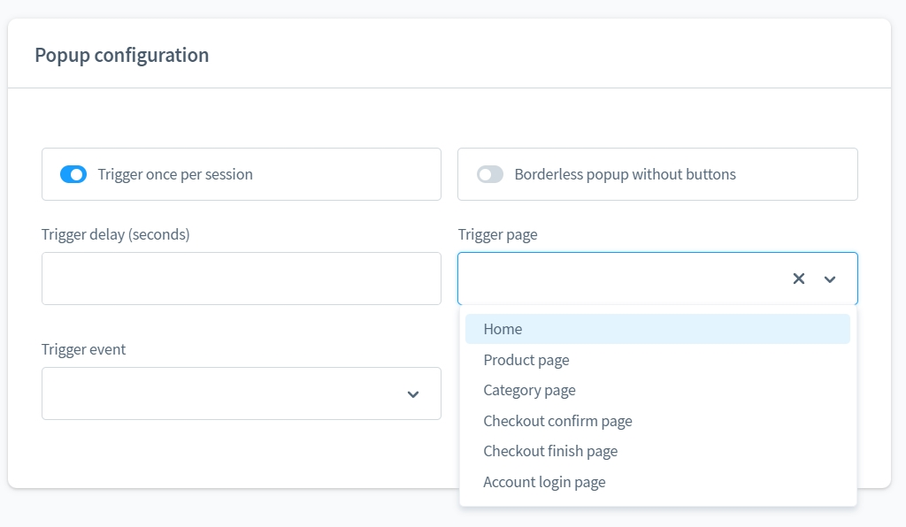
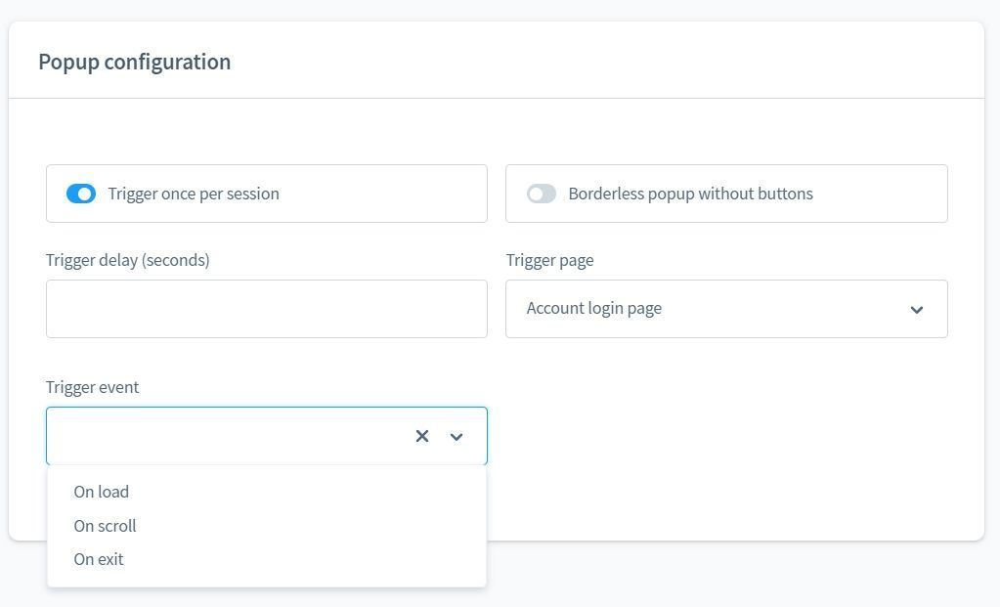
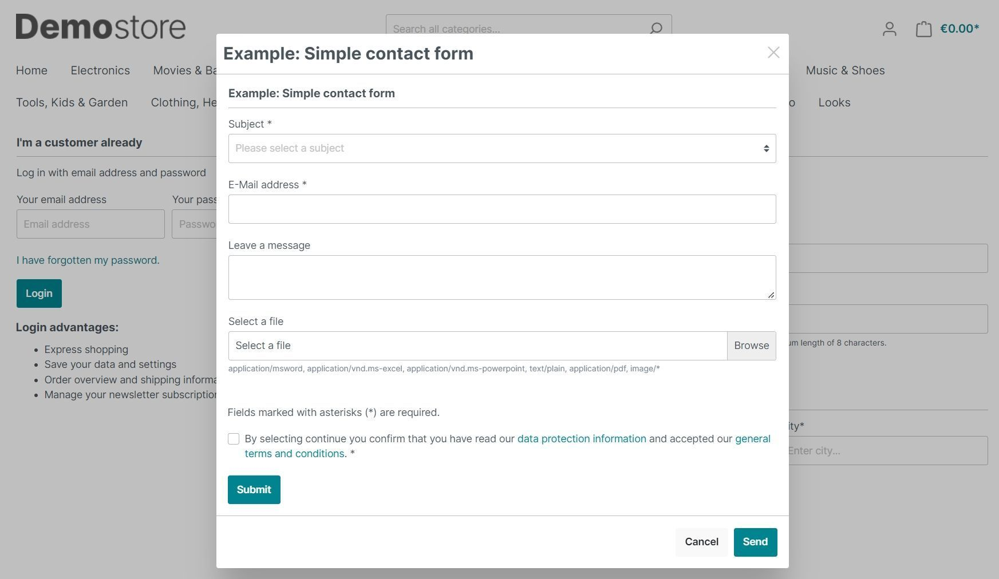
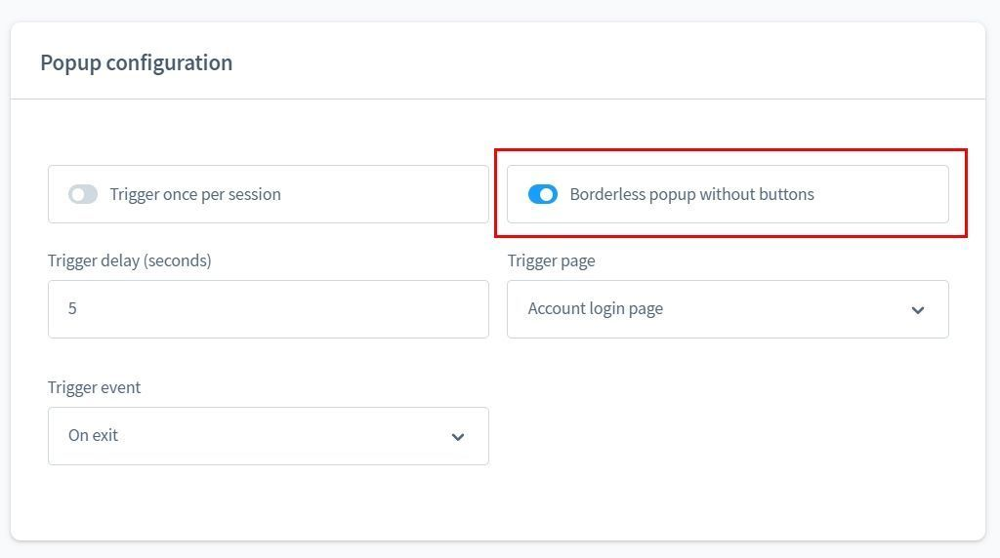
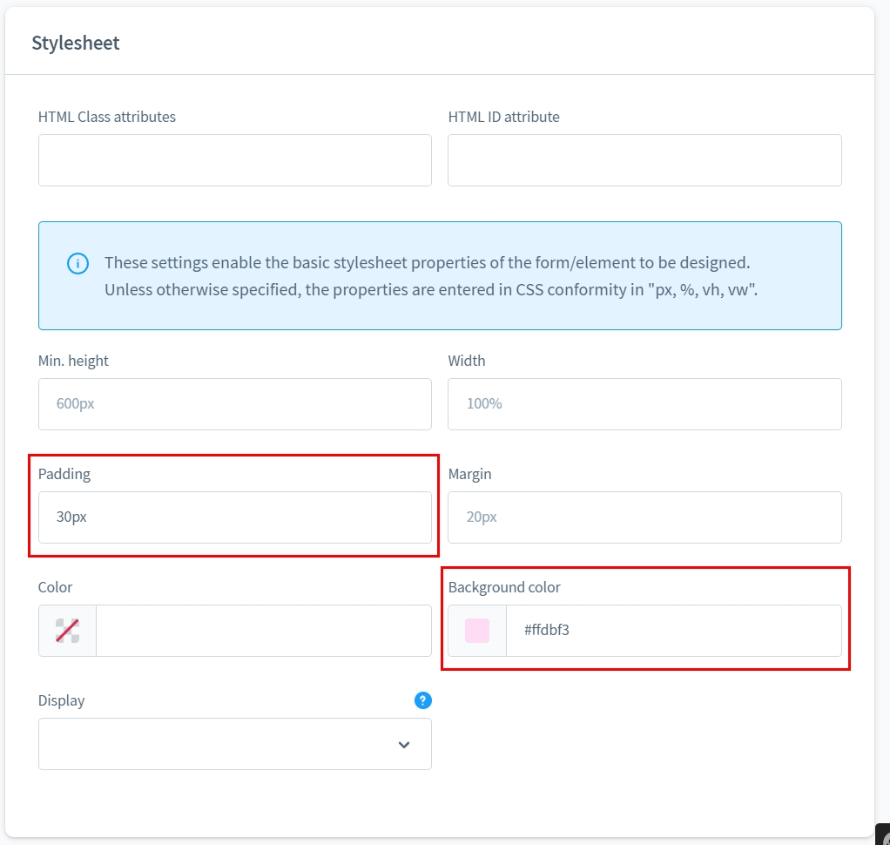
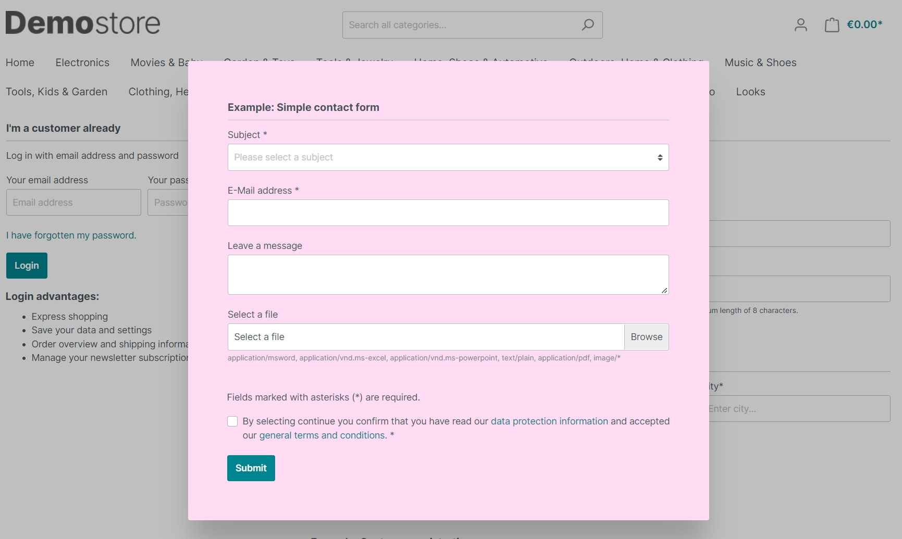

# Form Builder 2 | Exit-Intent-Popups Add-On

With this add-on for [Form Builder 2](../MoorlForms/index.md) you have the possibility
to open any form as a popup on any page. There are a number of settings for this.

## Note for all customers who already have the Form Builder

This plugin has a fundamentally different structure and does not offer the possibility to migrate the previous forms.
migrate the previous forms.

Unfortunately, it is also not possible to duplicate/transfer the subscriptions after consultation with Shopware.

As I do not want to create a disadvantage for my existing customers, the form construction kit will continue to be
will continue to be provided with updates. But no new functions will be developed.

For all interested parties with active subscriptions I offer a 50% discount for Basis and Add-Ons.
The migration of the forms will also be taken care of on request.
However, there may be differences in appearance, I will not match these.

## New form of type "Popup"

This form opens automatically. It can be added to any shop pages.

There are further settings for this form.

## Settings

As a rule, the same popup should not open again and again, unless you want to annoy your customers.
Use the option to show the popup only once per session!

popups that open immediately can be perceived as annoying. Set a dwell time,
when the popup is allowed to open.

Select a page on which the popup will open. If no page is selected,
the popup will open on any page.

You can open the popup for a specific event. If no event is selected,
the popup will open as an "Exit-Intent".

## Borderless popups

You don't have to use the popup for forms, you can also display other content.
For example, a discount code if the customer leaves the order completion after a certain time?

You can easily customise the borderless popup.

This is what the popup could look like now!

## Ideas for using the popup

1. offer newsletter registration if the customer stays on the same page for 60 seconds.
2. offer discount code when the customer wants to leave the order completion.
3. feedback or rating form on the order confirmation.

and much more...
