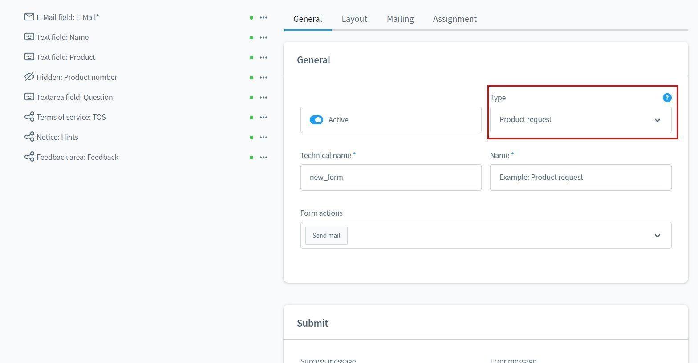
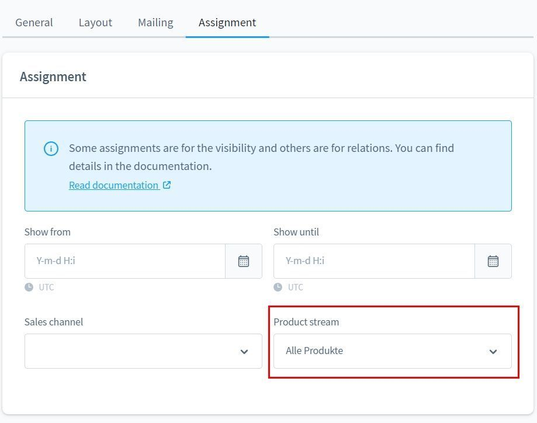
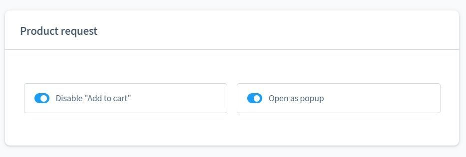
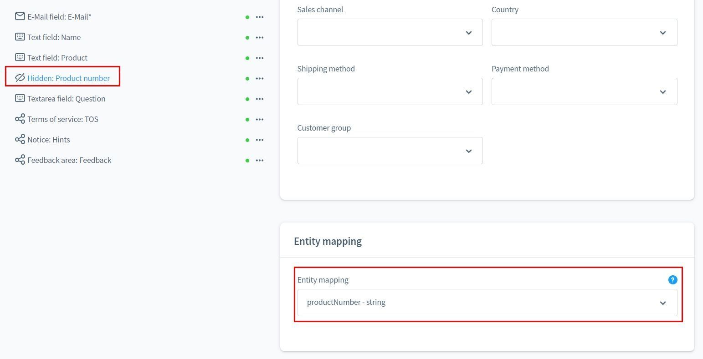
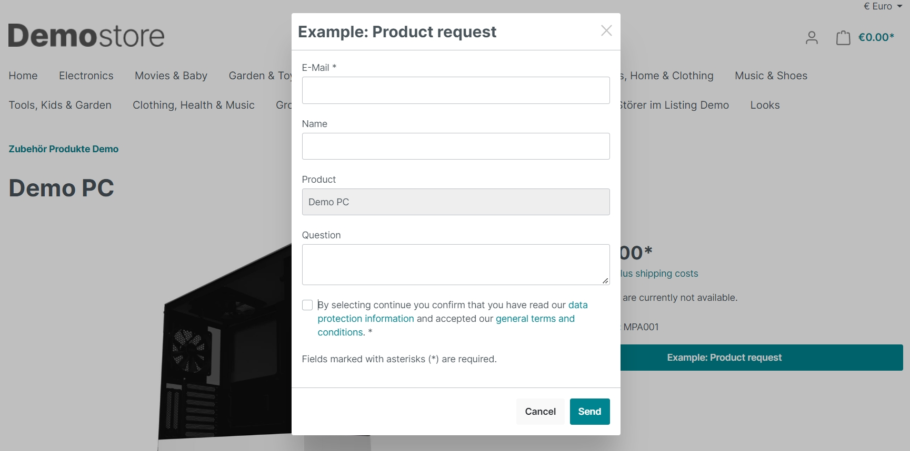

# Form Builder 2 | Product-Request Add-On

With this add-on for [Form Builder 2](../MoorlForms/index.md) you can
additional forms for your products. Products with forms
can optionally be excluded from purchase.

!!! note "Note for all customers who already own the Form Builder"

    This plugin has a fundamentally different structure and does not offer the possibility to migrate the previous forms.
          
    Unfortunately, it is also not possible to duplicate/transfer the subscriptions after consultation with Shopware.
          
    Since I don't want to put my existing customers at a disadvantage, the form construction kit will continue to be provided with updates. But no new functions will be developed.
          
    For all interested parties with active subscriptions I offer a 50% voucher for Basis and Add-Ons.
    
    The voucher is issued individually and cannot be combined with discount campaigns.

## Example forms for download

- [Product-Request Add-On](examples/product-request-add-on.json)

## New form of type "Product-Request

With this form you can offer the possibility on the product-detail-page to
to make enquiries about the product.

The form will be assigned to a dynamic product group.

The form can optionally be opened as a pop-up. In this case
element of the type "Submit" is not necessary.

You can create hidden fields and add relevant information about the product.
relevant information about the product.

## Output in the storefront

