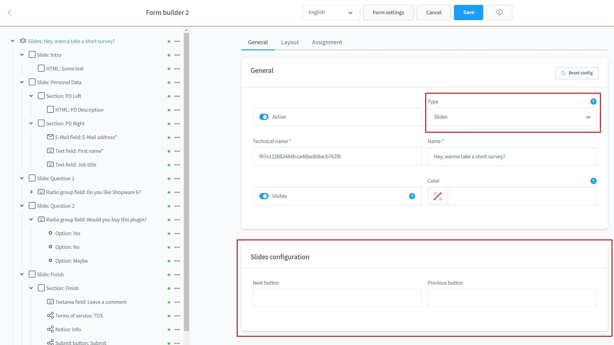
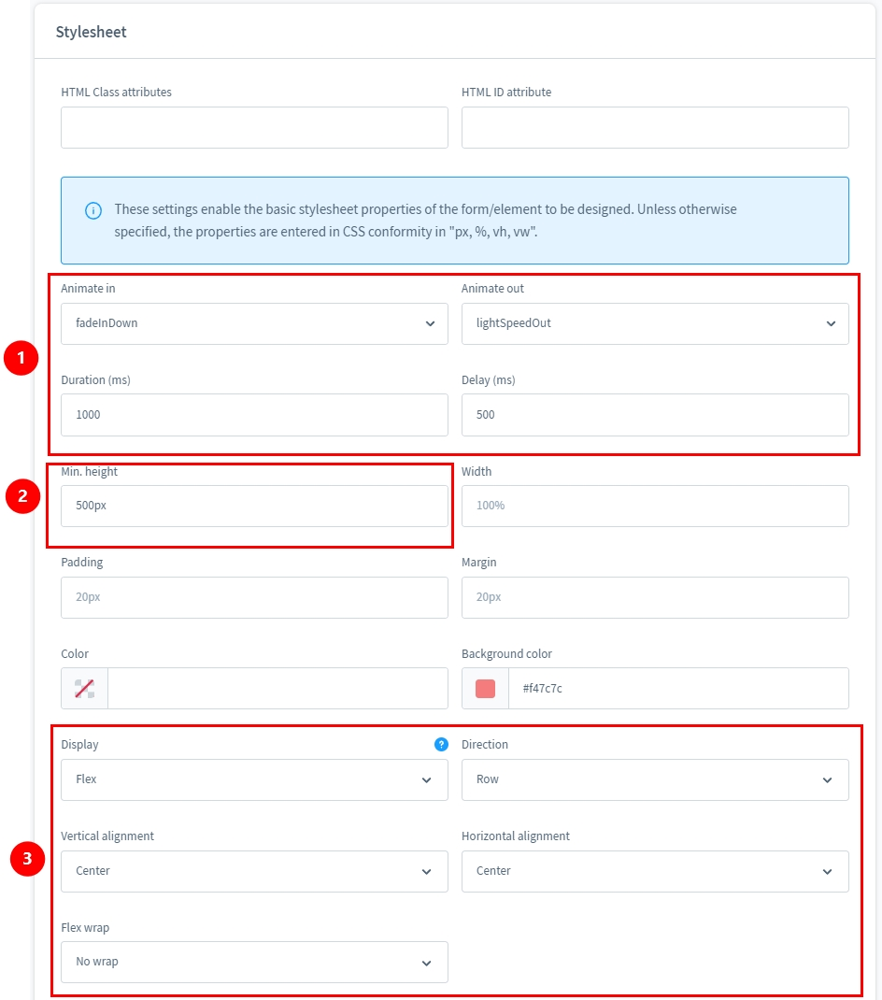
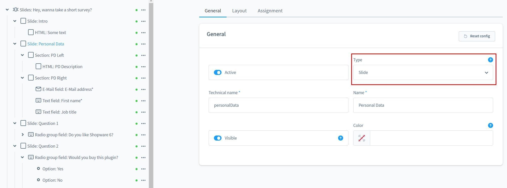
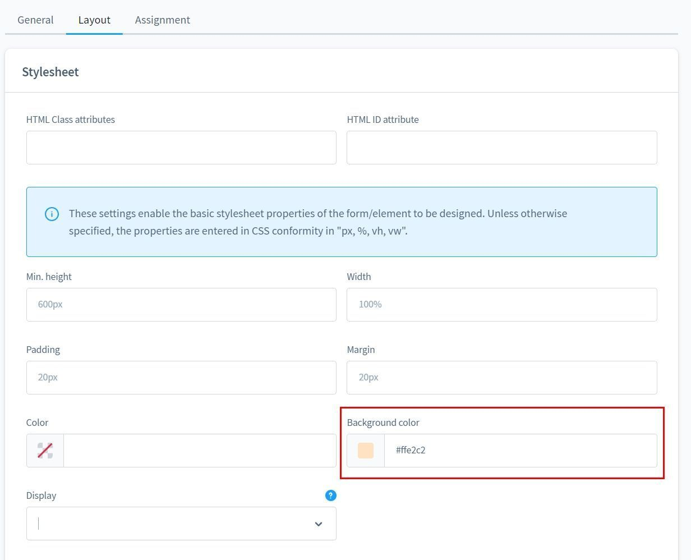
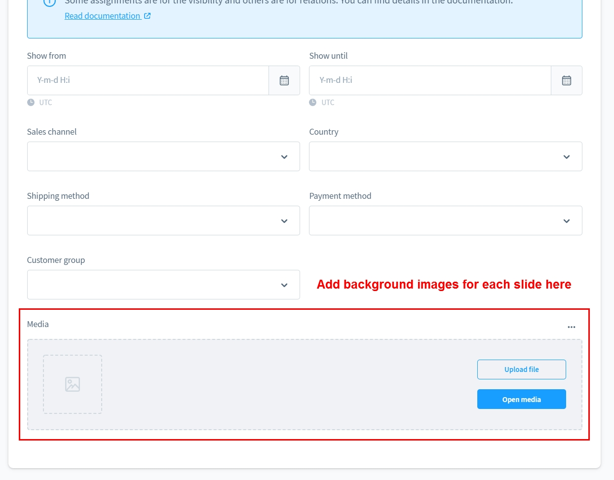
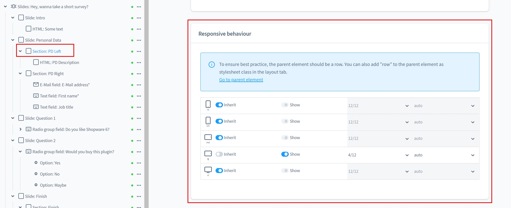
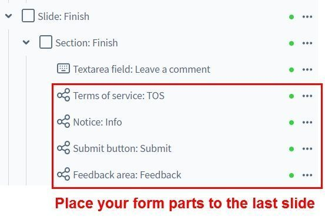
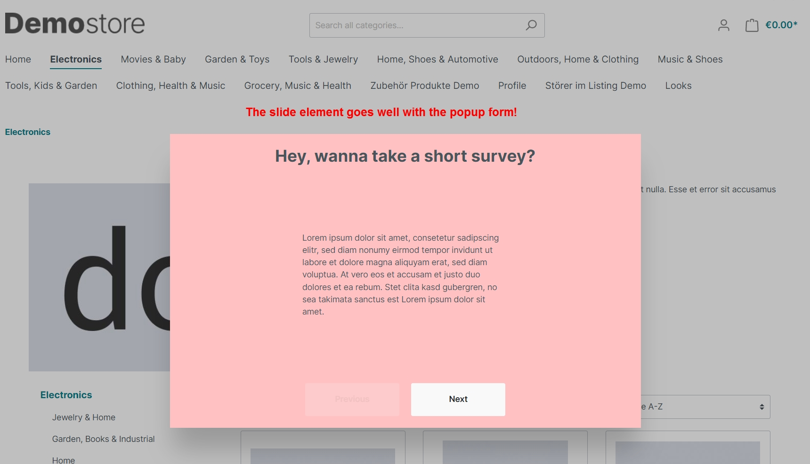
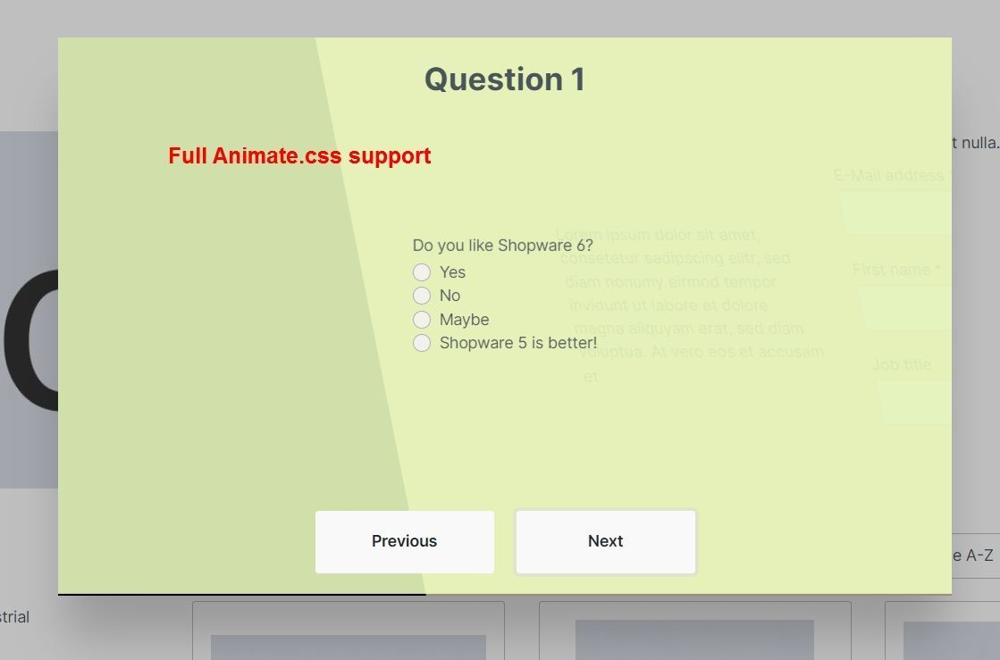
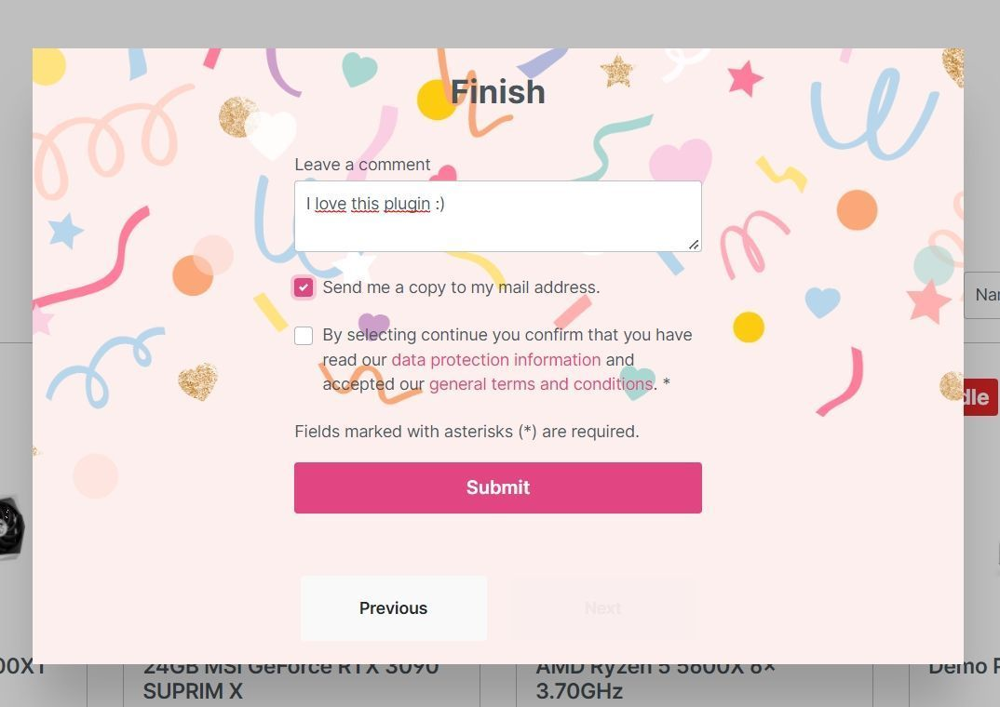

# Formular Baukasten 2 | Slides Add-On

Mit diesem Add-On für [Formular Baukasten 2](../MoorlForms/index.md) kannst du Formulare in mehrere Schritte und optisch ansprechend aufteilen. Dieses Plugin ist die optimale Ergänzung zum Popup Add-On!

!!! note "Hinweis für alle Kunden, die den Formular Baukasten bereits besitzen"

    Dieses Plugin ist grundlegend anders aufgebaut und bietet keine Möglichkeit, die bisherigen Formulare zu migrieren.
          
    Leider ist es nach Absprache mit Shopware auch nicht möglich die Subscriptions zu duplizieren/übertragen.
          
    Da ich meinen bisherigen Kunden keinen Nachteil schaffen möchte, wird der Formular Baukasten weiterhin mit Updates versorgt. Aber es werden keine neuen Funktionen mehr entwickelt.
          
    Für alle Interessenten mit aktiven Subscriptions biete ich einen 50% Gutschein für Basis und Add-Ons.
    
    Der Gutschein wird individuell ausgestellt und ist nicht mit Rabattaktionen kommulierbar.

## Beispiel Formulare zum Download

- [Slides Add-On](examples/slides-add-on.json)

## Neues Element von Typ "Slides"

Dieses Element ist in der Konfiguration sehr anspruchsvoll, aber auch mächtig in der Anwendung.

## Konfiguration

Benenne die vor- und zurück Buttons.

Die Stylesheet Einstellungen sind essenziell für das Element, hier kannst du folgende
Konfigurationen machen:

1. Animationen für die Übergänge
2. Die minimale Höhe (empfohlen)
3. Die Slides gleichen sich mit Bootstrap-Zeilen, hier empfehle ich die horizontale und
vertikale Ausrichtung auf "Mittig" zu stellen.
   
Hinweis: Die CSS Eigenschaften werden auf die Slide-Elemente innerhalb des Slides übertagen.
So sind die Eigenschaften stimmig und du kannst z.B. die Hintergrundfarbe pro Slide anpassen!

Das Element vom Typ "Slide" ist das Unterelement und kann beliebig oft verwendet werden.

Da die CSS Eigenschaften durch das Eltern-Element gesetzt werden, kannst du diese Einstellungen
optional anpassen.

Ein Hintergrundbild kannst du im Tab "Zuweisung" definieren.

Jedes Slide-Element unterstützt responsive Unter-Elemente, nutze diese Einstellung um die Felder
auszurichten.

Die wesentlichen Bestandteile des Formulars kannst du frei positionieren.

## Ausgabe im Storefront

In diesem Beispiel habe ich das Popup-Formular verwendet. Die Slides sind aber auch für
CMS Elemente tauglich!

