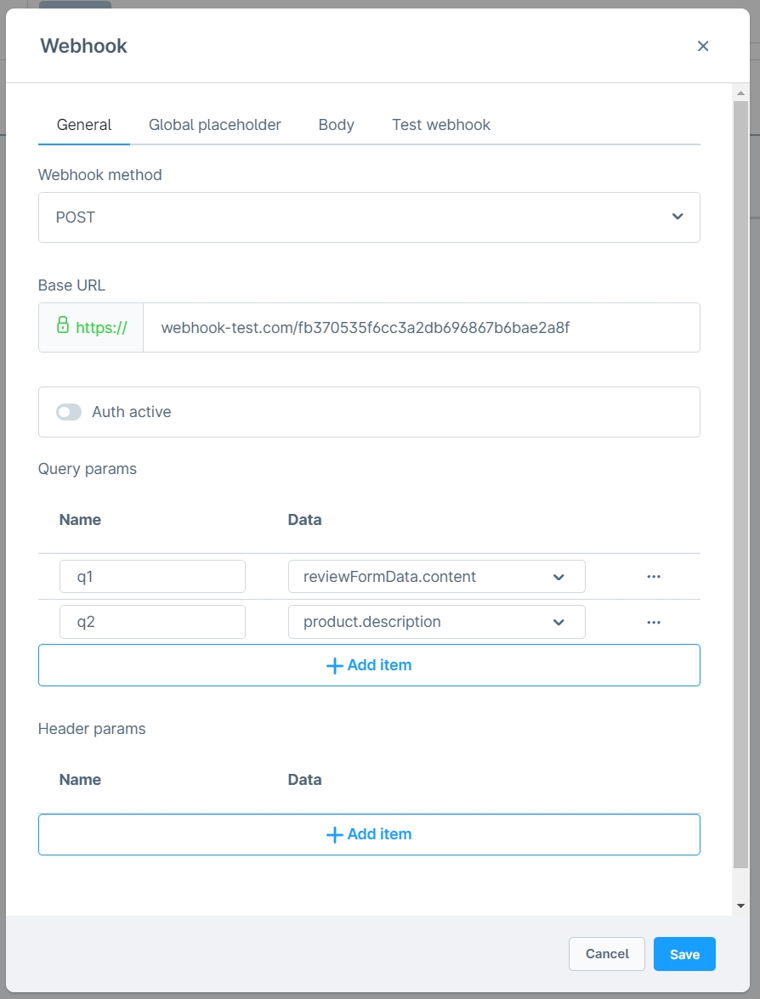
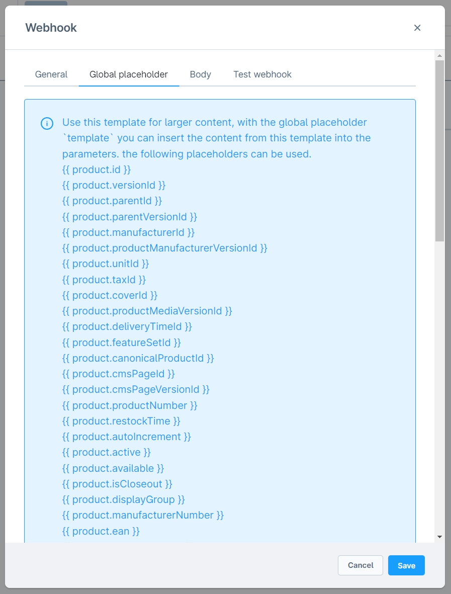
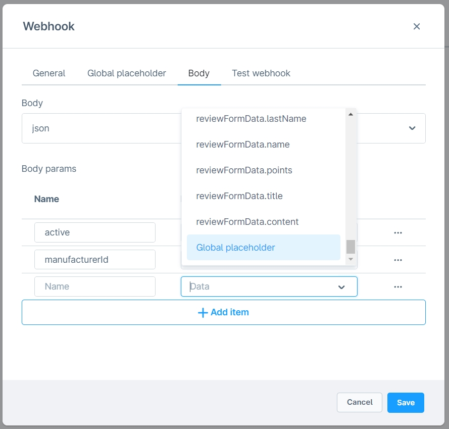
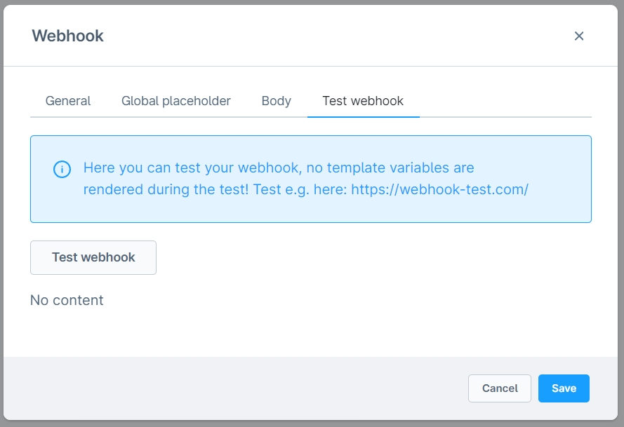
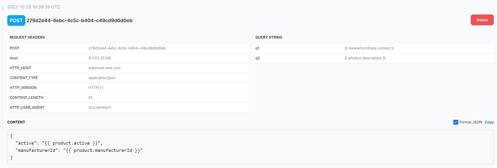

# Webhook Integration

Diese Erweiterung ist mit [Formular Baukasten 2](../MoorlForms/index.md) kompatibel

## Installation

!!! note

      Falls du Probleme mit dem Plugin hast, bitte beachte folgende [Hinweise](../) im FAQ Bereich.

1. Installiere
   [Foundation](../MoorlFoundation/index.md)
2. Installiere Webhook Integration im Plugin Manager

## Einrichtung

### Webhook erstellen

Es gibt für Webhooks unzählige Anwendungsbereiche, du kannst [hier](https://webhook-test.com/) Webhooks testen.

### Beispiele

#### Benachrichtigungen auf dein Amazon Echo Gerät

https://zeropointdevelopment.com/sending-notifications-to-amazon-echo-using-webhooks/

#### Per Webhook Nachrichten in dein Discord Channel senden

https://support.discord.com/hc/en-us/articles/228383668-Intro-to-Webhooks

### Webhook mit Flow-Builder einrichten

- Navigiere zum Flow-Builder und öffne z.B. "Kontaktformular wurde verschickt"
- Gehe in den Reiter "Flow"
- Füge die Aktion "Webhook senden" hinzu
- Trage die Daten deines Webhooks ein
- Tipp: Für längere Texte kannst du einen globalen Platzhalter als Template verwenden
- Teste deinen Webhook

Wenn der Flow aufgrund von falschen Platzhaltern nicht ausgeführt wird, gibt es keine Fehlermeldung. Bitte überprüfe deine Einstellungen sorgfältig!

### Webhook mit Formular Baukasten 2 Formular einrichten

- Öffne dein Formular im Shopware Admin
- In den Basis-Einstellungen des Formulars wählst du bei "Formular Aktionen" die Option "Sende Webhook" aus
- Trage die Daten deines Webhooks ein
- Tipp: Für längere Texte kannst du einen globalen Platzhalter als Template verwenden
- Teste deinen Webhook
- Speichere das Formular

## Test

Ein Beispiel für einen gesendeten Webhook.

