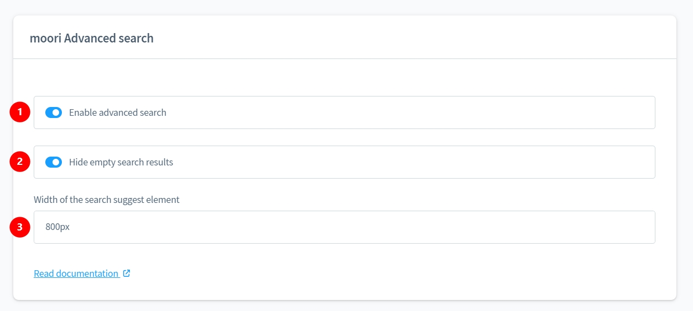
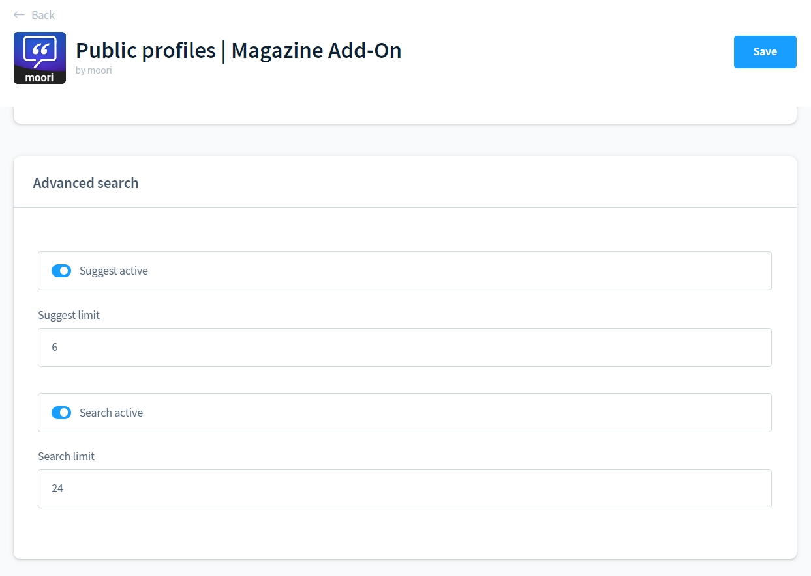
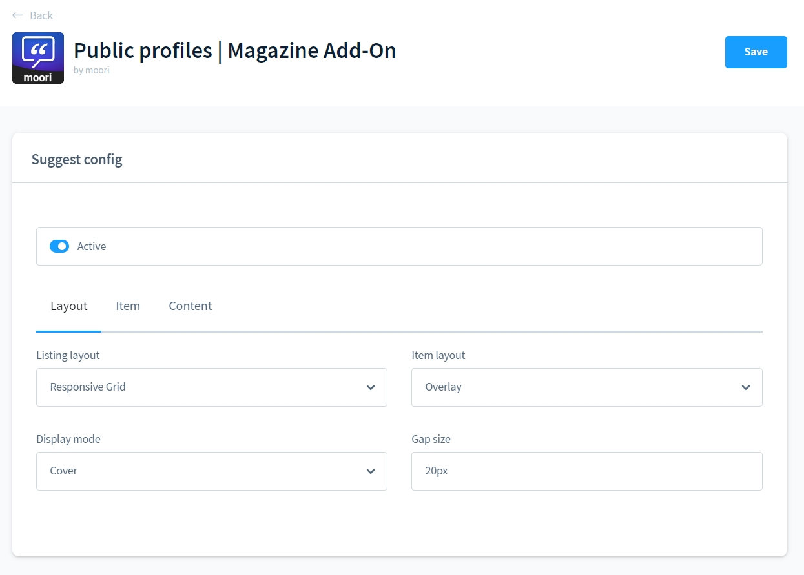
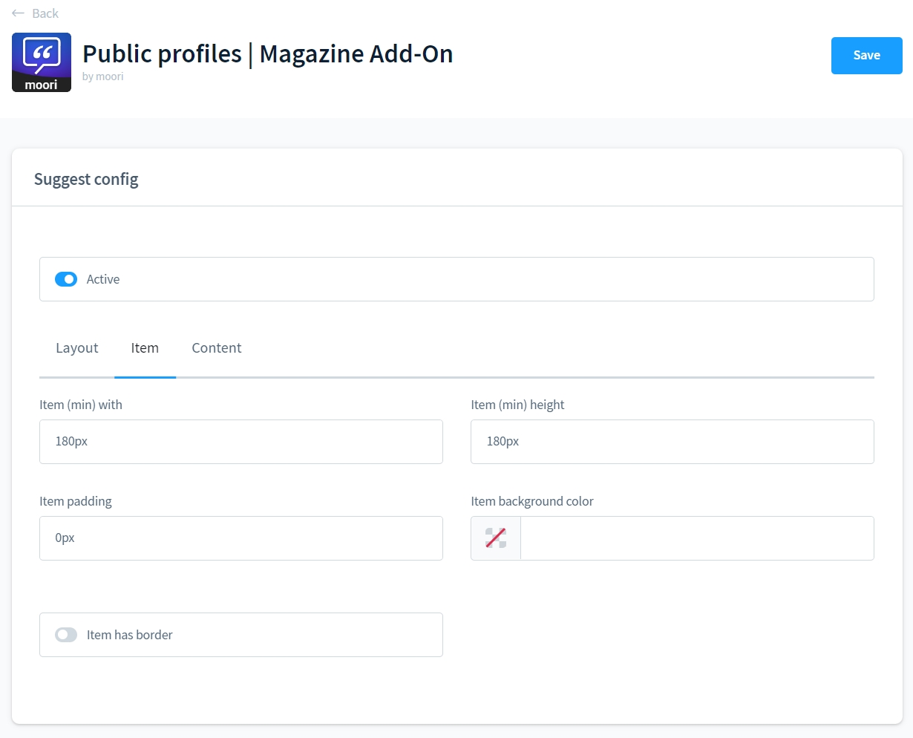
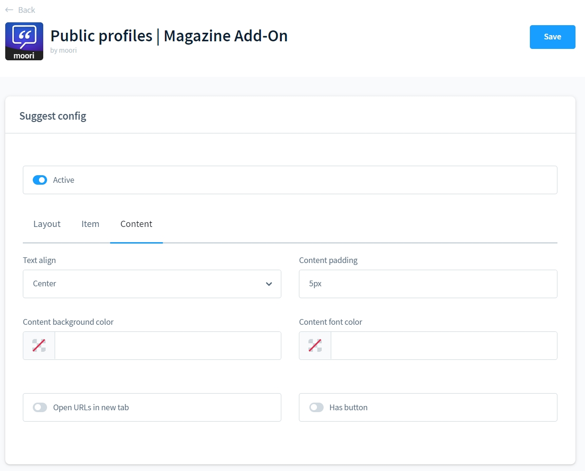
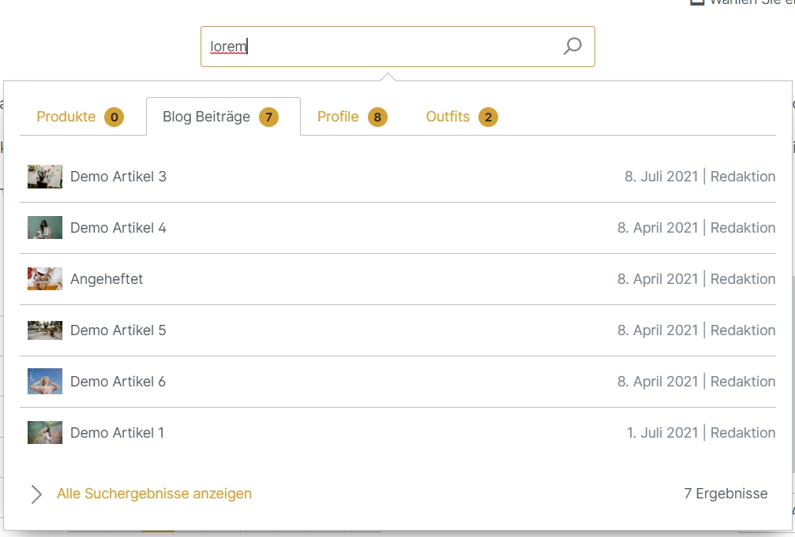

# Foundation | Erweiterte Suche

Das Foundation Plugin bietet speziell für alle moori Plugins eine erweiterte Suche.

Die Shopware 6 Suche kann dadurch optional angepasst und erweitert werden.

## Konfiguration im Foundation Plugin

Damit die erweiterte Suche nicht etwa andere Such-Erweiterungen oder Elastic-Search (ES) stört, kann man diese rein optional aktivieren oder deaktivieren.

1. Aktivieren
2. Tabs ohne Ergebnisse verstecken
3. Breite anpassen, damit mehrere Tabs hereinpassen

## Konfiguration in moori Plugins

Nicht alle moori Plugins bieten dieses Feature an. Hauptsächlich Plugins, die eigene Datensätze beinhalten, wie z.B. das [Magazine Add-On](../MoorlMagazine/index.md) für [Öffentliche Profile](../MoorlCreator/index.md).

Die erweiterte Suche besteht aus der Schnellsuche, die dynamisch auf jeder Shopseite verfügbar ist und der Such-Seite. Diese kannst du auch nach Bedarf aktivieren und deaktivieren. Außerdem kannst du bestimmen, wie viele Suchergebnisse maximal angezeigt werden dürfen.

## Layout der Suchergebnisse

Bestimme für jeden Typ ein individuelles Layout, dazu steht dir eine Konfiguration zur Verfügung, die sich stark der [Konfiguration für Listings](../MoorlFoundation/listing.md) ähnelt.

Du kannst die Konfiguration auch deaktivieren, dann werden die Suchergebnisse als Liste dargestellt.

## Schnellsuche ohne Konfiguration

## Schnellsuche mit Konfiguration

## Such-Seite

