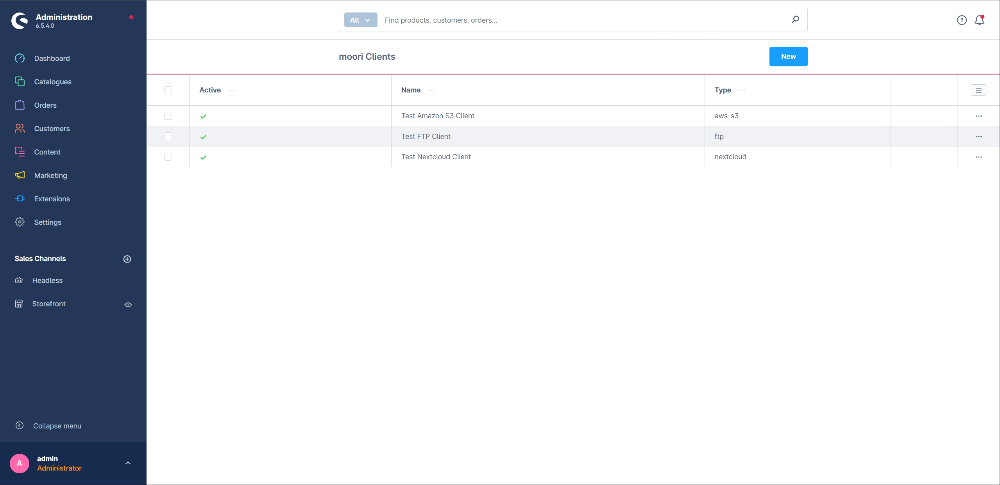
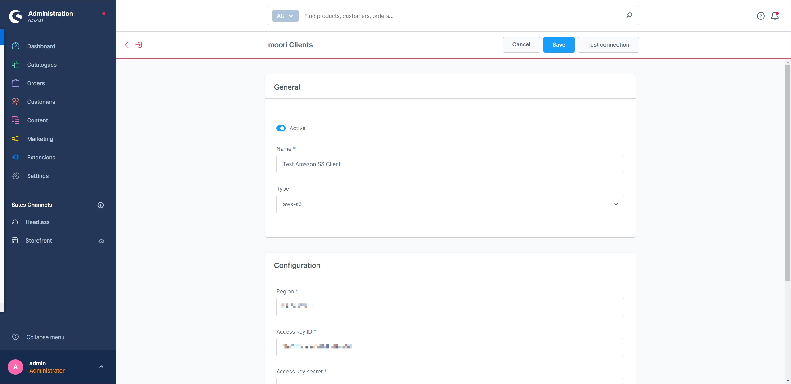
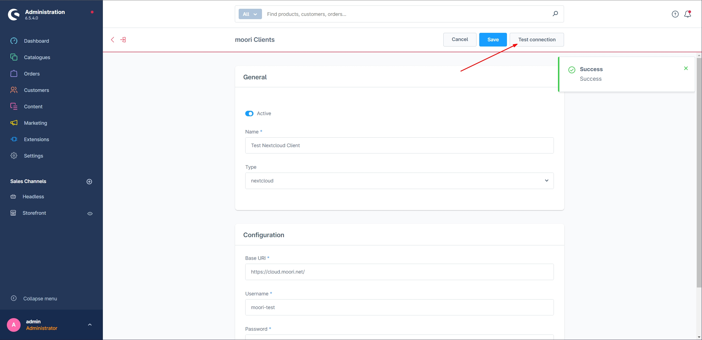

# Foundation | Clients

available as of Shopware 6.4

### Manage clients for external services

Here you can create clients for all kinds of external services. This can be, for example, a DeepL or Google API key. Or a connection to an FTP server. Most services are made available via additional plug-ins.

### Manage client

As the administration of clients is mostly the business of an experienced user, we will not translate the fields.

When you create a client, you first fill in the name. Then you select what kind of service you want to use.

The required and optional input fields then appear.

As soon as you have entered your data, you can test the connection - done!

