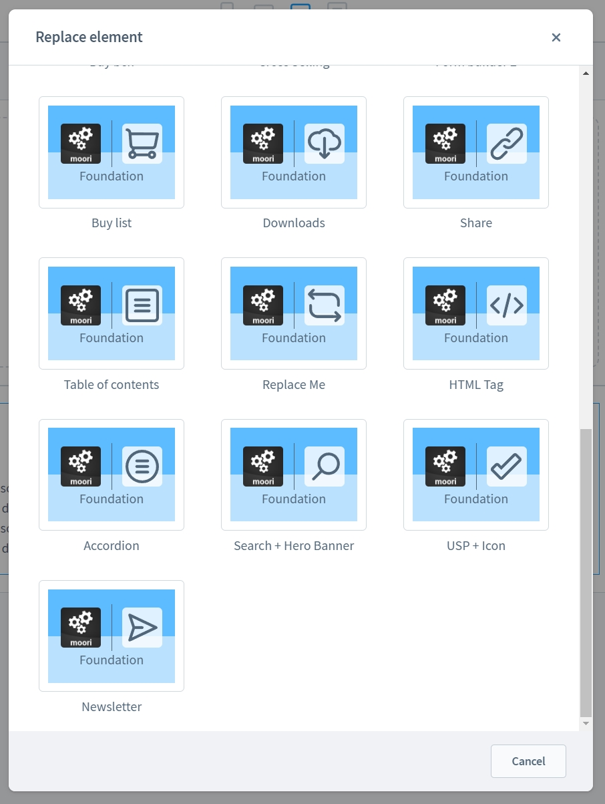
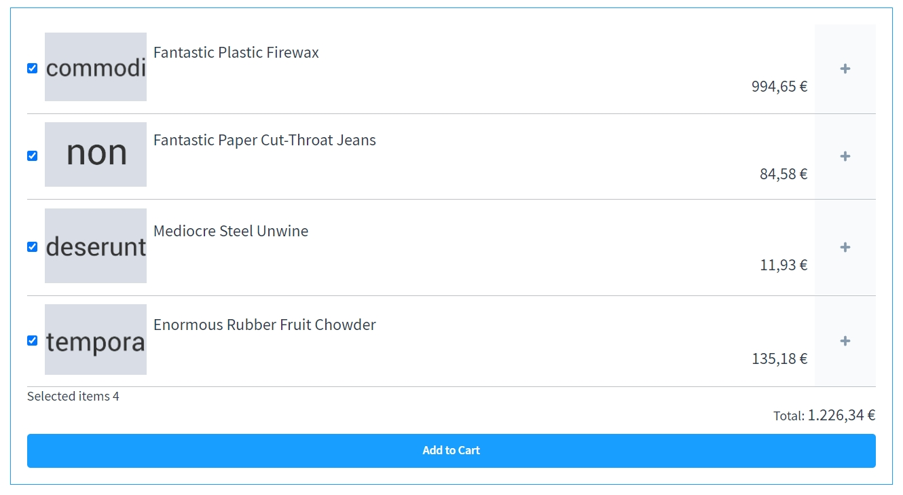
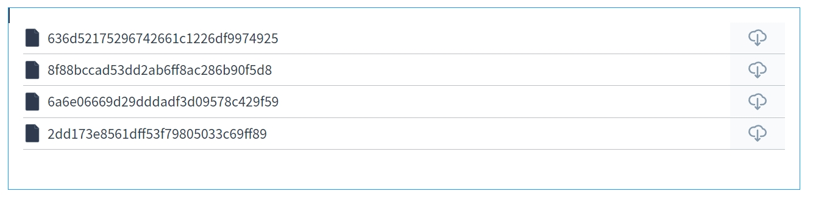
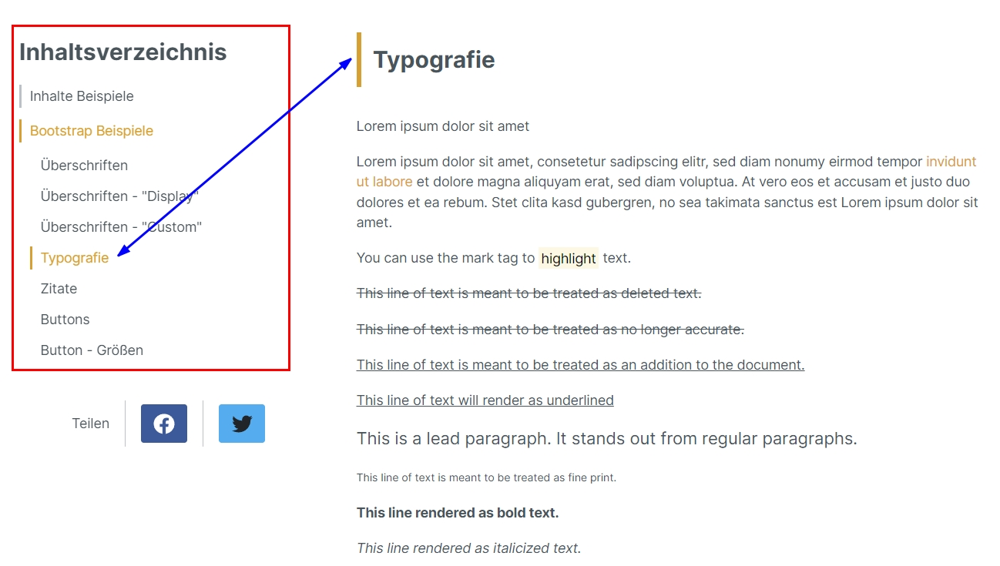
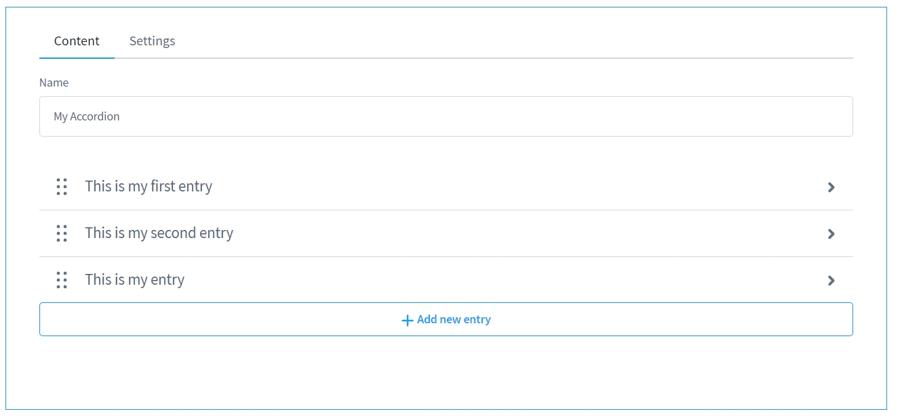
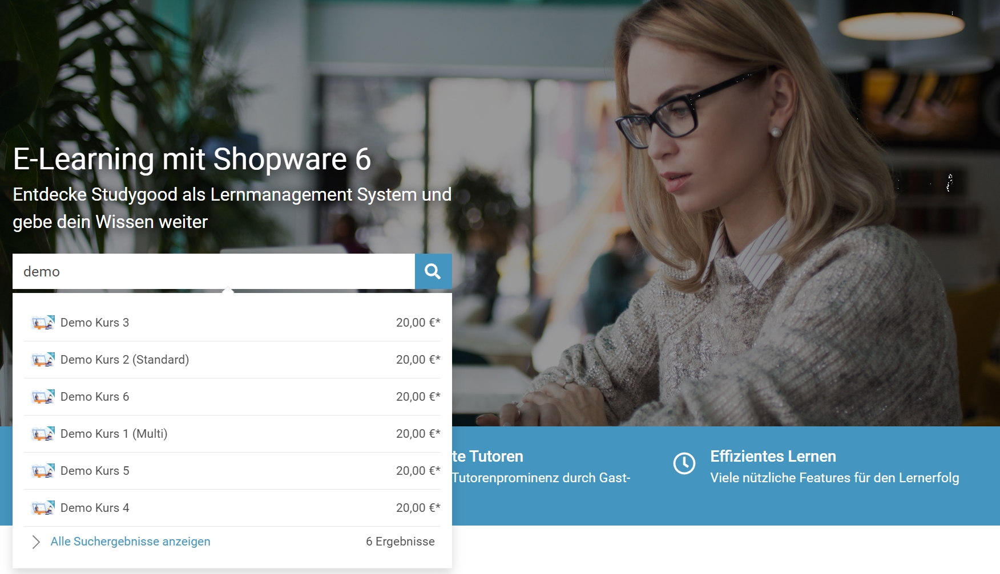
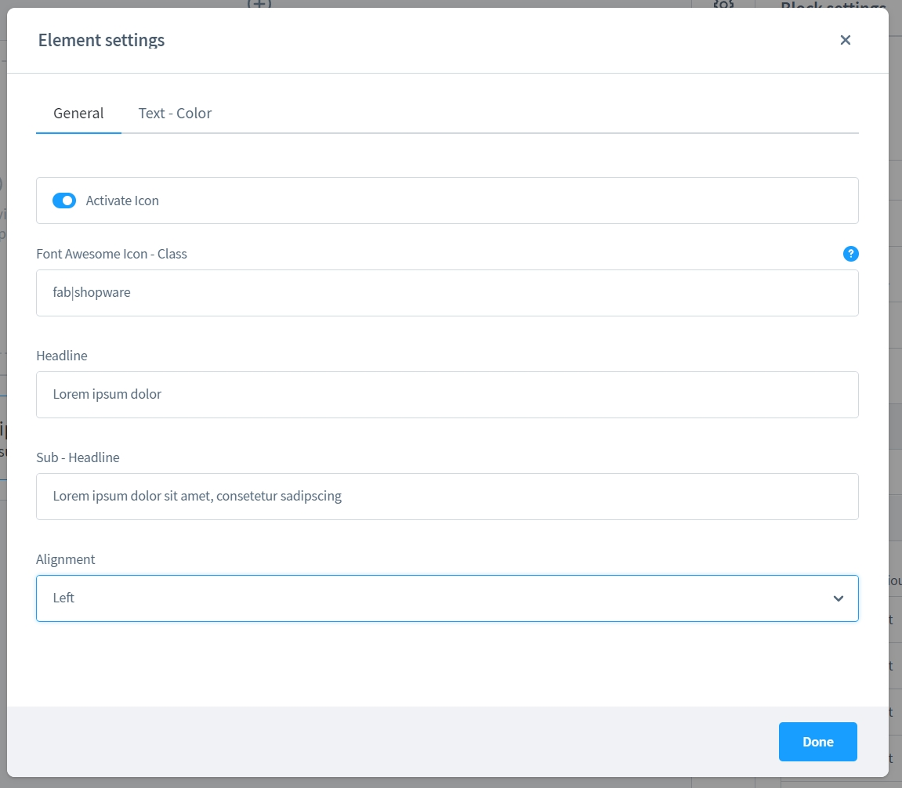
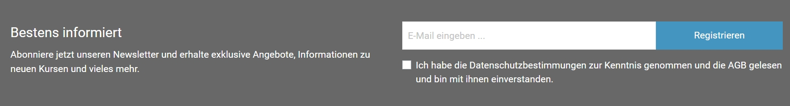
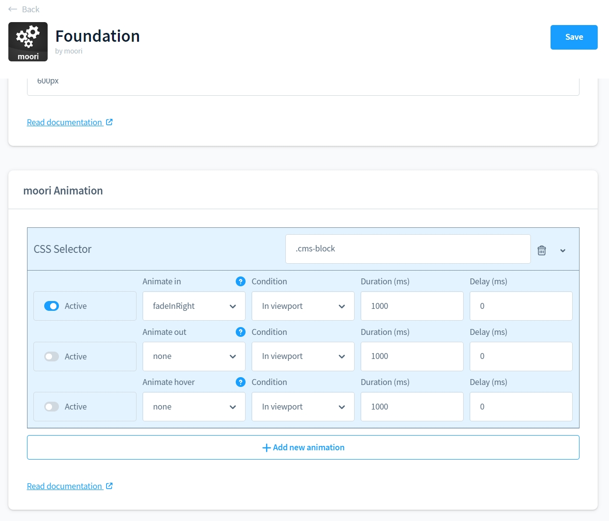
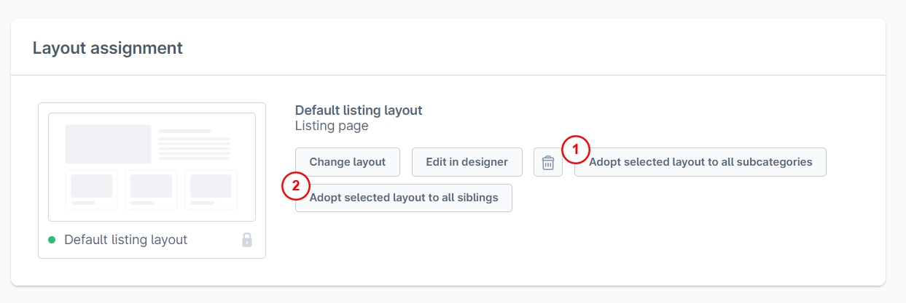

# Foundation | Free Features

The Free Features of the moori Foundation Plugin offer you a selection of useful CMS elements.

## Free Shopware 6 CMS Elements

### Shopping list / Quick buy

With this element you can add a selection of products directly to the shopping cart. This is an ideal and simple alternative to product bundles.

You can set here whether you want to place the products individually and/or all of them in the shopping basket. A variant switch is also possible.

This element is also used by other plug-ins, such as [Shop-The-Look](../MoorlShopTheLook/index.md) or the [Magazine Add-On](../MoorlMagazine/index.md) for [Public Profiles](../MoorlCreator/index.md).

### Download List

In general, downloads are always useful, e.g. information material on products or a small download area for CMS pages.

Use the CMS element and assign the downloads from the Shopware Media Manager.

This element is also used by other plugins, such as the [Magazine Add-On](../MoorlMagazine/index.md) for [Public Profiles](../MoorlCreator/index.md).

### Social Share

This CMS element can be placed on any CMS page, it provides share buttons for Twitter and Facebook.

### Table of contents

The table of contents has been specially developed for the plugins [Magazine Add-On](../MoorlMagazine/index.md) and [Public Profiles](../MoorlCreator/index.md).

It builds a dynamic navigation for the content area by assigning ID attributes to the HTML tags h2, h3, h4 and h5.

### Replacer

This element serves as a placeholder, e.g. to quickly test grid layouts. Generally, these elements are used in all CMS blocks of the Foundation Plugin.

### HTML tag

Here you can create a single HTML tag element, e.g. for headings.

### Accordion

This element was taken from the Appflix Foundation Plugin, it offers the possibility to structure text contents. Get suitable for building FAQ sections!

### Hero banner with search function

Another useful CMS element from Appflix. Here you can create a banner with a search field for the Shopware search.

### USP element

With this element you can display your USPs in your shop and enrich them with an icon. As of Shopware 6.4.11 you can use FontAwesome 5 icons.

### Newsletter element

Here you can freely place a newsletter subscription in your CMS pages.

## Animate.css configuration

You can animate your elements in the shop with the help of CSS selectors.

The following configurations are possible

1. fade-in animations (Animate in)
2. fade out animations (Animate out)
3. effects

These can also be started with three different triggers:

1. element is partially visible
2. element is completely visible
3. mouse is over the element

## Admin helper

### Mass assignment of CMS pages for categories

1. assign the current CMS page to all subordinate categories
2. assign the current CMS page to all categories in the same level

To prevent accidental clicking, the actions must be confirmed again!

## Premium Features

To tap the full potential of moori Foundation, I offer you a wide range of additional features at an affordable price!

Just have a look at the [Shopware Community Store](https://store.shopware.com/moorl87443379024/features-add-on-foundation.html)!
