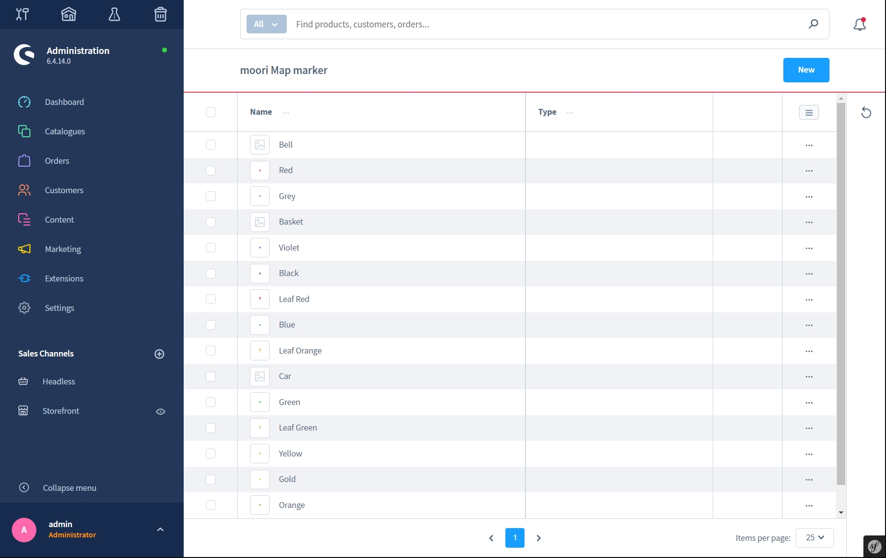
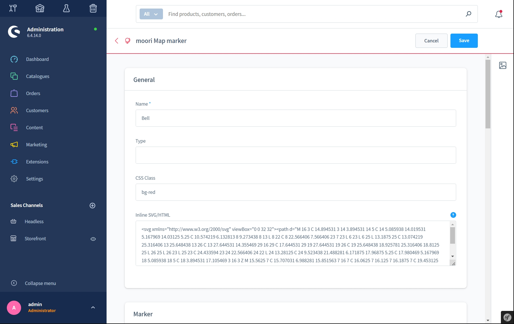
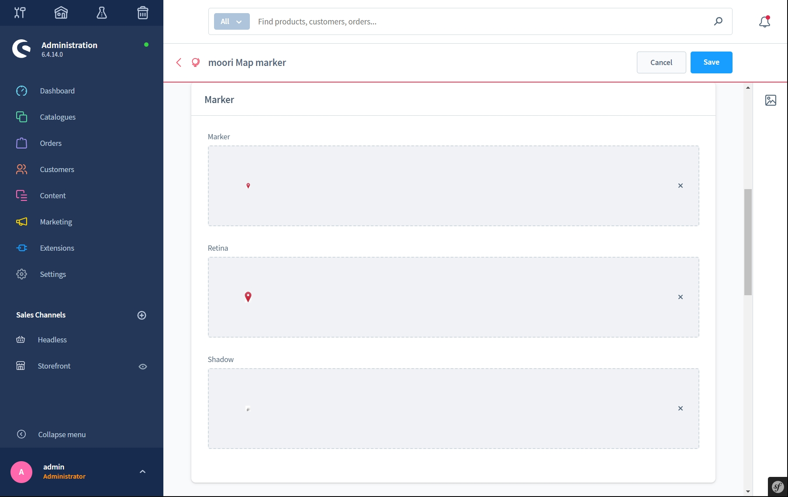
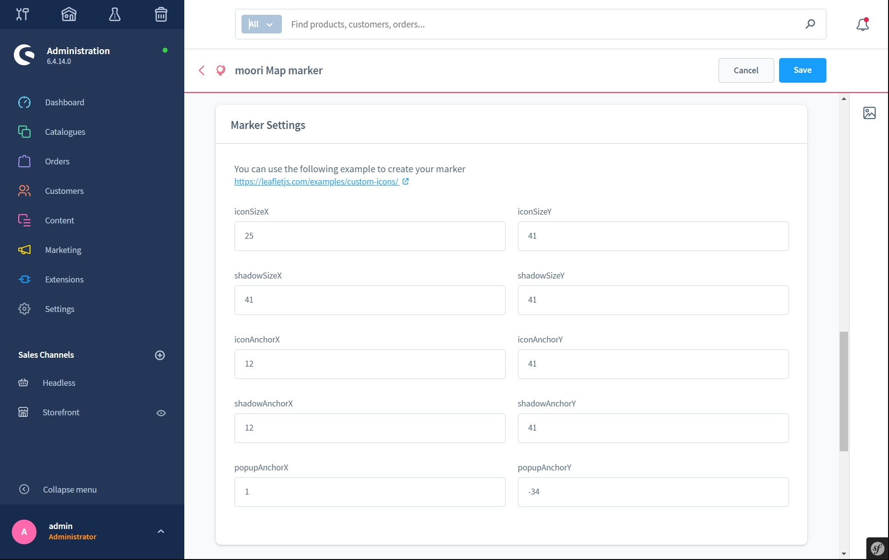
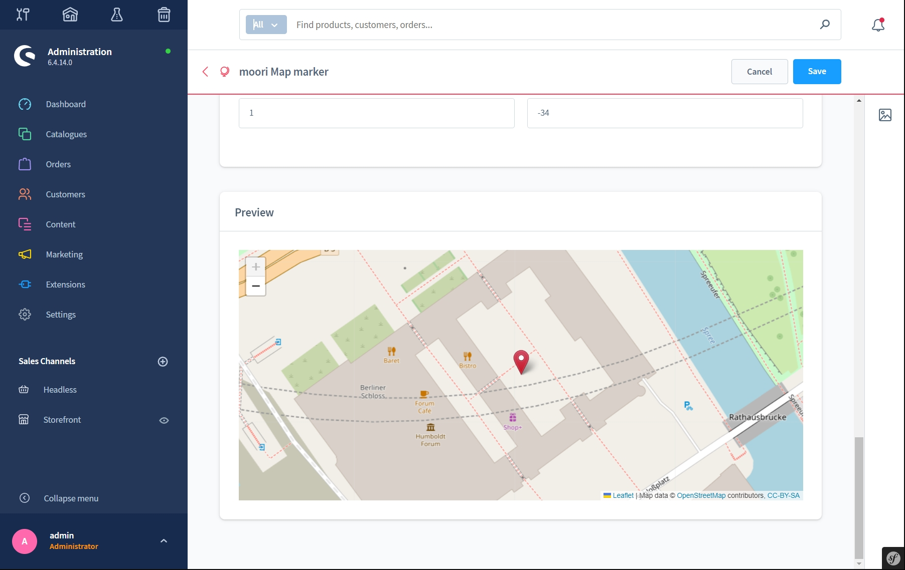
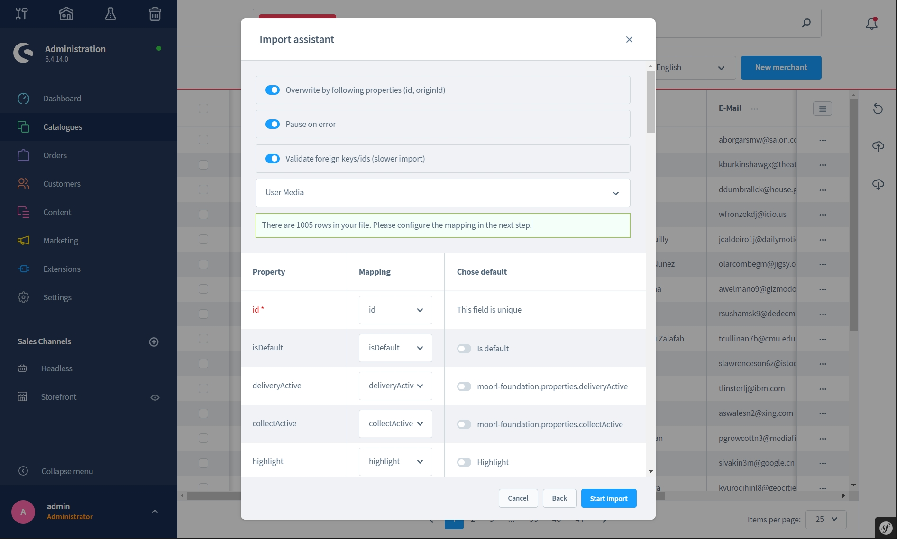
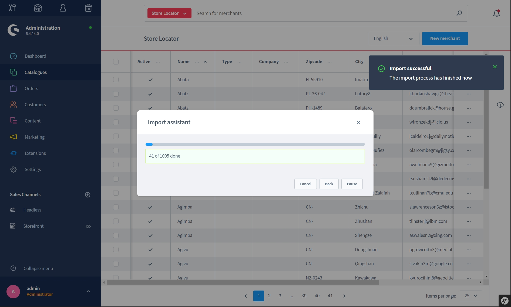

# Foundation | Basic Version

## Foundation is used by the following plugins

Unless otherwise stated, moori Foundation is used in the following plugins

- Plugins by [Appflix](https://store.shopware.com/appflix-ug.html)
- Plugins by [moori](https://store.shopware.com/moori.html)

## Reload missing services

Some services require composer packages, you can execute the following commands in the main directory of your Shopware 6 shop:

```text
composer require deeplcom/deepl-php
```

## What is Foundation used for?

The portfolio of Appflix and moori contains about 100 Shopware 6 plugins. Thereby recurring problems often occur.

Therefore, shared functions are combined in Foundation and serve as compensation for missing functions in the Shopware system.

Some examples:

- FontAwesome SVG: Provides additional icons for the design of the storefront pages.
- Animate CSS: Used for animations in the storefront.
- OpenStreetMap and Map Marker: Used as a basis for Store Locator, DeliveryWare (Appflix) and Classifieds (Appflix).
- Listings, Sliders and Sorting: Serves all plugins that have their own entities. For a quick integration into the Shopware 6 Core. The base also supports all search functions in the storefront.
- Automatic translations: With the help of DeepL, all language-related content can be translated.
- Demo Assistant: Allows demo content to be created in JSON format and imported into Shopware 6. This feature is also used in the themes from RH Webdesign.
- CMS Tools: A very comprehensive collection of useful tools.
- CMS Elements: All CMS elements that are suitable for multiple plugins have been grouped together in Foundation.
- etc...

You are welcome to use Foundation as a basis for your plugins or projects. However, it is forbidden to take features or tools from Foundation for your own purposes.

## Premium Features

Some features can be unlocked by a paid plugin. This applies especially to the CMS tools and the translation function with DeepL.

[To the plugin](https://store.shopware.com/moorl87443379024/features-add-on-foundation.html)

[More info](features-premium.md)

## Free Features

These are primarily used to keep the Appflix and moori plugins slim, but can also be used freely for other purposes.

[More info](features-free.md)

## Settings

### Open Street Map

Since some Appflix and moori plugins use this service, it has now been built into the Foundation. It was decided to use it as an alternative to Google Maps, as OpenStreetMap is in no way inferior. On the contrary, it has many advantages.

There is a CMS element for the map, which can be used. However, all other options are for the plug-ins.


- Url for tile level: You can use the basic URL, but also e.g. a personal mapbox URL. You can design the tiles according to your own ideas. [Here you can find examples](https://leaflet-extras.github.io/leaflet-providers/preview/)
- Copyright: It is important that you always indicate the copyright notice. This differs depending on the provider you use for your tile layers.
- Other settings: Here you can explicitly specify how the map behaves when you interact with it.
- Countries: To determine geo-coordinates, you can limit the search to countries here.
- Unit: For measuring the distance, you can specify the result in miles or kilometres.

### Map Marker

You can mark your locations with individual markers. Use the [Demo Assistant](demo-assistant.md) for preset markers.

Under Settings, Extensions, moori Map marker you will find the configuration.



You can use your own SVGs as HTML or graphics. The graphics consist of three layers: Marker, Retina and Shadow.




The [Official Documentation](https://leafletjs.com/examples/custom-icons/) of Leaflet will help you with the settings.



You will get immediate feedback in the preview whether your marker has been configured correctly.



### Import and Export




