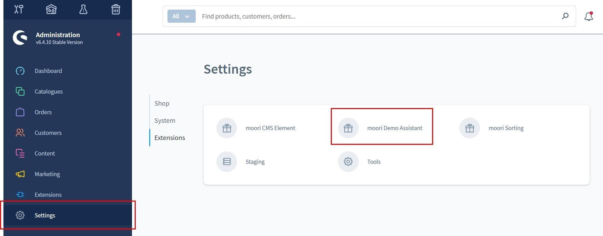
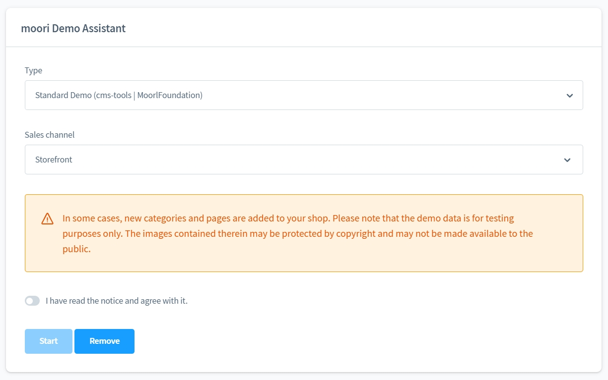

# Foundation Demo Assistant
verfügbar ab Shopware 6.4

### Demo Daten einfach installieren

Die zukünftigen moori Apps enthalten ab sofort Demopakete die Du einfach 
per Klick installieren kannst!

### Wie geht das?

Nachdem Du die moori Foundation App und die moori App Deiner Wahl installiert hast,
gehe in die Einstellungen auf den Reiter moori Tools und klicke anschließend auf dem Demo Assistant.

Danach wählst Du einfach die gewünschte App und den richtigen Verkaufskanal aus. 

Klicke auf Start...
Nach einer kurzen Weile hast sind die Demo Daten bereit zum Einsatz!

