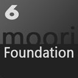

# Foundation / Basis Plugin

## Foundation wird von folgenden Plugins verwendet

- CMS Call to Action Banner
- CMS Brand Slider
- CMS Testimonials
- CMS Shop the Look
- Responsive Bildergallerie
- [Händler- und Filialensuche](../MoorlMerchantFinder/index.md)
- Wordpress Feed
- Download Center
- [Formular Baukasten](../MoorlFormBuilder/index.md)

## Es beinhaltet folgende Funktionen

- Fontawesome 5 Free - https://fontawesome.com
- Animate.css - https://daneden.github.io/animate.css
- Plugin-Interne Übersetzungen
- Plugin-Bedingte Ergänzungen (z.B. CMS Block Bezeichnungen)
- Nützliche Stylesheet Ergänzungen

## Zusätzliche Funktionen:

- Simple Ein- und Ausblend Animationen bein Scrollen oder mit dem Mauszeiger
- Zusätzliche Button Styles z.B. für Facebook, Amazon, Discord usw.
- Font Awesome 5 Free im Backend eingebunden

Die Funktionen der externen Anbieter können deaktiviert werden (z.B. Wenn Fontawesome 5 bereits über das Theme eingebunden wurde)
