# Public Profiles | Get-The-Look Add-On

[Click here for the demo](https://https://demo.moori.net/Looks/)

---

With this Add-On for [Public Profiles](../MoorlCreator/index.md)
you can present your products even better and at the same time inspire your
inspire your customers. Benefit from longer visitor time.

## Installation

_Note: If you have problems with the plugin, please note the following [notes
the following [hints](../faq.md) in the FAQ section._

1. install
   [Foundation](../MoorlFoundation/index.md)

2. install
   [Public Profiles](../MoorlCreator/index.md)

3. optional: In this app there is a
   [Demo Package](../MoorlFoundation/demo-assistant.md)
   Included.

## Settings

### Basic configuration

In the basic configuration you can make general settings. Here, for example, a
standard category for all looks.

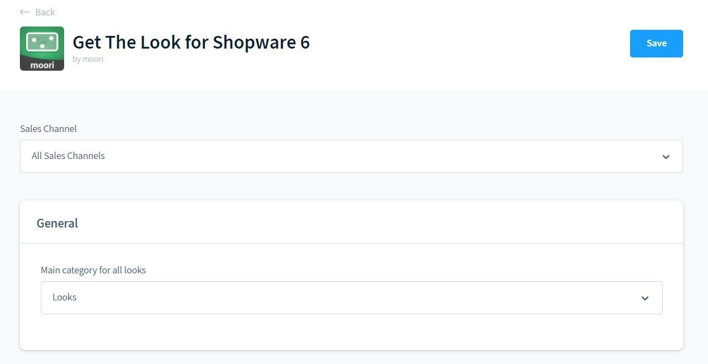

You can also extend the Shopware internal search and freely design the search results.

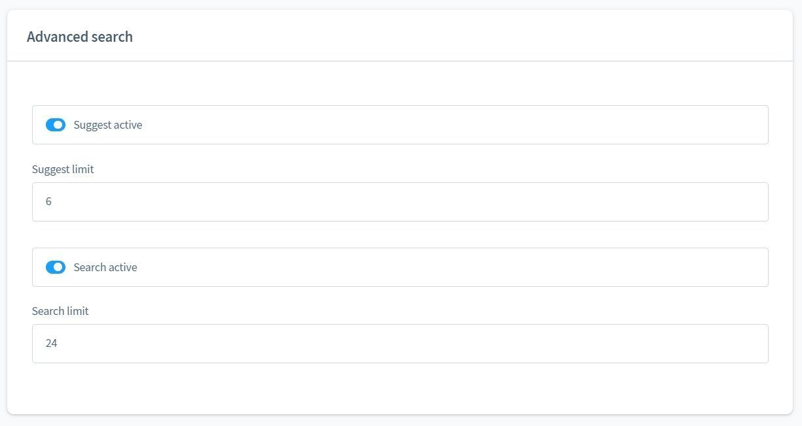

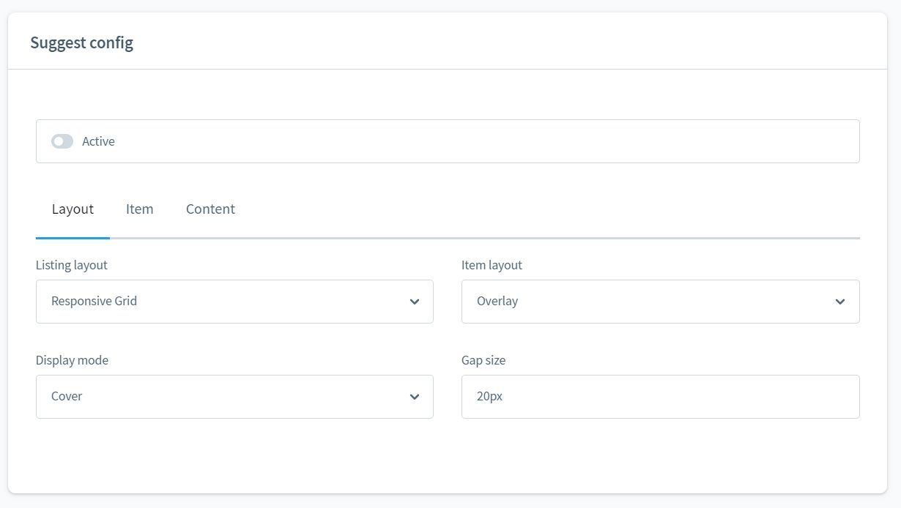

### Administration of looks

You can find the administration under "Catalogue - Get-The-Look!"

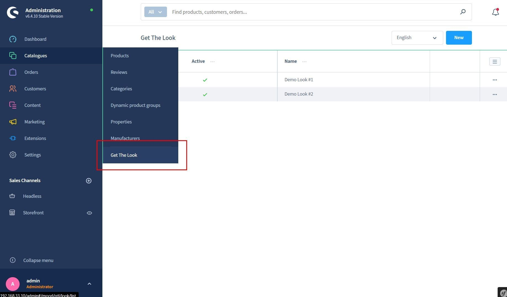

Here you can maintain the master data for your look.

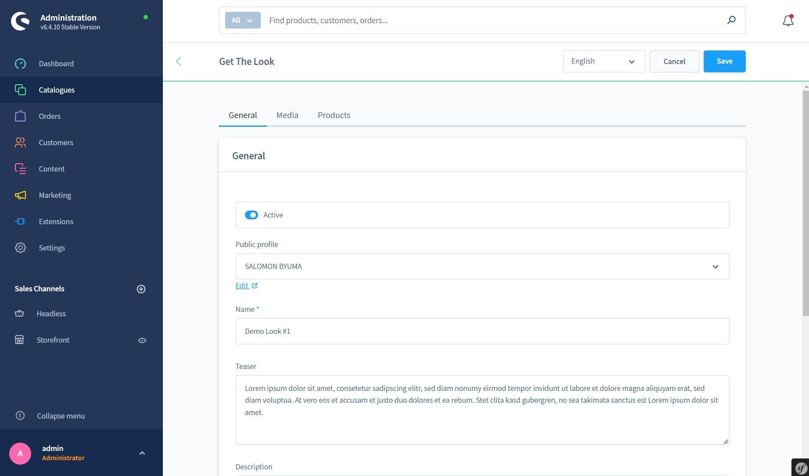

Under the tab "Media" you can add images.

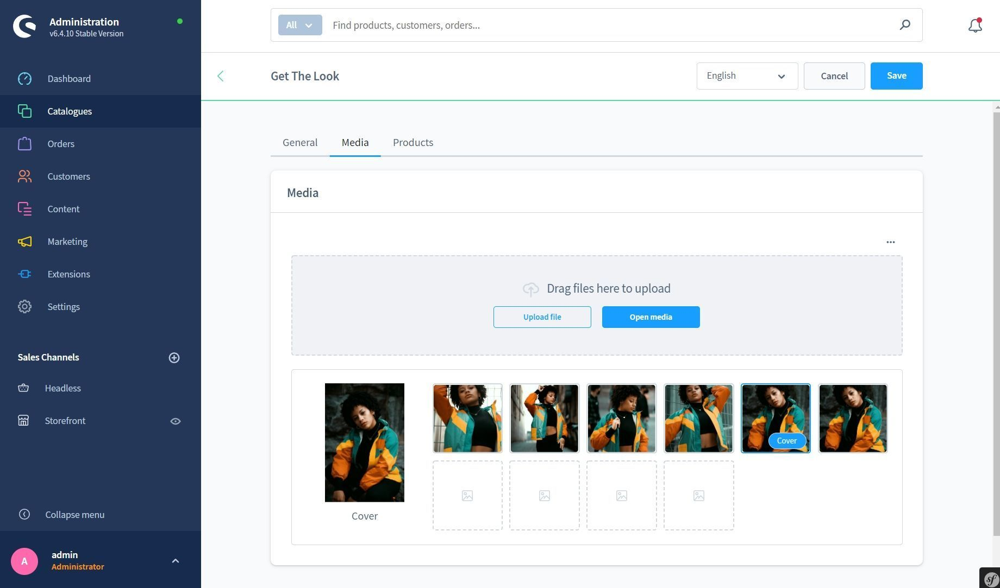

Finally, the matching products are assigned. The property "Priority"
stands for the arrangement within the shopping list in the storefront.

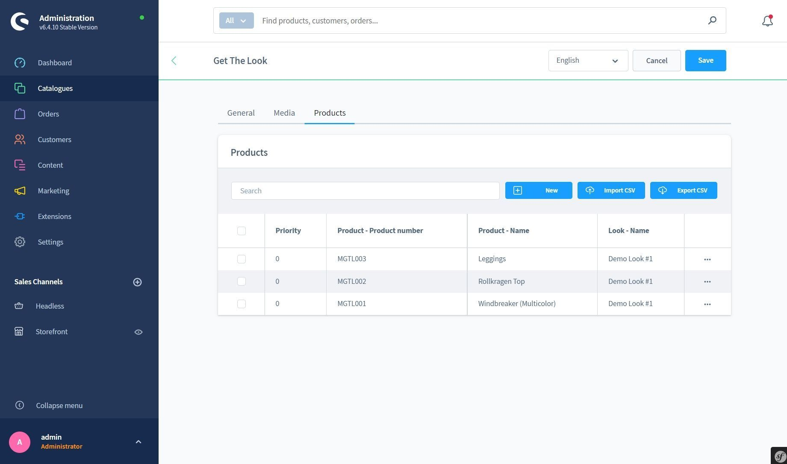

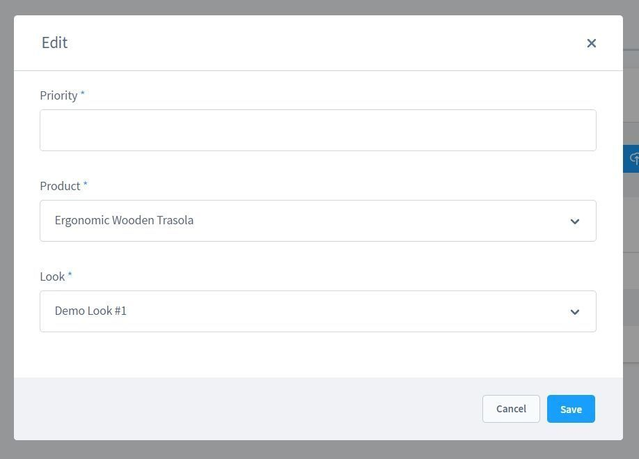

## Examples

A slider on the profile page of the look creator.

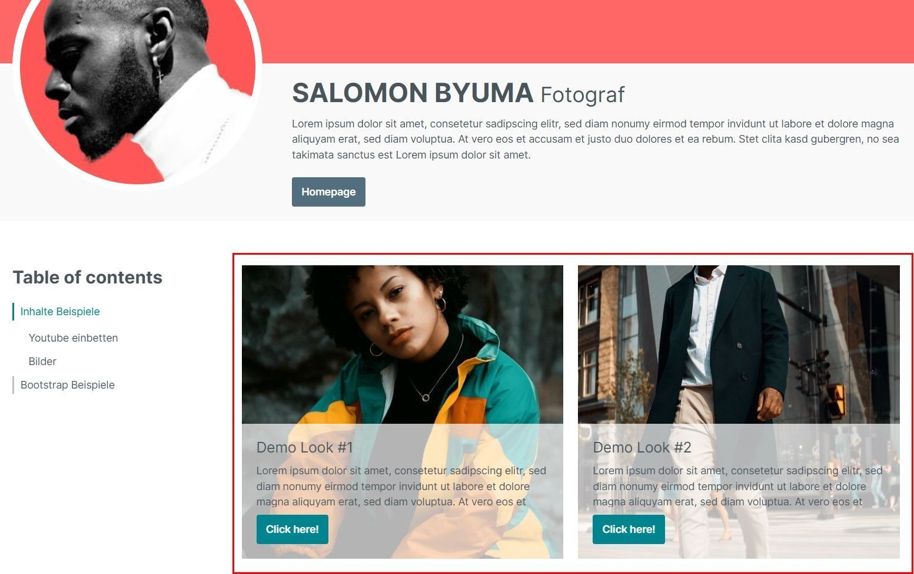

The quick search in Shopware can be deactivated via the settings of the plugin or globally in the Foundation
Plugin can be deactivated.

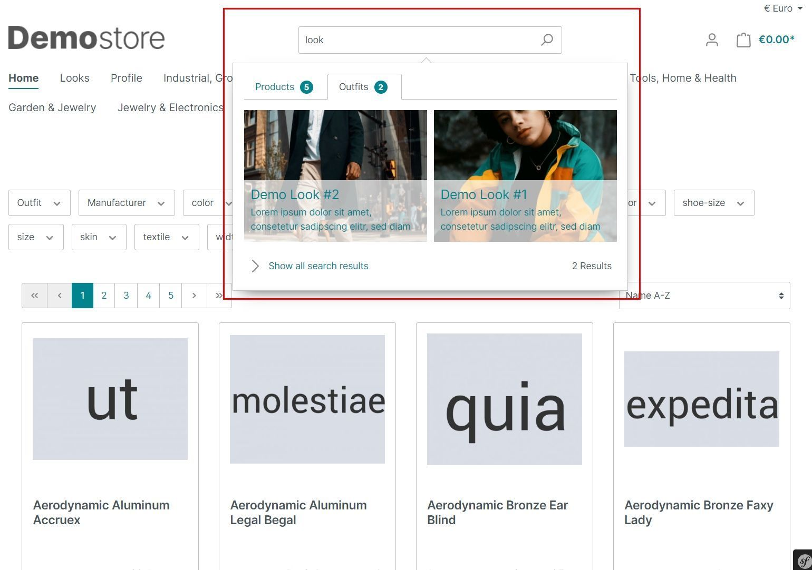

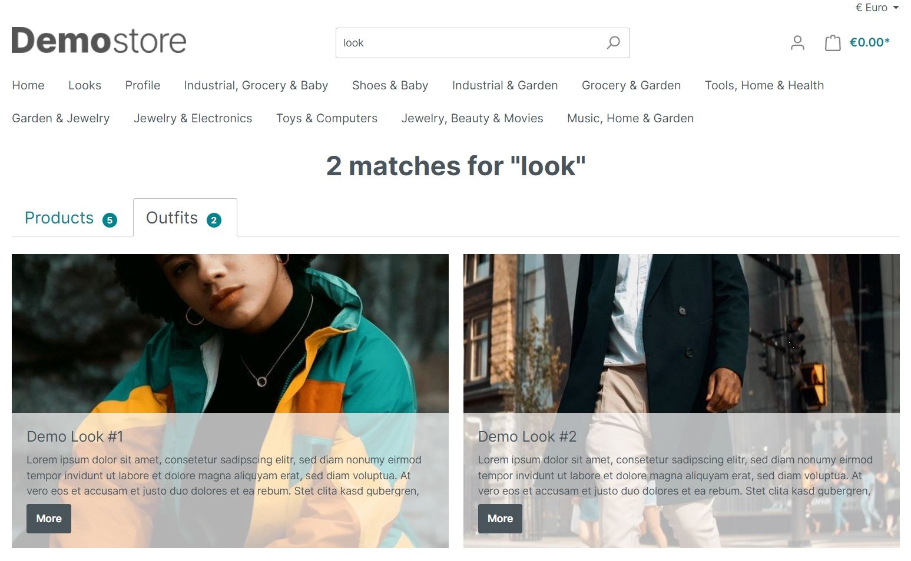

The detail page of the look.

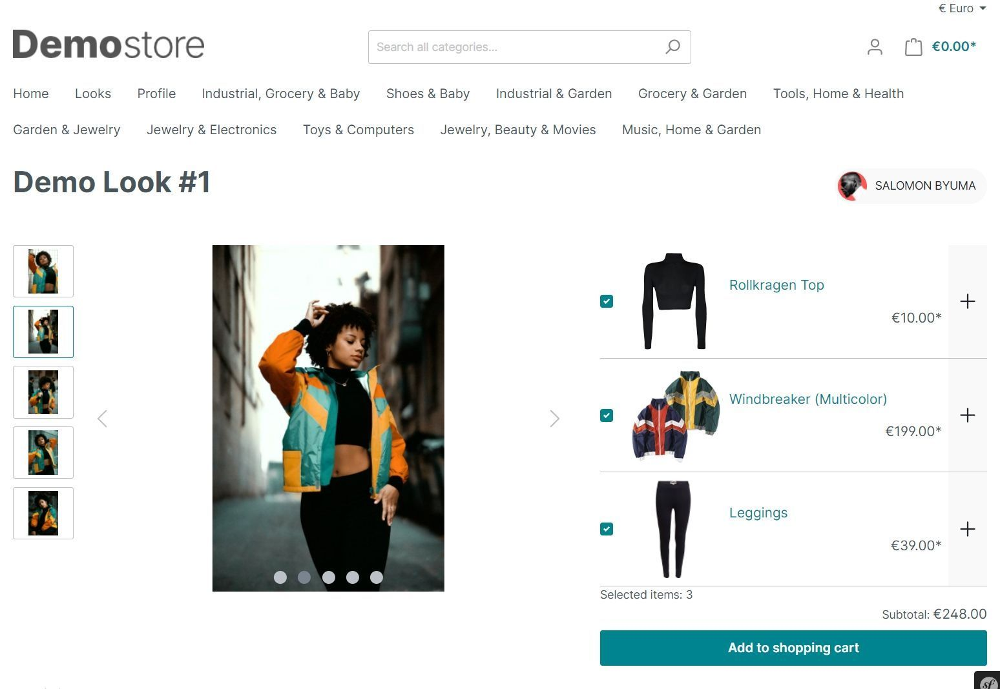

All products can be added to the shopping cart at the same time!

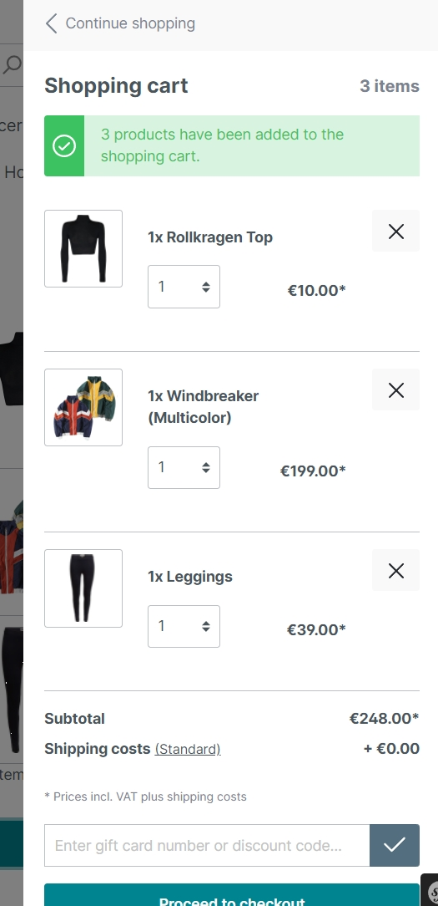
