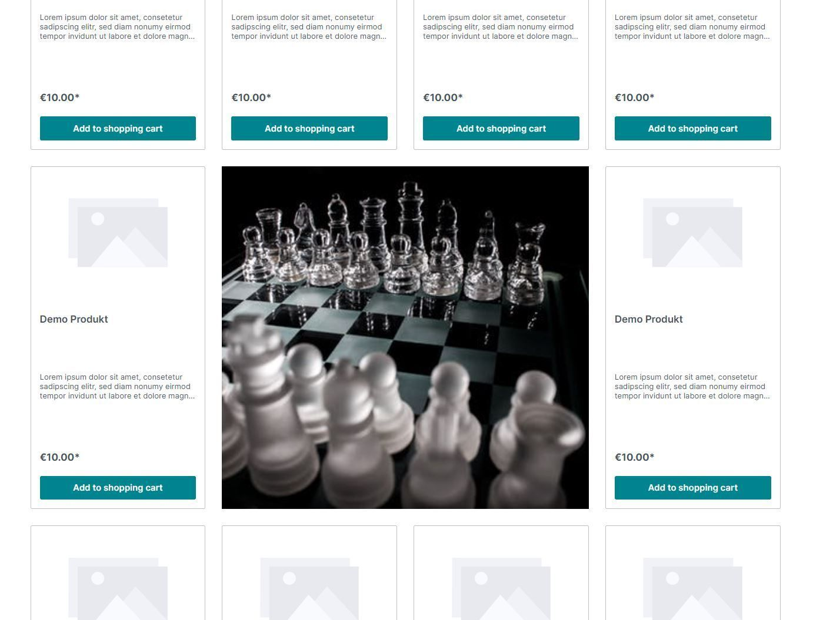
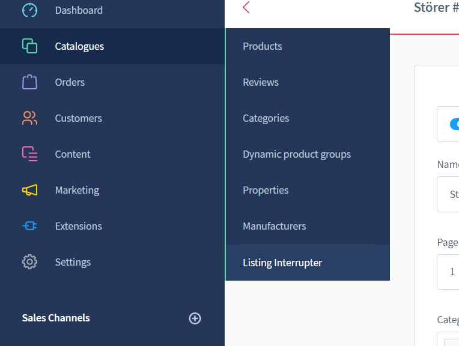
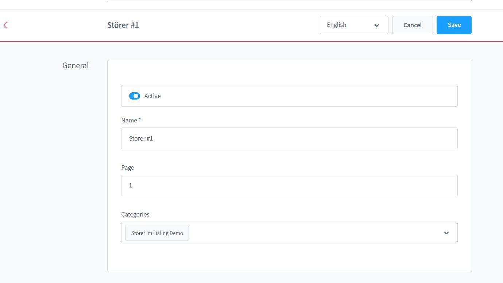
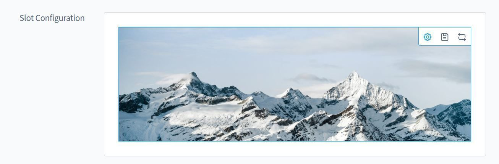
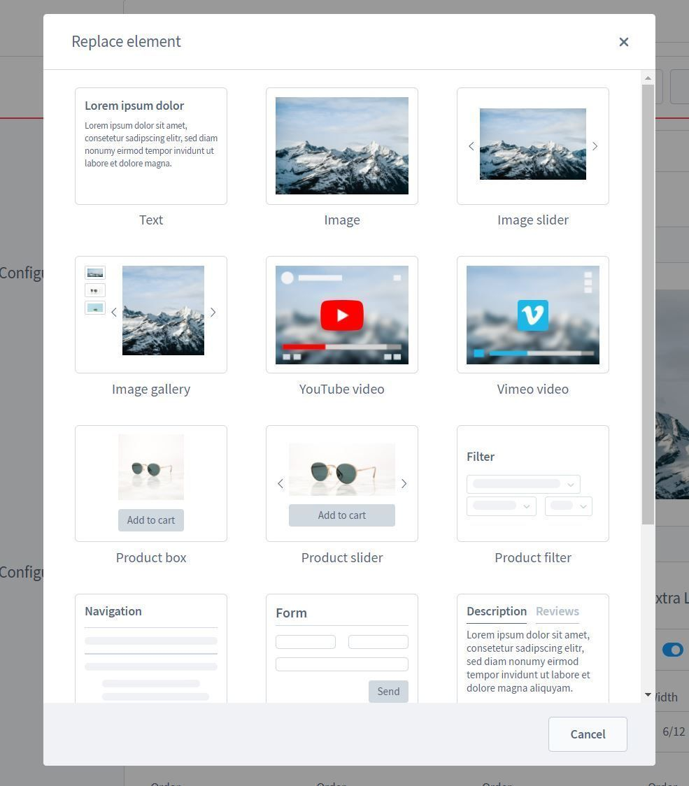
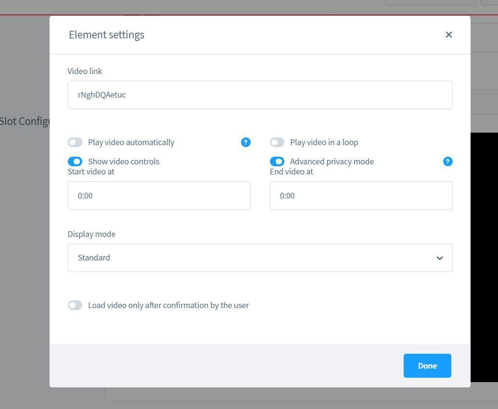
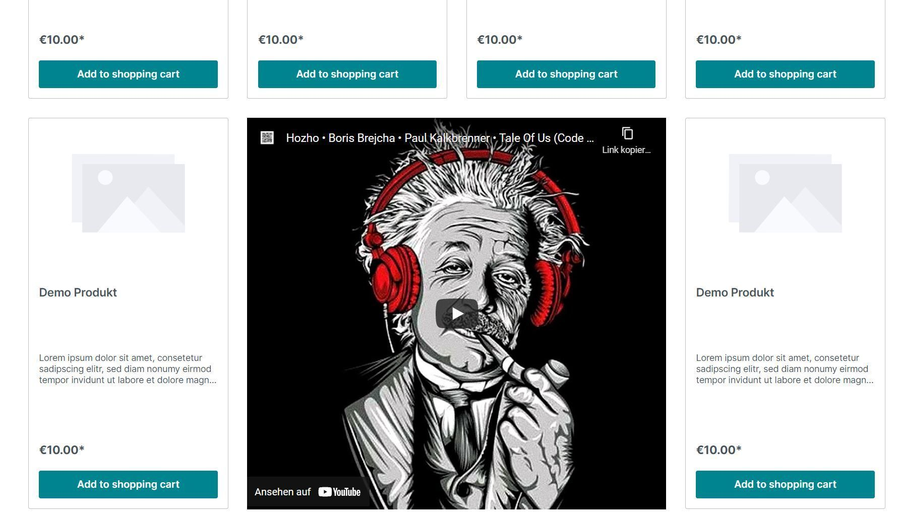
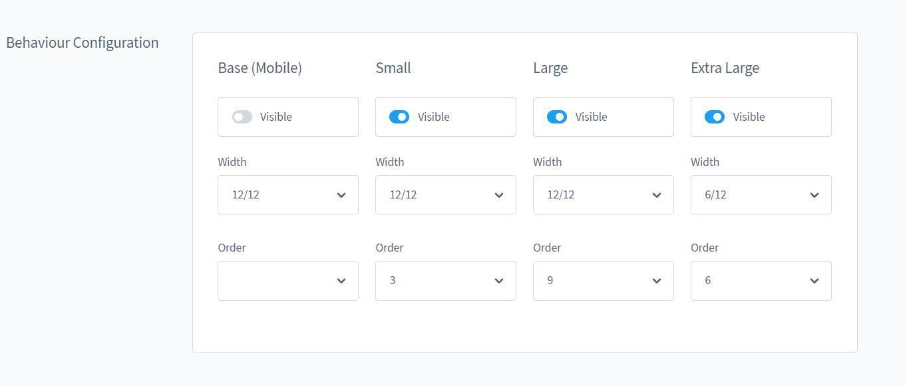
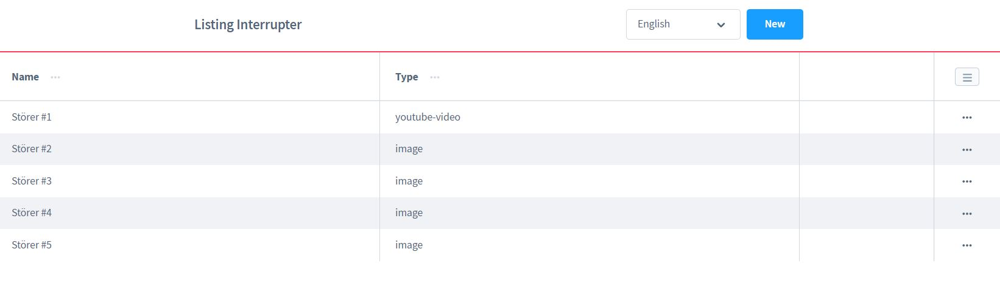

# Listing Störer

[Hier geht's zur Demo](https://demo.moori.net/Stoerer-im-Listing-Demo/)

Mit dieser App kannst Du Dein Produkt Listing mithilfe von CMS Elementen jeglicher Art
aufpeppen. So werden Deine Kunden auf Interessante Aktionen und Hinweise aufmerksam 
gemacht.

_Übrigens: Die App
[Call to Action Banner für Erlebniswelten](../MoorlCmsCtaBanner/index.md)
ist die perfekte Ergänzung._

Gestalte deine Produkt Listings um und untermale somit dein Produktangebot mit 
exklusiven Inhalten. Die Handhabung ist sehr einfach, Du bestimmst auf welcher 
Kategorie Seite und auf welcher Listing Seite dein Störer erscheinen Soll. 
Erstelle deinen Störer aus der CMS Element Bibliothek von Shopware oder aus CMS 
Elementen, die Du durch andere Plugin Hersteller bezogen hast. Stelle ein an 
welcher Stelle im Listing, welche Breite und für welche Viewports dein Störer 
erscheinen soll.

Mit dieses Plugin erhältst Du auch wieder ein fertiges Demopaket. 
Du kannst dieses Demo Paket über "Einstellungen | Plugins | Demo Assistent" finden 
und Installieren. 

## Installation

1.  Installiere
    [Foundation](../MoorlFoundation/index.md)
   
2.  Optional: In dieser App ist ein
    [Demo Paket](../MoorlFoundation/demo-assistant.md)
    Enthalten.

Du gelangst über den Menüpunkt "Kataloge > Listing Störer" zur App.

Hier kannst du anschließend einen Namen vergeben und die Seiten-Position bestimmen.
Wähle die Kategorien aus, in denen der Störer angezeigt werden soll.

Nach dem ersten Speichern kannst du nun den CMS Slot bearbeiten.
Diese ist identischen zu den CMS Elementen in den Erlebniswelten.

Wähle nun eine Element aus deinen CMS Elementen aus. Sofern du bereits
Elemente konfiguriert hast, kannst du diese mit dem Replacer laden.

Nun kannst du das Element nach deinen Wünschen konfigurieren. In diesem Beispiel
möchten wir ein Youtube-Video im Listing einbinden.

Ein kurzer Test bestätigt, dass das Element im Listing angezeigt wird.

_Achtung: Bitte beachte, dass du bei einer Änderung den Shop-Cache leeren musst._

In der Verhaltenskonfiguration kannst du bestimmen auf welchen Endgeräten der Störer
angezeigt wird, welche Breite dieser hat und an welcher Position er angezeigt werden
soll. Die Breite wird durch das Bootstrap Grid System bestimmt. Wir empfehlen bei 
kleinen Geräten immer die volle Breite (12/12) zu nutzen.

Du hast weitere Fragen, Anregungen oder Vorschläge? Bitte nutze dazu den folgenden
Kommentar Bereich.