# Öffentliche Profile | Magazine Add-On

Mit diesem Add-On für [Öffentliche Profile](../MoorlCreator/index.md) steht dir ein mächtiges Werkzeug für individuelle Blog-Erstellung und Content-Marketing zur Verfügung.

[Hier geht's zur Demo](https://demo.moori.net/Magazine-Demo/)

## Wofür ist dieses Plugin gut?

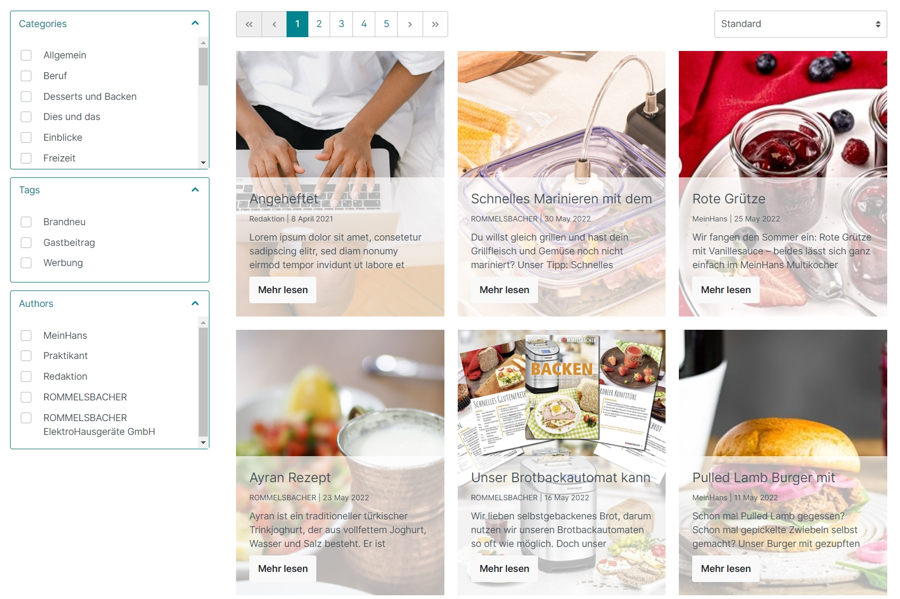

Dieses Plugin ist für Shopbetreiber geeignet, die Ihre Kunden regelmäßig mit Neuigkeiten versorgen möchten. Aber auch um eine bessere Sichtbarkeit im Web zu erzielen und ein besseres Ranking in Suchmaschinen zu erhalten. SEO und Inhalte sind zu dieser Zeit essenziell für ein erfolgreiches Online-Business.

Mit dem Magazine Add-On hast du die Möglichkeit deine Inhalte in strukturierter Form in deinem Online-Shop zu präsentieren. Dir stehen eine breitgefächerte Auswahl an CMS Elementen und Features für die optimale Darstellung bereit.

Der WordPress Import sorgt für eine problemlose Migration von Blog-Beiträgen aus deinem WordPress-System. Du kannst deine Inhalte auch aus mehreren Blogs importeren - und das automatisch!

## Installation

!!! note

      Falls du Probleme mit dem Plugin hast, bitte beachte folgende [Hinweise](../) im FAQ Bereich.

1. Installiere [Foundation](../MoorlFoundation/index.md)
2. Installiere [Öffentliche Profile](../MoorlCreator/index.md)
3. Installiere das Magazine Add-On
4. Optional: In dieser App ist ein [Demo Paket](../MoorlFoundation/demo-assistant.md) enthalten.
5. Gehe zu: Inhalte | Magazin

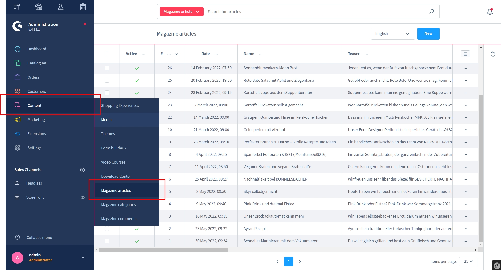

Hier kannst du nun einen neuen Beitrag erstellen.

## Einstellungen

### Basis Konfiguration

In der Basis Konfiguration des Add-Ons kannst du generelle Einstellungen vornehmen.

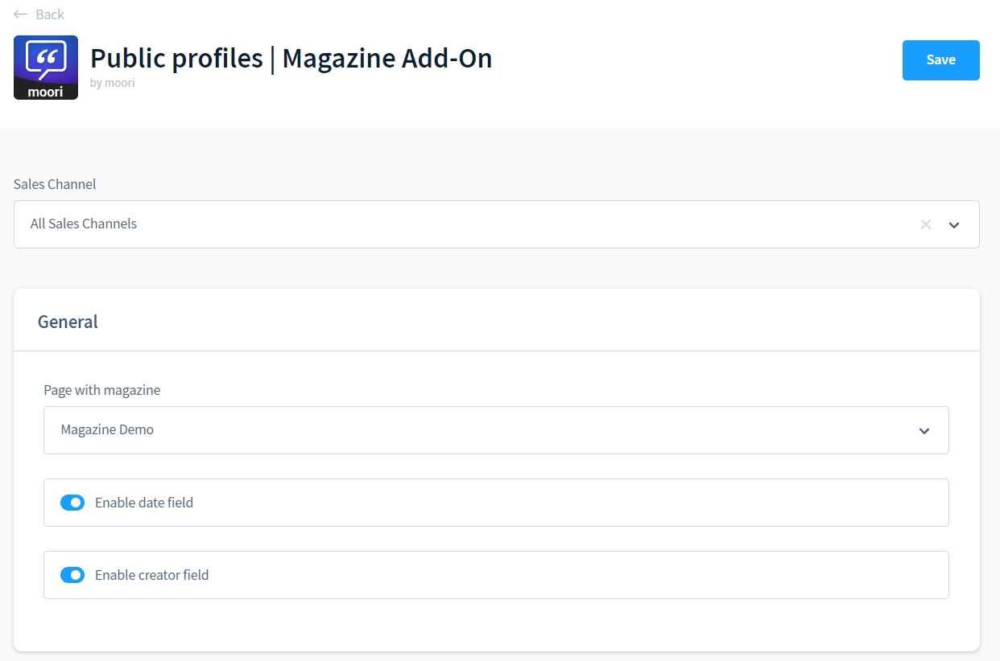

- Hauptseite für alle Beiträge: Damit kann dein Kunde in einem Blog-Beitrag wieder zurück zur Übersicht navigieren
- Datum/Author anzeigen: Zeigt zusätzliche Metadaten in der Übersicht und in der Suche an

Aktiviert die erweiterte Suche für deine Blog-Beiträge.

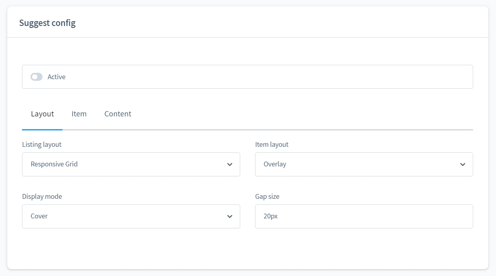

Du kannst hier das Layout der Blog-Beiträge in der Suche beliebig anpassen.

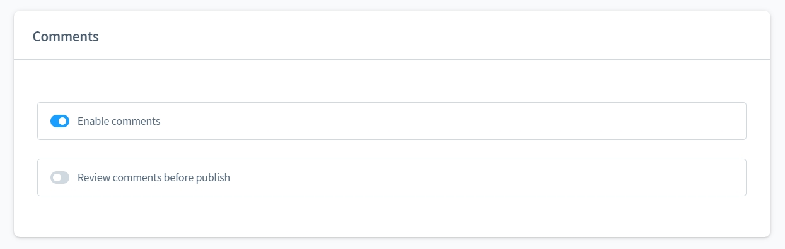

Kommentare können für jeden Beitrag individuell aktiviert/deaktiviert werden. Hier kannst du diese aber auch generell abschalten. Alternativ entfernst du einfach das CMS Element für Kommentare.

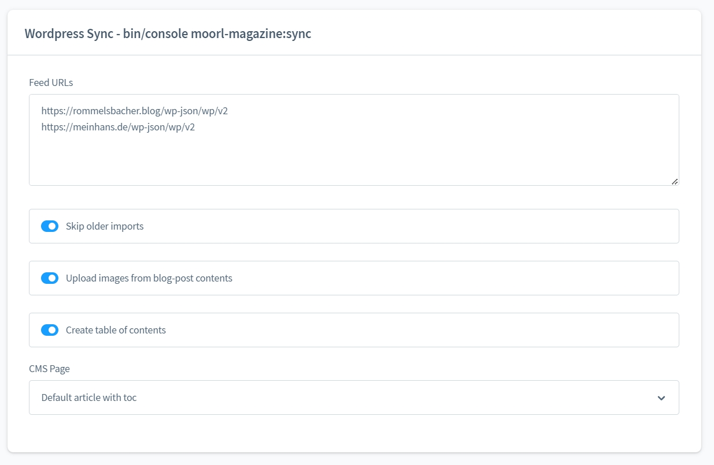

Du kannst hier deine WordPress Feeds konfigurieren. Die Inhalte aus dem WordPress Blog werden automatisch im Hintergrund importiert und synchronisiert.

### Blog Beitrag erstellen

Du kannst Kategorien und Beiträge manuell erstellen.

Klicke in der Liste oben rechts auf "Neu" für einen neuen Beitrag.

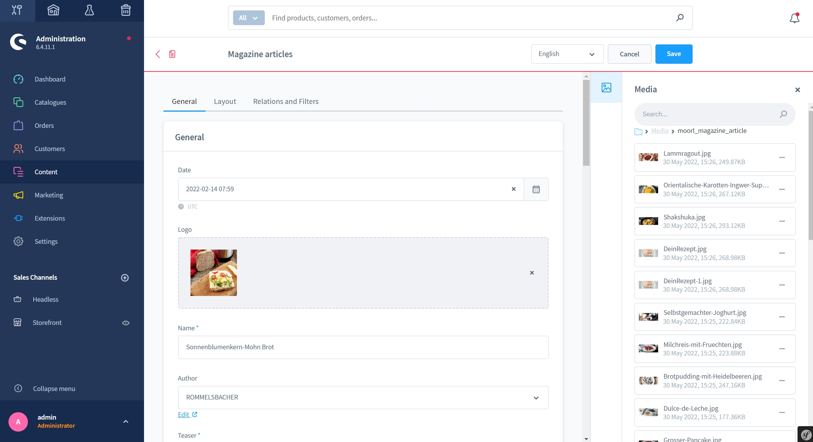

Hier findest du die Konfiguration für deinen Beitrag. Jeder Beitrag benötigt einen Titel, ein Einleitungstext und Inhalt.

Optional kannst du einen Autor aus dem Plugin "Öffentliche Profile" zuweisen.

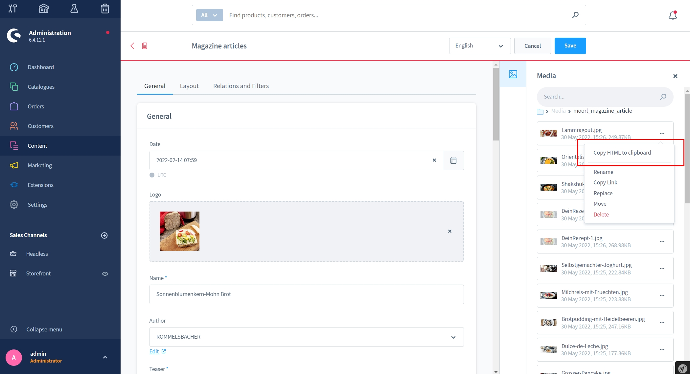

In der Sidebar für Medien, kannst du für deinen Inhaltsbereich fertige IMG-Tags generieren.

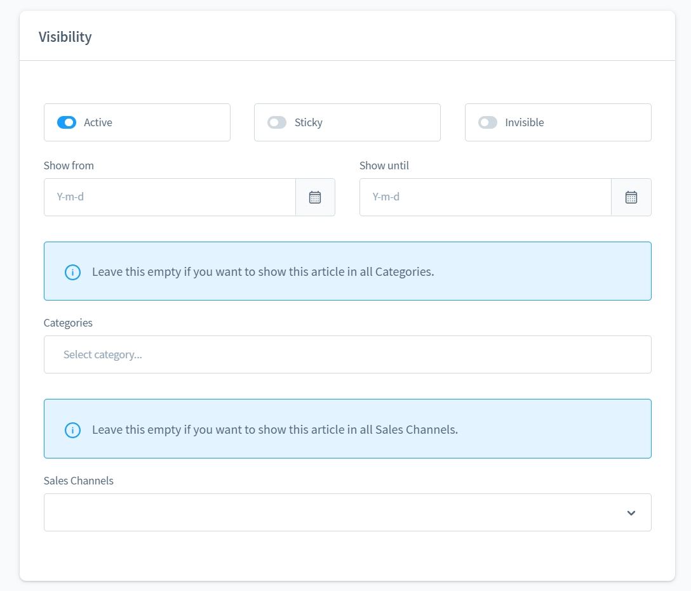

Bestimme die Sichtbarkeit deines Beitrags. Du hast die Möglichkeit deine Beträge anzuheften, dann sind diese immer an erster Stelle gelistet.

Wenn du das Add-On für verschiedene Inhalte nutzt, zum Beispiel Rezepte und allgemeine News, kannst du anhand der Shopware Kategorie, diese voneinander trennen.

Bei mehrfachen Verkaufskanälen kannst du Beitrage nur für bestimmte Kanäle anzeigen lassen.

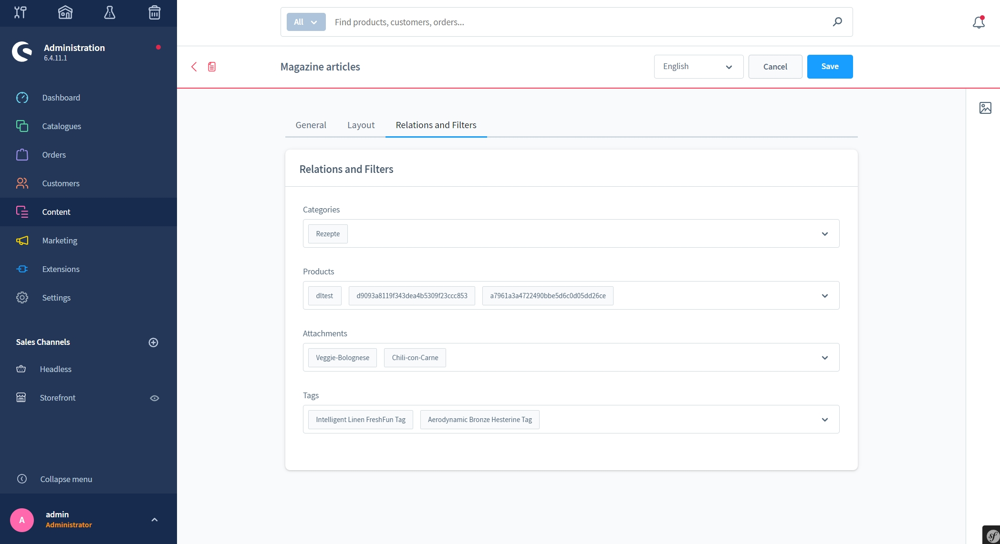

Das Add-On bietet dir die Möglichkeit, Produkte oder Downloads aus deinem Shop direkt im Beitrag anzuzeigen

### CMS Seitenlayout für Blog Beiträge

Für jeden Beitrag kannst du eine CMS Seite für das Layout bestimmen. Es ist auch möglich eine CMS Seite für den Inhalt zu nutzen, ich rate jedoch davon ab, da sich das eventuell negativ auf die Suchmaschinenoptimierung auswirkt.

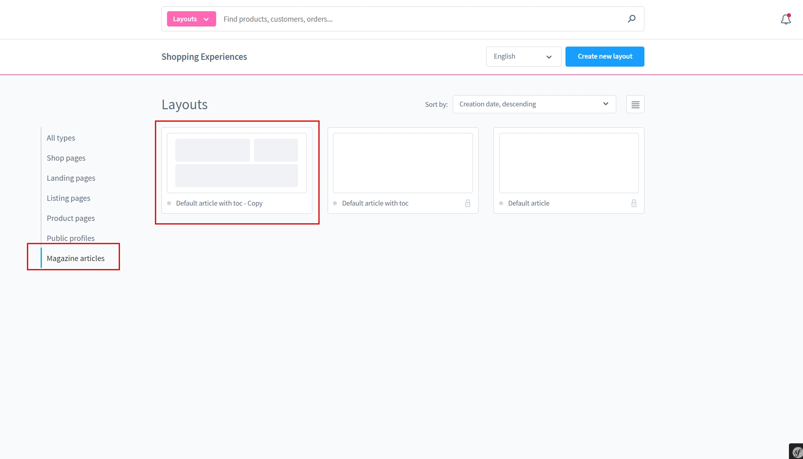

Mit dem Add-On werden zwei Standard-Layouts installiert. Kopiere diese für deine individuellen Anpassungen.

Sofern du schon Beiträge erstellt oder importiert hast, wird der Inhalt auf die CMS Seite übertragen. Es ist durchaus möglich, dass die Darstellung leicht Fehlerhaft ist. Das hängt meist von der Qualität der WordPress Posts ab.

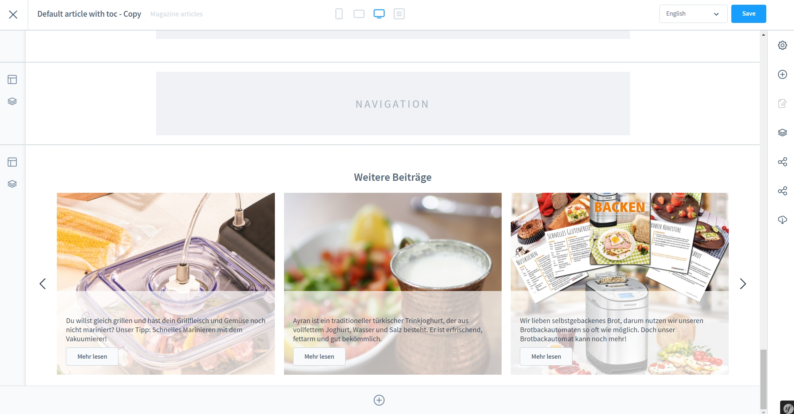

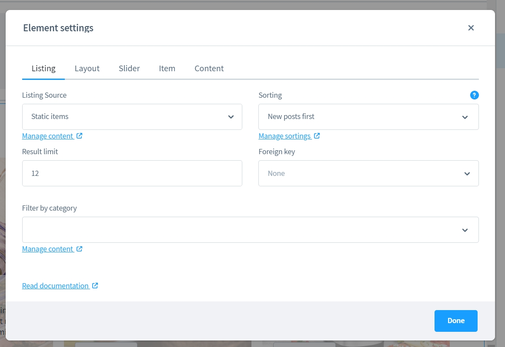

Das [Listing/Slider Element](../MoorlFoundation/listing.md) erlaubt es dir, weitere Beiträge vorzuschlagen.

Folgende Elemente (rot markiert) kannst du auf deiner Beitrags-CMS Seite verwenden.

- Listing/Slider Element
- Meta-Angaben zum Beitrag: Datum, Autor, Tags, Kategorien
- Kommentare
- Vor/Zurück Navigation

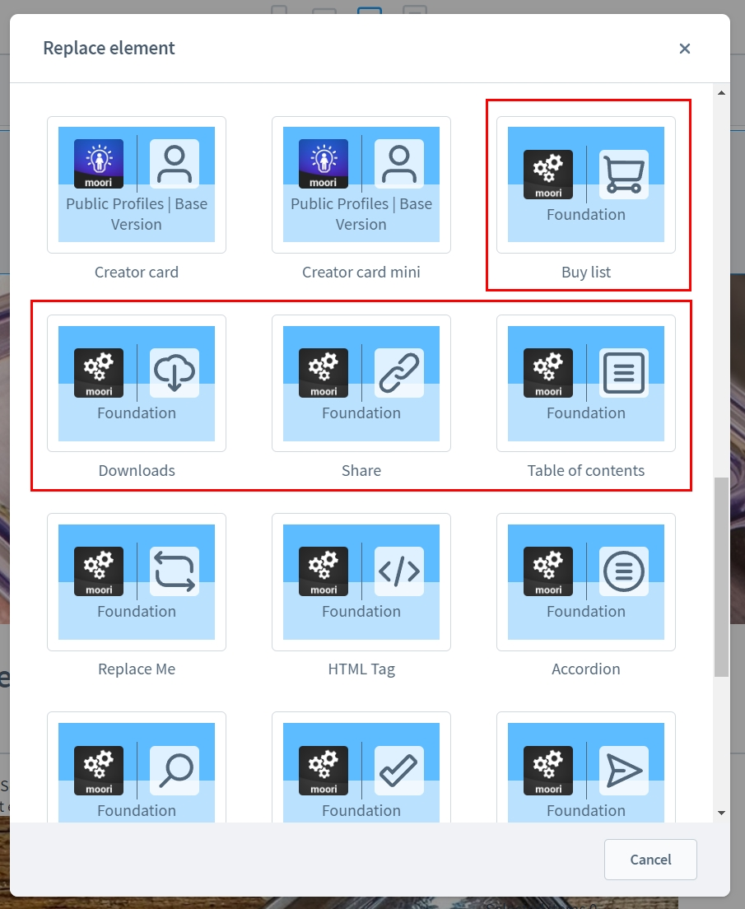

- Produkt/Einkaufsliste
- Downloads
- Teilen-Buttons
- Inhaltsverzeichnis (Table of contents)

### Listing Seite für alle Beiträge

Natürlich darf eine Übersichtsseite für alle Beiträge nicht fehlen. Das Add-On orientiert sich stark an das Produkt-Listing aus Shopware.

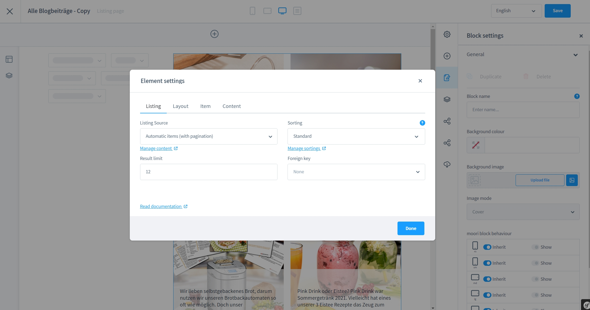

Hier kannst du eine Sidebar-Sektion nutzen, links platzierst du das CMS Element "Produkt Filter". In dem Hauptbereich das [Listing/Slider Element](../MoorlFoundation/listing.md).

### Sonstige Einstellungen

Mit dem Add-On kannst du die Templates für die SEO-Urls anpassen.

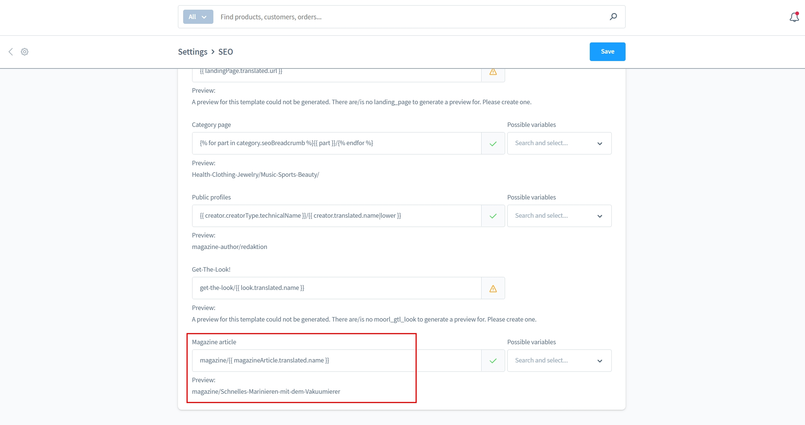

!!! note

      Die Einstellung setzt sich zurück, sobald du das Plugin deaktiverst und wieder aktivierst. In diesem Falle muss die SEO-Url Einstellung erneut durchgeführt werden!

## WordPress Sync

Mit dem WordPress Import kannst du die Blog-Beiträge deines Shops automatisch auf dem neuesten Stand halten!

Dazu benötigst du den Link zu deiner WordPress API. Sofern deine Beiträge gut strukturiert sind, kannst du die Erstellung für das Inhaltsverzeichnis aktiveren und die CMS Seite mit Inhaltsverzeichnis zuweisen!

Über den Scheduled-Task werden nun alle Beiträge, Kategorien und Kommentare automatisch in dein Shop übertragen! 

Du benötigst für den automatischen Import eine ausreichende PHP Konfiguration. Der Wert `max_execution_time` in PHP sollte bei 600 Sekunden liegen.

!!! note

      Der Import ist is mit der API Schnittstelle "V2" von WordPress kompatibel. Blog-Beiträge mit Page-Buildern (z.B. Elementor) werden nicht unterstützt - auch in Zukunft nicht.

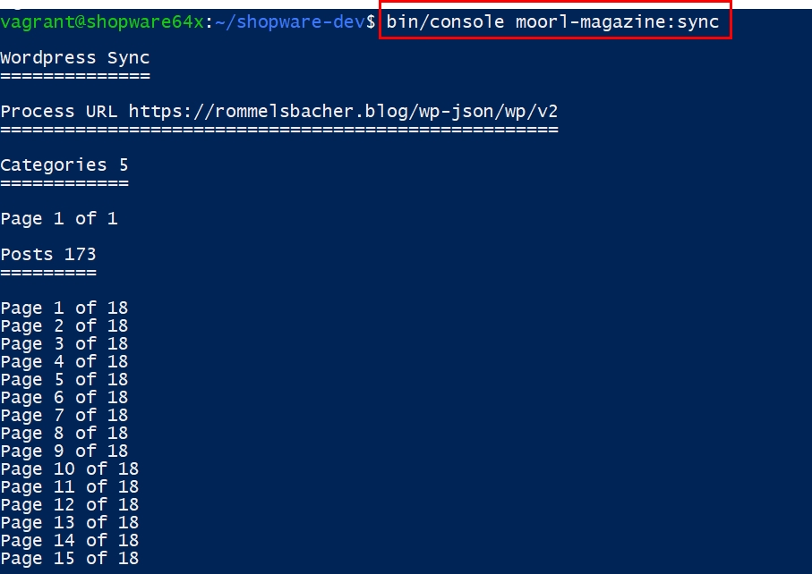

Alternativ kannst du den Scheduled-Task deaktivieren und lässt den Import via CLI oder Cronjob laufen, das lohnt sich z.B. wenn du sehr viele Beiträge hast und diese initial übertragen möchtest.

Verwende den Befehl `bin/console moorl-magazine:snyc`.

## Storefront Ansicht

### Beispiel Blog-Beitrag

Hier wird ein Standard Layout des Add-Ons genutzt.

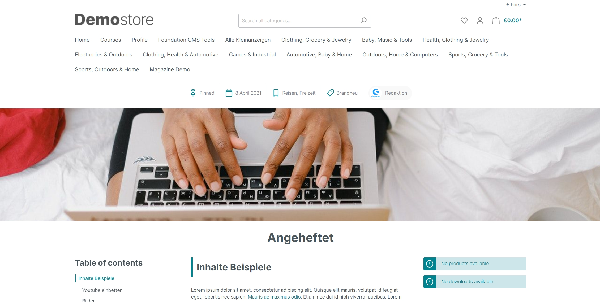

1. Meta-Angaben
2. Banner
3. 3-Spalten Sektion für Inhaltsverzeichnis, Inhalt und sonstige Elemente

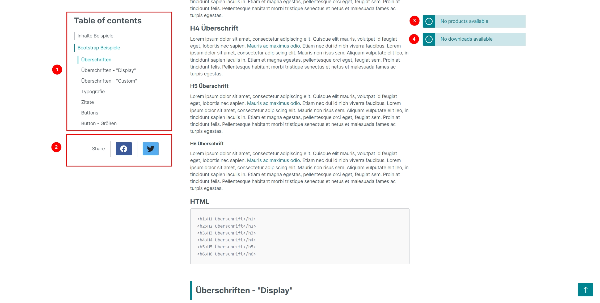

1. Inahltsverzeichnis (Table of contents)
2. Share-Buttons
3. Downloads (leer)
4. Einkaufsliste (leer)

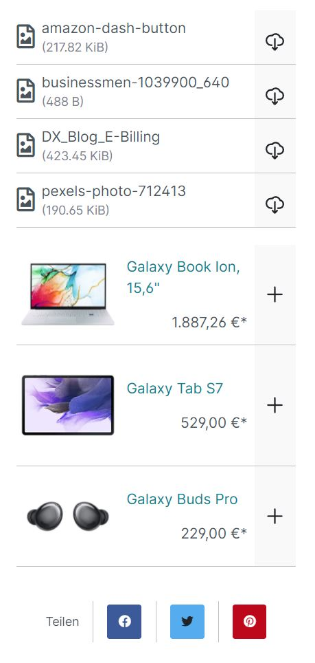

Einkaufsliste und Downloads gefüllt.

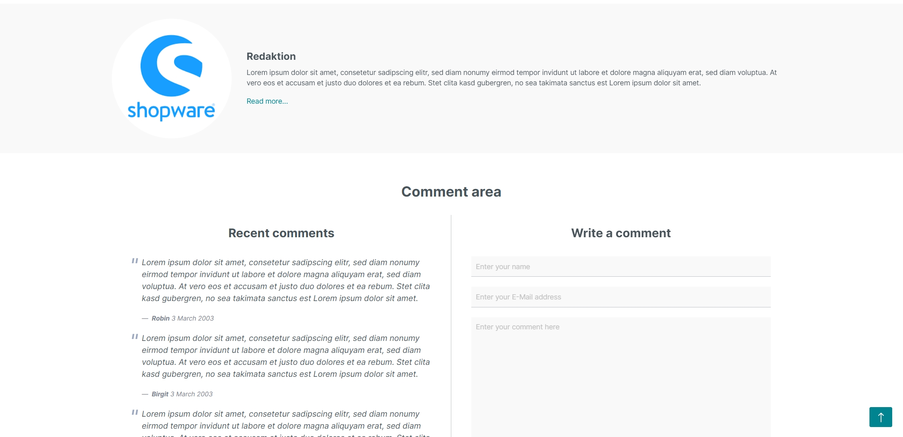

1. Autoreninformationen
2. Kommentarbereich

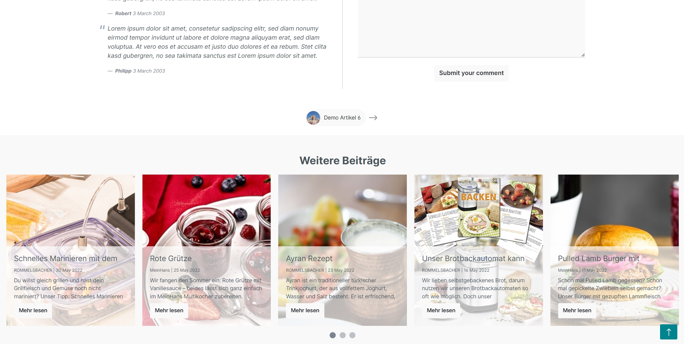

1. Vor/Zurück Naviation
2. Weitere Beiträge

### Beispiel Blog-Autor

Der Slider für Blog-Beiträge kann auch beim Autor eingebunden werden. Hier werden ausschließlich die Beiträge von diesem Autor angezeigt.

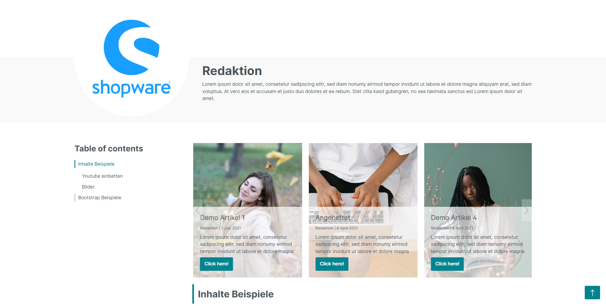

### Beispiel Übersicht

Die Übersicht mit allen Beiträgen, den entsprechenden Filtern, Sortierung und Pagination.

### Beispiel Suche nach Beiträgen

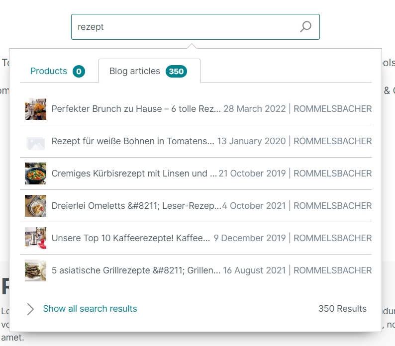

Schnellsuche

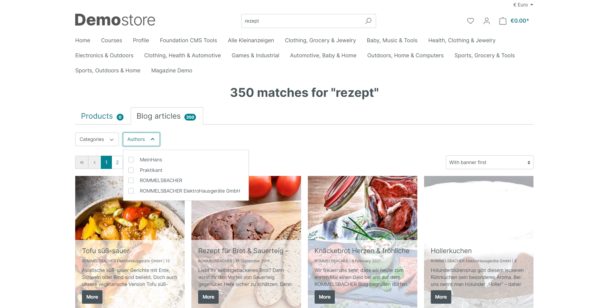

Normale Suche