# Store Locator | Basic Version

Displays dealers, sales outlets and other locations on your shop pages. OpenStreetMap serves as the basis and can be fully customised.

## Configuration

This plugin uses the basic functions of the moori Foundation plugin:

- Open Street Map
- Map Marker
- Import and Export

Configuration instructions can be found [here](../MoorlFoundation/index.md).

## Under construction

This page is currently under construction, please check back later or contact me.

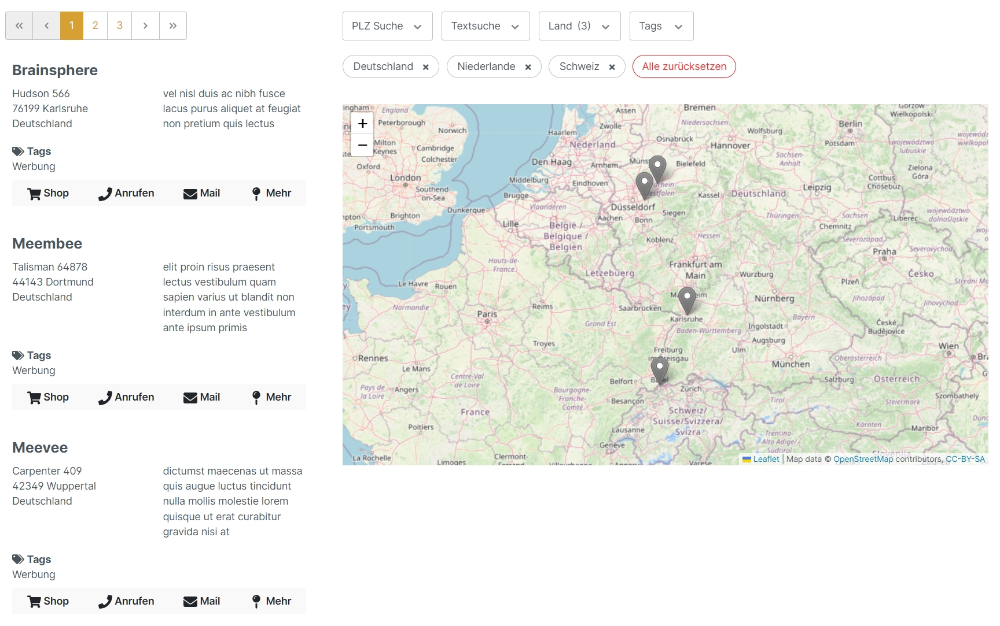

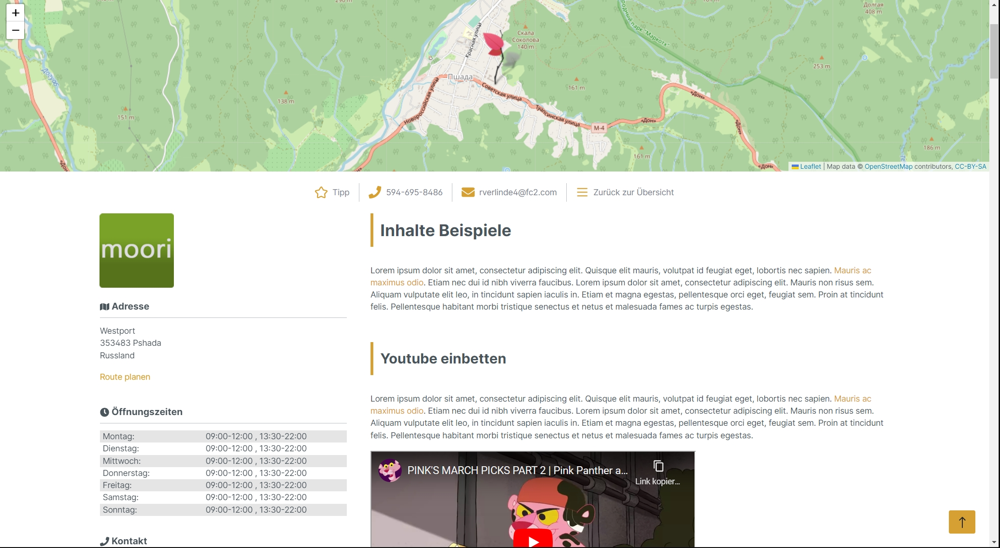

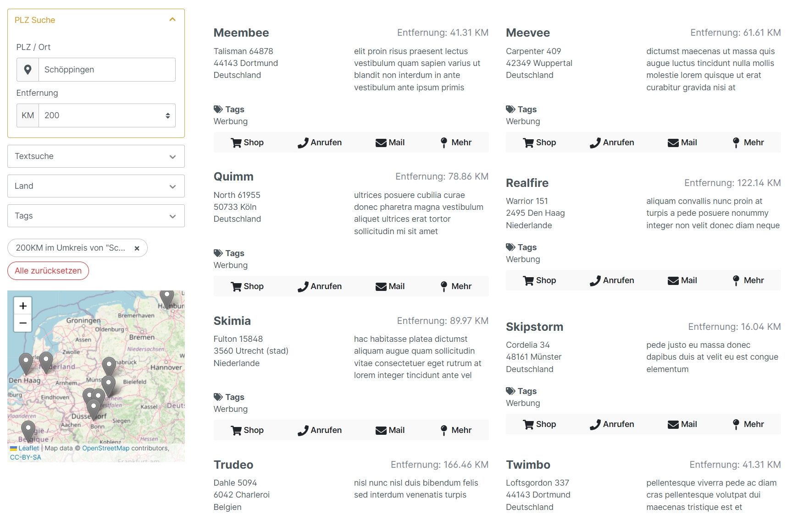

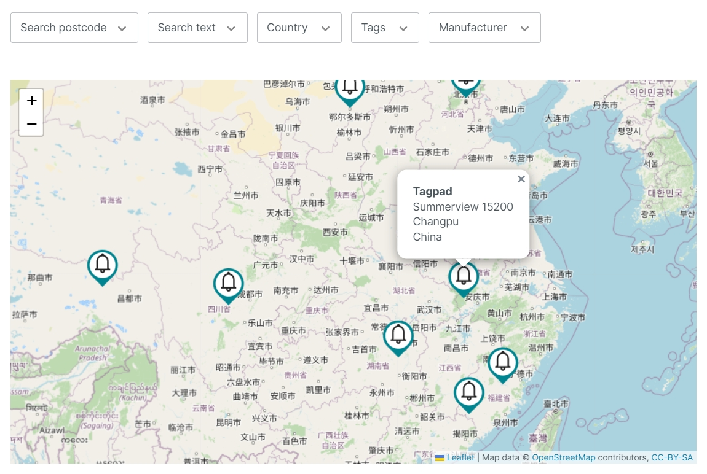

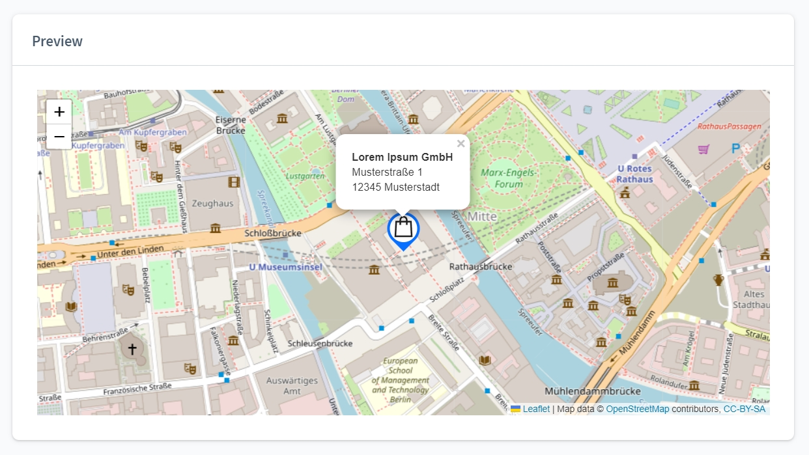

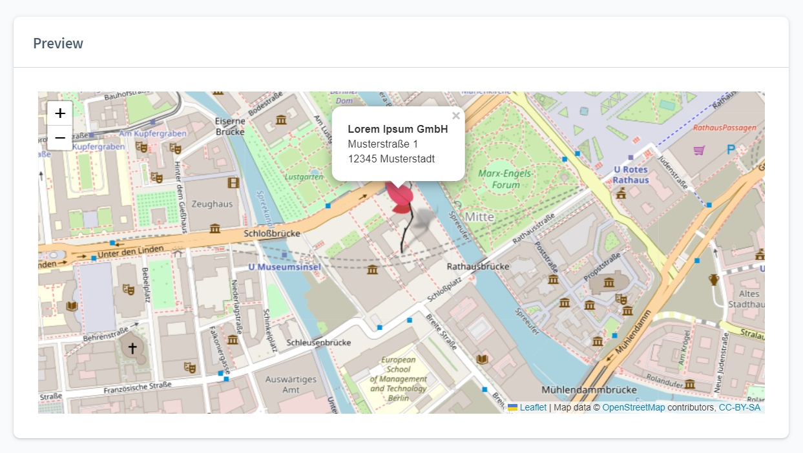

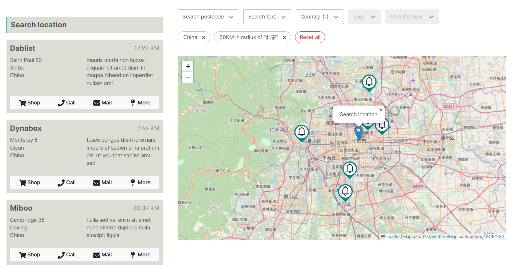

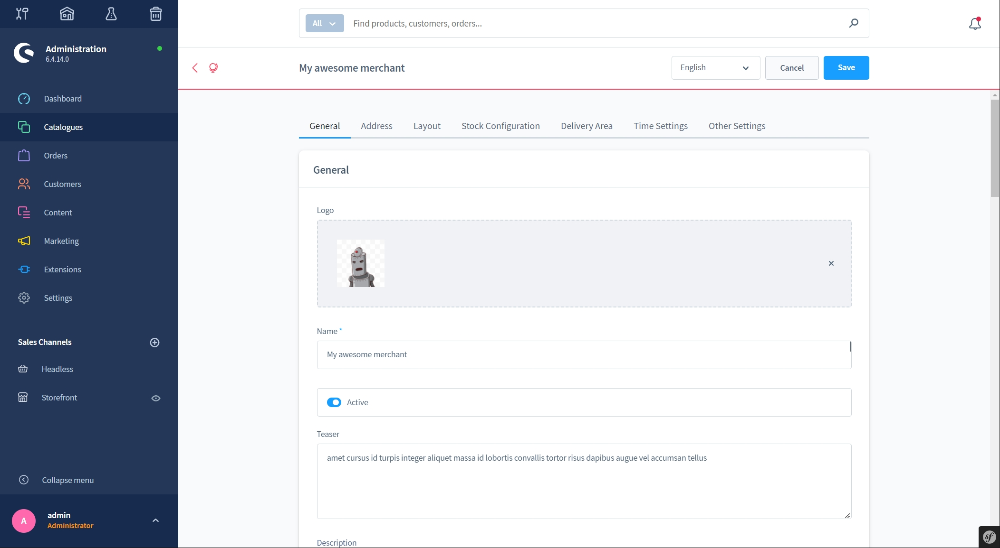

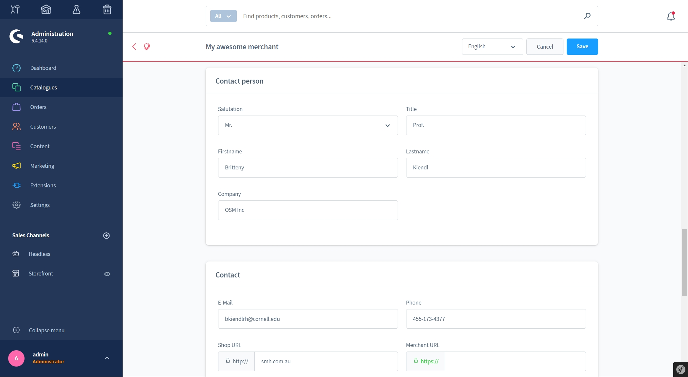

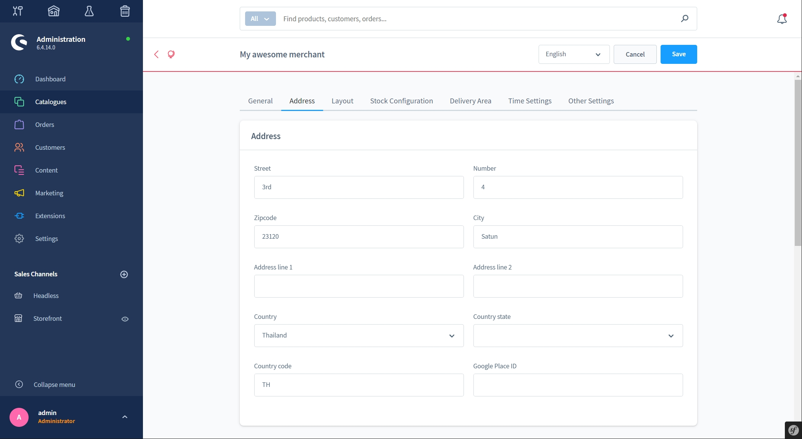

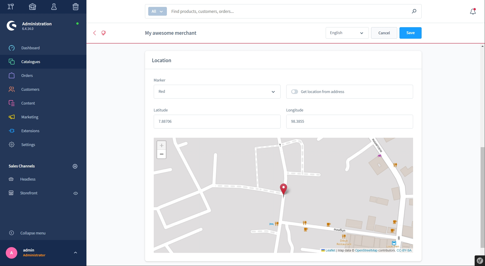

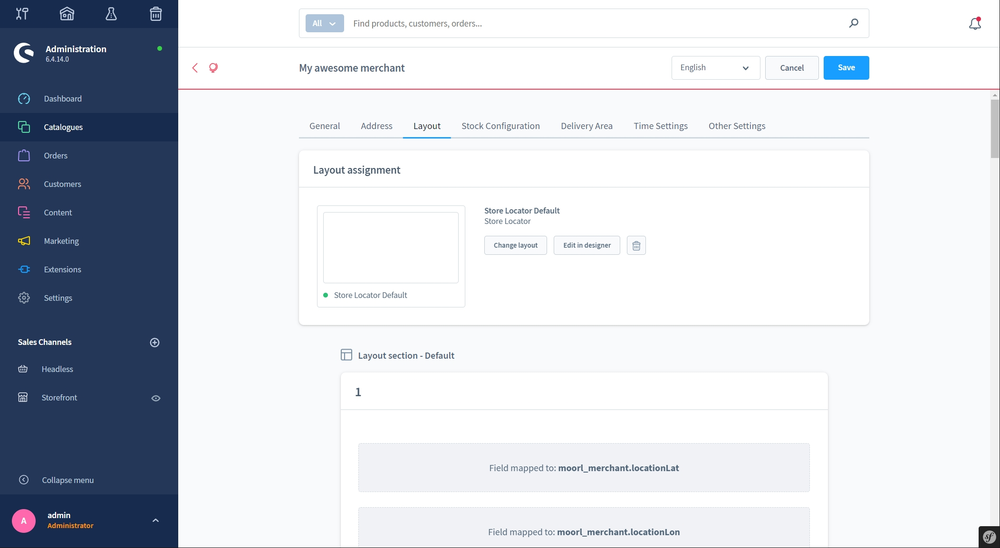

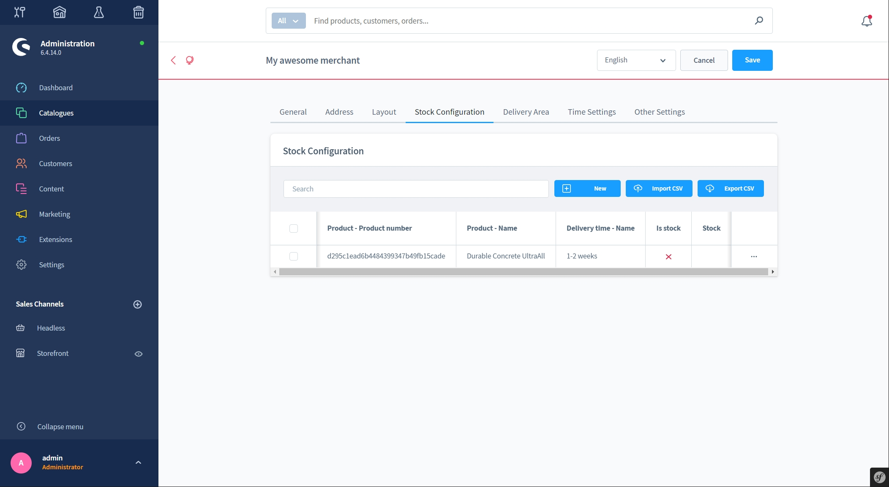

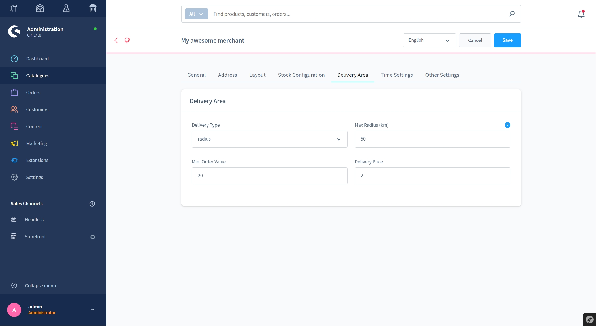

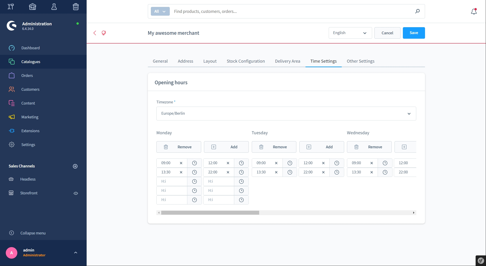

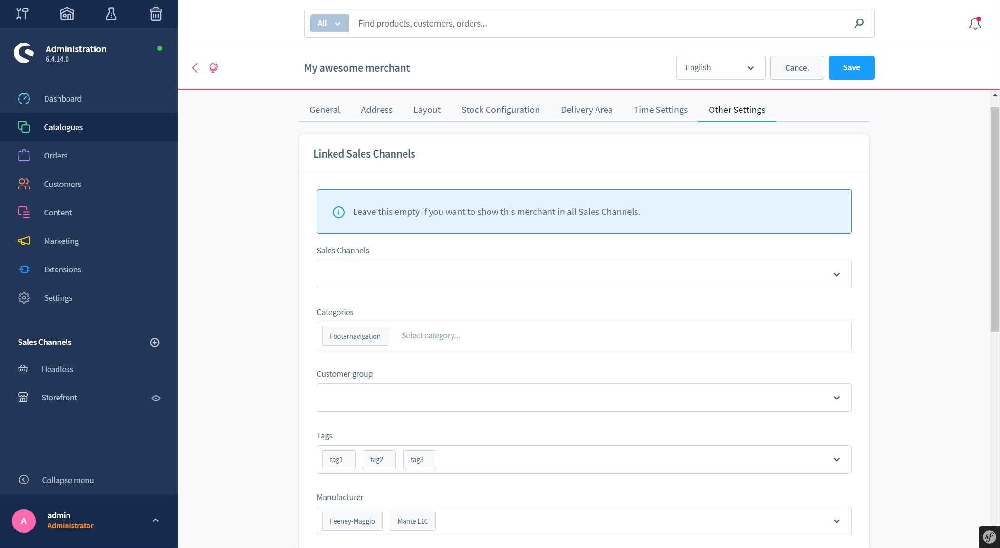

Translated with www.DeepL.com/Translator (free version)