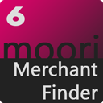

# Händlersuche | Basis Version

_Hinweis: Dieses Plugin benötigt die aktuelle Version des [Foundation / Basis Plugin](../MoorlFoundation/index.md)._

[Hier geht's zur Demo](https://demo.moori.net/Zubehoer-Finder-Demo/)

---

Dieses Plugin umfasst die Grundfunktionen für eine Händlersuche. 
Du kannst einen beliebigen CSV Export einbinden und mit Hilfe des 
Import Assistenten ergänzen. Durch die OpenStreetMap API kannst du 
die Positionen für die Karte beim Import berechnen lassen. Diese 
API erfordert keinen Schlüssel, wie zum Beispiel Google Maps.

Der Storefront-Controller wurde in der Version 1.1.0 entfernt, 
die Einrichtung geht jetzt ausschließlich nur über die Erlebniswelten.

Geplante Updates für die nächsten 6 Monate (nach Priorität sortiert):

1. Twig Blöcke in den Templates anlegen
2. Import / Export inlusive Tags, Hersteller und Kategorien
3. Einbinden von eigenen Map-Tiles - siehe: https://leaflet-extras.github.io/leaflet-providers/preview/
4. Popup mit Kontaktformular um dem Händler direkt via E-Mail zu Kontaktieren
5. Anlegen und Verknüpfen von CMS Seiten für Händler
6. Bessere Usability für die Vollbild-Händlersuche
7. Zwei weitere Designs und Farbschemen

### Highlights

- OpenStreetMap auf der Shopseite
- Import Assistent
- Umkreissuche anhand der PLZ oder der Stadt
- Verschiedene Styles und Vollbild-Händlersuche
- Extra Filtermöglichkeiten: Tags, Kategorien und Hersteller

### Features

- Erlebniswelten Elemente
- Hersteller Logos für jeden Händler im Frontend sichtbar
- Smoothe Zoom Effekte und Automatisches Scrollen zum ausgewählten Händler
- Standard Design passt sich dem Shopdesign an
- Umkreissuche mit Angabe der Entfernung
- Erleichterte Einrichtung dank Demo Daten