# Händlersuche | Installation

## Installation

### Vorbereitung

Bitte bereiten Sie sich auf die Installation gut vor und beachten Sie folgende Schritte:
1. Machen Sie ein Backup Ihres Systems
2. Installieren Sie aktuellste Version von 'moori Foundation', dieses Plugin beinhaltet grundlegende Funktionen
3. Installieren Sie nun das Plugin

### Erste Einstellungen

Sobald Sie das Plugin installiert und aktiviert haben, gehen Sie zu aller erst in die 
Hauptkonfiguration und setzen Sie nötigen Einstellungen.

Sobald bekannt ist, auf welcher Kategorie Seite die Händlersuche aktiv ist,
legen Sie diese hier fest.

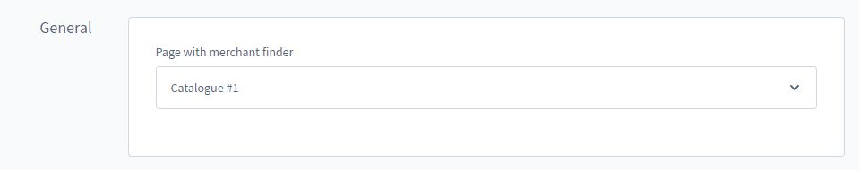

Diese Einstellungen können Sie optional anpassen.

1. Suchparameter in URL übergeben: Die Suchparameter können zu dem Link hinzugefügt werden,
so ist es beispielsweise möglich GET Variablen von externen Formularen zu übergeben (PLZ Suche im Footer Bereich etc.)
2. Länder filtern: Legen Sie fest, in welchen Ländern sich Ihre Händler aufhalten. So werden zum Beispiel
Ergebnisse aus den USA etc ausgeschlossen.
3. Suchmaschine: Diese Suchmaschine wird für die Koordinaten Ermittlung verwendet, lassen Sie 
dieses Feld einfach frei.
4. Anbieter für Tile Layers + Copyright: Hier können Sie spezielle Anbieter hinterlegen,
Beispiele finden Sie [hier](https://leaflet-extras.github.io/leaflet-providers/preview/)

### Eigene Marker Icons für Ihr Sales Channel anlegen

Sie haben die Möglichkeit Ihre eigenen Marker zu erstellen, hierfür gibt es ein hilfreiches
Beispiel in der [Leaflet Dokumentation](https://leafletjs.com/examples/custom-icons/)

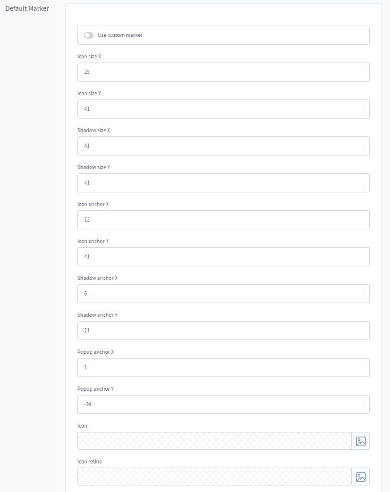

## Händlersuche Konfigurieren

### Öffnen

Sie finden die Liste unter dem Punkt Inhalte > Händlersuche

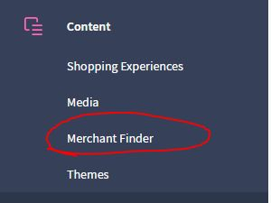

### Händler Liste

Dort finden Sie bereits einige Beispiel Daten, machen Sie ein Export der Daten damit Sie sehen,
wie der CSV Import im Idealfall aussehen könnte.

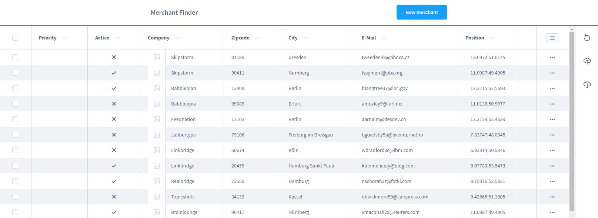

### Import Assistent

Sie können jedes beliebige CSV Importieren, stellen Sie sicher, dass der Import UTF-8 kodiert ist.
Ein Export aus Excel ist in der Regel nicht UTF-8 kodiert.

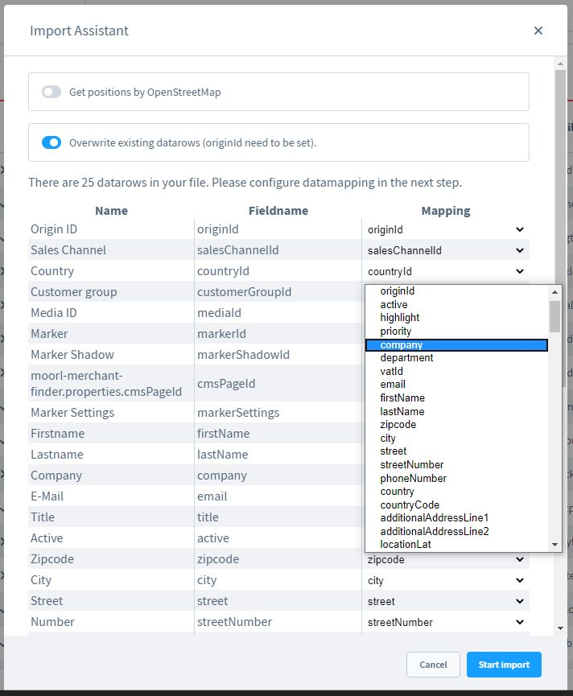

Wählen Sie die Zuweisung von CSV zum gewünschten Feld im Dropdown aus. Setzen Sie einen Haken
bei "Positionen aus OpenStreetMap beziehen" sofern Sie nur die Adressen und keine Koordinaten
verfügbar haben. Ein Import mit Positionen dauert in der Regel drei mal länger als ein normaler
Import.

Sie haben auch die Möglichkeit Standardwerte wie 1, 0, true oder false zu setzen. Es gibt ebenfalls
eine Auswahl für Länder / Sales Channel und Kundengruppen.

Sollte der Import Fehler verursachen, gehen Sie in die Entwickler Konsole (in Chrome: F12 drücken
und in den Tab "Console" gehen).

Sie können den Import beliebig wiederholen, es müssen jedoch IDs vorhanden sein, damit Sie keine
Duplikate anlegen.

### Detailansicht

Klicken Sie auf einen Händler um die Details bearbeiten zu können. Sie haben hier mehrere
Einstellmöglichkeiten.

- Aktiv: An/Aus
- Logo upload
- Priorität: Dieser Wert bestimmt welcher Händler zu erst angezeigt wird, ein hoher Wert
entspricht einer hohen Priorität
- Hervorheben: Der Eintrag des Händlers ist optisch auffällig
- CSM Seite: ID der CMS Seite für extra Inhalte, wird in einem Popup geöffnet
- Sonstige Angaben...

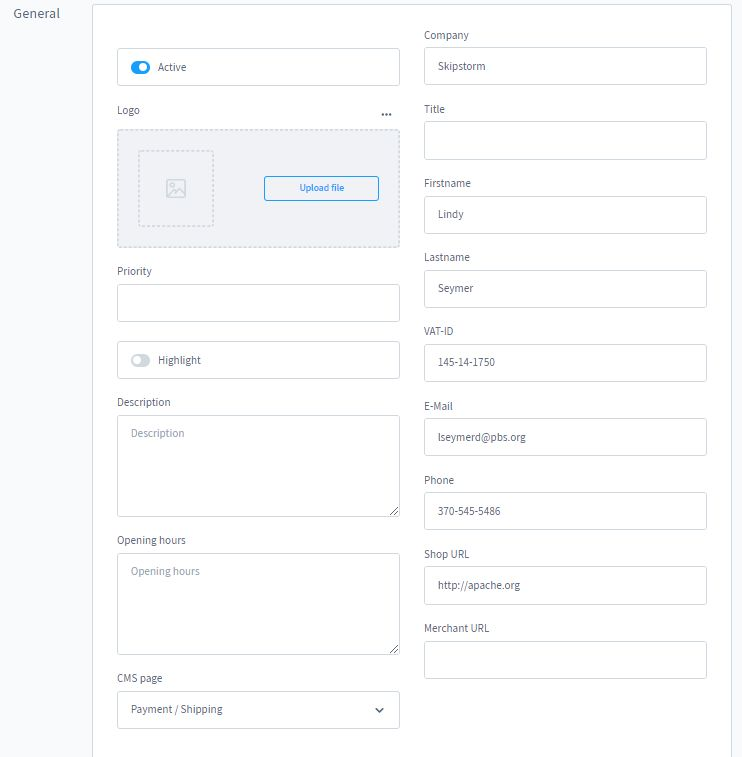

- Sales Channel: Wenn gesetzt dann wird der Händler nur im ausgewählten Sales Channel angezeigt
- Kategorien
- Kundengruppen: Händler wird nur der ausgewählten Kundengruppe angezeigt
- Tags: Händler können nach Tags gefiltert werden
- Hersteller: Händler können nach Herstellern gefiltert werden

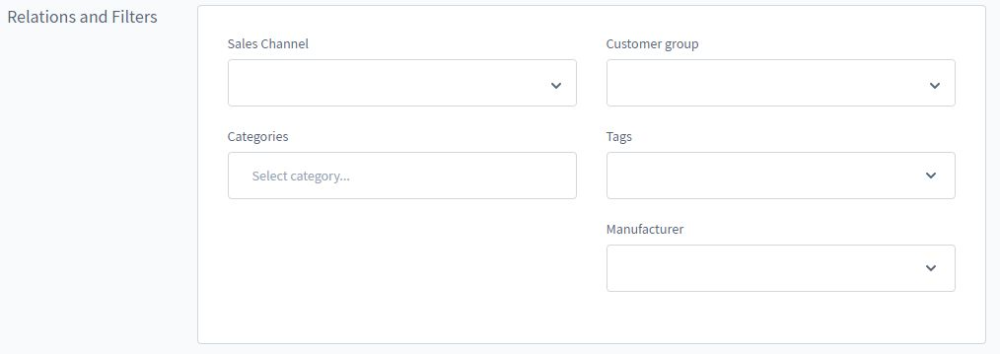

Adressdaten des Händlers

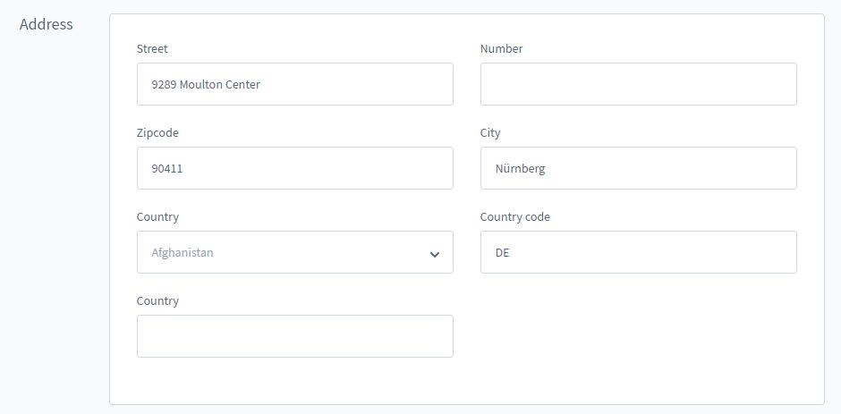

Manuelle Auswahl der Koordinaten

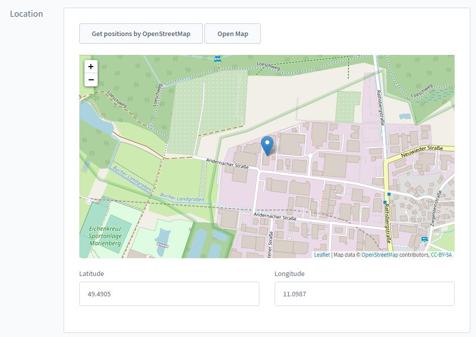

Marker Einstellungen

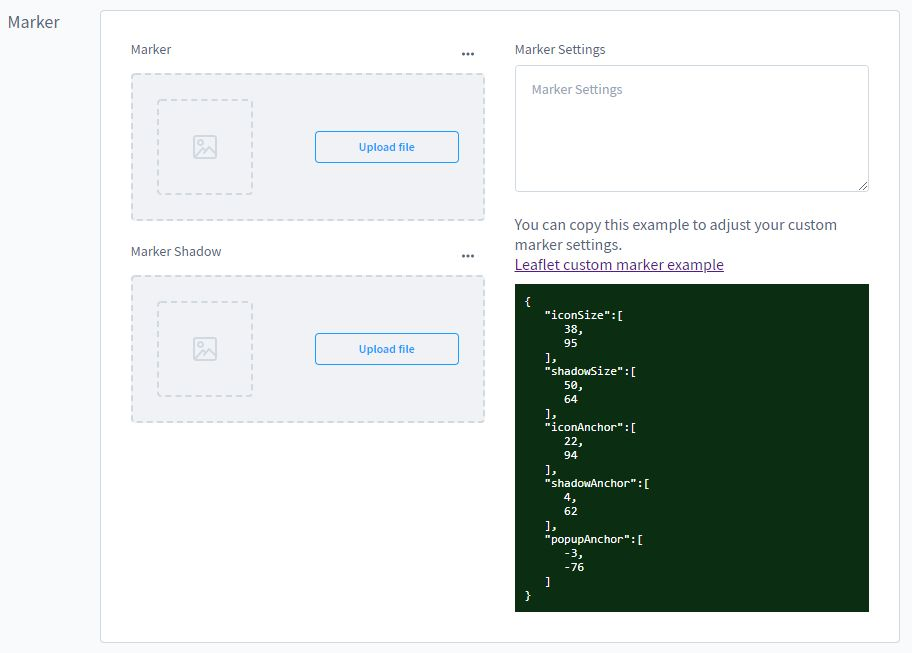

## Einkaufswelten einrichten

Sobald Sie Ihre Händler konfiguriert haben, können Sie Ihre Einkaufswelten einrichten.

Gehen Sie auf den Block "moori Merchant Finder" und ziehen Sie diesen in den Inhalts-
Bereich Ihrer CMS Seite.

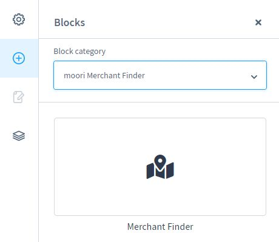

Nun erscheint das Element.

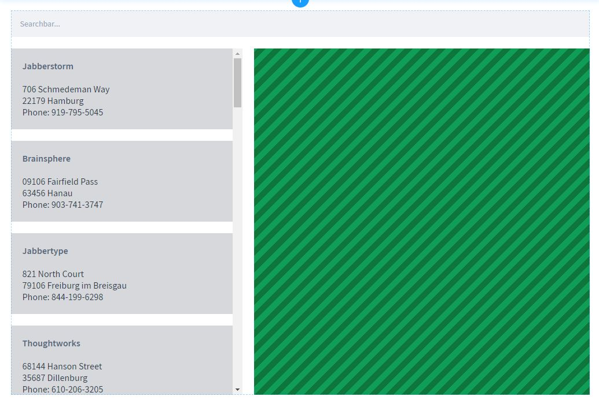

In den Einstellungen können Sie verschiedene Styles für die Ansicht auswählen.
Es lassen Sich auch bei Bedarf vordefinierte Filter einstellen.

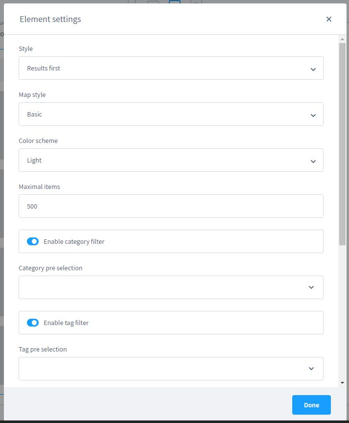

## Kategorie zuordnen

Ordnen Sie nun die CMS Seite mit der Händlersuche einer aktiven Kategorie zu.

Leeren Sie Ihren Browsercache und gehen Sie im Storefront auf die erstellte Kategorie.
Vergessen Sie nicht diese Kategorie in den Plugin-Einstellungen auszuwählen.

## Darstellung

So sollte die Händlersuche im Storefront aussehen.

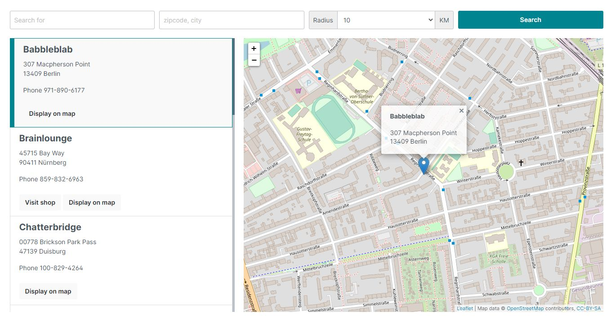

