# Product Add-Ons & Accessories

This plugin for Shopware 6 offers you the possibility to create product and accessory bundles. Within bundles, you can set individual prices for the accessories.

[Click here for the demo](https://demo.moori.net/Demo-PC/MPA001)

## What is this plugin good for?

With this plugin you have the possibility to offer add-ons or accessories for your products.

Add-ons can be grouped by their own categories, so it is possible for the customer to select only one add-on for the offered product.

Accessories without categories are offered as an option to the product. There you can offer services or insurances around the product, for example.

Select the option "Create bundles" in the plug-in configuration to freely determine the prices of the add-ons or accessories, so you have full control over the pricing.

Set products or accessories to sale, so unavailable parts are greyed out and cannot be ordered for the period.

The display of availability can also be determined in the plug-in settings.

## Installation

!!! note

      If you have problems with the plugin, please read the following [notes](../) in the FAQ section.

1. install [Foundation](../MoorlFoundation/index.md)
2. install Product Add-Ons & Accessories
3. optional: In this app there is a [Demo Package](../MoorlFoundation/demo-assistant.md) included.

## Configuration

You can generally find the configuration under the product or category details.

If you want to group your product add-ons, you should first create categories.

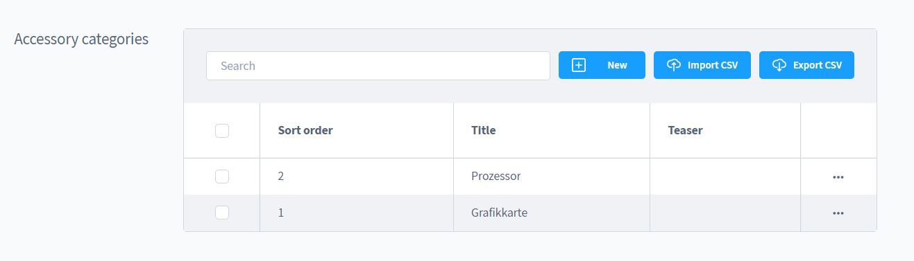

Enter a name and a sort order, the other fields are currently not relevant.

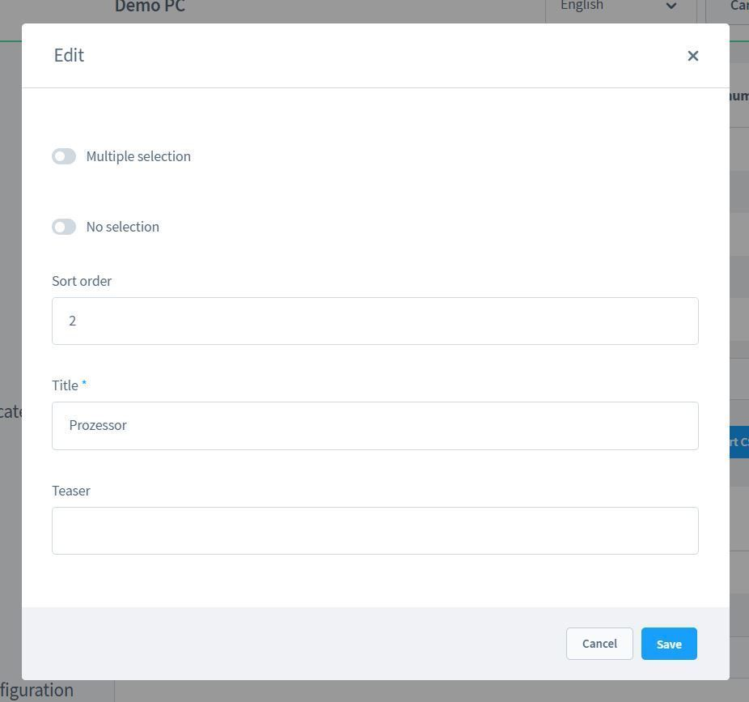

From a technical point of view, the add-ons are not pseudo-products but __real__ products,
when purchasing, the stock levels are updated.

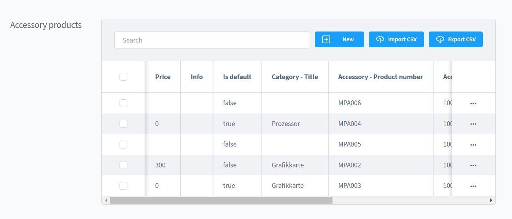

Here you can configure the add-ons/accessory products. You have the following options regarding
the pricing:

- Adjusted price: Yes = price can be defined by yourself, No = standard price of the product.
- Is standard: This option is preselected
- Add-on: The product that can be selected as an add-on
- Category (optional): In this category the selection is categorised

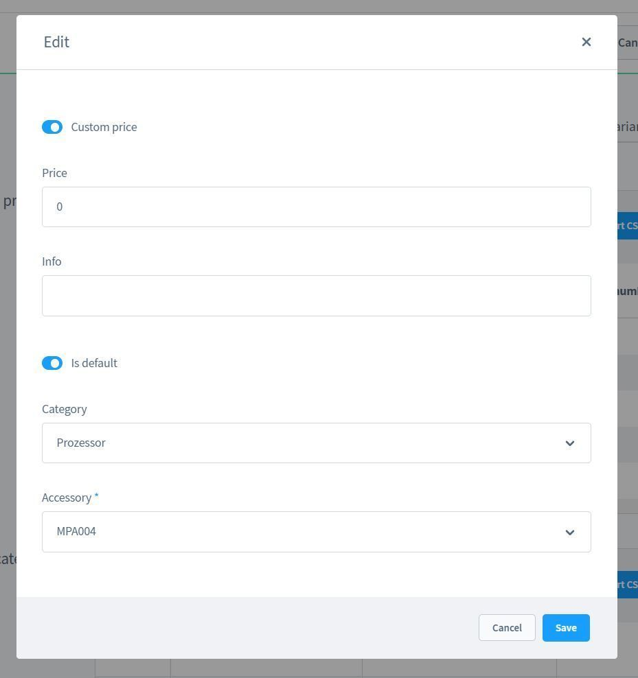

### Product level

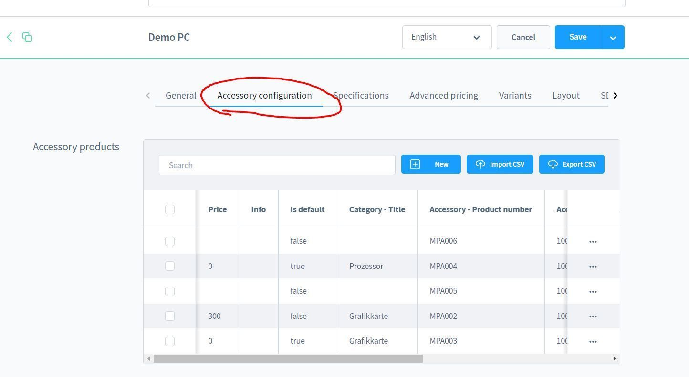

Here you can access the configuration on product level.

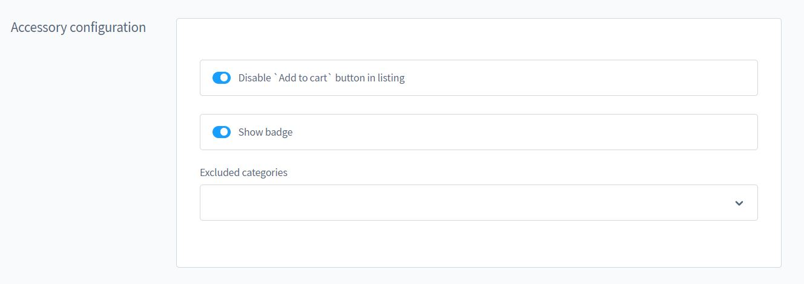

The following options can be configured on the product level:

- Hide Add to Cart button in listing: Prevents the product from being added to the shopping cart individually without configuration.
- Show Badge: Displays a badge in the listing
- Exclude configurations from category levels: Ignores the configurations from the selected category levels.

Example:

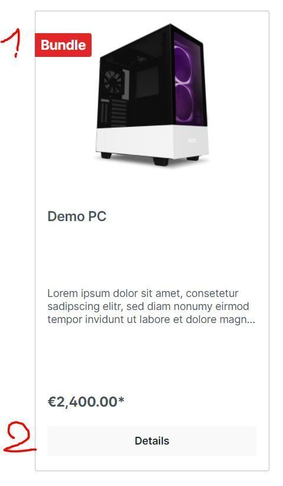

### Category level

If the configurations are repeated several times, it is worthwhile to create the configurations at category level.
category level. All products associated with this category are taken into account.
are taken into account.

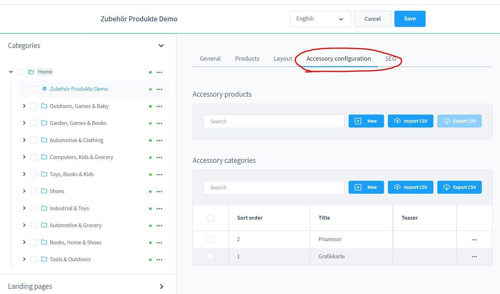

## Plugin configuration

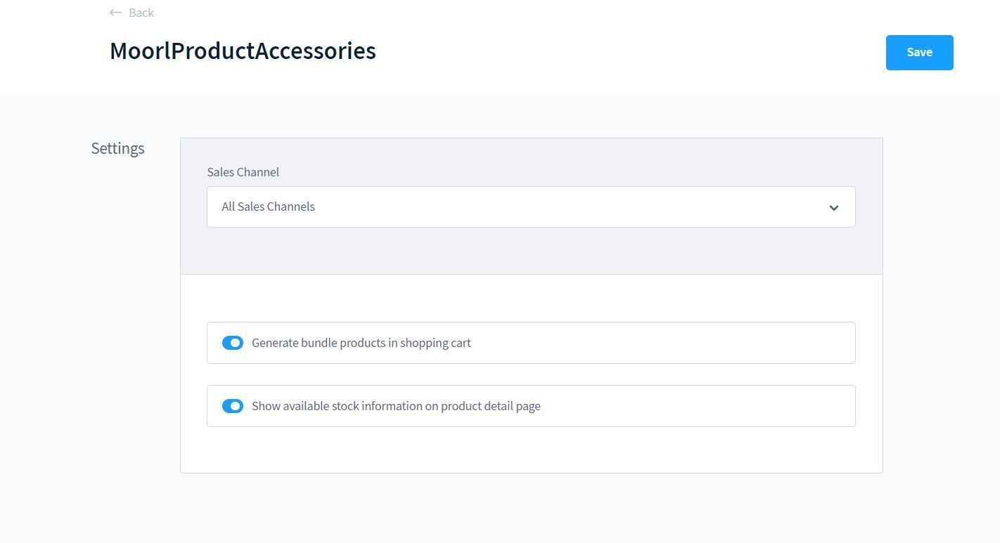

- Create bundle products: Yes = The product including the add-ons will be added to the shopping cart, No = All products will be added to the shopping cart individually
- Display stock: Yes = Will be displayed, No = Will not be displayed.

## Storefront

This is what the configurator looks like on the product detail page:

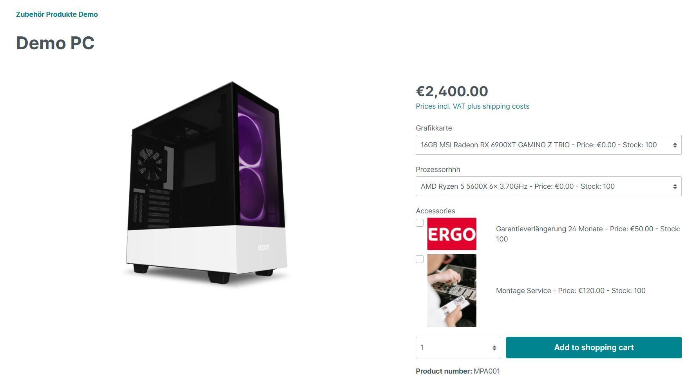

And like this in the shopping cart:

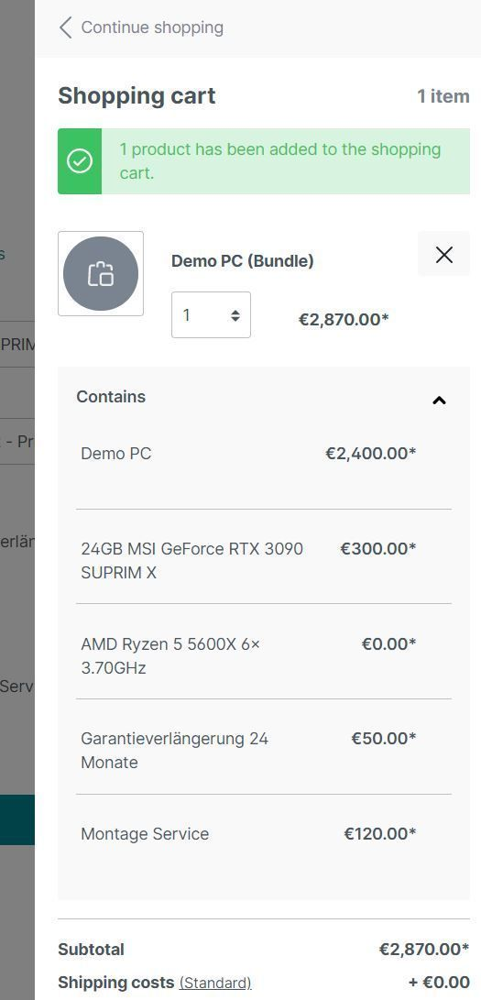
