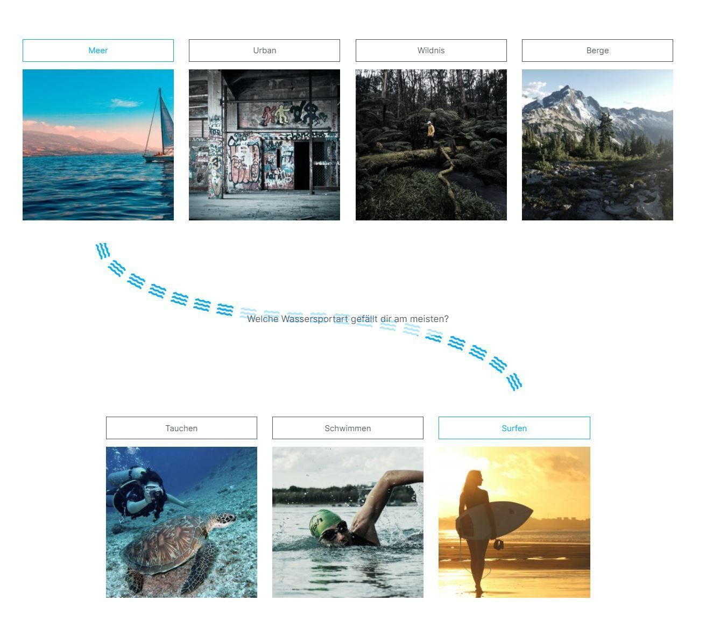
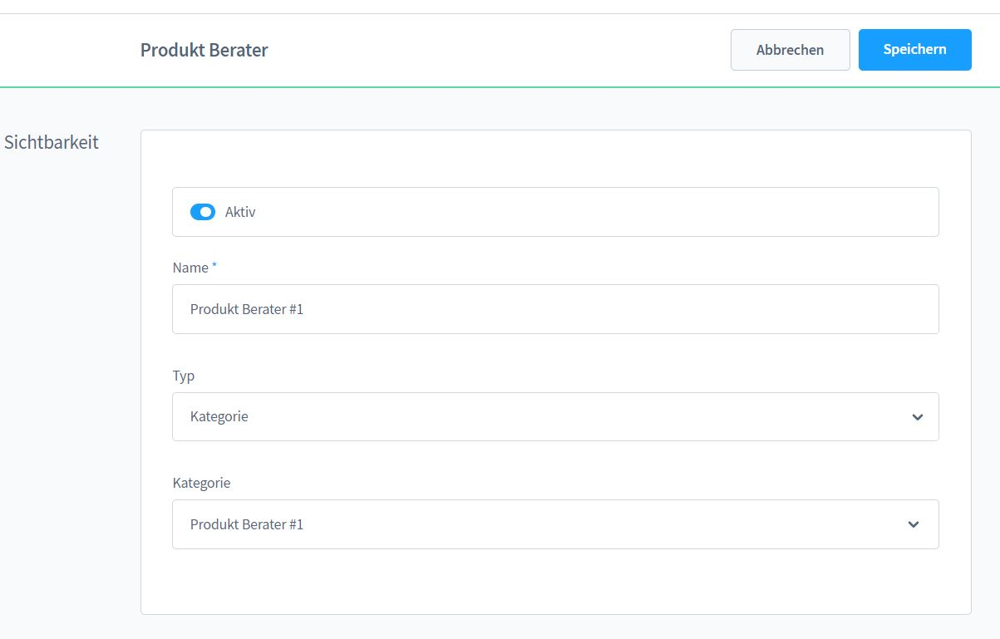
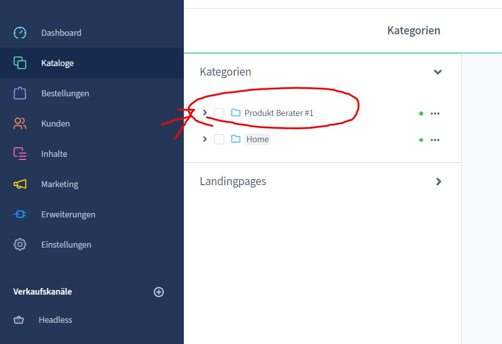
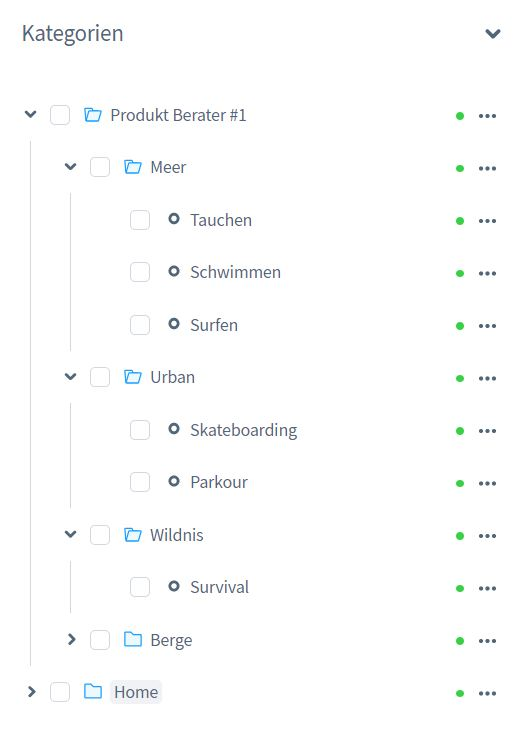
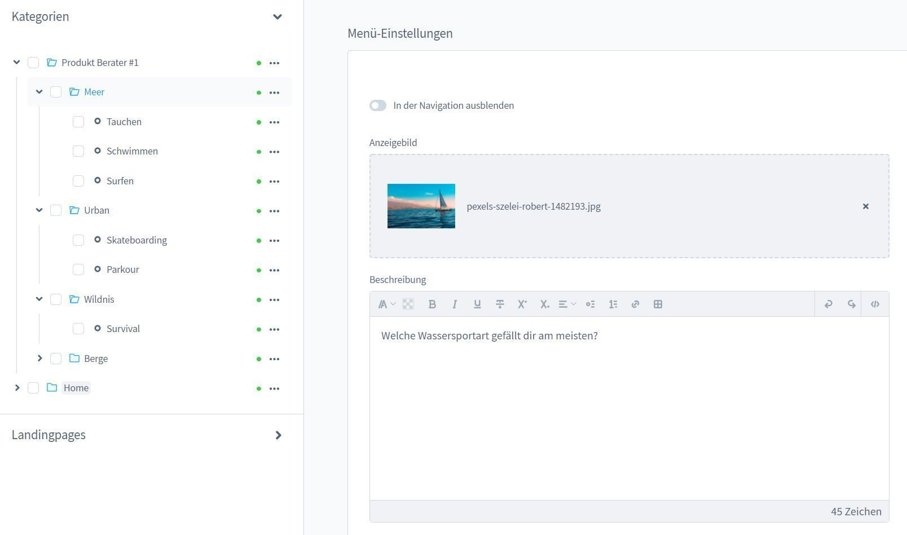
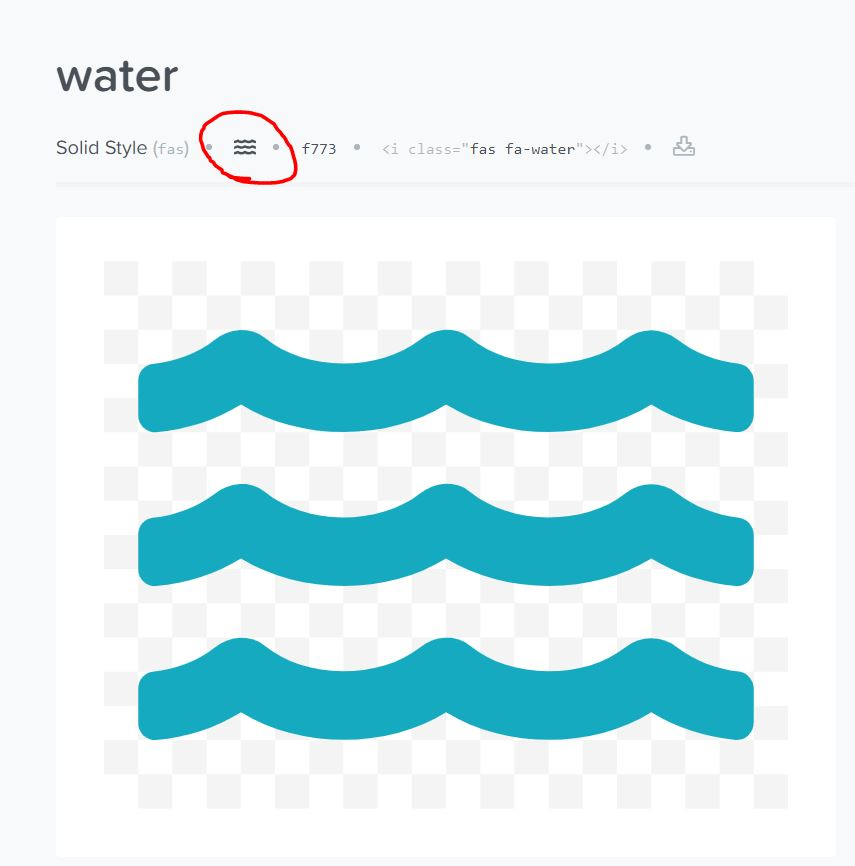
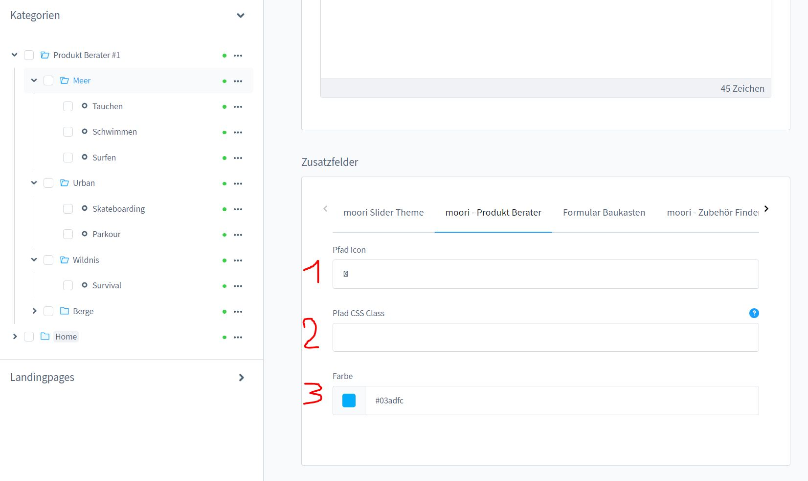
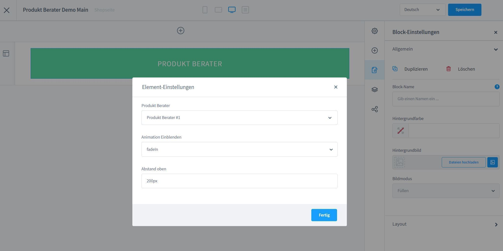
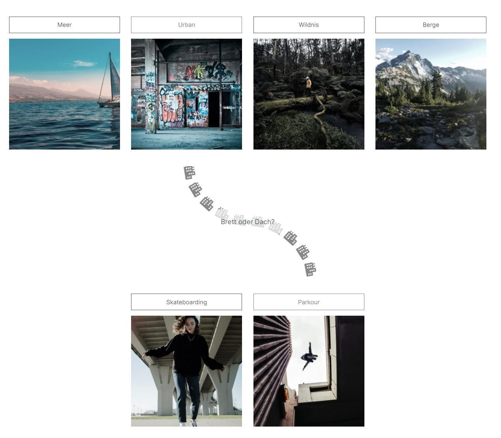
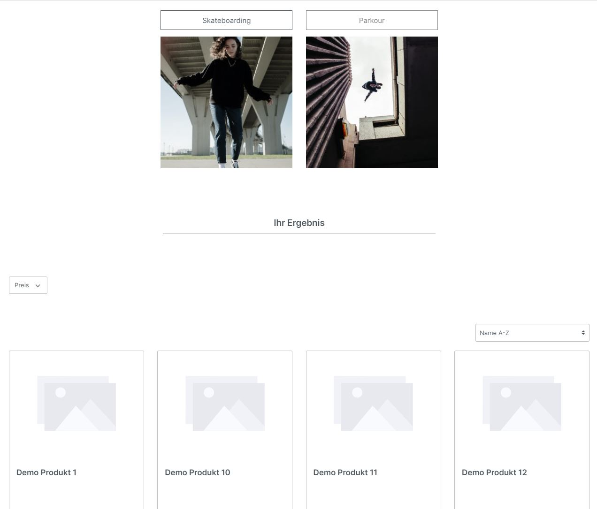

# Produktberater nach Entscheidungsstruktur

[Hier geht's zur Demo](https://demo.moori.net/Produkt-Berater-Demo/)

Mit dieser App hast Du die Möglichkeit via Shopware Kategorien eine Entscheidungsstruktur
aufzubauen. Anhand dieser Struktur werden Deinen Kunden auf spielerischer Weise die
passenden Produkte vorgeschlagen.

Mit dieses Plugin erhältst Du auch wieder ein fertiges Demopaket.
Du kannst dieses Demopaket über "Einstellungen | Plugins | Demo Assistent" finden
und Installieren.

## Installation

1.  Installiere
    [Foundation](../MoorlFoundation/index.md)

2.  Optional: In dieser App ist ein
    [Demopaket](../MoorlFoundation/demo-assistant.md)
    Enthalten.

Du gelangst über den Menüpunkt "Kataloge | Produkt Berater" zur App.

## Konfiguration

### Entscheidungsstruktur erstellen

Die Entscheidungsstruktur wird über die Kategorien von Shopware erstellt.
Lege dazu eine neue Kategorie im Root an und ersteller für jede Antwort eine
Unterkategorie.

### Zuweisung von Produkten

In der letzten jeweiligen Unterkategorie kannst du nun die zu der Entscheidung 
Deines Kunden passende Produkte zuweisen. Anschließend legst du eine CMS Seite
fest.

_Übrigens: Du musst nicht immer unbedingt Produkte vorschlagen, du kannst beliebige
CMS Seiten mit der Kategorie kombinieren!_

### Beschreibung

Die Beschreibung einer Kategorie wird verwendet um Deinem Kunden eine Frage zu
stellen. Der Name einer Kategorie steht hingegen für eine mögliche Antwort.

Das Kategorie Bild darf natürlich auch nicht fehlen.

### Der Pfad

Je nach Entscheidung ändert sich die Farbe und das Symbol für den Pfad. Aktiviere im
moori Foundation Plugin das Add-On FontAwesome!

[Auf der Seite von FontAwesome](https://fontawesome.com/v5.15/icons/water?style=solid)
suchst du dir einfach ein geeignetes Symbol aus, klicke auf dem umkringelten Bereich
um das Symbol zu kopieren.

Gehe in die Zusatzfelder der Kategorie und füge im Feld "Pfad Icon" das Symbol ein.
Wundere dich nicht über die fehlerhafte Anzeige hier.

Anschließend wählst du noch eine passende Farbe.

### CMS Seite erstellen

Gehe nun wieder in die Bearbeitung deines Produkt Beraters und füge den Einstiegspunkt der
Entscheidungsstruktur als Kategorie hinzu.

Jetzt kannst du deine CMS Seite erstellen, deinen Produkt Berater einfügen und im Frontend testen!

## Ansicht im Shop

