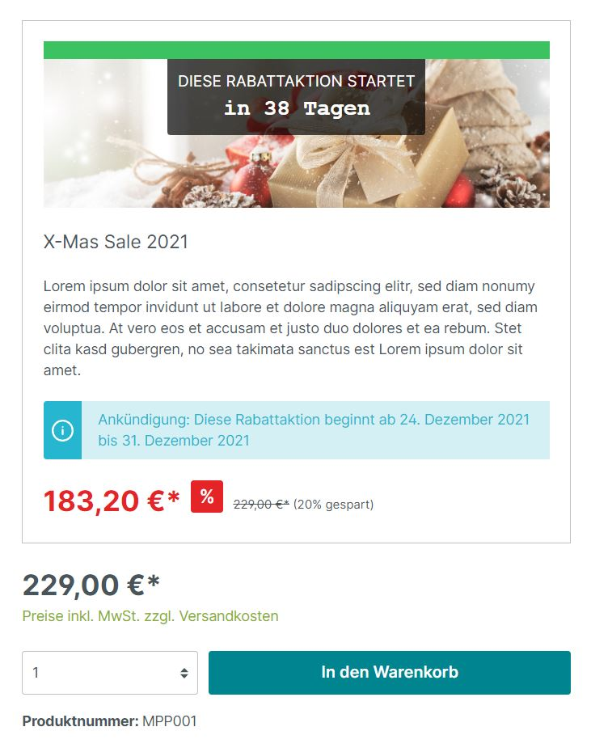

# Flash-Sales, Rabattaktionen und Liveshopping 

Das Shopware 6 Rabattaktionen Plugin ermöglicht es dir, deinen Shop für komplexe Flash-Sales aufzurüsten. Erstelle Rabatt-Kampagnen pünktlich zum Black Friday oder zum Winterschlussverkauf/Sommerschlussverkauf! Sobald du eine Aktion erstellst, entscheidest du ab wann diese in deinem Shop angekündigt wird.

[Hier geht's zur Demo](https://demo.moori.net/Produkt-Promo-Demo/)

Deine Rabattaktion kannst du nach deinen Vorstellungen konfigurieren. Wähle zwischen zeitlich begrenzten Aktionen oder bestimme die maximale verfügbare Menge. Du kannst deine Aktion auch einfach direkt starten oder beides miteinander kombinieren.

## Countdown Aktionen

Generell werden alle Ankündigungen mit einem Countdown versehen. Optional kannst du aber auch für deine Aktion ein Endzeitpunkt bestimmen und den Countdown aktivieren. Der Countdown kann als Zähler oder als eine relative Zeitangabe konfiguriert werden. Auch nach Beendigung der Aktion kannst du diese weiterhin für ein paar Tage im Shop stehen lassen.

## Begrenzte verfügbare Menge

Wählst du diese Option aus, dann wird im Hintergrund ein verfügbarer Lagerbestand runtergezählt. Dieser Bestand richtet sich bereits nach offenen Bestellungen und Verkäufen. Stornierte Bestellungen werden wieder automatisch dem Lagerbestand gutgeschrieben. Du kannst für jedes Produkt einen individuellen Lagerbestand festlegen. Wenn du ein Produkt mit mehreren Varianten wählst, dann wird der Bestand unter den Varianten aufgeteilt. Ist ein Produkt nicht mehr verfügbar, wird die Aktion für dieses Produkt vorzeitig beendet. Du kannst jedoch jederzeit den Lagerbestand manuell aufstocken. Der Lagerbestand kann optisch durch einen prozentualen oder absoluten Fortschrittsbalken visualisiert werden!

## Konfiguration der Rabatte

Anders als mit den Shopware 6 Rabatte & Aktionen, werden die Rabatte direkt auf der Produkt-Detailseite angezeigt. Du kannst einen prozentualen, einen absoluten oder einen Festpreis-Rabatt für jedes Produkt individuell einstellen. Die Rabatte sollten jedoch bei Shops mit mehreren Währungen immer prozentual sein. Der rabattierte Preis wird aus dem Stückpreis des Produktes ermittelt. Ist dein Produkt bereits durch einen Listenpreis oder eine UVP rabattiert, wird dieser als Grundlage für die neue Rabattierung genutzt. Der rabattierte Preis wird bei einer Ankündigung bereits im Produkt angezeigt. Bei einer bereits beendeten Aktion wird der rabattierte Preis verschwommen.

## Der Zocker Modus

Inspiriert durch das Shopware 5 Plugin "Liveshopping" gibt es auch den Zocker Modus. Jede Aktion mit einer festen Zeitspanne und einer begrenzten verfügbaren Menge kann diesen Modus nutzen. Der Preis wird täglich, stündlich oder minütlich immer weiter rabattiert - bis der maximale Rabatt erreicht wurde oder bis das Produkt ausverkauft und somit die Rabattaktion beendet wurde.

## Kundenspezifische Rabattaktionen

Das neueste Feature des Plugins ist, dass du entscheiden kannst, ob deine Aktion nur für einen speziellen Kundenkreis bestimmt ist. Du kannst die Aktion auf einen oder mehrere Verkaufskanäle, Kundengruppen oder Kunden einschränken.

## Weitere Einstellungen

Bestimme für deine Rabattaktion ein Motto: z.B. Black Friday Sale. Du kannst deiner Aktion einen Namen eine Beschreibung und einen Banner zuweisen. Willst du es nicht so übertreiben? Dann stell die Anzeige im Produkt Listing oder auf der Produkt-Detailseite einfach ab.
