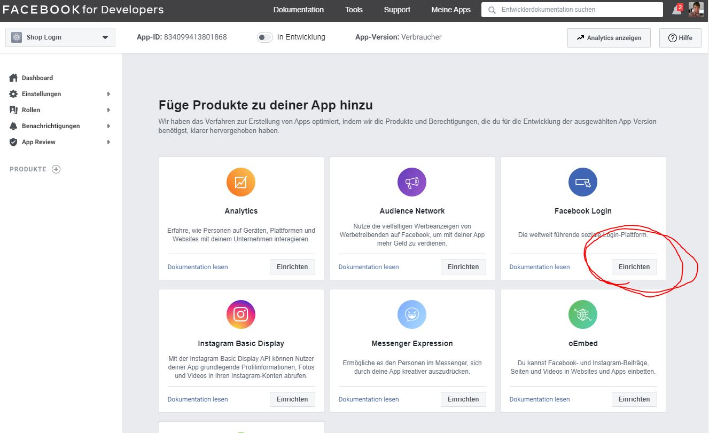
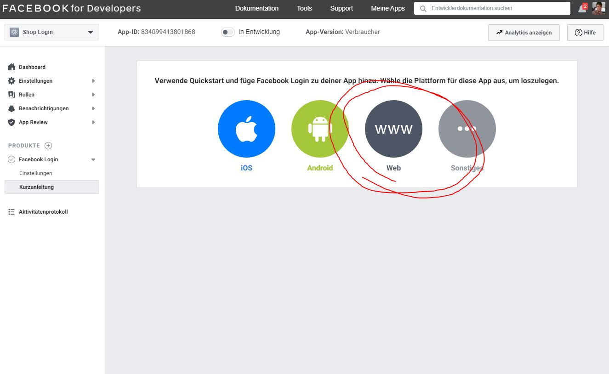
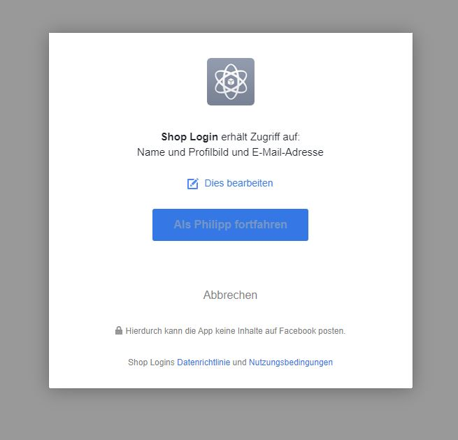

# Social Login | Facebook

Abgeleitet von der offiziellen Facebook Developers Dokumentation:

https://developers.facebook.com/docs/apps/

So erstellen Sie sich eine Facebook Login App:

1. Erstellen Sie sich einen Facebook Account
2. Gehen Sie auf https://developers.facebook.com/ und registrieren Sie sich oben rechts als Entwickler

## Schritt 1 - Eine neue App erstellen

Gehen Sie auf https://developers.facebook.com/apps/ und klicken auf den grünen Button
"App erstellen". Anschließend auf "Verknüpfte Funktionen entwickeln" und dann auf weiter.

Sie bekommen einige Apps vorgeschlagen, wählen Sie "Facebook Login".

Klicken Sie auf "Web".

## Schritt 2 - Die Einstellung der App

Gehen Sie in den Menüpunkt "Produkte > Einstellungen". Setzen Sie "Web-OAuth-Anmeldung" auf aktiv.
Fügen Sie bei "Gültige OAuth Redirect URLs" ihre Domain + "/moorl/sign-in/login". Achten Sie bitte darauf,
dass eine sichere Verbinung mit https Protokoll notwendig ist.

Gehen Sie nun in den Menüpunkt "Einstellungen > Allgemein". Hier finden Sie bereits die App-ID (Client ID)
und das App-Geheimniss (Client Secret). Geben Sie hier zusätzlich Ihre Domain Ihres Shops an. Dazu die URL
zu Ihren Datenschutzbestimmungen und Ihren AGBs. Die weiteren Einstellungen sind optional bzw. werden für
den Quickstart nicht benötigt.

## Schritt 3 - Plugin Konfiguration

Gehen Sie in Ihrem Shop in die Plugin Einstellungen und fügen Sie Ihre App-ID und Ihr App-Geheimniss ein.
Die Graph API Version kann frei gelassen werden.

Nun testen Sie den Login mit Ihrem Facebook Account. Bitte stellen Sie sicher, dass Sie den Test mit dem 
selben Account durchführen, den Sie auch für die Erstellung der App genutzt haben.

## Schritt 4 - App Live schalten

Gehen Sie wieder in die App Einstellungen im Developers Bereich von Facebook und schalten Sie oben 
neben der App-ID Ihre App Live. Falls noch Daten fehlen, werden Sie von Facebook dazu aufgefordert
diese zu ergänzen.

Herzlichen Glückwunsch, das wäre geschafft!