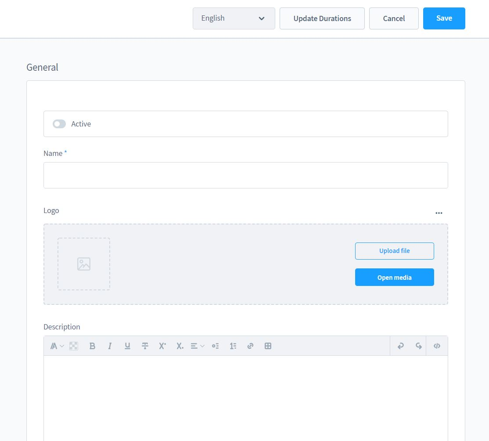
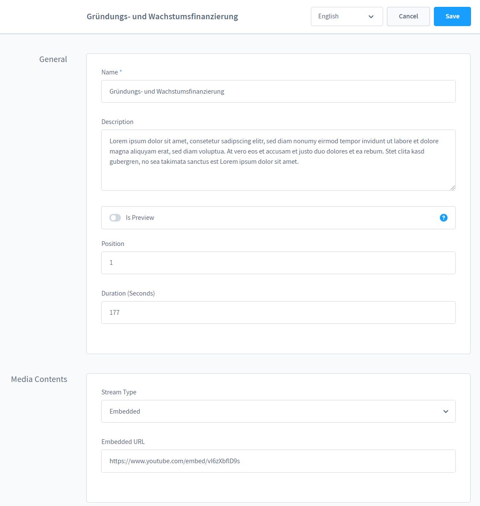
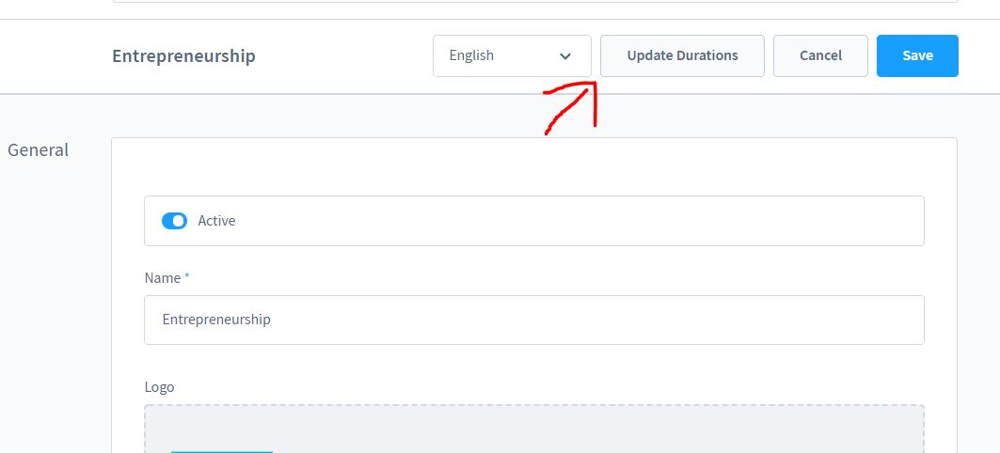

# Video Kurs LMS

Mit dem Video Kurs Lern Managegement System hast Du die Möglichkeit Deine Kurse Online zu verkaufen.

## Anleitung

### Installation

Diese App benötigt [moori Foundation](../MoorlFoundation/index.md), bitte 
diese zu erst im Extension Manager installieren!

Anschließend kannst Du Video Kurs LMS ebenfalls über den Extension Manager installieren.

### Schnellstart

Für diese App haben wir ein Demo Paket vorbereitet, Du kannst 
die Demo [hier installieren](../MoorlFoundation/demo-assistant.md).

### Einen Kurs erstellen

Gehe über den Menüpunkt Inhalte zu Video Kurse

Hier findest du ggf. schon das installierte Demo Paket? Erstelle einen neuen Kurs 
indem du auf "Neuen Kurs Erstellen" klickst

Hier kannst Du nun einen Namen, eine Beschreibung und eine Abo-Zeit eintragen!
Stelle die Abo-Zeit auf "0" Wenn Du Deinen Kurs auf unbegrenzte Zeit anbieten
möchtest.

Nach dem Speichern erscheinen weitere Optionen:
1. Kapitel - Eine Übersicht aller Kapitel in dem Kurs
2. Lektionen - Eine Übersicht aller Lektionen in dem Kurs
3. Abos - Eine Übersicht aller Buchungen des Kurses
4. Produkte - Trage hier die Produkte ein, die den Kurs repräsentieren

Klicke auf Neu um ein Kapitel oder eine Lektion zu erstellen.

Du erreichst die Detailseite des Kapitels oder der Lektion über das Kontextmenü in
den kleinen Tabellen.

In einer Lektion kannst du einen Namen eine Beschreibung und ein Cover Bild Hinterlegen.

Über das Kontextmenü der Lektionen im aktuellen Kapitel kannst du die Lektionen bearbeiten.

Für eine Lektion kannst du wieder einen Namen und eine Beschreibung pflegen. Es gibt
außerdem einen Schalter um die Lektion dem Kunden als Vorschau anzubieten - so kann sich
Dein Kunde ein Bild von Deinem Kurs machen.

Die Position bestimmt die Reihenfolge innerhalt des Kapitels.

Die Laufzeit sagt aus, wie lang diese Lektion ist - die Angabe ist in Sekunden und muss aktuell
manuell eingetragen werden.

Du kannst für die Lektion entweder eigene Videos aus der Shopware Medien Bibliothek nutzen oder
Youtube/Vimeo Videos einbetten. Wir empfehlen Vimeo, da Du dort deine Videos vor Kopien schützen 
kannst!

Sobald Dein Kurs fertig gestellt wurde, musst Du die Laufzeiten manuell aktualisieren. Dort
werden die Teil-Laufzeiten der Kapitel und die Gesamt-Laufzeit des Kurses gespeichert.

Du kannst nun Deinen Kurs aktivieren und im Frontend testen!

### App Konfiguration

1. Produktbeschreibung ersetzen - Ersetzt die Produktbeschreibung auf der Produkt-Detail-Seite
mit den Kursbeschreibungen.
2. Verzicht auf Widerruf - Eine Rechtliche Absicherung im Checkout, damit Deine Kunden
Download-Produkte nicht einfach widerrufen können.

