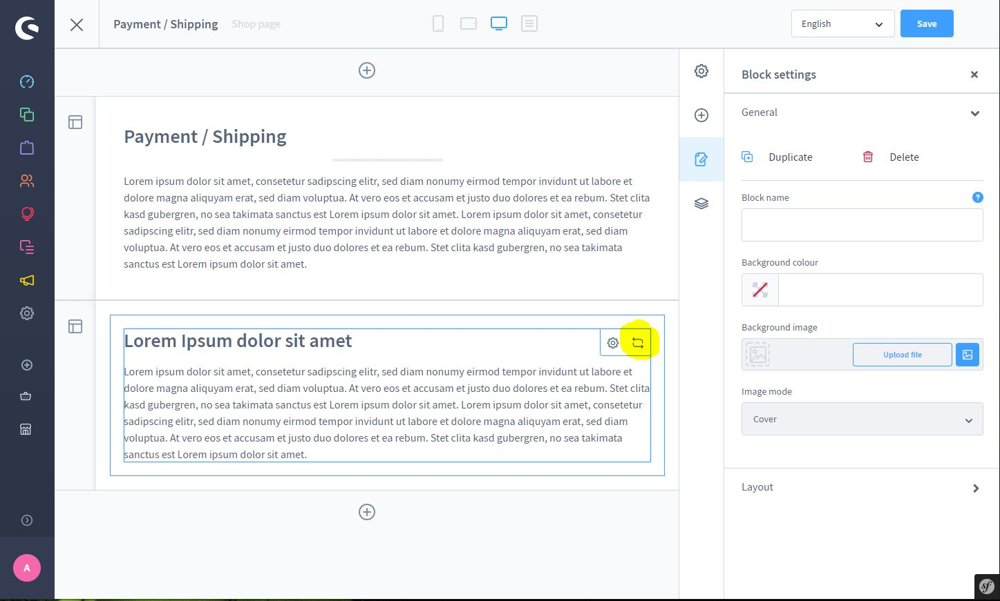
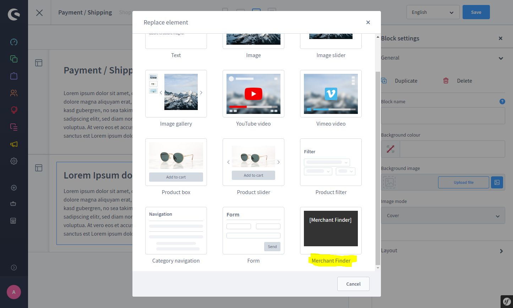

# Häufig gestellte Fragen (FAQ)

- [Probleme bei der Installation von Plugins](#probleme-bei-der-installation-von-plugins)
- [Fehler im Shopware 6 Shop](#fehler-im-shopware-6-shop)
- [Verbesserungsvorschläge und Ideen](#verbesserungsvorschlage-und-ideen)
- [Sonstige Fragen](#sonstige-fragen)

## Probleme bei der Installation von Plugins

### Das Plugin läuft nach dem Update nicht mehr

Sollte ein Plugin nicht wie erwartet funktionieren, dann kannst du das Plugin einfach deaktivieren und wieder aktivieren. Die Einstellungen werden zurückgesetzt ohne das deine Daten verloren gehen.

Nach der Aktivierung musst du jedoch deine eigenen Anpassungen an SEO Url Templates erneut durchführen.

### Das Plugin lässt sich nicht installieren

Du bekommst beim Versuch das Plugin zu installieren folgende Fehlermeldung?

```text
Required plugin/package "moorl/foundation 1.4.*" is missing or not installed and activated
```

Dann fehlt dir das Foundation Plugin. Hier kannst du das Plugin holen:

[https://store.shopware.com/moorl50852475974f/foundation-plugin.html](https://store.shopware.com/moorl50852475974f/foundation-plugin.html)

### Ich finde das CMS Block Element zum Plugin nicht

Viele haben Stunden lang nach dem Block Element (zum Beispiel für die Händlersuche) gesucht. 
Ein großer Teil der moori Plugins besitzt jedoch keinen Block, sondern nur ein Element.

Shopware unterscheidet zwischen Blöcken und Elementen. 
So kann beispielsweise ein Block auch aus mehreren Elementen bestehen. 
Generell hast du Zugriff auf die Elemente hier:



Nun kannst du das entsprechende Element auswählen!



## Fehler im Shopware 6 Shop

### Leider ist etwas schief gelaufen

Support Anfragen mit der Meldung __Leider ist etwas schief gelaufen__ können nicht zur Problemfindung helfen.

Bevor du ein Support Ticket oder eine Mail sendest, bitte besorge die richtigen Logdateien.

[https://docs.shopware.com/de/shopware-6-de/tutorials-und-faq/fehlermeldungen-debuggen](https://docs.shopware.com/de/shopware-6-de/tutorials-und-faq/fehlermeldungen-debuggen)

Wenn du dir sicher bist, dass ein moori Plugin für deinen Fehler verantwortlich ist, dann überspringe diese Antwort.

### Das Plugin läuft nicht

#### Nach dem Update des Plugins

Bitte lese dir immer vor einem Update die Hinweise der Plugins durch, das gilt speziell bei größeren Versionssprüngen. 

__Sofern es ein Problem gibt: Lösche nichts manuell via FTP oder aus der Datenbank!__

Meistens findest du im Änderungsprotokoll des Plugins notwendige Hinweise zur Lösung des Problems. Die meisten Probleme fasse ich hier zusammen:

1. Die SEO Url wird nicht erstellt: Setze das Plugin zurück: Einmal deaktivieren und wieder aktivieren. Hier werden die SEO Url Templates und weitere relevante Inhalte des Plugins neu installiert. Falls du das SEO Url Template angepasst hast, musst es nach dem Zurücksetzen erneut anpassen. Wenn du einen mehrsprachigen Shop hast, musst du die Titel/Namen der Entität übersetzen, sonst wird mit Sicherheit immer eine SEO Url nicht richtig generiert.

2. Anderes Problem: Setze das Plugin zurück: Einmal deaktivieren und wieder aktivieren.

#### Andere Ursachen

Lässt sich das Plugin aus irgendeinem Grund nicht starten, dann check zunächst, ob du die aktuelle Shopware Version hast und auch ob das Plugin aktuell ist.

Sollte das der Fall sein, dann kannst du gerne sofort Kontakt zu mir aufnehmen! Meine E-Mail-Adresse lautet info@moorleiche.com, ich versuche möglichst früh zu reagieren.

## Verbesserungsvorschläge und Ideen

### Mir fehlt eine wichtige Funktion

Für Verbesserungsvorschläge bin ich immer offen, sinnvolle Erweiterungen werden in der Regel auch gerne umgesetzt. Ich habe mir vorgenommen meine Plugins mit eurer Hilfe weiter zu Entwickeln, wohin die Reise auch hingeht.

## Sonstige Fragen

### Wie hoch ist dein Stundensatz?

- Mein Stundensatz beträgt 100,00 € pro Stunde zzgl. MwSt.
- Plugin-Updates, die einen generellen Mehrwert für die Allgemeinheit bieten, werden mit 75,00 € pro Stunde zzgl. MwSt. berechnet

### Entwickelst du auch Shopware 6 Plugins für Kunden?

Ich entwickle gerne neue Plugins und bringe stets auch eigene Ideen mit ein. Ich verfolge das Ziel, möglichst hochwertige und umfangreiche Plugins zu entwickeln, die auch für den Community Store von Shopware geeignet sind.

Hier profitieren wir immer beide von:

1. Du erhältst ein günstiges Plugin auf deine Bedürfnisse abgestimmt
2. Dein Plugin wird automatisch für dich weiter entwickelt und ist immer mit der neuesten Shopware Version kompatibel
3. Ich kann das Plugin auch anderen Shopbetreibern zu einem erschwinglichen Preis anbieten

Natürlich zahlst du als Initiator einen verhältnismäßig hohen Preis. Du erfüllst jedoch damit einen essenziellen Beitrag in das Shopware Ökosystem und profitierst langfristig auch von anderen Plugins, die im Store angeboten werden.

Ich biete keine Weiterentwicklung für Plugins an, die meinen Plugins ähneln!

Stell mir gerne eine Anfrage per E-Mail :)

### Bietest du ein Komplettpaket für Shopware 6 an?

Für einen neuen Start mit Shopware 6 biete ich zusammen mit einer engen Auswahl an spezialisierten Programmierern und Designern ein Komplettpaket an.

Zu den Dienstleistungen gehören z.B.

- Webserver einrichten
- Shop-Installation
- Migration aus Shopware 5 oder anderen Shopsystemen (Prestashop, xt:commerce, Shopify usw.)
- Schnittstellen, automatisierte Importe aus CSV Tabellen oder APIs
- Konzept und Design des Shops
- Individuelle Plugin-Programmierung

Es werden jedoch keine Dienstleistungen zu Content oder Suchmaschinen-Marketing angeboten.

Das Projekt-Volumen sollte zwischen 3 und 12 Monate umfassen.

### Kannst du bestehende Shopware 6 Shops betreuen?

Ich betreue grundsätzlich nur Shops, die aus eigenen Projekten hervorgehen.
